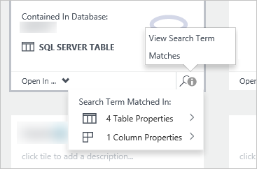

<properties
   pageTitle="How to discover data sources | Microsoft Azure"
   description="How-to article highlighting how to discover registered data assets with Azure Data Catalog, including searching and filtering and using the hit highlighting capabilities of the Azure Data Catalog portal."
   services="data-catalog"
   documentationCenter=""
   authors="steelanddata"
   manager="NA"
   editor=""
   tags=""/>
<tags
   ms.service="data-catalog"
   ms.devlang="NA"
   ms.topic="article"
   ms.tgt_pltfrm="NA"
   ms.workload="data-catalog"
   ms.date="07/12/2016"
   ms.author="maroche"/>

# How to discover data sources

## Introduction
**Microsoft Azure Data Catalog** is a fully managed cloud service that serves as a system of registration and system of discovery for enterprise data sources. In other words, **Azure Data Catalog** is all about helping people discover, understand, and use data sources, and helping organizations to get more value from their existing data. Once a data source has been registered with **Azure Data Catalog**, its metadata is indexed by the service, so that users can easily search to discover the data they need.

## Searching and filtering

Discovery in **Azure Data Catalog** uses two primary mechanisms: searching and filtering.

Searching is designed to be both intuitive and powerful – by default, search terms are matched against any property in the catalog, including user-provided annotations.

Filtering is designed to complement searching. Users can select specific characteristics such as experts, data source type, object type, and tags, to view only matching data assets, and to constrain search results to matching assets as well.

By using a combination of searching and filtering, users can quickly navigate the data sources that have been registered with **Azure Data Catalog** to discover the data sources they need.

## Search syntax

Although the default free text search is simple and intuitive, users can also use **Azure Data Catalog**’s search syntax to have greater control over the search results. **Azure Data Catalog** search supports the following techniques:

| Technique                 | Use                                                                                                                                     | Example                                                   |
|---------------------------|-----------------------------------------------------------------------------------------------------------------------------------------|-----------------------------------------------------------|
| Basic Search              | Basic search using one or more search terms. Results are any assets that match on any property with one or more of the terms specified. | sales data                                                |
| Property Scoping          | Only return data sources where the search term is matched with the specified property                                                   | name:finance                                              |
| Boolean Operators         | Broaden or narrow a search using Boolean operations                                                                                     | finance NOT corporate                                     |
| Grouping with Parenthesis | Use parentheses to group parts of the query to achieve logical isolation, especially in conjunction with Boolean operators              | name:finance AND (tags:Q1 OR tags:Q2) |
| Comparison Operators      | Use comparisons other than equality for properties that have numeric and date data types                                                | modifiedTime > "11/05/2014"                                 |

For more information on **Azure Data Catalog** search, see [https://msdn.microsoft.com/library/azure/mt267594.aspx](https://msdn.microsoft.com/library/azure/mt267594.aspx).

## Hit highlighting
When viewing search results, any displayed properties that match the specified search terms – such as the data asset name, description, and tags – will be highlighted to make it easier to identify why a given data asset was returned by a given search.

> [AZURE.NOTE] Users can turn hit highlighting off if desired, using the “Highlight” switch in the **Azure Data Catalog** portal.

When viewing search results, it may not always be obvious why a data asset is included, even with hit highlighting enabled. Because all properties are searched by default, a data asset may be returned due to a match on a column-level property. And because multiple users can annotate registered data assets with their own tags and descriptions, not all metadata may be displayed in the list of search results.

In the default tile view, each tile displayed in the search results will include a “View search term matches” icon, which allows the user to quickly view the number of matches and their location, and to jump to them if desired.

 

## Summary
Registering a data source with **Azure Data Catalog** makes that data source easier to discover and understand, by copying structural and descriptive metadata from the data source into the Catalog service. Once a data source has been registered, users can discover it using filtering and search from within the **Azure Data Catalog** portal.

## See also
- [Get Started with Azure Data Catalog](data-catalog-get-started.md) tutorial for step-by-step details about how to discover data sources.
