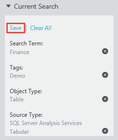
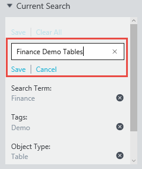
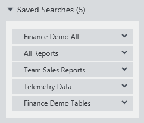
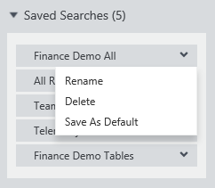
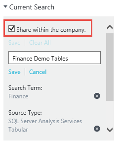
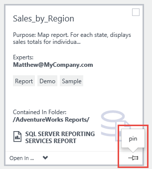
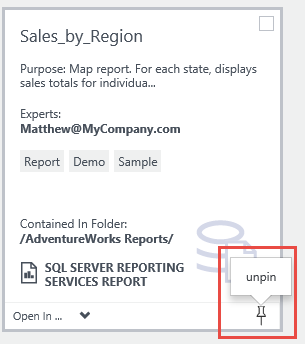
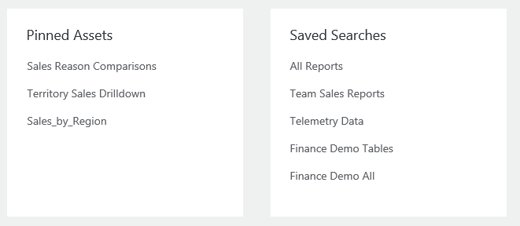

# Save searches and pin data assets in Azure Data Catalog
## Introduction
Azure Data Catalog provides capabilities for data source discovery. You can quickly search and filter the catalog to locate data sources and understand their intended purpose, making it easier to find the right data for the job at hand.

But what if you need to regularly work with the same data? And what if you and other users regularly contribute your knowledge to the same data sources in the catalog? In these situations, having to repeatedly issue the same searches can be inefficient. This is where saved search and pinned data assets can help.

## Saved searches
A saved search in Data Catalog is a reusable, per-user search definition. You can define a search, including search terms, tags, and other filters, and then save it. You can re-run the saved search definition later to return any data assets that match its search criteria.

### Create a saved search
To create a saved search, do the following:
1. In the Azure Data Catalog portal, in the **Current Search** window, click **Save**. 

     

2. Enter the search criteria that you want to reuse, and then click **Save**.

    

3. When you are prompted, enter a name for the saved search. Pick a name that is meaningful and that describes the data assets that will be returned by the search.

### Manage saved searches
After you have saved one or more searches, a **Saved Searches** option is displayed beneath the **Current Search** box. When the list is expanded, all saved searches are displayed.

 

Do any of the following:

* To execute a search, select a saved search in the list.

* To view a list of management options for a saved search, click the down arrow next to the search name.

    

* To enter a new name for the saved search, select **Rename**. The search definition is not changed.

* To remove the saved search from your list, select **Delete**, and then confirm the deletion.

* To mark the saved search as your default search, select **Save As Default**. If you perform an “empty” search from the Azure Data Catalog home page, your default search is executed. In addition, the search that's marked as the default search is displayed at the top of the **Saved Searches** list.

### Organizational saved searches
All user in your organization can save searches for their own use. Data Catalog administrators can also save searches for all users within the organization. When administrators save a search, they're presented with a **Share within the company** option. Selecting this option shares the saved search for all users in the organization.

 

## Pinned data assets
With saved searches, you can save and reuse search definitions. The data assets that are returned by the searches might change over time as the contents of the catalog change. When you pin data assets, you can explicitly identify specific data assets to make them easier to access without needing to use a search.

Pinning a data asset is straightforward. To add the data asset to your pinned list, you simply click the **pin** icon. The icon is displayed in the corner of the asset tile in the tile view, and in the left-most column in the list view in the Azure Data Catalog portal.

Unpinning a data asset is equally straightforward. Simply click the **unpin** icon to toggle the setting for the selected asset.

## The My Assets section
The Data Catalog portal home page includes a **My Assets** section that displays assets of interest to the current user. This section includes both pinned assets and saved searches.

## Summary
Azure Data Catalog provides capabilities that make it easier to discover the data sources you need, so you and other organization members can spend less time looking for data and more time working with it. Saved searches and pinned data assets build on these core capabilities so users can easily identify data sources that they work with repeatedly.
