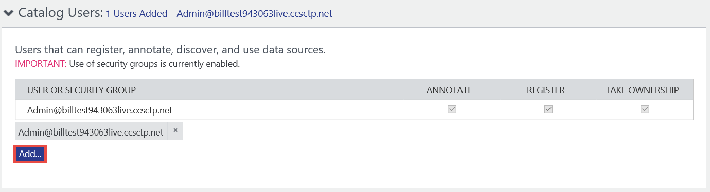
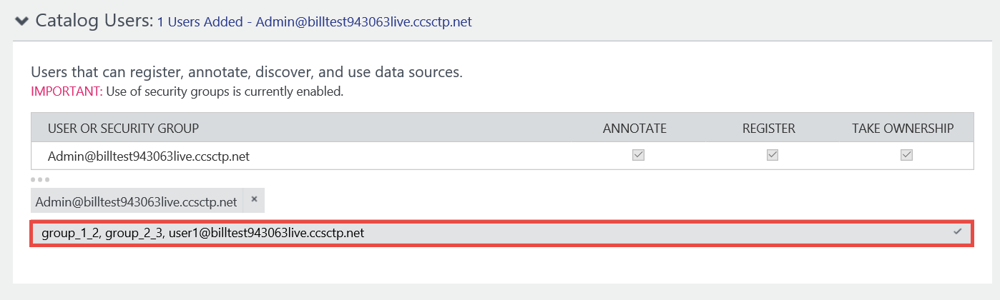
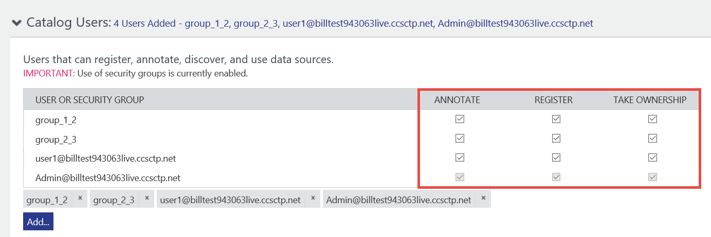
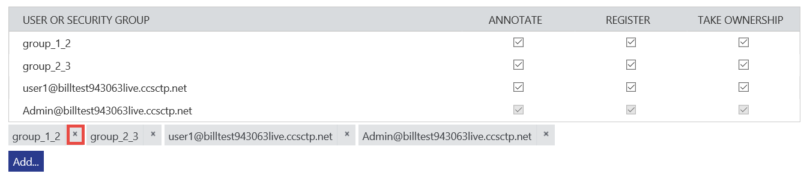

# How to secure access to data catalog and data assets
> [!IMPORTANT]
> This feature is available only in the standard edition of Azure Data Catalog.

Azure Data Catalog allows you to specify who can access the data catalog and what operations (register, annotate, take ownership) they can perform on metadata in the catalog. 

## Catalog users and permissions
To give a user or a group the access to a data catalog and set permissions:

1. On the [home page of your data catalog](http://www.azuredatacatalog.com),  click **Settings** on the toolbar.

	
2. In the settings page, expand the **Catalog Users** section.
	
3. Click **Add**.
4. Enter the fully qualified **user name** or name of the **security group** in the Azure Active Directory (AAD) associated with the catalog. Use comma (`,’) as a separator if you are adding more than one user or group.
	
5. Press **ENTER** or **TAB** out of the text box. 
6.	Confirm that all permissions (**Annotate**, **Register**, and **Take Ownership**) are assigned to these users or groups by default. That is, the user or group can [register data assets]( data-catalog-how-to-register.md), [annotate data assets]( data-catalog-how-to-annotate.md), and [take ownership of data assets]( data-catalog-how-to-manage.md). 
	
7.	To give a user or group only the read access to the catalog, clear the **annotate** option for that user or group. When you do so, the user or group cannot annotate data assets in the catalog but they can view them. 
8.	To deny a user or group from registering data assets, clear the **register** option for that user or group.
9.	To deny a user from taking ownership of a data asset, clear the **take ownership** option for that user or group. 
10.	To delete a user/group from catalog users, click **x** for the user/group at the bottom of the list. 
	

	> [!IMPORTANT]
	> We recommend that you add security groups to catalog users rather than adding users directly and assign permissions. Then, add users to the security groups that match their roles and their required access to the catalog.

## Special considerations

- The permissions assigned to security groups are additive. Say, a user is in two groups. One group has annotate permissions and other group does not have annotate permissions. Then, user has annotate permissions. 
- The permissions assigned explicitly to a user override the permissions assigned to groups to which the user belongs. In the previous example, say, you explicitly added the user to catalog users and do not assign annotate permissions. The user cannot annotate data assets even though the user is a member of a group that does have annotate permissions.

## Next steps
- [Get started with Azure Data Catalog](data-catalog-get-started.md)

