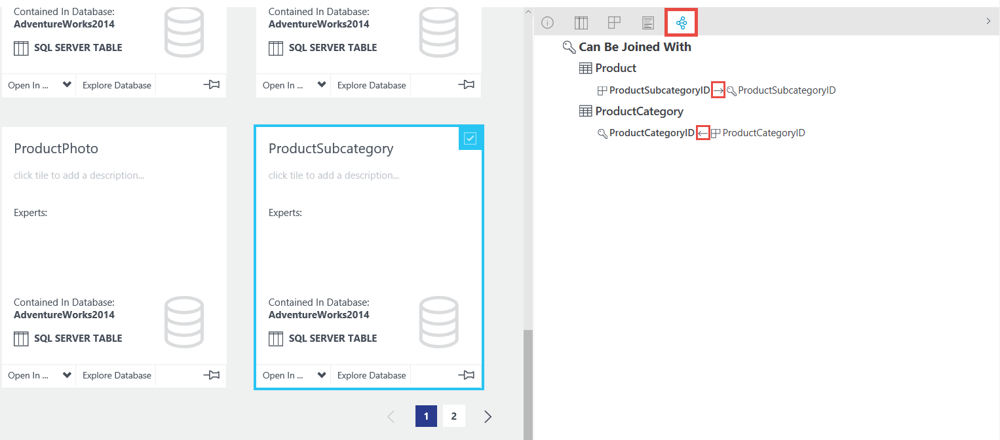
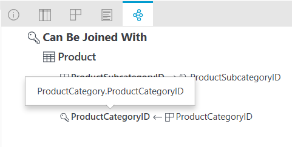

# How to view related data assets in Azure Data Catalog?
Azure Data Catalog allows you to view data assets related to a selected data asset and view relationships between them. 

## Supported data sources 
When you register data assets from the following data sources, Azure Data Catalog automatically registers metadata about join relationships between the selected data assets. 

- SQL Server
- Azure SQL Database
- MySQL
- Oracle

> [!NOTE]
> For Data Catalog to import relationship between two data assets, you must register both the assets at the same time. If you had added one of them separately, add it again and the other data asset to import relationship between them.

## View related data assets
To view data assets that are related to a selected dataset, use the **Relationships** tab as shown in the following image: 

In this example, there are two relationships for the selected **ProductSubcategory** data asset: 

- ProductSubcategoryID column of the Product table has a foreign key relationship with ProductSubcategoryID column of the selected ProductSubcategory table. 
- ProductCategoryID column of the ProductSubCategory table has a foreign key relationship with ProductCategoryID column of the selected ProductCategory table.

> [!NOTE]
> Notice the direction of the arrow in the relationships tree view.  

To see more details such as the fully qualified name of the column, move the mouse over and you see a popup similar to the following image: 

To include relationships between assets that have already been registered, re-register those assets.

## Next steps
- [How to manage data assets](data-catalog-how-to-manage.md)