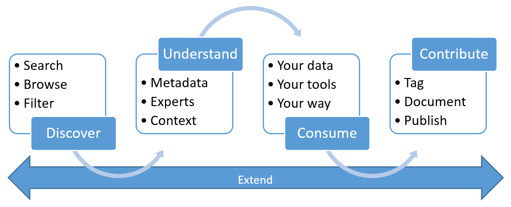

# What is Azure Data Catalog?

Azure Data Catalog is a fully managed cloud service. It lets users discover the data sources they need and understand the data sources they find. At the same time, Data Catalog helps organizations get more value from their existing investments.

With Data Catalog, any user (analyst, data scientist, or developer) can discover, understand, and consume data sources. Data Catalog includes a crowdsourcing model of metadata and annotations. It is a single, central place for all of an organization's users to contribute their knowledge and build a community and culture of data.

## Discovery challenges for data consumers

Traditionally, discovering enterprise data sources has been an organic process based on tribal knowledge. For companies that want to get the most value from their information assets, this approach presents numerous challenges:

* Users might not know that a data source exists unless they come into contact with it as part of another process. There is no central location where data sources are registered.
* Unless users know the location of a data source, they cannot connect to the data by using a client application. Data-consumption experiences require users to know the connection string or path.
* Unless users know the location of a data source's documentation, they cannot understand the intended uses of the data. Data sources and documentation might live in a variety of places and be consumed through a variety of experiences.
* If users have questions about an information asset, they must locate the expert or team that's responsible for the data and engage them offline. There is no explicit connection between data and the experts that have perspectives on its use.
* Unless users understand the process for requesting access to the data source, discovering the data source and its documentation still does not help them access the data.

## Discovery challenges for data producers

Although data consumers face the previously mentioned challenges, users who are responsible for producing and maintaining information assets face challenges of their own:

* Annotating data sources with descriptive metadata is often a lost effort. Client applications typically ignore descriptions that are stored in the data source.
* Creating documentation for data sources is often a lost effort. Keeping documentation in sync with data sources is an ongoing responsibility. Users may lack trust in documentation that's perceived as being out of date.
* Creating and maintaining documentation for data sources is complex and time-consuming. Making that documentation readily available to everyone who uses the data source can be even more so.
* Restricting access to data sources and ensuring that data consumers know how to request access is an ongoing challenge.

When such challenges are combined, they present a significant barrier for companies who want to encourage and promote the use and understanding of enterprise data.

## Azure Data Catalog can help

Data Catalog is designed to address these problems and to help enterprises get the most value from their existing information assets. Data Catalog makes data sources easily discoverable and understandable by the users who manage the data.

Data Catalog provides a cloud-based service into which a data source can be registered. The data remains in its existing location, but a copy of its metadata is added to Data Catalog, along with a reference to the data-source location. The metadata is also indexed to make each data source easily discoverable via search and understandable to the users who discover it.

After a data source has been registered, its metadata can then be enriched. The metadata can be added either by the user who registered it or by other users in the enterprise. Any user can annotate a data source by providing descriptions, tags, or other metadata, such as documentation and processes for requesting data source access. This descriptive metadata supplements the structural metadata (such as column names and data types) that's registered from the data source.

Discovering and understanding data sources and their use is the primary purpose of registering the sources. Enterprise users might need data for business intelligence, application development, data science, or any other task where the right data is required. They can use the Data Catalog discovery experience to quickly find data that matches their needs, understand the data to evaluate its fitness for the purpose, and consume the data by opening the data source in their tool of choice. 

At the same time, users can contribute to the catalog by tagging, documenting, and annotating data sources that have already been registered. They can also register new data sources, which can then be discovered, understood, and consumed by the community of catalog users.

## Learn more about Data Catalog

To learn more about the capabilities of Data Catalog, see:

* [How to register data sources](data-catalog-how-to-register.md)
* [How to discover data sources](data-catalog-how-to-discover.md)
* [How to annotate data sources](data-catalog-how-to-annotate.md)
* [How to document data sources](data-catalog-how-to-documentation.md)
* [How to connect to data sources](data-catalog-how-to-connect.md)
* [How to work with big data](data-catalog-how-to-big-data.md)
* [How to manage data assets](data-catalog-how-to-manage.md)
* [How to set up the Business Glossary](data-catalog-how-to-business-glossary.md)
* [Frequently asked questions](data-catalog-frequently-asked-questions.md)

## Next steps

To get started with Data Catalog:

* [Quickstart: Create an Azure Data Catalog](data-catalog-get-started.md)
* [Open your Azure Data Catalog](https://www.azuredatacatalog.com)