# Tutorial: Register data assets in Azure Data Catalog

In this tutorial, you use the registration tool to register data assets from the Azure SQL database sample with the catalog. Registration is the process of extracting key structural metadata such as names, types, and locations from the data source and the assets it contains, and copying that metadata to the catalog. The data source and data assets remain where they are, but the metadata is used by the catalog to make them more easily discoverable and understandable.

In this tutorial, you learn how to:
> [!div class="checklist"]
> * Register data assets 
> * Search data assets
> * Annotate data assets
> * Connect to data assets
> * Manage data assets
> * Delete data assets

## Prerequisites

To get started, you must complete the [quickstart](register-data-assets-tutorial.md).

* A [Microsoft Azure](https://azure.microsoft.com/) subscription.
* You need to have your own [Azure Active Directory tenant](../active-directory/fundamentals/active-directory-access-create-new-tenant.md).

To set up Data Catalog, you must be the owner or co-owner of an Azure subscription.

## Register data assets

### Register a data source

You register data assets (tables) from an [Azure SQL database sample](../azure-sql/database/single-database-create-quickstart.md), but you can use any supported data source if you prefer to work with data that is familiar and relevant to your role. For a list of supported data sources, see [Supported data sources](data-catalog-dsr.md).

The Azure SQL database name we're using in this tutorial is *RLSTest*.

You can now register data assets from the Azure SQL database sample by using Azure Data Catalog.

1. Go to the [Azure Data Catalog home page](http://azuredatacatalog.com) and select **Publish Data**.

   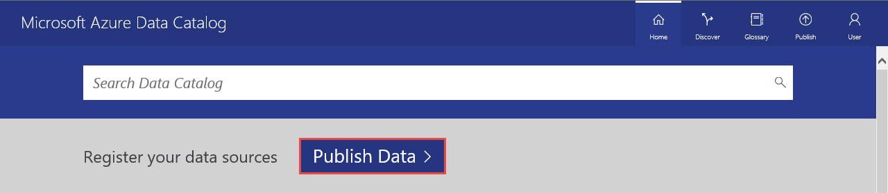

2. select **Launch Application** to download, install, and run the registration tool on your computer.

   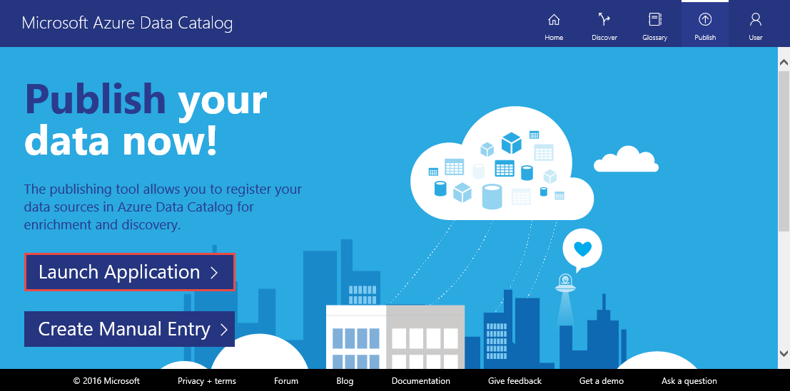

3. On the **Welcome** page, select **Sign in** and enter your credentials.

    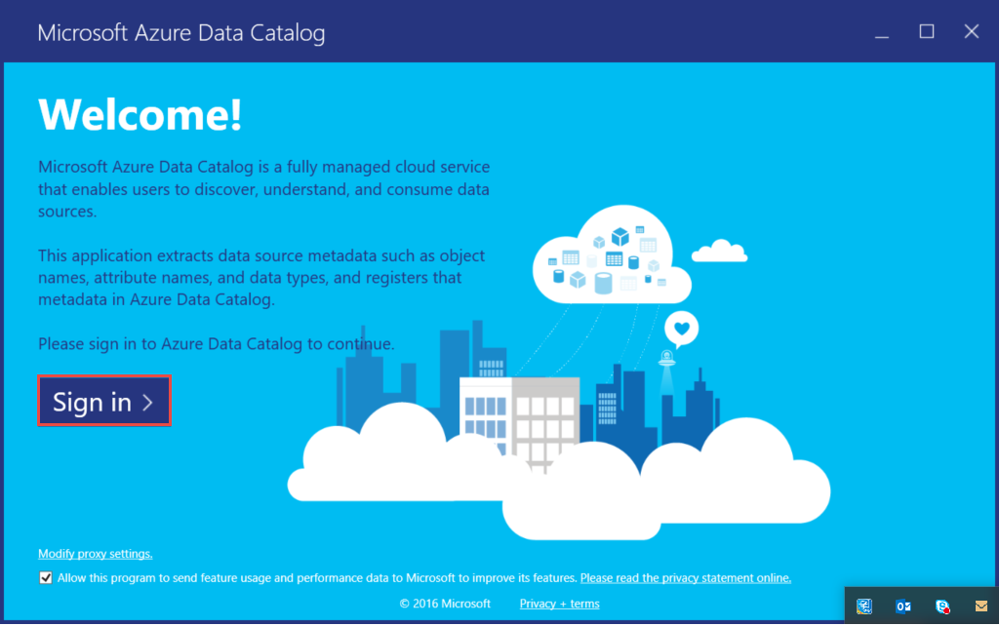

4. On the **Microsoft Azure Data Catalog** page, select **SQL Server** and **Next**.

    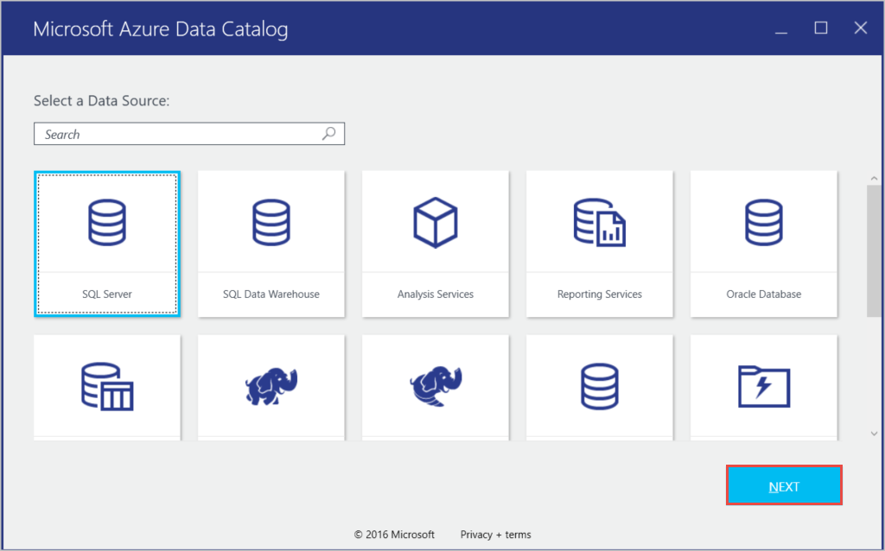

5. Enter the SQL Server connection properties for your Azure SQL database sample and select **CONNECT**.

   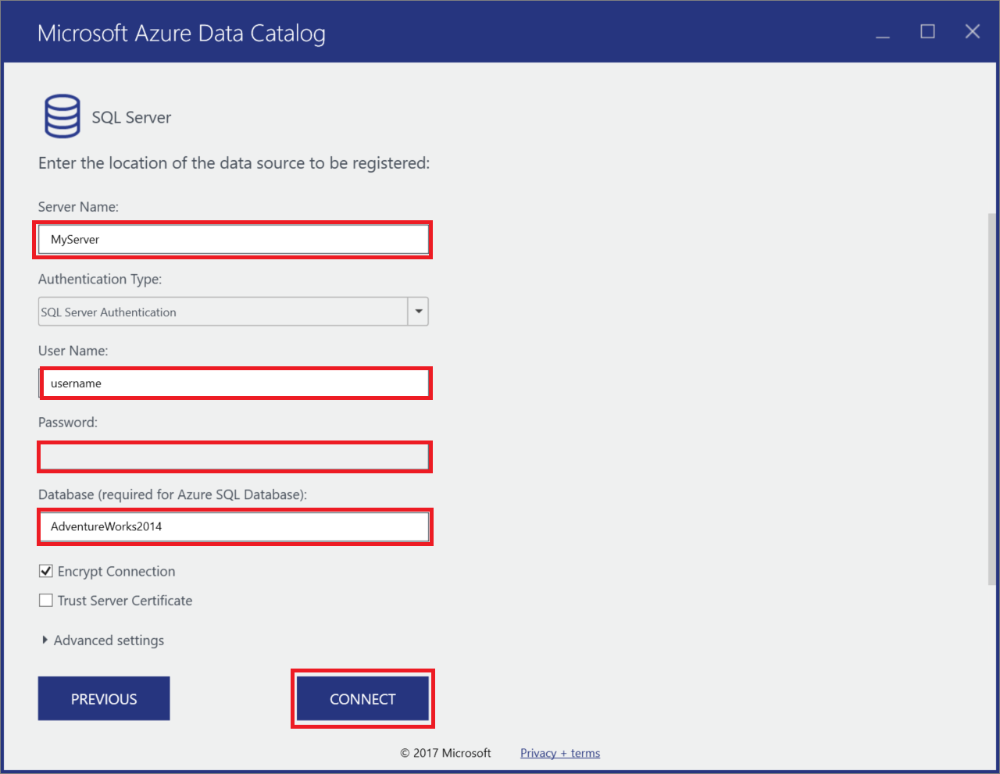

6. Register the metadata of your data asset. In this example, you register **Product** objects from the Azure SQL database sample namespace:

    1. In the **Server Hierarchy** tree, expand your Azure SQL database sample and select **SalesLT**.

    2. Select **Product**, **ProductCategory**, **ProductDescription**, and **ProductModel** by using Ctrl+select.

    3. select the **move-selected arrow** (**>**). This action moves all selected objects into the **Objects to be registered** list.

          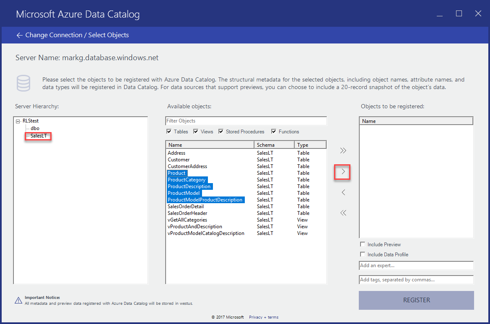

    4. Select **Include a Preview** to include a snapshot preview of the data. The snapshot includes up to 20 records from each table, and it's copied into the catalog.

    5. Select **Include Data Profile** to include a snapshot of the object statistics for the data profile (for example: minimum, maximum, and average values for a column, number of rows).

    6. In the **Add tags** field, enter **sales, product, azure sql**. This action adds search tags for these data assets. Tags are a great way to help users find a registered data source.

    7. Specify the name of an **expert** on this data (optional).

          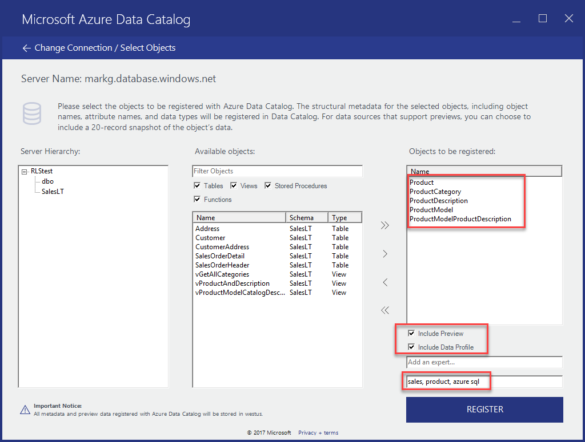

    8. Select **REGISTER**. Azure Data Catalog registers your selected objects. In this exercise, the selected objects from your Azure SQL database sample are registered. The registration tool extracts metadata from the data asset and copies that data into the Azure Data Catalog service. The data remains where it currently stays. Data remains under the control of the administrators and policies of the origin system.

          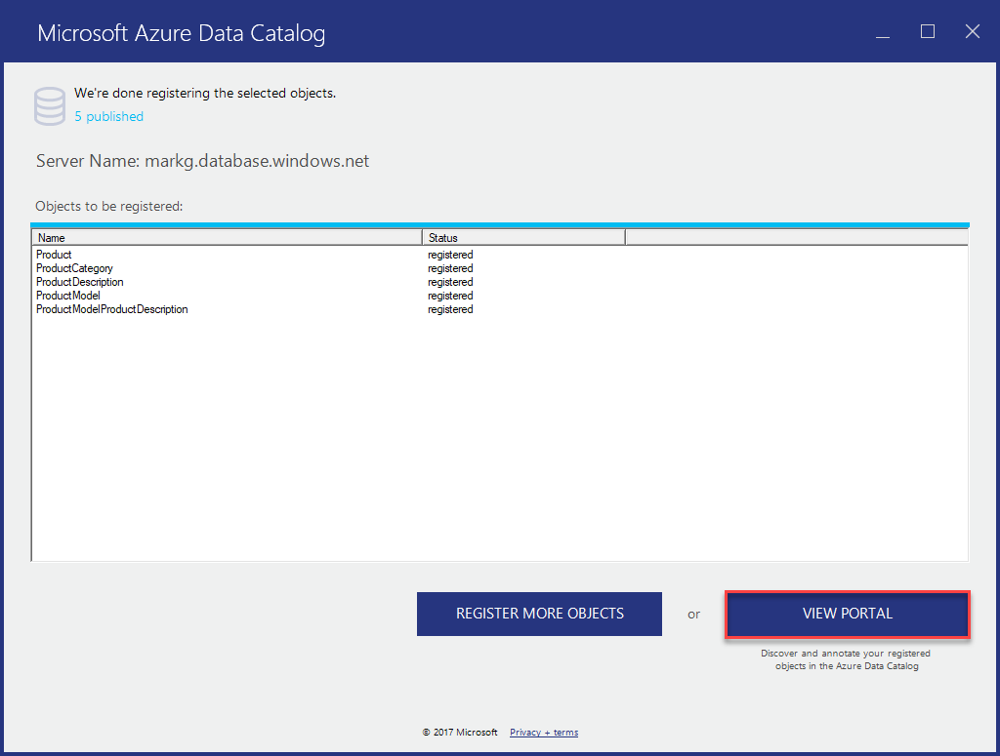

    9. To see your registered data source objects, select **View Portal**. In the Azure Data Catalog portal, confirm that you see all four tables and the database in the grid view (verify that the search bar is clear).

        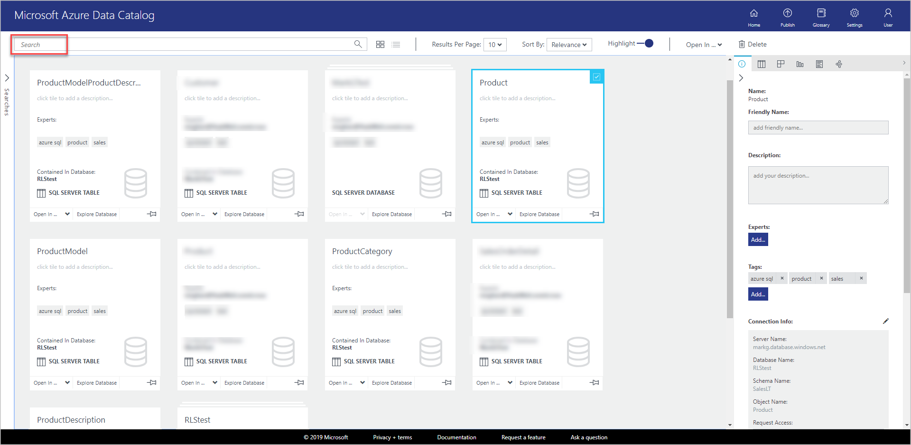

In this exercise, you registered objects from the Azure SQL database sample so that they can be easily discovered by users across your organization.

In the next exercise, you learn how to discover registered data assets.

## Discover data assets

Discovery in Azure Data Catalog uses two primary mechanisms: searching and filtering.

Searching is designed to be both intuitive and powerful. By default, search terms are matched against any property in the catalog, including user-provided annotations.

Filtering is designed to complement searching. You can select specific characteristics such as experts, data source type, object type, and tags to view matching data assets and to constrain search results to matching assets.

By using a combination of searching and filtering, you can quickly navigate the data sources that are registered with Azure Data Catalog.

In this exercise, you use the Azure Data Catalog portal to discover data assets you registered in the previous exercise. See [Data Catalog Search syntax reference](/rest/api/datacatalog/#search-syntax-reference) for details about search syntax.

Following are a few examples for discovering data assets in the catalog.  

### Discover data assets with basic search

Basic search helps you search a catalog by using one or more search terms. Results are any assets that match on any property with one or more of the terms specified.

1. select **Home** in the Azure Data Catalog portal. If you've closed the web browser, go to the [Azure Data Catalog home page](https://www.azuredatacatalog.com).

2. In the search box, enter `product` and press **ENTER**.

    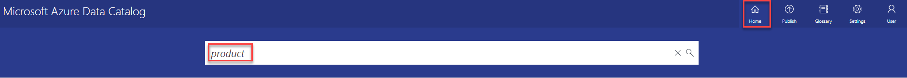

3. Confirm that you see all four tables and the database in the results. You can switch between **grid view** and **list view** by selecting buttons on the toolbar, as shown in the following image. Notice that the search keyword is highlighted in the search results because the **Highlight** option is **ON**. You can also specify the number of **results per page** in search results.

    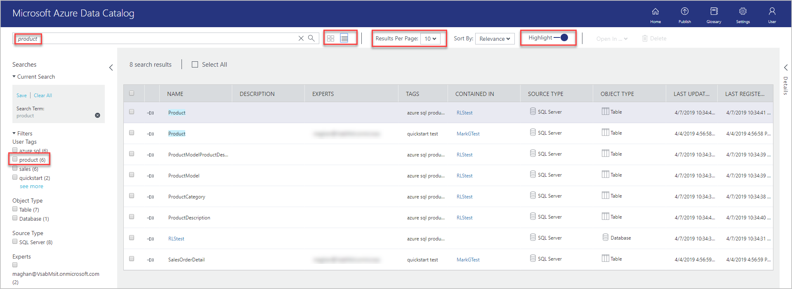

    The **Searches** panel is on the left and the **Properties** panel is on the right. On the **Searches** panel, you can change search criteria and filter results. The **Properties** panel displays properties of a selected object in the grid or list.

4. select **Product** in the search results. select the **Preview**, **Columns**, **Data Profile**, and **Documentation** tabs, or select the arrow to expand the bottom pane.  

    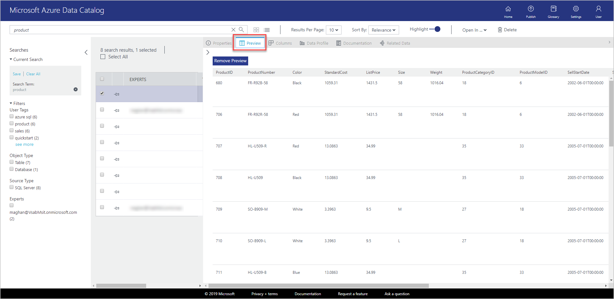

    On the **Preview** tab, you see a preview of the data in the **Product** table.  
5. select the **Columns** tab to find details about columns (such as **name** and **data type**) in the data asset.

6. select the **Data Profile** tab to see the profiling of data (for example: number of rows, size of data, or minimum value in a column) in the data asset.

### Discover data assets with property scoping

Property scoping helps you discover data assets where the search term is matched with the specified property.

1. Clear the **Table** filter under **Object Type** in **Filters**.  

2. In the search box, enter `tags:product` and press **ENTER**. See [Data Catalog Search syntax reference](/rest/api/datacatalog/#search-syntax-reference) for all the properties you can use for searching the data catalog.

3. Confirm that you see the tables and the database in the results.  

    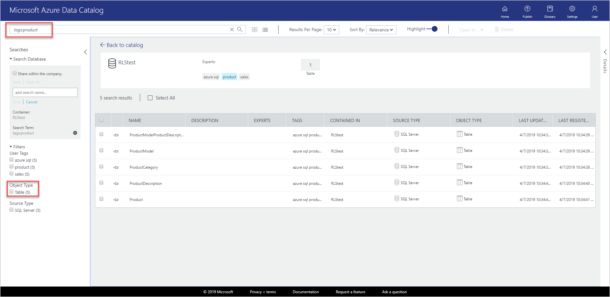

### Save the search

1. In the **Searches** pane in the **Current Search** section, enter a name for the search and select **Save**.

    

2. Confirm that the saved search shows up under **Saved Searches**.

3. Select one of the actions you can take on the saved search (**Rename**, **Delete**, **Save As Default** search).

### Grouping with parentheses

By grouping with parentheses, you can group parts of the query to achieve logical isolation, especially along with Boolean operators.

1. In the search box, enter `name:product AND (tags:product AND objectType:table)` and press **ENTER**.

2. Confirm that you see only the **Product** table in the search results.

    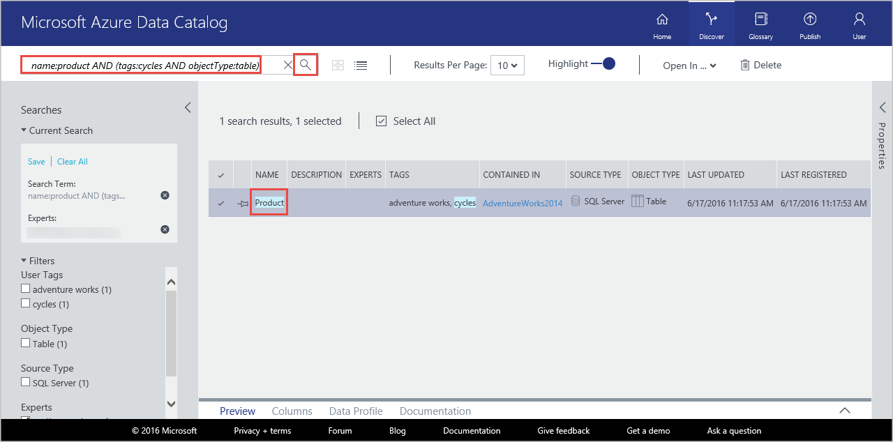

### Comparison operators

With comparison operators, you can use comparisons other than equality for properties that have numeric and date data types.

1. In the search box, enter `lastRegisteredTime:>"06/09/2016"`.

2. Clear the **Table** filter under **Object Type**.

3. Press **ENTER**.

4. Confirm that you see the **Product**, **ProductCategory**, and **ProductDescription** tables and the Azure SQL database you registered in search results.

    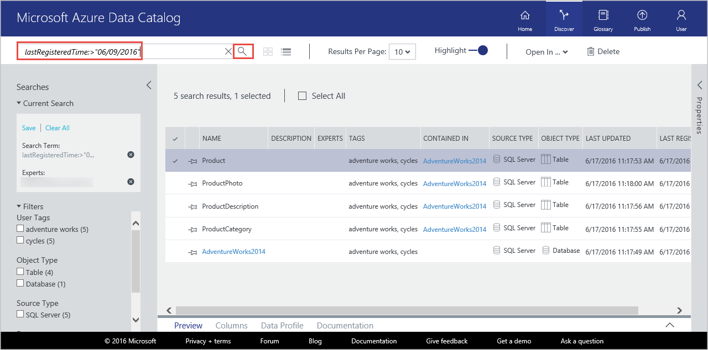

See [How to discover data assets](data-catalog-how-to-discover.md) for detailed information about discovering data assets. For more information on search syntax, see [Data Catalog Search syntax reference](/rest/api/datacatalog/#search-syntax-reference).

## Annotate data assets

In this exercise, you use the Azure Data Catalog portal to annotate (add information such as descriptions, tags, or experts) existing data assets in the catalog. The annotations supplement the structural metadata extracted from the data source during registration. Annotation makes the data assets much easier to discover and understand.

In this exercise, you annotate a single data asset (ProductPhoto). You add a friendly name and description to the ProductPhoto data asset.  

1. Go to the [Azure Data Catalog home page](https://www.azuredatacatalog.com) and search with `tags:product` to find the data assets you've registered.

2. select **ProductModel** in search results.  

3. Enter **Product images** for **Friendly Name** and **Product photos for marketing materials** for the **Description**.

    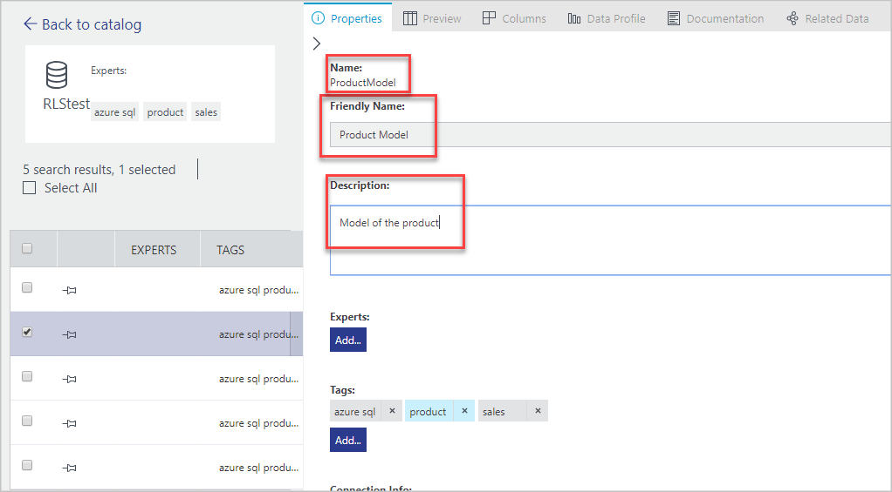

    The **Description** helps others discover and understand why and how to use the selected data asset. You can also add more tags and view columns. You can search and filter data sources by using the descriptive metadata you’ve added to the catalog.

You can also do the following steps on this page:

* Add experts for the data asset. select **Add** in the **Experts** area.

* Add tags at the dataset level. select **Add** in the **Tags** area. A tag can be a user tag or a glossary tag. The Standard Edition of Data Catalog includes a business glossary that helps catalog administrators define a central business taxonomy. Catalog users can then annotate data assets with glossary terms. For more information, see [How to set up the Business Glossary for Governed Tagging](data-catalog-how-to-business-glossary.md)

* Add tags at the column level. select **Add** under **Tags** for the column you want to annotate.

* Add description at the column level. Enter **Description** for a column. You can also view the description metadata extracted from the data source.

* Add **Request access** information that shows users how to request access to the data asset.
  
* Choose the **Documentation** tab and provide documentation for the data asset. With Azure Data Catalog documentation, you can use your data catalog as a content repository to create a complete narrative of your data assets.
  
You can also add an annotation to multiple data assets. For example, you can select all the data assets you registered and specify an expert for them.

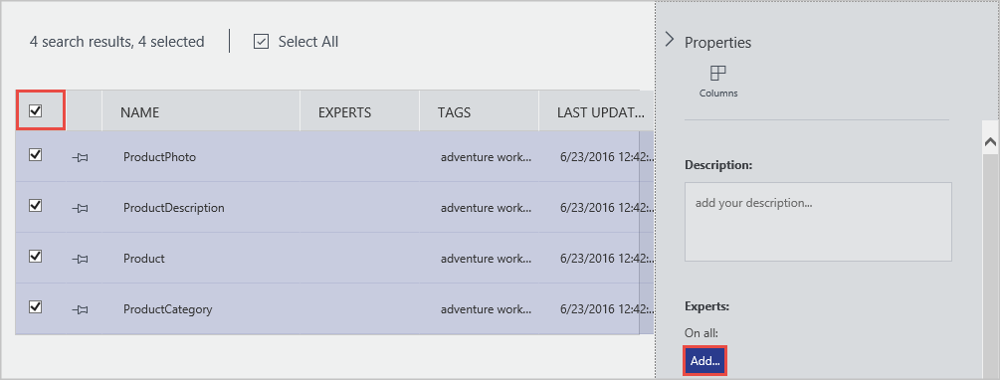

Azure Data Catalog supports a crowd-sourcing approach to annotations. Any Data Catalog user can add tags (user or glossary), descriptions, and other metadata. By doing so, users add perspective on a data asset and its use, and share that perspective with other users.

See [How to annotate data assets](data-catalog-how-to-annotate.md) for detailed information about annotating data assets.

## Connect to data assets

In this exercise, you open data assets in an integrated client tool (Excel) and a non-integrated tool (SQL Server Management Studio) by using connection information.

> [!NOTE]
> It’s important to remember that Azure Data Catalog doesn’t give you access to the actual data source—it simply makes it easier for you to discover and understand it. When you connect to a data source, the client application you choose uses your Windows credentials or prompts you for credentials as necessary. If you have not previously been granted access to the data source, you need to be granted access before you can connect.

### Connect to a data asset from Excel

1. Select **Product** from search results. select **Open In** on the toolbar and select **Excel**.

    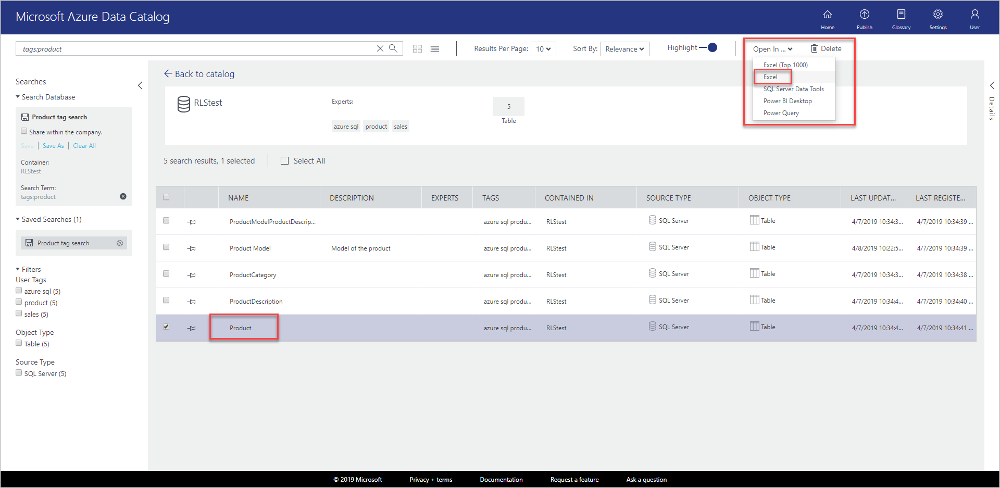

2. Select **Open** in the download pop-up window. This experience may vary depending on the browser.

3. In the **Microsoft Excel Security Notice** window, select **Enable**.

    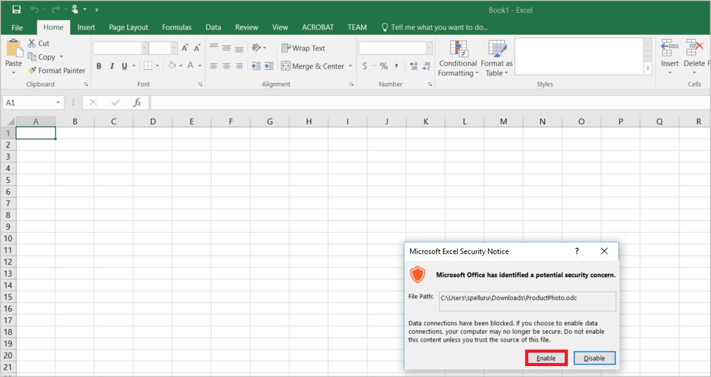

4. Keep the defaults in the **Import Data** dialog box and select **OK**.

    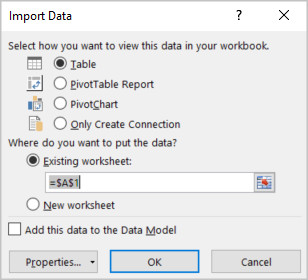

5. View the data source in Excel.

    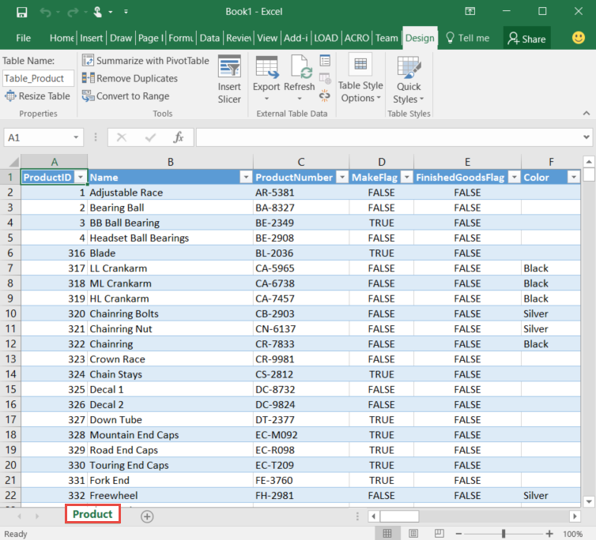

### SQL Server Management Studio

In this exercise, you connected to data assets discovered by using Azure Data Catalog. With the Azure Data Catalog portal, you can connect directly by using the client applications integrated into the **Open in** menu. You can also connect with any application you choose by using the connection location information included in the asset metadata. For example, you can use SQL Server Management Studio to connect to the Azure SQL database to access the data in the data assets registered in this tutorial.

1. Open **SQL Server Management Studio**.

2. In the **Connect to Server** dialog box, enter the server name from the **Properties** pane in the Azure Data Catalog portal.

3. Use appropriate authentication and credentials to access the data asset. If you don't have access, use information in the **Request Access** field to get it.

    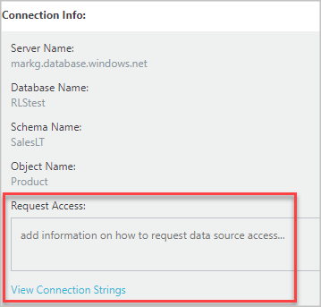

Select **View Connection Strings** to view and copy ADO.NET, ODBC, and OLEDB connection strings to the clipboard for use in your application.

## Manage data assets

In this step, you see how to set up security for your data assets. Data Catalog doesn't give users access to the data itself. The owner of the data source controls data access.

You can use Data Catalog to discover data sources and to view the metadata related to the sources registered in the catalog. There may be situations, however, where data sources should only be visible to specific users or to members of specific groups. For these scenarios, you can use Data Catalog to take ownership of registered data assets, and control the visibility of the assets you own.

> [!NOTE]
> The management capabilities described in this exercise are available only in the Standard Edition of Azure Data Catalog, not in the Free Edition.
> In Azure Data Catalog, you can take ownership of data assets, add co-owners to data assets, and set the visibility of data assets.

### Take ownership of data assets and restrict visibility

1. Go to the [Azure Data Catalog home page](https://www.azuredatacatalog.com). In the **Search** text box, enter `tags:cycles` and press **ENTER**.

2. select an item in the result list and select **Take Ownership** on the toolbar.

3. In the **Management** section of the **Properties** panel, select **Take Ownership**.

    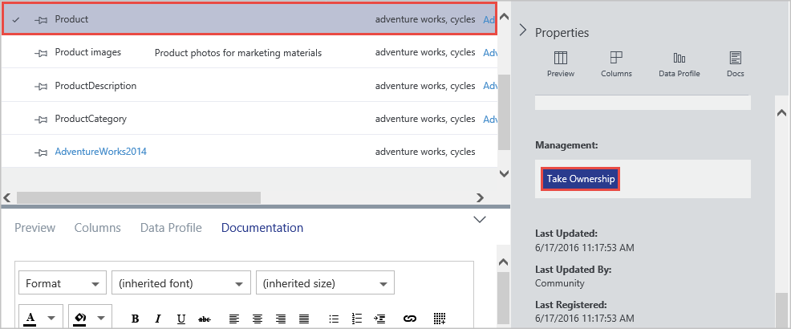

4. To restrict visibility, choose **Owners & These Users** in the **Visibility** section and select **Add**. Enter user email addresses in the text box and press **ENTER**.

    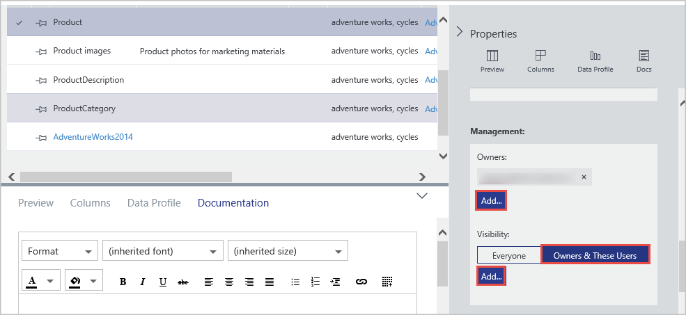

## Remove data assets

In this exercise, you use the Azure Data Catalog portal to remove preview data from registered data assets and delete data assets from the catalog.

In Azure Data Catalog, you can delete an individual asset or delete multiple assets.

1. Go to the [Azure Data Catalog home page](https://www.azuredatacatalog.com).

2. In the **Search** text box, enter `tags:cycles` and select **ENTER**.

3. Select an item in the result list and select **Delete** on the toolbar as shown in the following image:

    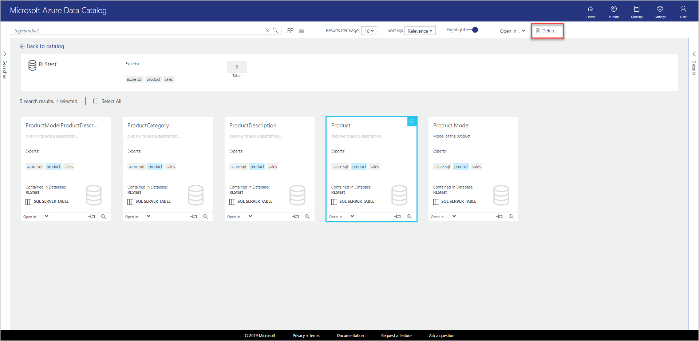

    If you're using the list view, the check box is to the left of the item as shown in the following image:

    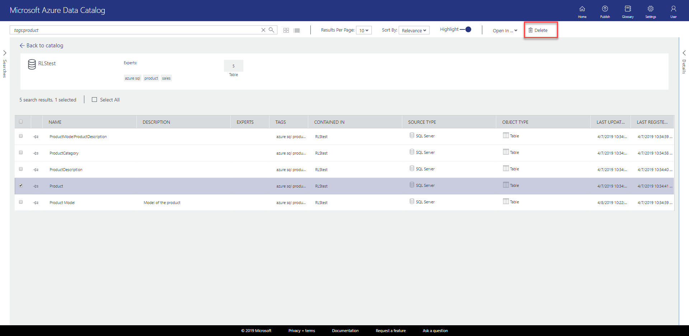

    You can also select multiple data assets and delete them as shown in the following image:

    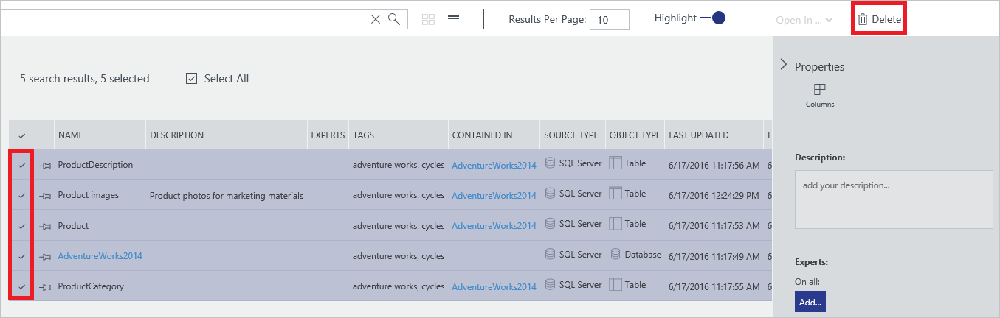

> [!NOTE]
> The default behavior of the catalog is to allow any user to register any data source, and to allow any user to delete any data asset that has been registered. The management capabilities included in the Standard Edition of Azure Data Catalog provide additional options for taking ownership of assets, restricting who can discover assets, and restricting who can delete assets.

## Summary

In this tutorial, you explored essential capabilities of Azure Data Catalog, including registering, annotating, discovering, and managing enterprise data assets. Now that you’ve completed the tutorial, it’s time to get started. You can begin today by registering the data sources you and your team rely on, and by inviting colleagues to use the catalog.

## Next steps

> [!div class="nextstepaction"]
> [Supported data sources](data-catalog-dsr.md)
