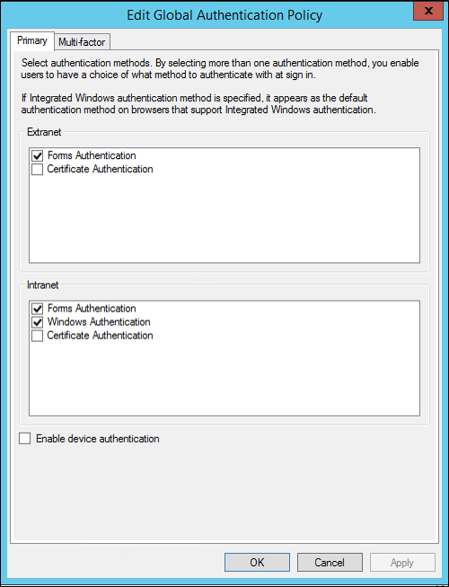

# Troubleshooting Azure Data Catalog

[!INCLUDE [Microsoft Purview redirect](includes/catalog-to-purview-migration-flag.md)]

This article describes common troubleshooting concerns for Azure Data Catalog resources. 

## Functionality limitations

In Azure Data Catalog, the following functionality is limited:

- Accounts with type **Guest Role** aren't supported. You can't add guest accounts as users of Azure Data Catalog, and guest users can't use the portal at [https://www.azuredatacatalog.com](https://www.azuredatacatalog.com).

- Creating Azure Data Catalog resources using Azure Resource Manager Templates or Azure PowerShell commands isn't supported.

- The Azure Data Catalog resource can't be moved between Azure Tenants.

## Microsoft Entra policy configuration

You may encounter a situation where you can sign in to the Azure Data Catalog portal, but when you attempt to sign in to the data source registration tool, you encounter an error message that prevents you from signing in. This error may occur when you are on the company network or when you're connecting from outside the company network.

The registration tool uses *forms authentication* to validate user sign-ins against Microsoft Entra ID. For successful sign-in, a Microsoft Entra administrator must enable forms authentication in the *global authentication policy*.

With the global authentication policy, you can enable authentication separately for intranet and extranet connections, as shown in the following image. Sign-in errors may occur if forms authentication isn't enabled for the network from which you're connecting.

 

For more information, see [the article for configuring authentication policies](/previous-versions/windows/it-pro/windows-server-2012-R2-and-2012/dn486781(v=ws.11)).

## Next steps

* [Create an Azure Data Catalog](data-catalog-get-started.md)
