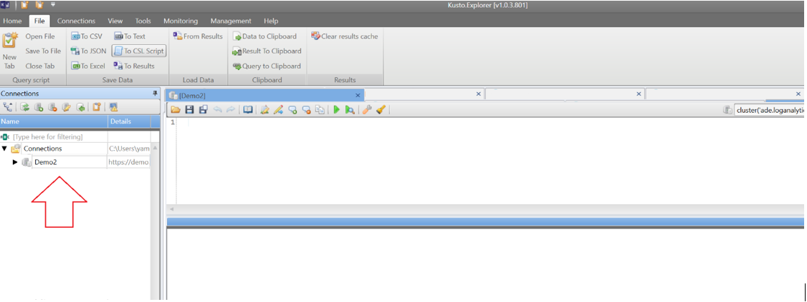

# Azure Data Explorer proxy for cross product queries (Preview)

The Azure Data Explorer proxy enables you to perform cross product queries between Azure Data Explorer, [Application Insights](/azure/azure-monitor/app/app-insights-overview), and [Log Analytics](/azure/azure-monitor/platform/data-platform-logs) in the [Azure Monitor](/azure/azure-monitor/) service. The Azure Data Explorer proxy allows you to define a Azure Monitor logs and Application Insights cluster as a virtual cluster. You can then query the cluster using Azure Data Explorer tools and connect to it as a virtual cluster in a cross cluster query. The Azure Data Explorer proxy flow is depicted below. 


> [!NOTE]
> The ADX Proxy is now in **Private Preview**. To enable this feature, contact the [ADXProxy](mailto:adxproxy@microsoft.com) team and follow the guidelines detailed below.

## Prerequisites

### Whitelisting

During the preview of the feature, each user needs to be whitelisted before using the proxy. The process is done internally by the ADX Proxy team.

The following info is required in order to complete the whitelisting:

1. Your **tenant id**
  - The tenant ID is the Azure Tenant ID of the Azure Tenant where your ADX clusters, Application Insights and/or Log Analytics instances are hosted
  - To get tenant id:
    - Select Azure Active Directory =\&gt; Properties
    - Copy the Directory Id

1. **List of the ADX clusters** - the list is required to enable ADX OPS to modify the callout policy of those cluster, that will enable them to communicate with the proxy.
  - The callout policy of All Kusto cluster that are involved in the cross cluster query, and must be modified to enable access to the proxy clusters (this is done internally by the Kusto DevOps team)
  - ALL Kusto native clusters that participate in the query must have the callout set properly
  - The callout policy applied to the clusters to support the ADX proxy: @&#39;[{&quot;CalloutType&quot;: &quot;kusto&quot;,&quot;CalloutUriRegex&quot;: &quot;ade\\.(int\\.)?(applicationinsights|loganalytics)\\.io\\/subscriptions\\/.\*$&quot;, &quot;EnableAllCallouts&quot;: true, &quot;CanCall&quot;: true}]&#39;

1. **List of subscriptions** (ID and NAME) that owns the Log Analytics workspaces and Application Insights (the name is optional, only ID is mandatory)
  - The proxy maps each subscription as an ADX cluster
  - To get Subscription Id:
    - Select the AppInsights app =\&gt; Properties
    - Copy the Subscription Id

1. **List of apps** (NAME) **per subscriptions**.
  - The proxy maps each Application Insights app as an ADX database
  - To get App Name:
    - Select the AppInsights app =\&gt; Properties
    - Copy the Name

## Important Notes:

1. You can use Kusto Explorer, ADX web Explorer, Jupyter Kqlmagic, or REST API to **query the proxy clusters**
2. Make sure you use **latest version of Kusto Explorer** (if you are not sure, reopen it)
3. In Kusto Explorer, if you add connection to **more than one proxy cluster** , make sure to give each a **different alias name**. Otherwise they all will have the same &quot;ade&quot; alias name on the left pane
  - Please note - this will be fixed for GA
4. Database names in Kusto are **case sensitive**. In cross cluster queries make sure that the app/workspace (database) name is using the correct characters
  - The proxy document that AI app or LA workspace names are case sensitive, when used in cross cluster queries !!! This might surprise AI and LA users, because in Draft the names are case insensitive. The reason for this, is because database names in Kusto are case sensitive.
5. When Application Insights apps or Log Analytics workspaces name have a special characters (such as SPACE character) as part of the name, we need to use URL encoding to replace the special characters it in the proxy cluster name. For example, the encoding for space: use %20
6. Log Analytics workspace names and Application Insights app names that include characters that don't meet ADX identifier naming rules (see [https://docs.microsoft.com/en-us/azure/kusto/query/schema-entities/entity-names](https://docs.microsoft.com/en-us/azure/kusto/query/schema-entities/entity-names)) will be named with invalid characters and will be replaced by the dash character &#39;-&#39;.
7. Please note: a join operation may require a hint to make it run on a kusto native cluster (and not on the proxy, otherwise it will fail), by adding to the join operator a hint attribute: hint.remote=right or left. for example: &#39;| join hint.remote=right ...&#39;

## Restrictions

1. The **ADX** cluster **used for the cross queries must be** a native Kusto cluster**
2. The ADX Proxy does not support access to resources from a different tenant than the resource&#39;s tenant ID
3. Only AAD access token are allowed
  - Please note that Kusto have more authentication options which are not allowed with the Proxy
  - When you authenticate using AAD you need to specify the audience to get a token. The ADX proxy expect to get a Kusto access token (any AAD Kusto access token will work)
    1. For example: for direct access to the proxy via REST API, the user needs to create and use an access token to &quot;https://kusto.kusto.windows.net&quot;
2. Current version of ADX proxy, does not support direct query of ADX proxy using V2 protocol (only V1 is supported). Will support it in a future version
3. Third party queries may not work, due to Kusto optimization. More info TBD
4. Log Analytics functions associates with specific Workspace currently not supported

## Using the proxy

The following flow depicts how to connect to the proxy, add a proxy cluster to ADX Web UI Explorer, and run queries again your AI/LA clusters from the Azure Data Explorer proxy

### Connect to the proxy

1. Verify your Azure Data Explorer native cluster *help* appears on the left menu before you connect to your Log Analytics or Application Insights cluster.

    

1. In the Azure Data Explorer UI (https://dataexplorer.azure.com/clusters), select **Add Cluster**.

1. In the **Add Cluster** window:

    * Add the URL to the LA or AI cluster. For example: `https://ade.loganalytics.io/subscriptions/<Subscription ID>/workspaces/<Workspace name>`
    * Select **Add**.

    

1. After the connection is established, your LA or AI cluster will appear in the left pane with your native ADX cluster. 

    

### Run queries

#### Query against the native Azure Data Explorer cluster 

Run queries against your Azure Data Explorer cluster (such as *StormEvents* table). When running the query, verify that your native Azure Data Explorer cluster is selected in the left pane.

```kusto
StormEvents | take 10 // Demonstrate query through the native ADX cluster
```


#### Query against your LA or AI cluster** 

When you run queries against your LA or AL cluster (such as on *Perf* table), verify that your LA or AI cluster is selected in the left pane.

```kusto
Perf | take 10 // Demonstrate query through the proxy on the LA workspace
```


#### Query against your LA or AI cluster from the ADX proxy  

When you run queries against your LA or AI cluster from the proxy (such as on *Perf* table), verify your ADX native cluster is selected in the left pane

```kusto
cluster(`https://ade.loganalytics.io/subscriptions/<subscription ID>/workspaces/<workspace name>`) .database(`<workspace name).Perf
| take 10 // Demonstrate query of the LA workspace through the native DX cluster
```


#### Cross query of LA or AI cluster and the ADX cluster from the ADX proxy 

> [!IMPORTANT]
> When you run cross cluster queries from the proxy, verify your ADX native cluster is selected in the left pane.

```kusto
unionStormEvents, cluster(`https://ade.loganalytics.io/subscriptions/<subscription ID>/workspaces/<workspace name>`).database(<workspace name>).Perf
| take 10 // union tables from both the ADX cluster and the LA workspace
```


## Additional syntax examples

The following syntax options can be used when calling the Application Insights (AI) or Log Analytics (LA) clusters:

|Syntax Description  |Application Insights  |Log Analytics  |
|----------------|---------|---------|
| Database within a cluster that contains all apps in this subscription    |   (`https://ade.applicationinsights.io/subscriptions/<subscription-id>`).database(`<database-name>`)      |    (`https://ade.loganalytics.io/subscriptions/<subscription-id>`).database(`<database-name>`)     |
|Cluster that contains all apps/workspaces in this subscription    |     (`https://ade.applicationinsights.io/subscriptions/<subscription-id>`)    |    (`https://ade.loganalytics.io/subscriptions/<subscription-id>`)     |
|Cluster that contains all apps/workspaces in the subscription and are members of this resource group    |   (`https://ade.applicationinsights.io/subscriptions/<subscription-id>/resourcegroups/<resource-group-name>`)      |    (`https://ade.loganalytics.io/subscriptions/<subscription-id>/resourcegroups/<resource-group-name>`)     |
|Cluster that contains only this app/workspace (recommended)    |     (`https://ade.applicationinsights.io/subscriptions/<subscription-id>/apps/<ai-app-name>`) or  (`https://ade.applicationinsights.io/subscriptions/<subscription-id>/providers/microsoft.insights/components/<ai-app-name>`)  | (`https://ade.loganalytics.io/subscriptions/<subscription-id>/workspaces/<ai-app-name>`)  or   (`https://ade.loganalytics.io/subscriptions/<subscription-id>/providers/microsoft.operationalinsights/workspaces/<ai-app-name>`)   |
|Cluster that contains only this resource group      |    (`https://ade.applicationinsights.io/subscriptions/<subscription-id>/resourcegroups/<resource-group-name>/apps/<ai-app-name>`) or  (`https://ade.applicationinsights.io/subscriptions/<subscription-id>/resourcegroups/<resource-group-name>/providers/microsoft.insights/components/<ai-app-name>`)    |  (`https://ade.loganalytics.io/subscriptions/<subscription-id>/resourcegroups/<resource-group-name>/workspaces/<ai-app-name>`) or  (`https://ade.loganalytics.io/subscriptions/<subscription-id>/resourcegroups/<resource-group-name>/providers/microsoft.operationalinsights/workspaces/<ai-app-name>`)    |

## Additional usage scenarios

* How to add a proxy cluster to Kusto CLI
* How to add a proxy cluster to Jupyter Kqlmagic
* How to use proxy cluster API directly via Rest API

