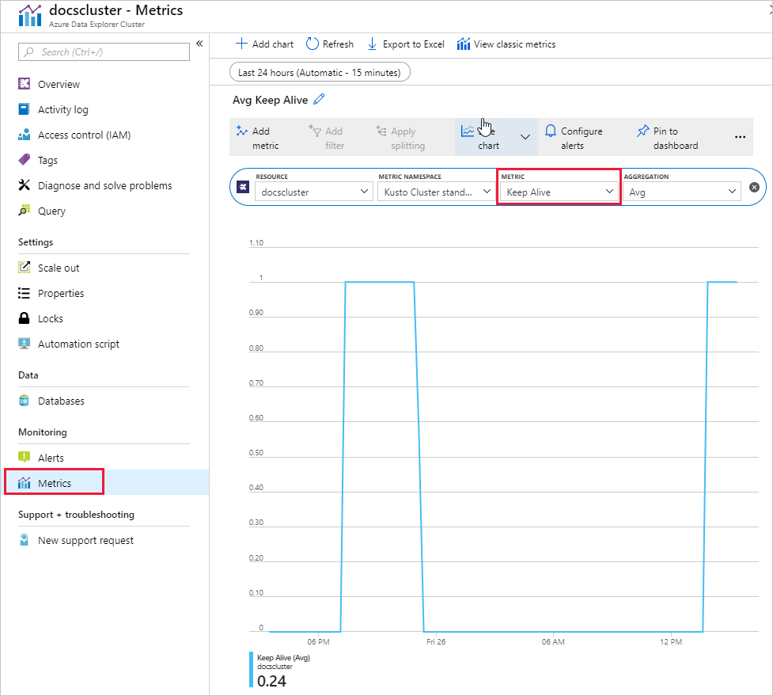
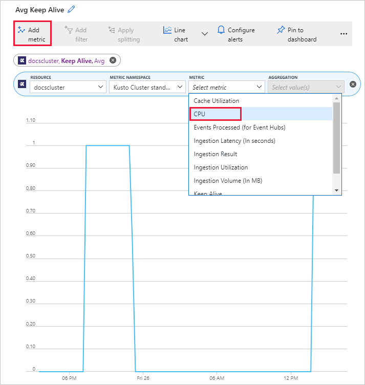

# Check the health of an Azure Data Explorer cluster

There are several factors that impact the health of an Azure Data Explorer cluster, including CPU, memory, and the disk subsystem. This article shows some basic steps you can take to gauge the health of a cluster.

1. Sign in to [https://dataexplorer.azure.com](https://dataexplorer.azure.com).

1. In the left pane, select your cluster, and run the following command.

    ```Kusto
    .show diagnostics
    | project IsHealthy
    ```
    An output of 1 is healthy; an output of 0 is unhealthy.

1. Sign into the [Azure portal](https://portal.azure.com), and navigate to your cluster.

1. Under **Monitoring**, select **Metrics**, then select **Keep Alive**, as shown in the following image. An output close to 1 means a healthy cluster.

    

1. It's possible to add other metrics to the chart. Select the chart then **Add metric**. Select another metric - this example shows **CPU**.

    

1. If you need assistance diagnosing issues with the health of a cluster, please open a support request in the [Azure portal](https://portal.azure.com/#blade/Microsoft_Azure_Support/HelpAndSupportBlade/overview).