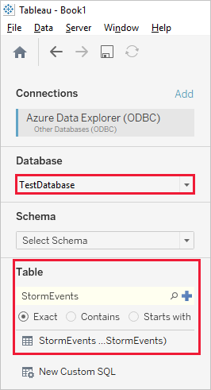
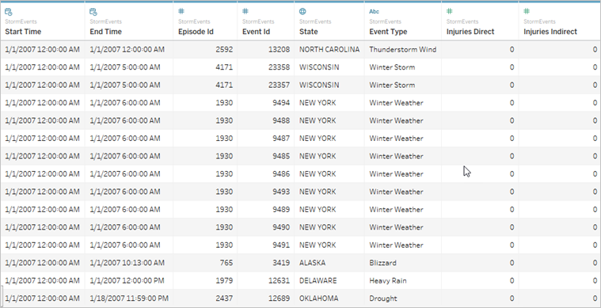

# Connect to Azure Data Explorer with ODBC

Open Database Connectivity ([ODBC](/sql/odbc/reference/odbc-overview)) is a widely accepted application programming interface (API) for database access. Use ODBC to connect to Azure Data Explorer from applications that don't have a dedicated connector.

Behind the scenes, applications call functions in the ODBC interface, which are implemented in database-specific modules called *drivers*. Azure Data Explorer supports a subset of the SQL Server communication protocol ([MS-TDS](/azure/kusto/api/tds/)); therefore it can use the ODBC driver for SQL Server.

In this article, you learn how to use the SQL Server ODBC driver, so you can connect to Azure Data Explorer from any application that supports ODBC. You can then optionally connect to Azure Data Explorer from Tableau, and bring in data from a sample cluster.

## Prerequisites

You need the following to complete this how to:

* [Microsoft ODBC Driver for SQL Server version 17.2.0.1 or later](/sql/connect/odbc/download-odbc-driver-for-sql-server) for your operating system.

* If you want to follow our Tableau example, you also need:

  * Tableau Desktop, full or [trial](https://www.tableau.com/products/desktop/download) version.

  * A cluster that includes the StormEvents sample data. For  more information, see [Quickstart: Create an Azure Data Explorer cluster and database](create-cluster-database-portal.md) and [Ingest sample data into Azure Data Explorer](ingest-sample-data.md).

    [!INCLUDE [data-explorer-storm-events](../../includes/data-explorer-storm-events.md)]

## Configure the ODBC data source

Follow these steps to configure an ODBC data source using the ODBC driver for SQL Server.

1. In Windows, search for *ODBC Data Sources*, and open the ODBC Data Sources desktop app.

1. Select **Add**.

    

1. Select **ODBC Driver 17 for SQL Server** then **Finish**.

    

1. Enter a name and description for the connection and the cluster you want to connect to, then select **Next**. The cluster URL should be in the form *\<ClusterName\>.\<Region\>.kusto.windows.net*.

    

1. Select **Active Directory Integrated** then **Next**.

    

1. Select the database with the sample data then **Next**.

    

1. On the next screen, leave all options as defaults then select **Finish**.

1. Select **Test Data Source**.

    

1. Verify that the test succeeded then select **OK**. If the test didn't succeed, check the values that you specified in previous steps, and ensure you have sufficient permissions to connect to the cluster.

    

## Visualize data in Tableau (optional)

Now you've finished configuring ODBC, you can bring sample data into Tableau.

1. In Tableau Desktop, in the left menu, select **Other Databases (ODBC)**.

    

1. For **DSN**, select the data source you created for ODBC, then select **Sign In**.

    

1. For **Database**, select the database on your sample cluster, such as *TestDatabase*. For **Schema**, select *dbo*, and for **Table**, select the *StormEvents* sample table.

    

1. Tableau now shows the schema for the sample data. Select **Update Now** to bring the data into Tableau.

    

    When the data is imported, Tableau shows rows of data similar to the following image.

    

1. Now you can create visualizations in Tableau based on the data you brought in from Azure Data Explorer. For more information, see [Tableau Learning](https://www.tableau.com/learn).

## Next steps

[Write queries for Azure Data Explorer](write-queries.md)

[Tutorial: Visualize data from Azure Data Explorer in Power BI](visualize-power-bi.md)