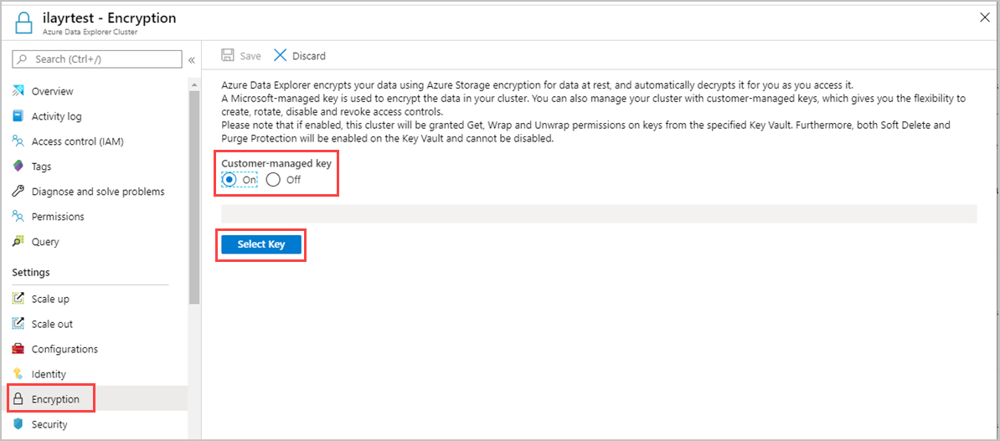
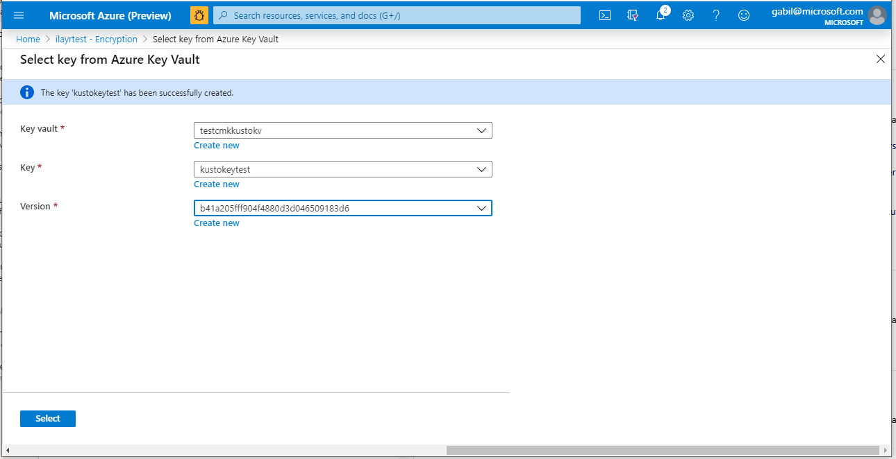

# Configure customer-managed keys using the Azure portal

> [!div class="op_single_selector"]
> * [Portal](customer-managed-keys-portal.md)
> * [C#](customer-managed-keys-csharp.md)
> * [Azure Resource Manager template](customer-managed-keys-resource-manager.md)

[!INCLUDE [data-explorer-configure-customer-managed-keys](../../includes/data-explorer-configure-customer-managed-keys.md)]

## Enable encryption with customer-managed keys in the Azure portal

This article shows you how to enable customer-managed keys encryption using the Azure portal. By default, Azure Data Explorer encryption uses Microsoft-managed keys. Configure your Azure Data Explorer cluster to use customer-managed keys and specify the key to associate with the cluster.

1. In the [Azure portal](https://portal.azure.com/), go to your [Azure Data Explorer cluster](create-cluster-database-portal.md#create-a-cluster) resource. 
1. Select **Settings** > **Encryption** in left pane of portal.
1. In the **Encryption** pane, select **On** for the **Customer-managed key** setting.
1. Click **Select Key**.

    

1. In the **Select key from Azure Key Vault** window, select an existing **Key vault** from the dropdown list. If you select **Create new** to [create a new Key Vault](/azure/key-vault/quick-create-portal#create-a-vault), you'll be routed to the **Create Key Vault** screen.

1. Select **Key**.
1. Select **Version**.
1. Click **Select**.

    

1. In the **Encryption** pane that now contains your key, select **Save**. When CMK creation succeeds, you'll see a success message in **Notifications**.

    

By enabling customer-managed keys for your Azure Data Explorer cluster, you'll be creating a system assigned identity for the cluster if one doesn't exist. In addition, you'll be providing the required get, wrapKey, and unwarpKey permissions to your Azure Data Explorer cluster on the selected Key Vault and get the Key Vault properties. 

> [!NOTE]
> Select **Off** to remove the customer-managed key after it has been created.

## Next steps

* [Secure Azure Data Explorer clusters in Azure](security.md)
* [Secure your cluster in Azure Data Explorer - Azure portal](manage-cluster-security.md) by enabling encryption at rest.
* [Configure customer-managed-keys using the Azure Resource Manager template](customer-managed-keys-resource-manager.md)
* [Configure customer-managed-keys using C#](customer-managed-keys-csharp.md)

