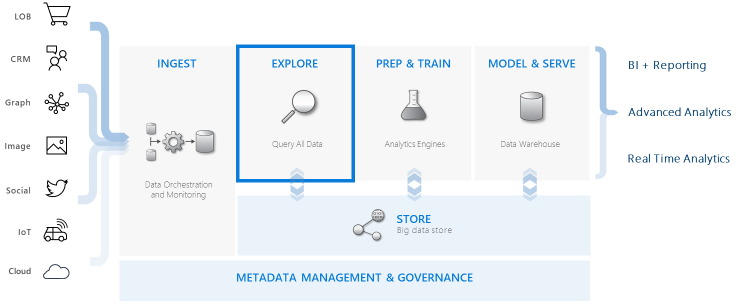
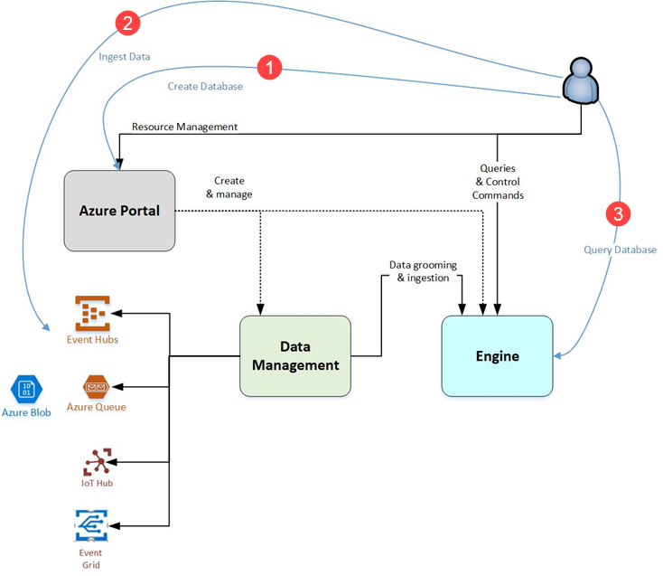

# What is Azure Data Explorer?

Azure Data Explorer is a fast and highly scalable data exploration service for log and telemetry data. It helps you handle the many data streams emitted by modern software, so you can collect, store, and analyze data. Azure Data Explorer is ideal for analyzing large volumes of diverse data from any data source, such as websites, applications, IoT devices, and more. This data is used for diagnostics, monitoring, reporting, machine learning, and additional analytics capabilities. Azure Data Explorer makes it simple to ingest this data and enables you to perform complex ad-hoc queries on the data in seconds.

## What makes Azure Data Explorer unique?

- Scales quickly to terabytes of data, in minutes, allowing rapid iterations of data exploration to discover relevant insights.

- Offers an innovative query language, optimized for high performance data analytics.

- Supports analysis of high volumes of heterogeneous data (structured and unstructured).

- Provides the ability to build and deploy exactly what you need by combining with other services to supply an encompassing, powerful, and interactive data analytics solution.

## Data warehousing workflow

Azure Data Explorer integrates with other major services to provide an end-to-end solution that includes data collection, ingestion, storage, indexing, querying, and visualization. It has a pivotal role in the data warehousing flow by executing the **EXPLORE** step of the flow on terabytes of diverse raw data.

Azure Data Explorer supports several ingestion methods, including connectors to common services like Event Hub, programmatic ingestion using SDKs, such as .NET and Python, and direct access to the engine for exploration purposes. Azure Data Explorer integrates with analytics and modeling services for additional analysis and visualization of data.

## Azure Data Explorer flow

The following diagram shows the different aspects of working with Azure Data Explorer.

Work in Azure Data Explorer generally follows this pattern:

1. **Create database:** Create a *cluster* and then create one or more *databases* in that cluster. [Quickstart: Create an Azure Data Explorer cluster and database](create-cluster-database-portal.md)

1. **Ingest data:** Load data into database tables so that you can run queries against it. [Quickstart: Ingest data from Event Hub into Azure Data Explorer](ingest-data-event-hub.md)

1. **Query database:** Use our web application to run, review, and share queries and results. It is available in the Azure portal and as a stand-alone application. In addition, you can send queries programmatically (using an SDK) or to a REST API endpoint. [Quickstart: Query data in Azure Data Explorer](web-query-data.md)

## Query experience

A query in Azure Data Explorer is a read-only request to process data and return the results of this processing, without modifying the data or metadata. You continue refining your queries until you have completed your analysis. Azure Data Explorer makes this process easy because of its very fast ad-hoc query experience.

Azure Data Explorer handles large amounts of structured, semi-structured (JSON-like nested types) and unstructured (free-text) data equally well. It allows you to search for specific text terms, locate particular events, and perform metric-style calculations on structured data. Azure Data Explorer bridges the worlds of unstructured text logs and structured numbers and dimensions by extracting values in runtime from free-form text fields. Data exploration is simplified by combining fast text indexing, column store, and time series operations.

Azure Data Explorer capabilities are extended by other services built on its powerful query language, including [Log Analytics](/azure/log-analytics/), [Application Insights](/azure/application-insights/), [Time Series Insights](/azure/time-series-insights/), and [Windows Defender Advanced Threat Protection](/windows/security/threat-protection/windows-defender-atp/windows-defender-advanced-threat-protection/).

## Feedback

We would be thrilled to hear your feedback regarding Azure Data Explorer and its query language at:

- [Ask questions on the forum MSDN](https://social.msdn.microsoft.com/Forums/en-US/home?forum=AzureKusto)

- [Make product suggestions in User Voice](http://aka.ms/AzureDataExplorer.UserVoice)

## Next steps

[Quickstart: Create an Azure Data Explorer cluster and database](create-cluster-database-portal.md)

[Quickstart: Ingest data from Event Hub into Azure Data Explorer](ingest-data-event-hub.md)

[Quickstart: Query data in Azure Data Explorer](web-query-data.md)
