# Use Azure Data Factory command activity to run Azure Data Explorer control commands

[Azure Data Factory](/azure/data-factory/) (ADF) is a cloud-based data integration service that allows you to perform a combination of activities on the data. Use ADF to create data-driven workflows for orchestrating and automating data movement and data transformation. The **Azure Data Explorer Command** activity in Azure Data Factory enables you to run [Azure Data Explorer control commands](/azure/kusto/concepts/#control-commands) within an ADF workflow. This article teaches you how to create a pipeline with a lookup activity and ForEach activity containing an Azure Data Explorer command activity.

## Prerequisites

* If you don't have an Azure subscription, create a [free Azure account](https://azure.microsoft.com/free/) before you begin.
* [An Azure Data Explorer cluster and database](create-cluster-database-portal.md)
* A source of data.
* [A data factory](data-factory-load-data.md#create-a-data-factory)

## Create a new pipeline

1. Select the **Author** pencil tool. 
1. Create a new pipeline by selecting **+** and then select **Pipeline** from the drop-down.

   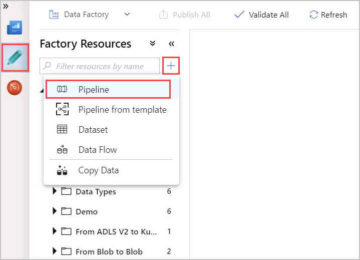

## Create a Lookup activity

A [lookup activity](/azure/data-factory/control-flow-lookup-activity) can retrieve a dataset from any Azure Data Factory-supported data sources. The output from Lookup activity can be used in a ForEach or other activity.

1. In the **Activities** pane, under **General**, select the **Lookup** activity. Drag and drop it into the main canvas on the right.
 
    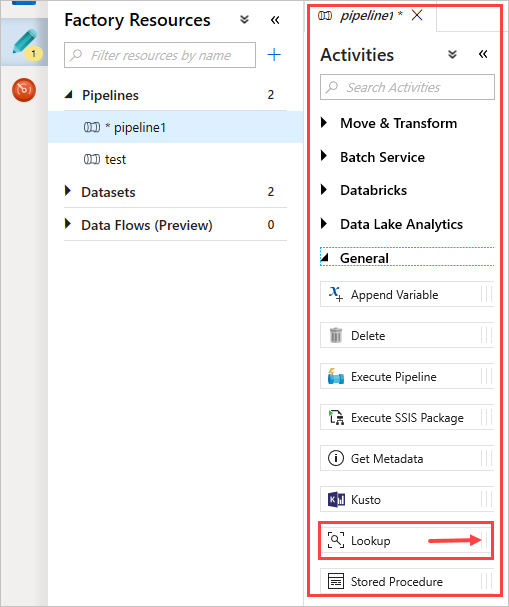

1. The canvas now contains the Lookup activity you created. Use the tabs below the canvas to change any relevant parameters. In **General**, rename the activity. 

    

    > [!TIP]
    > Click on the empty canvas area to view the pipeline properties. Use the **General** tab to rename the pipeline. Our pipeline is named *pipeline-4-docs*.

### Create an Azure Data Explorer dataset in lookup activity

1. In **Settings**, select your pre-created Azure Data Explorer **Source dataset**, or select **+ New** to create a new dataset.
 
    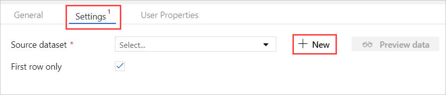

1. Select the **Azure Data Explorer (Kusto)** dataset from **New Dataset** window. Select **Continue** to add the new dataset.

   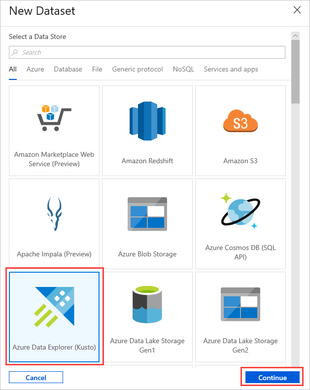 

1. The new Azure Data Explorer dataset parameters are visible in **Settings**. To update the parameters, select **Edit**.

    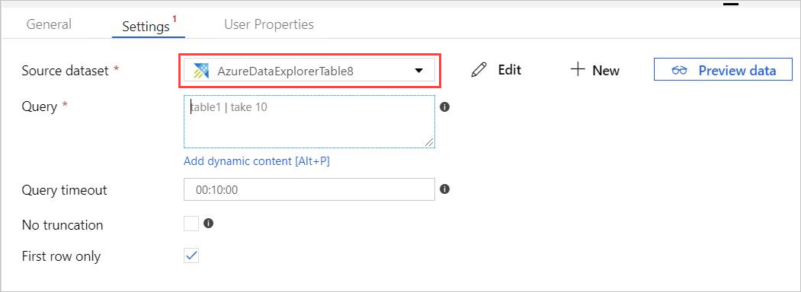

1. The **AzureDataExplorerTable** new tab opens in the main canvas. 
    * Select **General** and edit the dataset name. 
    * Select **Connection** to edit the dataset properties. 
    * Select the **Linked service** from the drop-down, or select **+ New** to create a new linked service.

    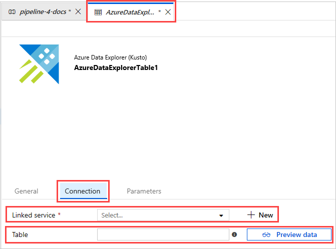

1. When creating a new linked service, the **New Linked Service (Azure Data Explorer)** page opens:

    

   * Select **Name** for Azure Data Explorer linked service. Add **Description** if needed.
   * In **Connect via integration runtime**, change current settings, if needed. 
   * In **Account selection method** select your cluster using one of two methods: 
        * Select the **From Azure subscription** radio button and select your **Azure subscription** account. Then, select your **Cluster**. Note the drop-down will only list clusters that belong to the user.
        * Instead, select **Enter manually** radio button and enter your **Endpoint** (cluster URL).
    * Specify the **Tenant**.
    * Enter **Service principal ID**. The principal ID must have the adequate permissions, according to the permission level required by the command being used.
    * Select **Service principal key** button and enter **Service Principal Key**.
    * Select your **Database** from the dropdown menu. Alternatively, select **Edit** checkbox and enter your database name.
    * Select **Test Connection** to test the linked service connection you created. If you can connect to your setup, a green checkmark **Connection successful** will appear.
    * Select **Finish** to complete linked service creation.

1. Once you’ve set up a linked service, In **AzureDataExplorerTable** > **Connection**, add **Table** name. Select **Preview data**, to make sure that the data is presented properly.

   Your dataset is now ready, and you can continue editing your pipeline.

### Add a query to your lookup activity

1. In **pipeline-4-docs** > **Settings** add a query in **Query** text box, for example:

    ```kusto
    ClusterQueries
    | where Database !in ("KustoMonitoringPersistentDatabase", "$systemdb")
    | summarize count() by Database
    ```

1. Change the **Query timeout** or **No truncation** and **First row only** properties, as needed. In this flow, we keep the default **Query timeout** and uncheck the checkboxes. 

    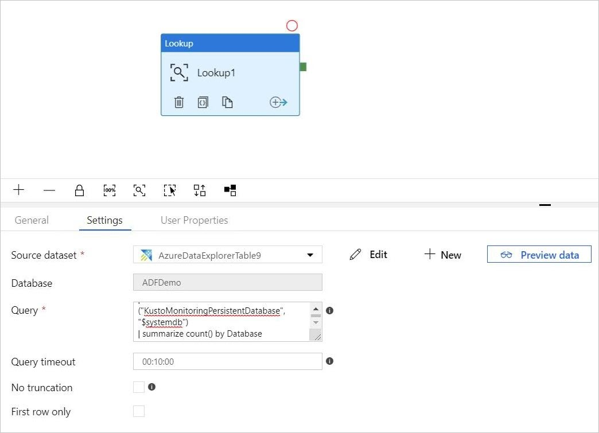

## Create a For-Each activity 

The [For-Each](/azure/data-factory/control-flow-for-each-activity) activity is used to iterate over a collection and execute specified activities in a loop. 

1. Now you add a For-Each activity to the pipeline. This activity will process the data returned from the Lookup activity. 
    * In the **Activities** pane, under **Iteration & Conditionals**, select the **ForEach** activity and drag and drop it into the canvas.
    * Draw a line between the output of the Lookup activity and the input of the ForEach activity in the canvas to connect them.

        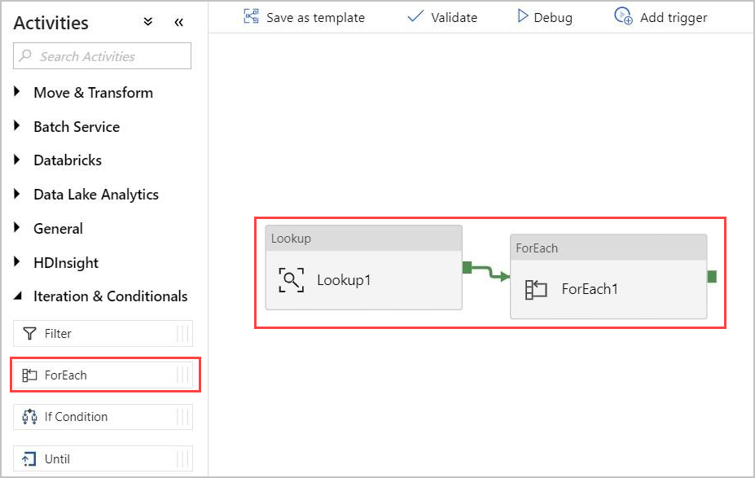

1.	Select the ForEach activity in the canvas. In the **Settings** tab below:
    * Check the **Sequential** checkbox for a sequential processing of the Lookup results, or leave it unchecked to create parallel processing.
    * Set **Batch count**.
    * In **Items**, provide the following reference to the output value:
    *@activity('Lookup1').output.value*

       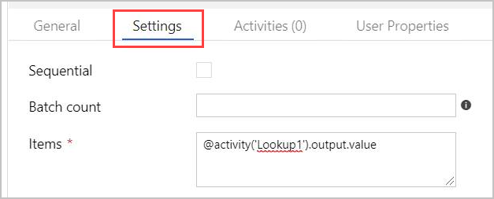

## Create an Azure Data Explorer Command activity within the ForEach activity

1. Double-click the ForEach activity in the canvas to open it in a new canvas to specify the activities within ForEach.
1. In the **Activities** pane, under **Azure Data Explorer**, select the **Azure Data Explorer Command** activity and drag and drop it into the canvas.

    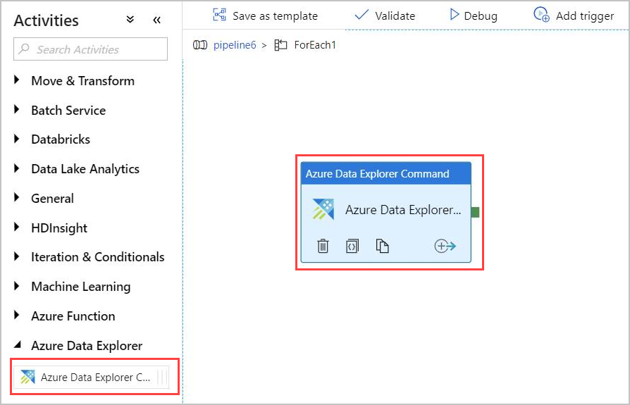

1.	In the **Connection** tab, select the same Linked Service previously created.

    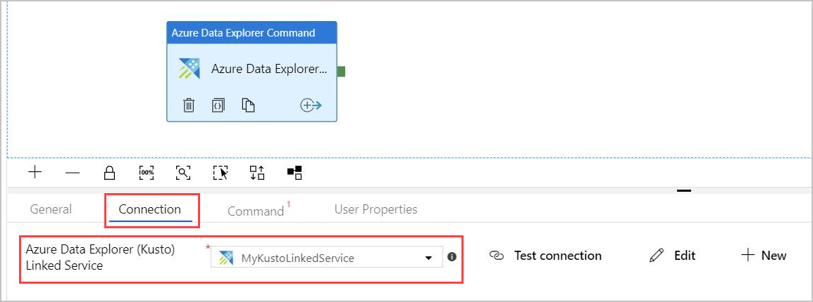

1. In the **Command** tab, provide the following command:

    ```kusto
    .export
    async compressed
    into csv h"http://<storageName>.blob.core.windows.net/data/ClusterQueries;<storageKey>" with (
    sizeLimit=100000,
    namePrefix=export
    )
    <| ClusterQueries | where Database == "@{item().Database}"
    ```

    The **Command** instructs Azure Data Explorer to export the results of a given query into a blob storage, in a compressed format. It runs asynchronously (using the async modifier).
    The query addresses the database column of each row in the Lookup activity result. The **Command timeout** can be left unchanged.

    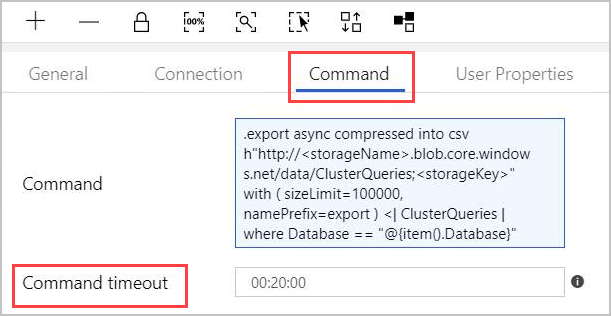   

    > [!NOTE]
    > The command activity has the following limits:
    > * Size limit: 1 MB response size
    > * Time limit: 20 minutes (default), 1 hour (maximum).
    > * If needed, you can append a query to the result using [AdminThenQuery](/azure/kusto/management/index#combining-queries-and-control-commands), to reduce resulting size/time.

1.	Now the pipeline is ready. You can go back to the main pipeline view by clicking the pipeline name.

    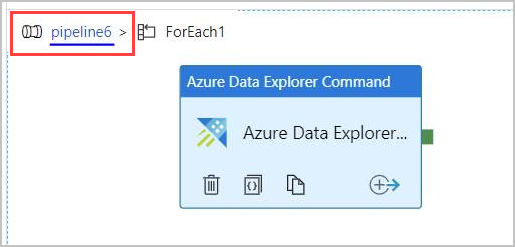

1. Select **Debug** before publishing the pipeline. The pipeline progress can be monitored in the **Output** tab.

    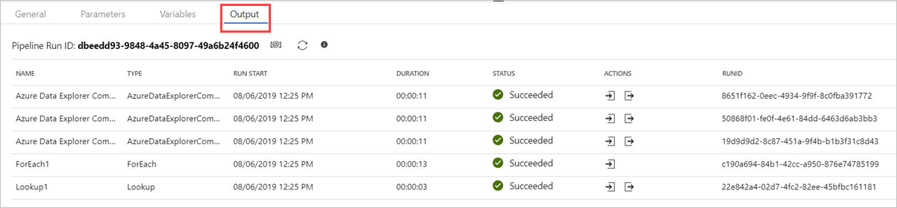

1. You can **Publish All** and then **Add trigger** to run the pipeline. 

## Control command outputs

The structure of the command activity output is detailed below. This output can be used by the next activity in the pipeline.

### Returned value of a non-async control command

In a non-async control command, the structure of the returned value is similar to the structure of the Lookup activity result. The `count` field indicates the number of returned records. A fixed array field `value` contains a list of records. 

```json
{ 
    "count": "2", 
    "value": [ 
        { 
            "ExtentId": "1b9977fe-e6cf-4cda-84f3-4a7c61f28ecd", 
            "ExtentSize": 1214.0, 
            "CompressedSize": 520.0 
        }, 
        { 
            "ExtentId": "b897f5a3-62b0-441d-95ca-bf7a88952974", 
            "ExtentSize": 1114.0, 
            "CompressedSize": 504.0 
        } 
    ] 
} 
```
 
### Returned value of an async control command

In an async control command, the activity polls the operations table behind the scenes, until the async operation is completed or times-out. Therefore, the returned value will contain the result of `.show operations OperationId` for that given **OperationId** property. Check the values of **State** and **Status** properties, to verify successful completion of the operation.

```json
{ 
    "count": "1", 
    "value": [ 
        { 
            "OperationId": "910deeae-dd79-44a4-a3a2-087a90d4bb42", 
            "Operation": "TableSetOrAppend", 
            "NodeId": "", 
            "StartedOn": "2019-06-23T10:12:44.0371419Z", 
            "LastUpdatedOn": "2019-06-23T10:12:46.7871468Z", 
            "Duration": "00:00:02.7500049", 
            "State": "Completed", 
            "Status": "", 
            "RootActivityId": "f7c5aaaf-197b-4593-8ba0-e864c94c3c6f", 
            "ShouldRetry": false, 
            "Database": "MyDatabase", 
            "Principal": "<some principal id>", 
            "User": "<some User id>" 
        } 
    ] 
}
``` 

## Next steps

* Learn about how to [copy data to Azure Data Explorer using Azure Data Factory](data-factory-load-data.md).
* Learn about using [Azure Data Factory template for bulk copy from database to Azure Data Explorer](data-factory-template.md).
