# Copy data to Azure Data Explorer using Azure Data Factory 

Azure Data Explorer is a fast, fully managed data analytics service for real-time analysis on large volumes of data streaming from many sources such as applications, websites, and IoT devices. Iteratively explore data and identify patterns and anomalies to improve products, enhance customer experiences, monitor devices, and boost operations. Explore new questions and get answers in minutes. Azure Data Factory is a fully managed cloud-based data integration service. You can use the service to populate your Azure Data Explorer database with data from your existing system and save time when building your analytics solutions.

Azure Data Factory offers the following benefits for loading data into Azure Data Explorer:

* **Easy to set up**: An intuitive five-step wizard with no scripting required.
* **Rich data store support**: Built-in support for a rich set of on-premises and cloud-based data stores. For a detailed list, see the table of [Supported data stores](/azure/data-factory/copy-activity-overview#supported-data-stores-and-formats).
* **Secure and compliant**: Data is transferred over HTTPS or ExpressRoute. The global service presence ensures that your data never leaves the geographical boundary.
* **High performance**: Up to 1-GB/s data loading speed into Azure Data Explorer. For details, see [Copy activity performance](/azure/data-factory/copy-activity-performance).

This article shows you how to use the Data Factory Copy Data tool to load data from Amazon S3 into Azure Data Explorer. You can follow similar steps to copy data from other data stores such as [Azure Blob Storage](/azure/data-factory/connector-azure-blob-storage), [Azure SQL Database](/azure/data-factory/connector-azure-sql-database), [Azure SQL Data Warehouse](/azure/data-factory/connector-azure-sql-data-warehouse), [Google BigQuery](/azure/data-factory/connector-google-bigquery),[Oracle](/azure/data-factory/connector-oracle), and [File system](/azure/data-factory/connector-file-system).

## Prerequisites

* If you don't have an Azure subscription, create a [free Azure account](https://azure.microsoft.com/free/) before you begin.
* [An Azure Data Explorer cluster and database](create-cluster-database-portal.md)
* Source of data.

## Create a data factory

1. Select the **Create a resource** button (+) in the upper-left corner of the portal > **Analytics** > **Data Factory**.

   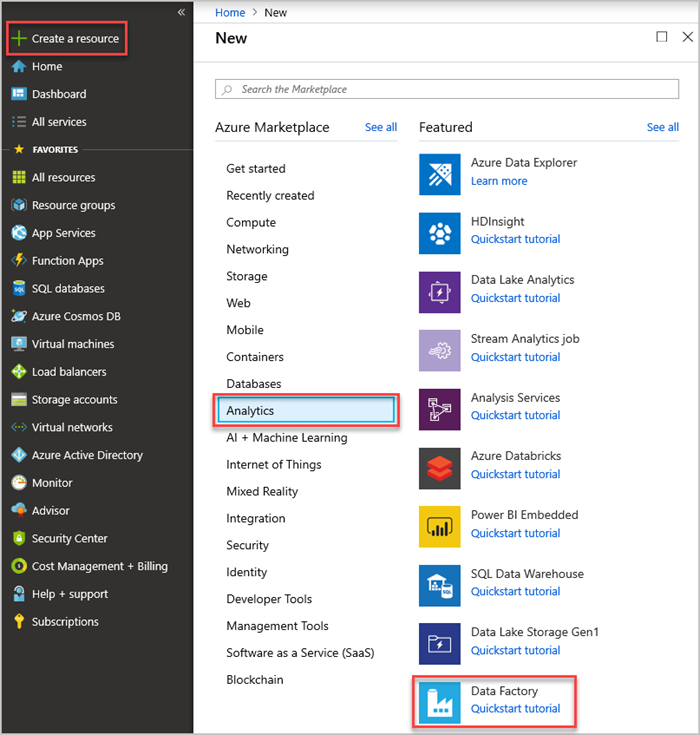

1. In the **New data factory** page, provide values for the following fields and then Select **Create**.

    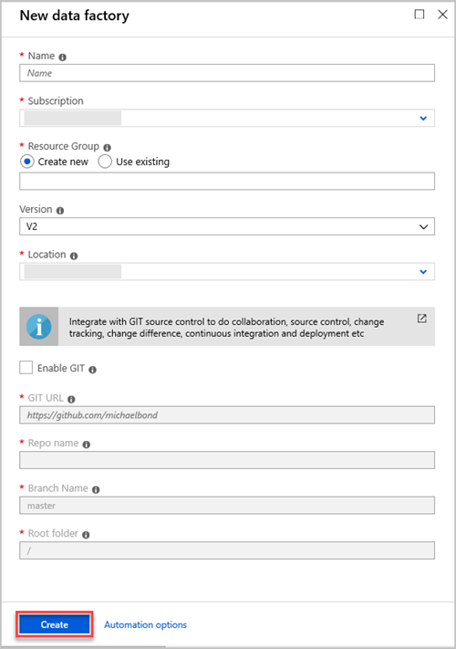

    **Setting**  | **Field description**
    |---|---|
    | **Name** | Enter a globally unique name for your data factory. If you receive the error *"Data factory name \"LoadADXDemo\" is not available"*, enter a different name for the data factory. For naming rules of Data Factory artifacts, see [Data Factory naming rules](/azure/data-factory/naming-rules).|
    | **Subscription** | Select your Azure subscription in which to create the data factory. |
    | **Resource Group** | Select **Create new** and enter the name of a new resource group. Select **Use existing**, if you have an existing resource group. |
    | **Version** | Select **V2** |
    | **Location** | Select the location for the data factory. Only supported locations are displayed in the drop-down list. The data stores that are used by data factory can be in other locations or regions. |
    | | |

1. Select Notifications on the toolbar to monitor the creation process. After creation is complete, go to the data factory you created. The **Data Factory** home page opens.

   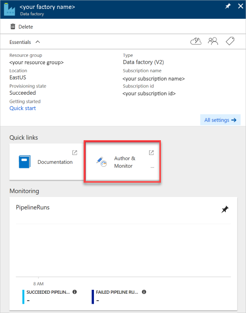

1. Select the **Author & Monitor** tile to launch the application in a separate tab.

## Load data into Azure Data Explorer

Data can be loaded from many types of [data stores](/azure/data-factory/copy-activity-overview#supported-data-stores-and-formats) into Azure Data Explorer. This topic details loading data from Amazon S3.

There are two ways to load data into Azure Data Explorer using Azure Data Factory:

* Azure Data Factory user interface - [**Author** tab](/azure/data-factory/quickstart-create-data-factory-portal#create-a-data-factory)
* [Azure Data Factory **Copy Data** tool](/azure/data-factory/quickstart-create-data-factory-copy-data-tool) used in this article.

### Copy data from Amazon S3 (Source)

1. In the **Let's get started** page, select the **Copy Data** tile to launch the Copy Data tool.

   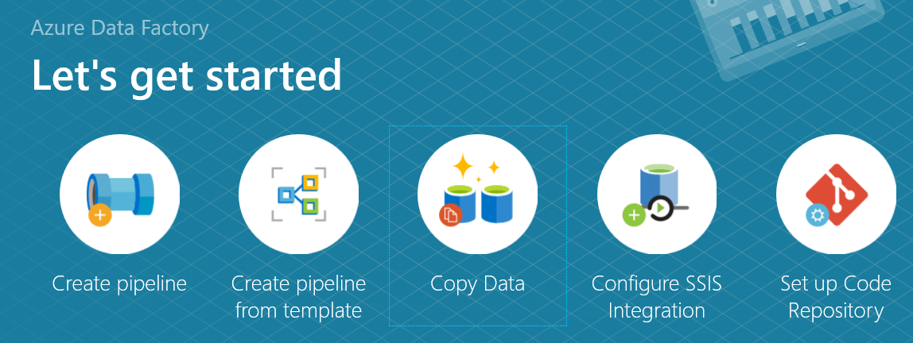

1. In the **Properties** page, specify **Task name** and select **Next**.

    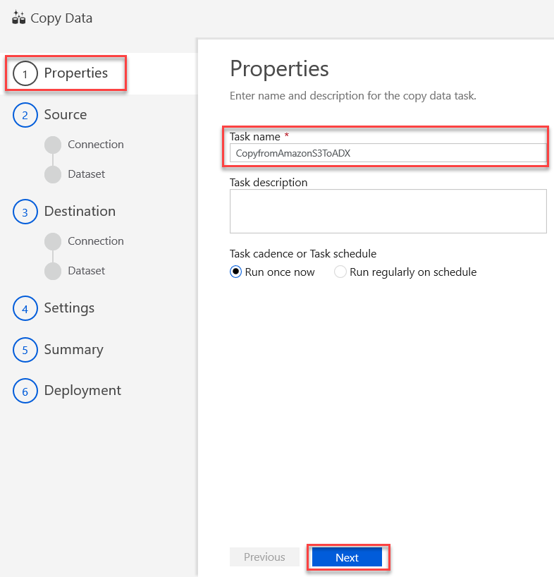

1. In the **Source data store** page, click **+ Create new connection**.

    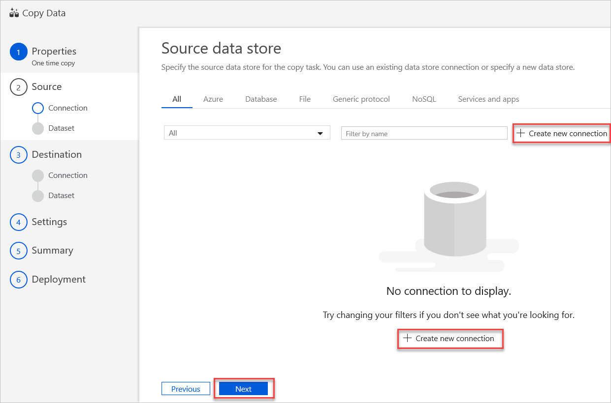

1. Select **Amazon S3**, and then select **Continue**

    

1. In the **New Linked Service (Amazon S3)** page, do the following steps:

    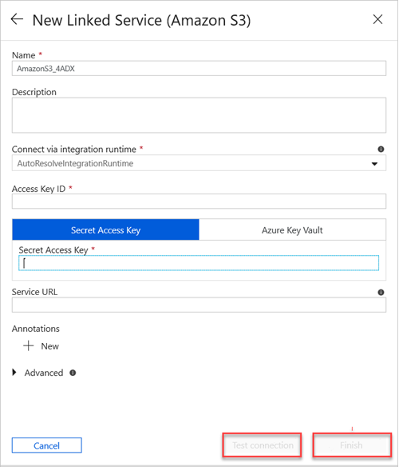

    * Specify **Name** of your new linked service.
    * Select **Connect via integration runtime** value from the dropdown.
    * Specify the **Access Key ID** value.
    * Specify the **Secret Access Key** value.
    * Select **Test Connection** to test the linked service connection you created.
    * Select **Finish**.

1. In the **Source data store** page, you'll see your new AmazonS31 connection. Select **Next**.

   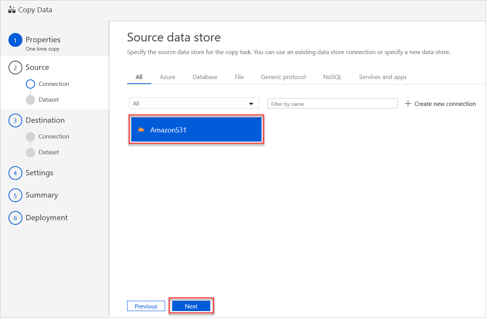

1. In the **Choose the input file or folder** page:

    1. Browse to the folder/file that you want to copy. Select the folder/file.
    1. Select the copy behavior as required. Keep   **Binary copy** unchecked.
    1. Select **Next**.

    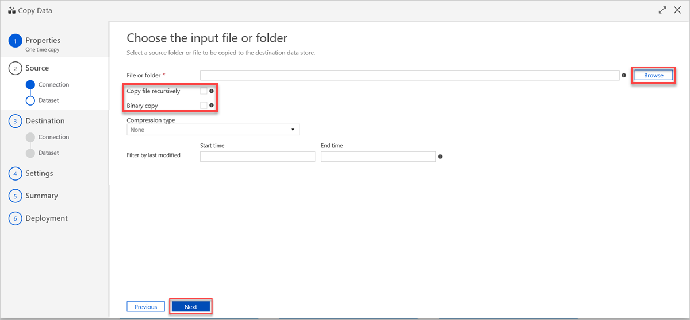

1. In the **file formats settings** page select the relevant settings for your file and click **Next**.

   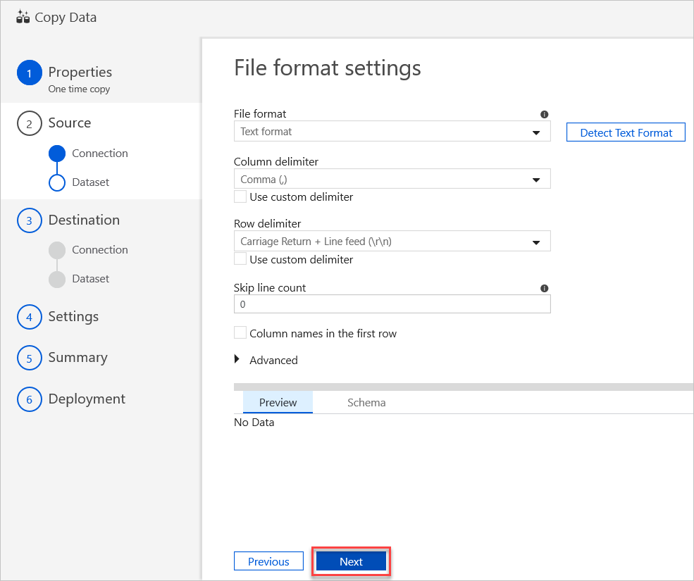

### Copy data into Azure Data Explorer (Destination)

Azure Data Explorer new linked service is created to copy the data into the Azure Data Explorer destination table (sink) specified below.

1. In the **Destination data store** page, you can use an existing data store connection or specify a new data store by clicking **+ Create new connection**.

    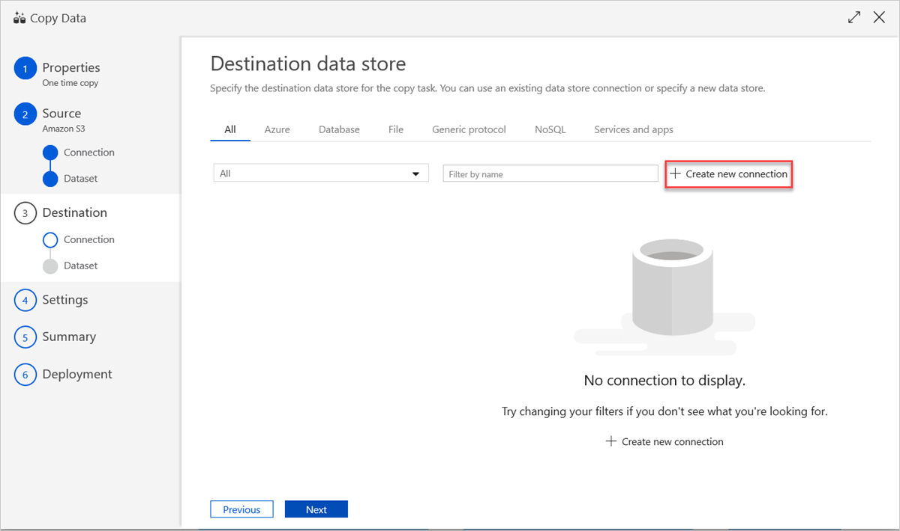

1. In the **New Linked Service** page, select **Azure Data Explorer**, and then select **Continue**

    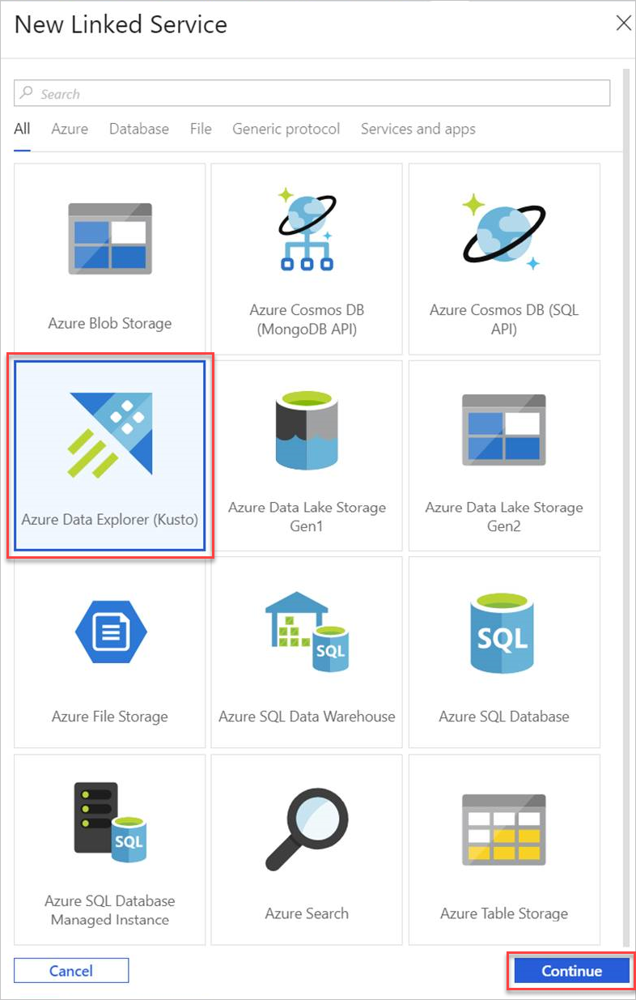

1. In the **New Linked Service (Azure Data Explorer)** page, do the following steps:

    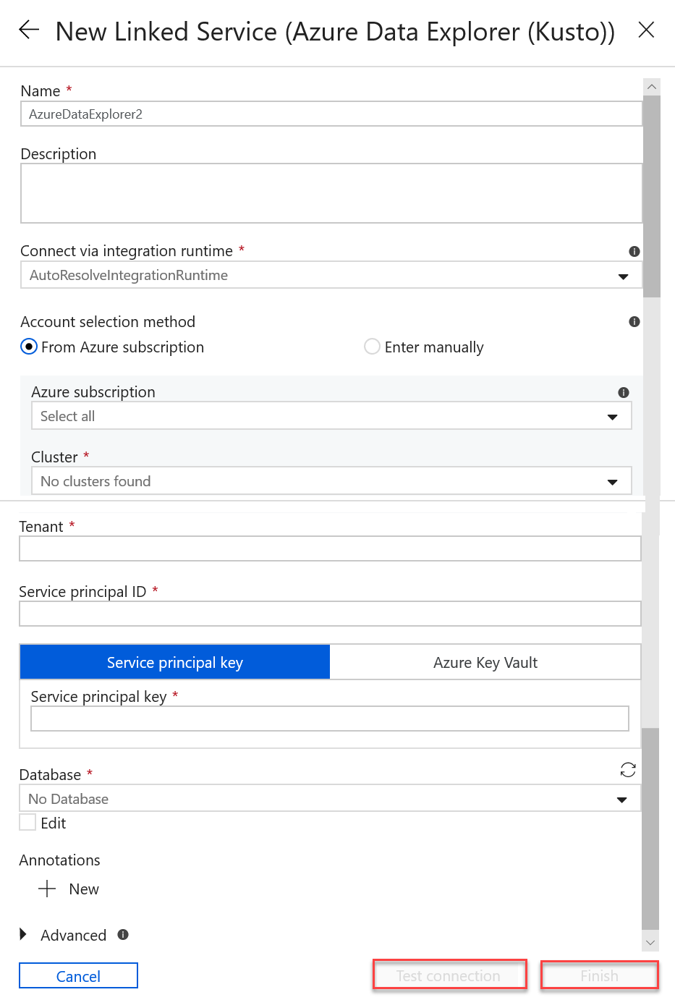

   * Select **Name** for Azure Data Explorer linked service.
   * In **Account selection method**: 
        * Select the **From Azure subscription** radio button and select your **Azure subscription** account. Then, select your **Cluster**. Note the drop-down will only list clusters that belong to the user.
        * Alternatively, select **Enter manually** radio button and enter your **Endpoint**.
    * Specify the **Tenant**.
    * Enter **Service principal ID**.
    * Select **Service principal key** button and enter **Service Principal Key**.
    * Select your **Database** from the dropdown menu. Alternatively, select **Edit** checkbox and enter your database name.
    * Select **Test Connection** to test the linked service connection you created. If you can connect to your setup, a green checkmark **Connection successful** will appear.
    * Select **Finish** to complete linked service creation.

    > [!NOTE]
    > The service principal is used by Azure Data Factory to access the Azure Data Explorer service. For service principal, [create a Azure Active Directory (Azure AD) service principal](/azure-stack/operator/azure-stack-create-service-principals#manage-an-azure-ad-service-principal). Do not use the **Azure Key Vault** method.

1. The **Destination data store** opens. The Azure Data Explorer data connection you created is available for use. Select **Next** to configure the connection.

    

1. In **Table mapping**, set the destination table name and select **Next**.

    

1. In the **Column mapping** page:
    * The first mapping is performed by ADF according to [ADF schema mapping](/azure/data-factory/copy-activity-schema-and-type-mapping)
        * Set the **Column mappings** for the Azure Data Factory destination table. The default mapping is displayed from source to ADF destination table.
        * Unselect the columns that you don't need to define your column mapping.
    * The second mapping occurs when this tabular data is ingested into Azure Data Explorer. Mapping is performed according to [CSV mapping rules](/azure/kusto/management/mappings#csv-mapping). Note that even if the source data was not in CSV format, ADF has converted the data into a tabular format, therefore, CSV mapping is the only relevant mapping at this stage.
        * Under **Azure Data Explorer (Kusto) sink properties** add the relevant **Ingestion mapping name** (optional) so that column mapping can be used.
        * If **Ingestion mapping name** isn't specified, “by-name” mapping order defined in **Column mappings** section will occur. If "by-name" mapping fails, Azure Data Explorer will try to ingest the data in a “by-column position” order (maps by-position as default).
    * Select **Next**

    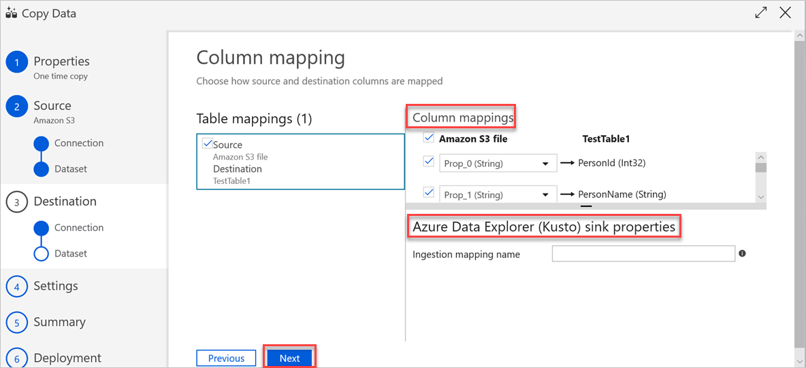

1. In the **Settings** page:
    * Set the relevant **fault tolerance settings**.
    * **Performance settings**: Enable staging isn't applicable. **Advanced settings** include cost considerations. Leave as is if no specific needs.
    * Select **Next**.

    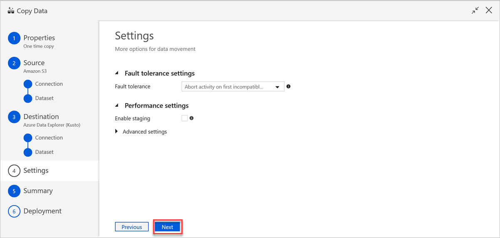

1. In **Summary**, review the settings, and select **Next**.

    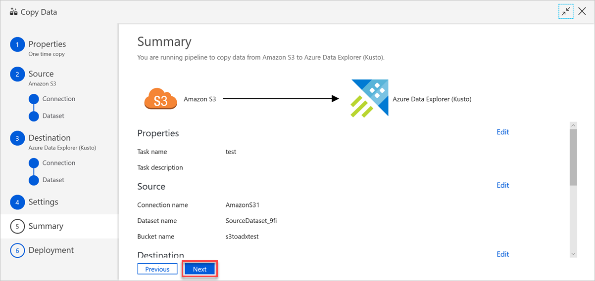

1. In the **Deployment page**:
    * Select **Monitor** to switch to the **Monitor** tab and see the status of the pipeline (progress, errors, and data flow).
    * Select **Edit Pipeline** to edit linked services, datasets, and pipelines.
    * Select **Finish** to complete copy data task

    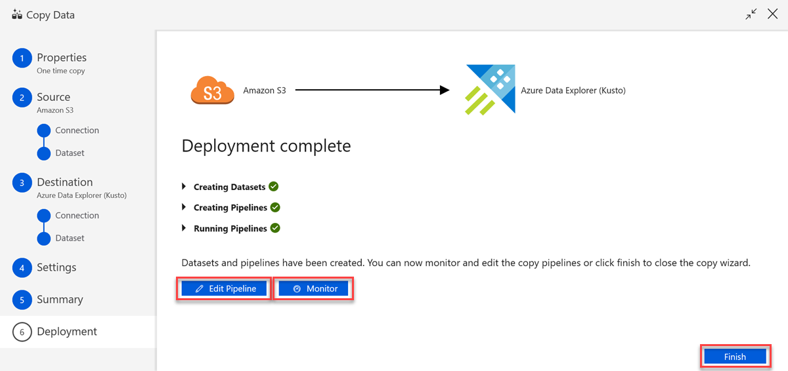

## Next steps

* Learn about the [Azure Data Explorer connector](/azure/data-factory/connector-azure-data-explorer) in Azure Data Factory.

* Learn more about editing linked services, datasets, and pipelines in the [Data Factory UI](/azure/data-factory/quickstart-create-data-factory-portal).

* Learn about [Azure Data Explorer queries](/azure/data-explorer/web-query-data) for data querying.
