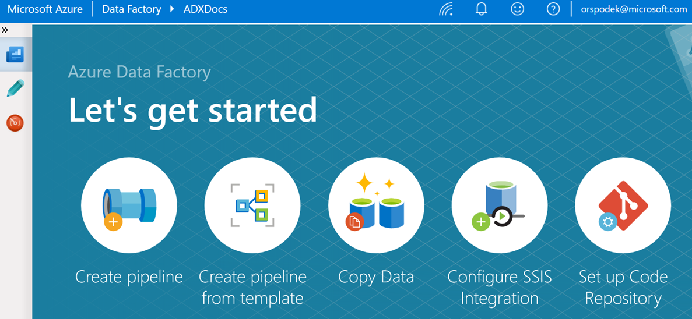
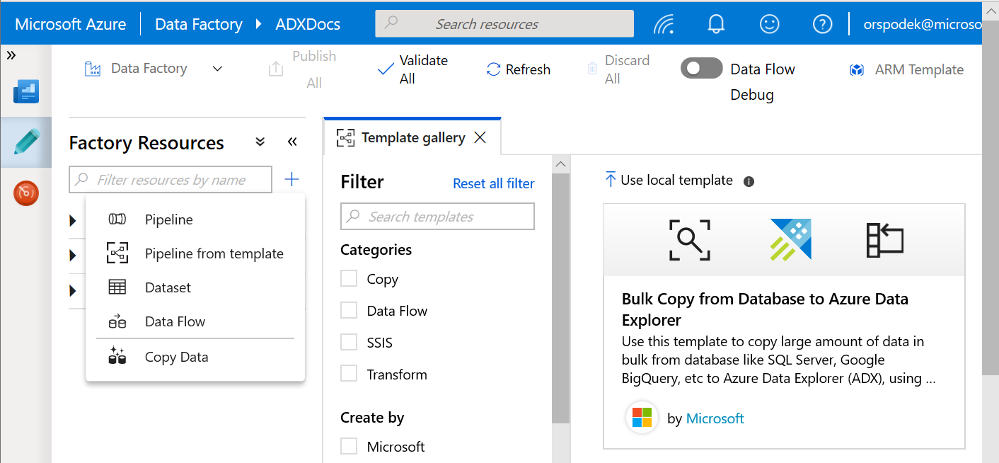
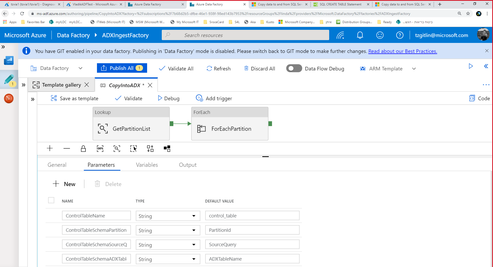
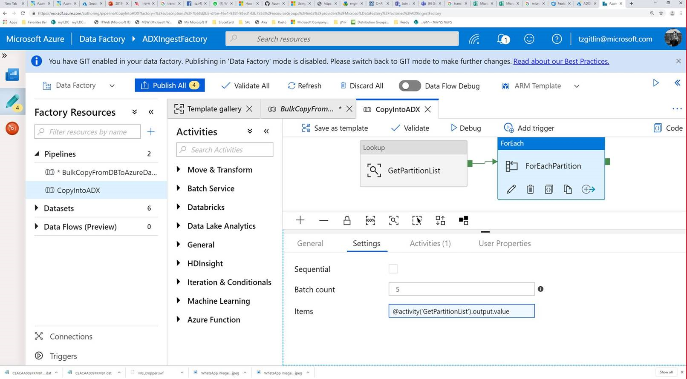
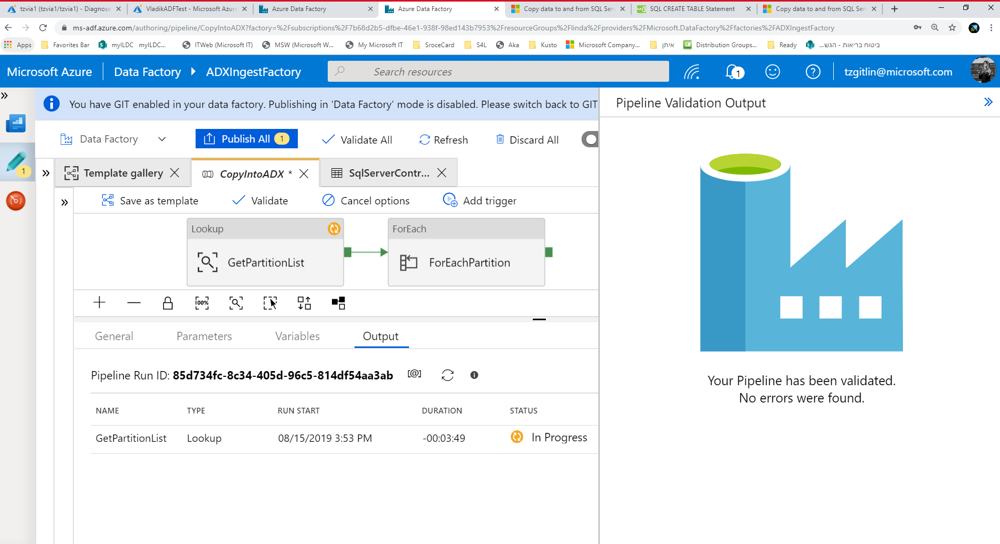
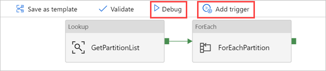

# Copy in bulk from a database to Azure Data Explorer by using the Azure Data Factory template 

Azure Data Explorer is a fast, fully managed, data-analytics service. It offers real-time analysis on large volumes of data that stream from many sources, such as applications, websites, and IoT devices. 

To copy data from a database in Oracle Server, Netezza, Teradata, or SQL Server to Azure Data Explorer, you have to load huge amounts of data from multiple tables. Usually, the data has to be partitioned in each table so that you can load rows with multiple threads in parallel from a single table. This article describes a template to use in these scenarios.

[Azure Data Factory templates](/azure/data-factory/solution-templates-introduction) are predefined Data Factory pipelines. These templates can help you get started quickly with Data Factory and reduce development time on data integration projects. 

You create the *Bulk Copy from Database to Azure Data Explorer* template by using *Lookup* and *ForEach* activities. For faster data copying, you can use the template to create many pipelines per database or per table. 

> [!IMPORTANT]
> Be sure to use the tool that's appropriate for the quantity of data you want to copy.
> * Use the *Bulk Copy from Database to Azure Data Explorer* template to copy large amounts of data from databases such as SQL server and Google BigQuery to Azure Data Explorer. 
> * Use the [*Data Factory Copy Data tool*](data-factory-load-data.md) to copy a few tables with small or moderate amounts of data into Azure Data Explorer. 

## Prerequisites

* If you don't have an Azure subscription, create a [free Azure account](https://azure.microsoft.com/free/) before you begin.
* [An Azure Data Explorer cluster and database](create-cluster-database-portal.md).
* [Create a data factory](data-factory-load-data.md#create-a-data-factory).
* A source of data in a database.

## Create ControlTableDataset

*ControlTableDataset* indicates what data will be copied from the source to the destination in the pipeline. The number of rows indicates the total number of pipelines that are needed to copy the data. You should define ControlTableDataset as part of the source database.

An example of the SQL Server source table format is shown in the following code:
    
```sql   
CREATE TABLE control_table (
PartitionId int,
SourceQuery varchar(255),
ADXTableName varchar(255)
);
```

The code elements are described in the following table:

|Property  |Description  | Example
|---------|---------| ---------|
|PartitionId   |  The copy order | 1  |  
|SourceQuery   |  The query that indicates which data will be copied during the pipeline runtime | <br>`select * from table where lastmodifiedtime  LastModifytime >= ''2015-01-01 00:00:00''>` </br>    
|ADXTableName  |  The destination table name | MyAdxTable       |  

If your ControlTableDataset is in a different format, create a comparable ControlTableDataset for your format.

## Use the Bulk Copy from Database to Azure Data Explorer template

1. In the **Let's get started** pane, select **Create pipeline from template** to open the **Template gallery** pane.

    

1. Select the **Bulk Copy from Database to Azure Data Explorer** template.
 
    

1.  In the **Bulk Copy from Database to Azure Data Explorer** pane, under **User Inputs**, specify your datasets by doing the following: 

    a. In the **ControlTableDataset** drop-down list, select the linked service to the control table that indicates what data is copied from the source to the destination and where it will be placed in the destination. 

    b. In the **SourceDataset** drop-down list, select the linked service to the source database. 

    c. In the **AzureDataExplorerTable** drop-down list, select the Azure Data Explorer table. If the dataset doesn't exist, [create the Azure Data Explorer linked service](data-factory-load-data.md#create-the-azure-data-explorer-linked-service) to add the dataset.

    d. Select **Use this template**.

    

1. Select an area in the canvas, outside the activities, to access the template pipeline. Select the **Parameters** tab to enter the parameters for the table, including **Name** (control table name) and **Default value** (column names).

    

1.	Under **Lookup**, select **GetPartitionList** to view the default settings. The query is automatically created.
1.	Select the Command activity, **ForEachPartition**, select the **Settings** tab, and then do the following:

    a. In the **Batch count** box, enter a number from 1 to 50. This selection determines the number of pipelines that run in parallel until the number of *ControlTableDataset* rows is reached. 

    b. To ensure that the pipeline batches run in parallel, *do not* select the **Sequential** check box.

    

    > [!TIP]
    > The best practice is to run many pipelines in parallel so that your data can be copied more quickly. To increase efficiency, partition the data in the source table and allocate one partition per pipeline, according to date and table.

1. Select **Validate All** to validate the Azure Data Factory pipeline, and then view the result in the **Pipeline Validation Output** pane.

    

1. If necessary, select **Debug**, and then select **Add trigger** to run the pipeline.

        

You can now use the template to efficiently copy large amounts of data from your databases and tables.

## Next steps

* Learn how to [copy data to Azure Data Explorer by using Azure Data Factory](data-factory-load-data.md).
* Learn about the [Azure Data Explorer connector](/azure/data-factory/connector-azure-data-explorer) in Azure Data Factory.
* Learn about [Azure Data Explorer queries](/azure/data-explorer/web-query-data) for data querying.


