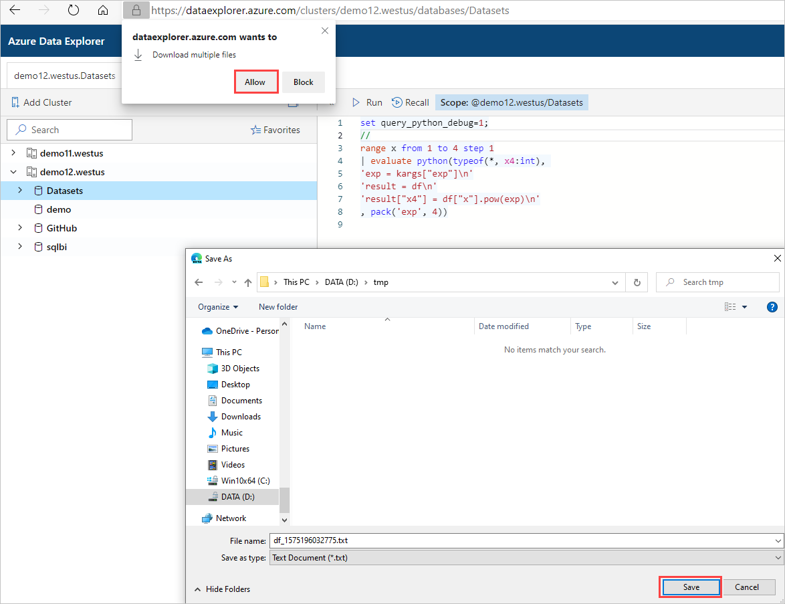
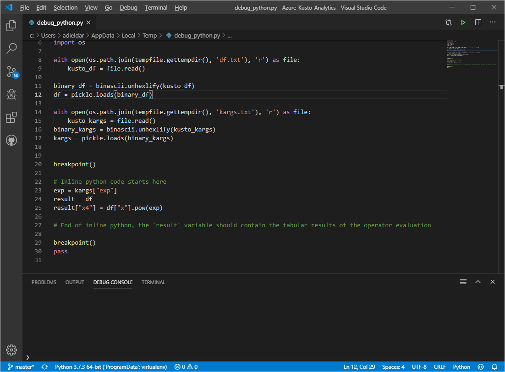
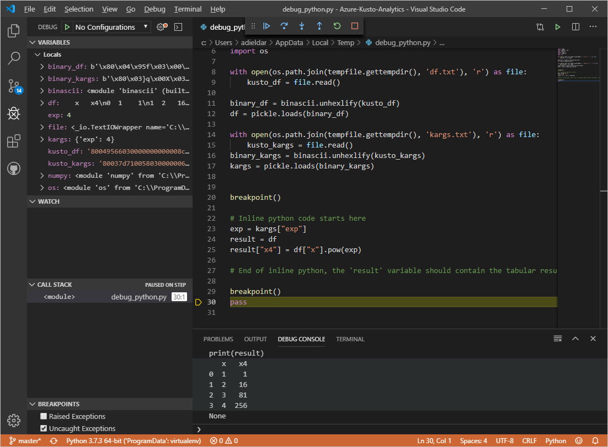

# Debug Kusto query language inline Python using VS Code

Azure Data Explorer supports running Python code embedded in Kusto query language using the [python() plugin](/azure/kusto/query/pythonplugin). The plugin runtime is hosted in a sandbox, an isolated and secure Python environment. The python() plugin capability extends Kusto query language native functionalities with the huge archive of OSS Python packages. This extension enables you to run advanced algorithms, such as machine learning, artificial intelligence, statistical, and time series as part of the query.

Kusto query language tools aren't convenient for developing and debugging Python algorithms. Therefore, develop the algorithm on your favorite Python-integrated development environment such as Jupyter, PyCharm, VS, or VS Code. When the algorithm is complete, copy and paste into KQL. To improve and streamline this workflow, Azure Data Explorer supports integration between Kusto Explorer or Web UI clients and VS Code for authoring and debugging KQL inline Python code. 

> [!NOTE]
> This workflow can only be used to debug relatively small input tables (up to few MB). Therefore, you may need to limit the input for debugging.  If you need to process a large table, limit it for debugging using `| take`, `| sample`, or `where rand() < 0.x`.

## Prerequisites

1. Install Python [Anaconda Distribution](https://www.anaconda.com/distribution/#download-section). In **Advanced Options**, select **Add Anaconda to my PATH environment variable**.
2. Install [Visual Studio Code](https://code.visualstudio.com/Download)
3. Install [Python extension for Visual Studio Code](https://marketplace.visualstudio.com/items?itemName=ms-python.python).

## Run your query in your client application

1. In your client application, prefix a query containing inline Python with `set query_python_debug;`
1. Run the query.
    * Kusto Explorer: VS Code is automatically launched with the *debug_python.py* script.
    * Kusto Web UI: 
        1. Download and save *debug_python.py*, *df.txt*, and *kargs.txt*. In window, select **Allow**. **Save** files in selected directory. 

            

        1. Right-click *debug_python.py* and open with VS code. 
        The *debug_python.py* script contains the inline Python code, from the KQL query, prefixed by the template code to initialize the input dataframe from *df.txt* and the dictionary of parameters from *kargs.txt*.    
            
1. In VS code, launch the VS code debugger: **Debug** > **Start Debugging (F5)**, select **Python** configuration. The debugger will launch and automatically breakpoint to debug the inline code.

### How does inline Python debugging in VS Code work?

1. The query is parsed and executed in the server until the required `| evaluate python()` clause is reached.
1. The Python sandbox is invoked but instead of running the code, it serializes the input table, the dictionary of parameters, and the code, and sends them back to the client.
1. These three objects are saved in three files: *df.txt*, *kargs.txt*, and *debug_python.py* in the selected directory (Web UI) or in the client %TEMP% directory (Kusto Explorer).
1. VS code is launched, preloaded with the *debug_python.py* file that contains a prefix code to initialize df and kargs from their respective files, followed by the Python script embedded in the KQL query.

## Query example

1. Run the following KQL query in your client application:

    ```kusto
    range x from 1 to 4 step 1
    | evaluate python(typeof(*, x4:int), 
    'exp = kargs["exp"]\n'
    'result = df\n'
    'result["x4"] = df["x"].pow(exp)\n'
    , pack('exp', 4))
    ```

    See the resulting table:

    | x  | x4  |
    |---------|---------|
    | 1     |   1      |
    | 2     |   16      |
    | 3     |   81      |
    | 4     |    256     |
    
1. Run the same KQL query in your client application using `set query_python_debug;`:

    ```kusto
    set query_python_debug;
    range x from 1 to 4 step 1
    | evaluate python(typeof(*, x4:int), 
    'exp = kargs["exp"]\n'
    'result = df\n'
    'result["x4"] = df["x"].pow(exp)\n'
    , pack('exp', 4))
    ```

1. VS Code is launched:

    

1. VS Code debugs and prints ‘result’ dataframe in the debug console:

    

> [!NOTE]
> There may be differences between the Python sandbox image and your local installation. [Check the sandbox image for specific packages by querying the plugin](https://github.com/Azure/azure-kusto-analytics-lib/blob/master/Utils/functions/get_modules_version.csl).
