# Azure DevOps Task for Azure Data Explorer

[Azure DevOps Services](https://azure.microsoft.com/services/devops/) provides development collaboration tools such as high-performance pipelines, free private Git repositories, configurable Kanban boards, and extensive automated and continuous testing capabilities. [Azure Pipelines](https://azure.microsoft.com/services/devops/pipelines/) is an Azure DevOps capability that enables you to manage CI/CD to deploy your code with high-performance pipelines that work with any language, platform, and cloud.
[Azure Data Explorer - Admin Commands](https://marketplace.visualstudio.com/items?itemName=Azure-Kusto.PublishToADX) is the Azure Pipelines task that enables you to create release pipelines and deploy your database changes to your Azure Data Explorer databases. It's available for free in the [Visual Studio Marketplace](https://marketplace.visualstudio.com/).

This document describes a simple example on the use of the **Azure Data Explorer – Admin Commands** task to deploy your schema changes to your database. For complete CI/CD pipelines, refer to [Azure DevOps documentation](/azure/devops/user-guide/what-is-azure-devops?view=azure-devops#vsts).

## Prerequisites

* If you don't have an Azure subscription, create a [free Azure account](https://azure.microsoft.com/free/) before you begin.
* Azure Data Explorer Cluster setup:
    * An [Azure Data Explorer cluster and database](/azure/data-explorer/create-cluster-database-portal)
    * Create Azure Active Directory (Azure AD) app by [provisioning an Azure AD application](/azure/kusto/management/access-control/how-to-provision-aad-app).
    * Grant access to your Azure AD App on your Azure Data Explorer database by [managing Azure Data Explorer database permissions](/azure/data-explorer/manage-database-permissions).
* Azure DevOps setup:
    * [Sign up for a free organization](/azure/devops/user-guide/sign-up-invite-teammates?view=azure-devops)
    * [Create an organization](/azure/devops/organizations/accounts/create-organization?view=azure-devops)
    * [Create a project in Azure DevOps](/azure/devops/organizations/projects/create-project?view=azure-devops)
    * [Code with Git](/azure/devops/user-guide/code-with-git?view=azure-devops)

## Create folders

Create the following sample folders (*Functions*, *Policies*, *Tables*) in your Git repository. Copy the files from [here](https://github.com/Azure/azure-kusto-docs-samples/tree/master/DevOps_release_pipeline) into the respective folders as seen below and commit the changes. The sample files are provided to execute the following workflow.

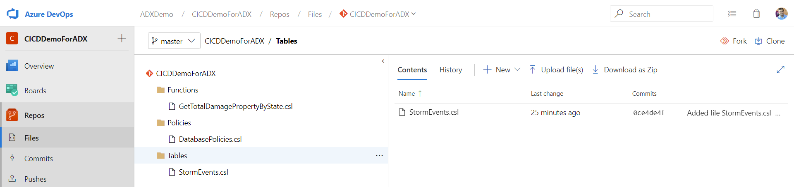

> [!TIP]
> When creating your own workflow, we recommend making your code idempotent. For example, use [.create-merge table](/azure/kusto/management/tables#create-merge-tables) instead of [.create table](/azure/kusto/management/tables#create-table), and use [.create-or-alter](/azure/kusto/management/functions#create-or-alter-function) function instead of [.create](/azure/kusto/management/functions#create-function) function.

## Create a release pipeline

1. Sign in to your [Azure DevOps organization](https://dev.azure.com/).
1. Select **Pipelines** > **Releases** from left-hand menu and select **New pipeline**.

    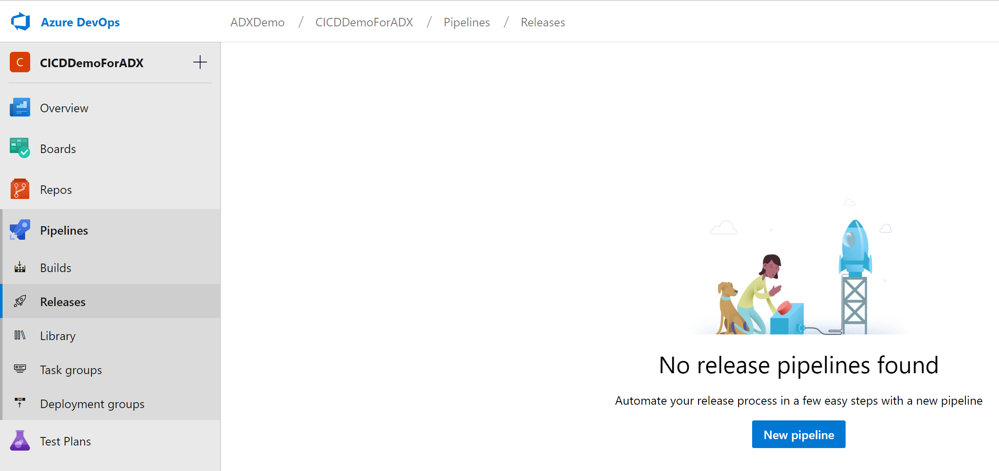

1. The **New release pipeline** window opens. In the **Pipelines** tab, in the **Select a template** pane, select **Empty job**.

     

1. Select **Stage** button. In **Stage** pane, add the **Stage name**. Select **Save** to save your pipeline.

    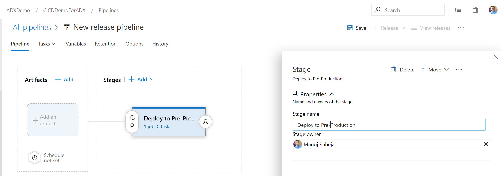

1. Select **Add an artifact** button. In the **Add an artifact** pane, select the repository where your code exists, fill out relevant information, and click **Add**. Select **Save** to save your pipeline.

    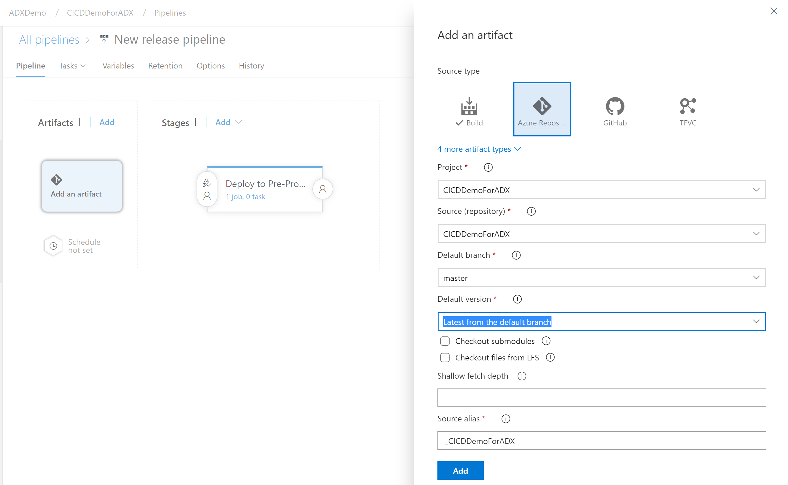

1. In the **Variables** tab, select **+ Add** to create a variable for **Endpoint URL** that will be used in the task. Write the **Name** and the **Value** of the endpoint. Select **Save** to save your pipeline. 

    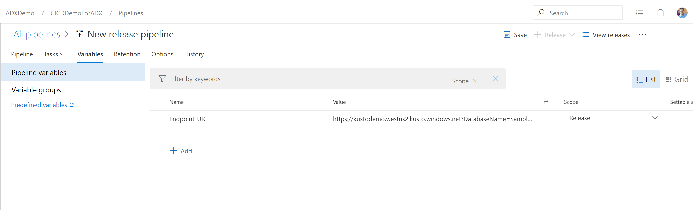

    To find your Endpoint_URL, the overview page of your **Azure Data Explorer Cluster** in the Azure portal contains the Azure Data Explorer cluster URI. Construct the URI in the following format `https://<Azure Data Explorer cluster URI>?DatabaseName=<DBName>`.  For example, https:\//kustodocs.westus.kusto.windows.net?DatabaseName=SampleDB

    

## Create tasks to deploy

1. In the **Pipeline** tab, click on **1 job, 0 task** to add tasks. 

    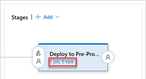

1. Create three tasks to deploy **Tables**, **Functions**, and **Policies**, in this order. 

1. In the **Tasks** tab, select **+** by **Agent job**. Search for **Azure Data Explorer**. In **Marketplace**, install the **Azure Data Explorer – Admin Commands** extension. Then, select **Add** in **Run Azure Data Explorer Command**.

     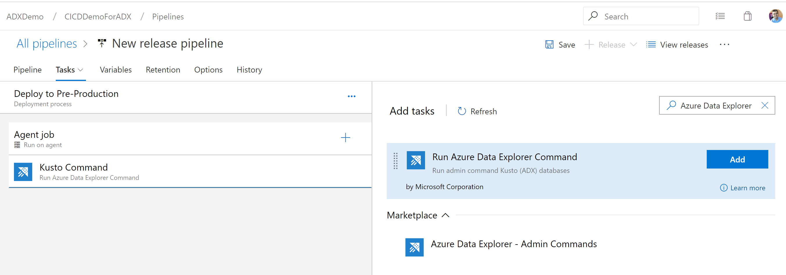

1. Click on **Kusto Command** on the left and update the task with the following information:
    * **Display name**: Name of the task
    * **File path**: In the **Tables** task, specify */Tables/*.csl since the table creation files are in the *Table* folder.
    * **Endpoint URL**: enter the `EndPoint URL`variable created in previous step.
    * Select **Use Service Endpoint** and select **+ New**.

    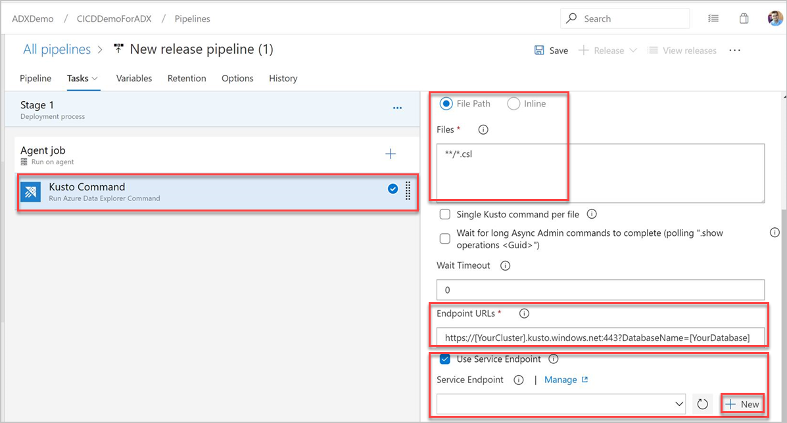

1. Complete the following information in the **Add Azure Data Explorer service connection** window:

    |Setting  |Suggested value  |
    |---------|---------|
    |**Connection name**     |    Enter a name to identify this service endpoint     |
    |**Cluster Url**    |    Value can be found in the overview section of your Azure Data Explorer Cluster in the Azure portal | 
    |**Service Principal Id**    |    Enter the AAD App ID (created as prerequisite)     |
    |**Service Principal App Key**     |    Enter the AAD App Key (created as prerequisite)    |
    |**AAD tenant Id**    |      Enter your AAD tenant (such as microsoft.com, contoso.com...)    |

    Select **Allow all pipelines to use this connection** checkbox. Select **OK**.

    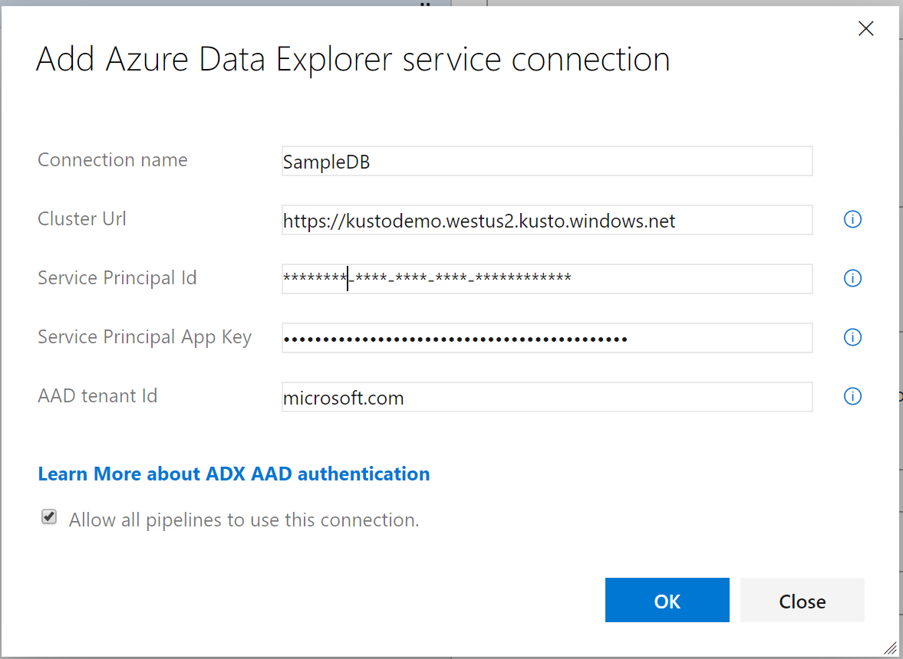

1. Repeat steps 1-5 another two times to deploy files from the *Functions* and *Policies* folders. Select **Save**. In the **Tasks** tab, see the three tasks created: **Deploy Tables**, **Deploy Functions**, and **Deploy Policies**.

    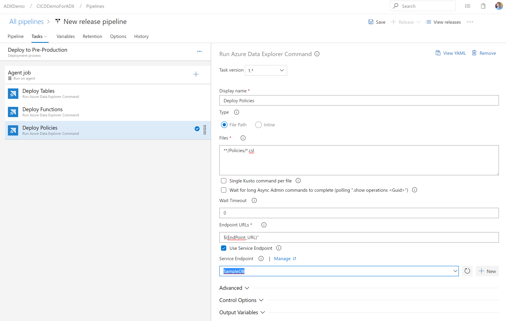

1. Select **+ Release** > **Create release** to create a release.

    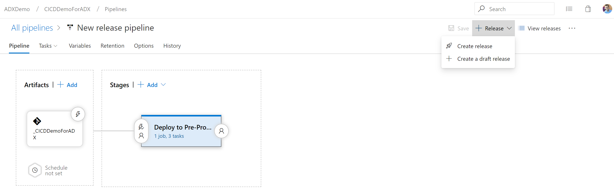

1. In the **Logs** tab, check the deployment status is successful.

    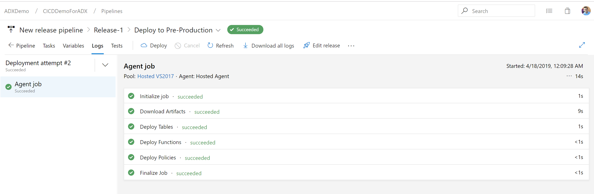

You have now completed creation of a release pipeline for deployment of three tasks to pre-production.