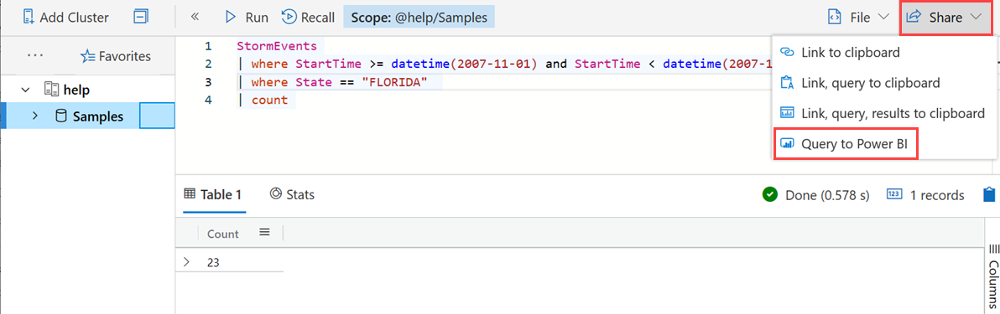
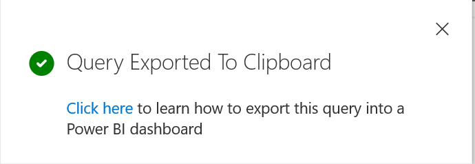
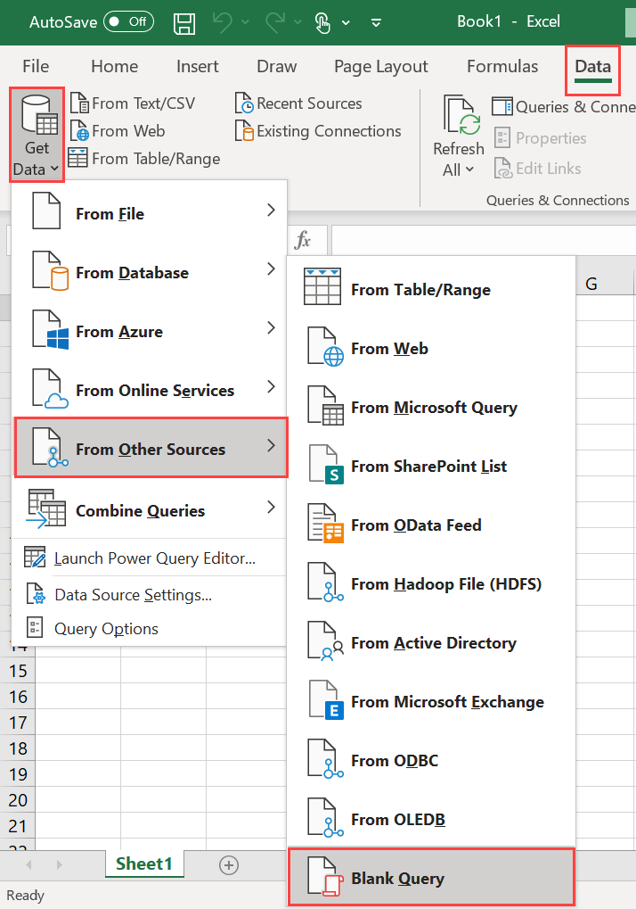
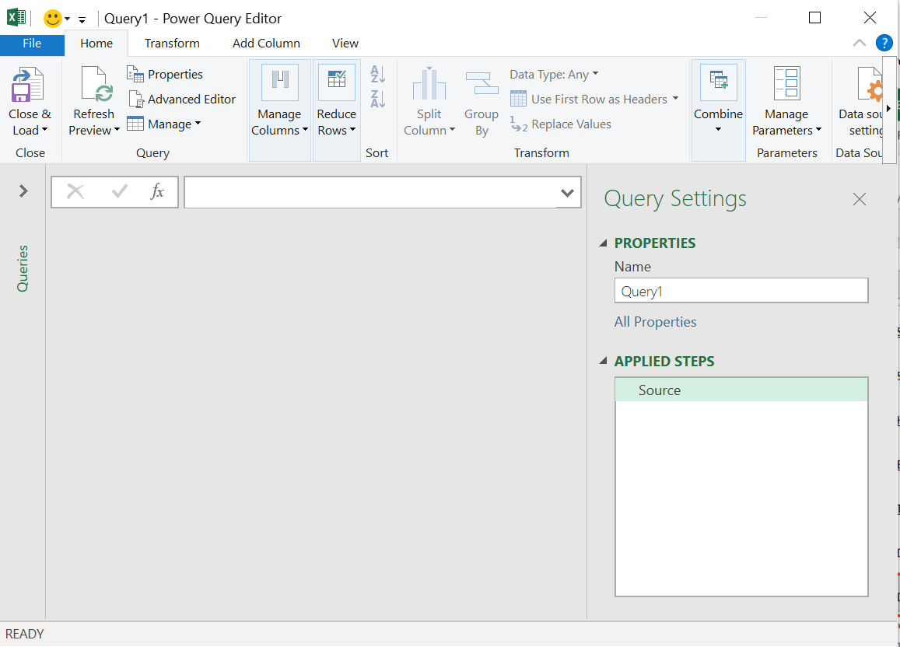
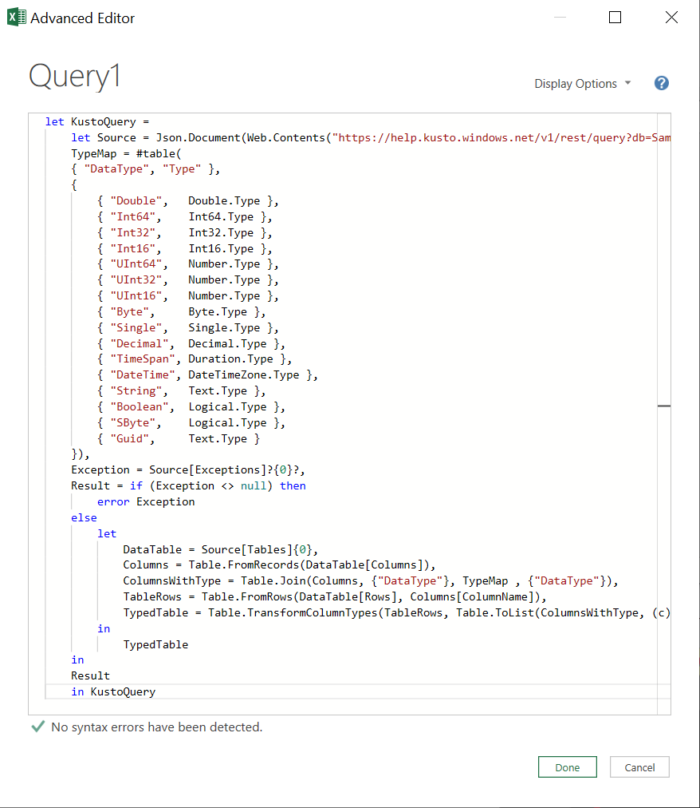
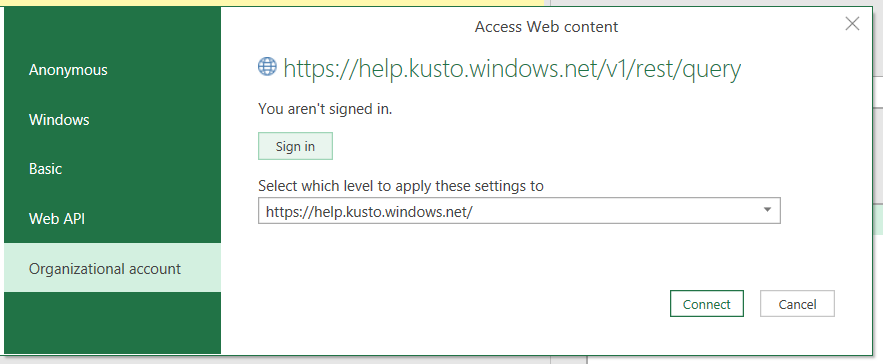
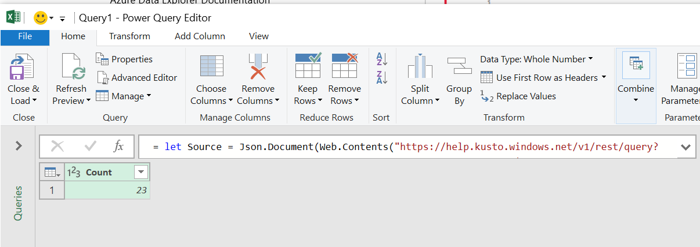
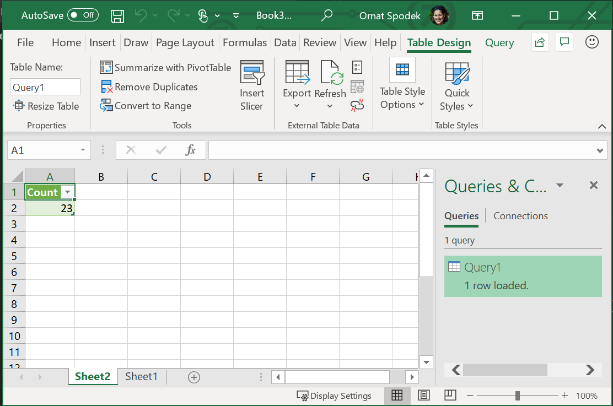

# Visualize data using an Azure Data Explorer Kusto query imported into Microsoft Excel

Azure Data Explorer provides two options for connecting to data in Excel: use the native connector or import a query from Azure Data Explorer. This article shows you how to import a query from Azure Data Explorer to Excel to visualize data. Add Kusto query as an Excel data source to do additional calculations or visualizations on the data.

## Prerequisites

* If you don't have an Azure subscription, create a [free Azure account](https://azure.microsoft.com/free/) before you begin.
* An organizational email account that is a member of Azure Active directory, so you can connect to the [Azure Data Explorer help cluster](https://dataexplorer.azure.com/clusters/help/databases/Samples) 
 or 
* Create [a test cluster and database](create-cluster-database-portal.md) and sign in to [the Azure Data Explorer Web UI application](https://dataexplorer.azure.com/).

## Define Kusto query as an Excel data source

1. In [Azure Data Explorer Web UI](https://dataexplorer.azure.com/clusters/help/databases/Samples), run the query and check the results.

1. Select the **Share** tab and select **Query to Power BI**.

    

1. A window appears with the following notification:

    

1. Open **Microsoft Excel**.

1. In the **Data** tab, select **Get Data** > **From Other Sources** > **Blank Query**.

    

1. The **Power Query Editor** window opens. In the window, select **Advanced Editor**.

    

1. In the **Advanced Editor** window, paste the query you exported to the clipboard and select **Done**.

        

1. To authenticate, select **Edit Credentials**.

    

1. Select **Organizational account** and **Sign in**. Complete the sign-in process and then select **Connect**.

    

    Repeat the previous steps to add more queries. You can rename the queries to more meaningful names.

1. Select the **Close & Load** button to get your data into Excel.

    

1. Now your data is in Excel. Select the **Refresh** button to refresh the query.

    

## Next steps

[Visualize data using the Azure Data Explorer connector for Excel](excel-connector.md)