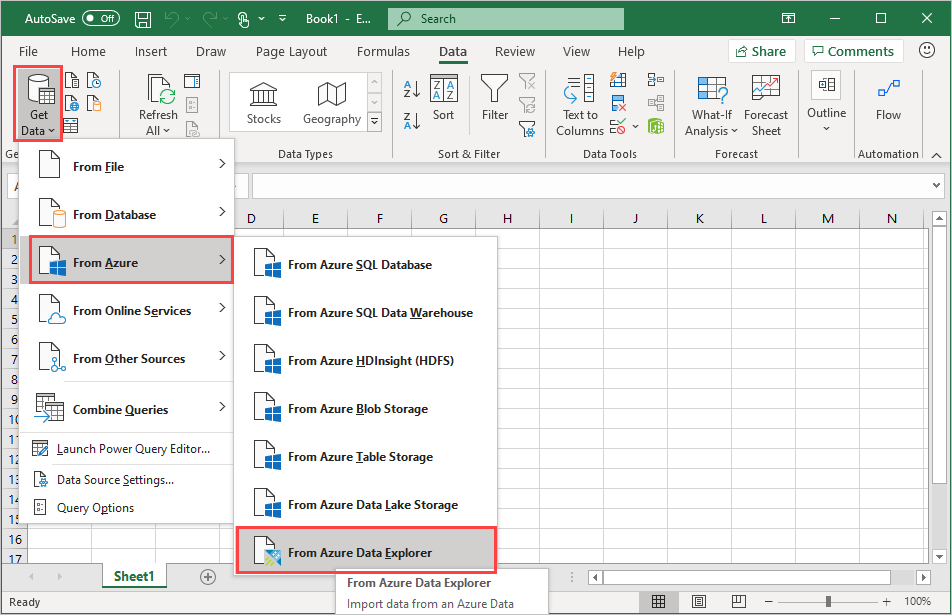
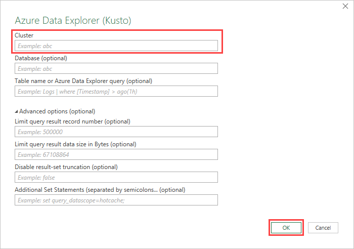
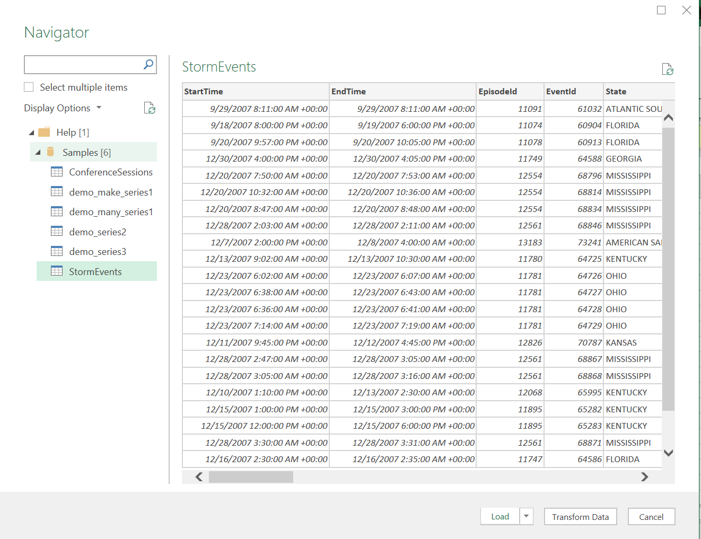
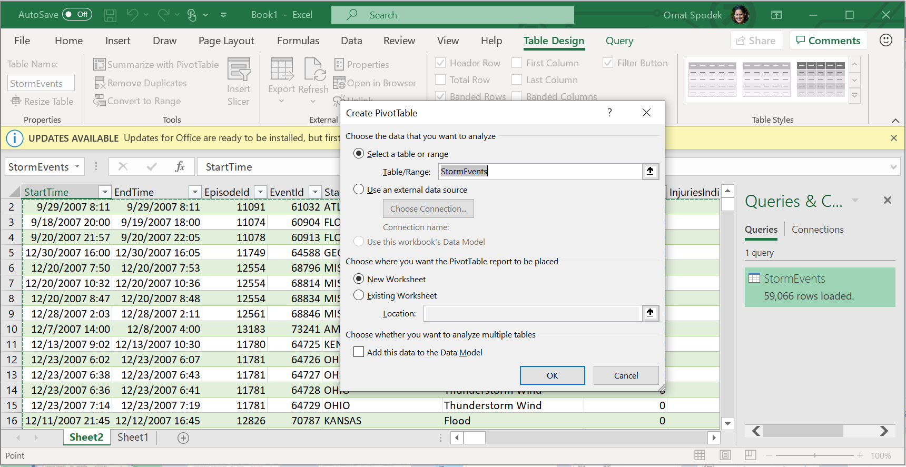
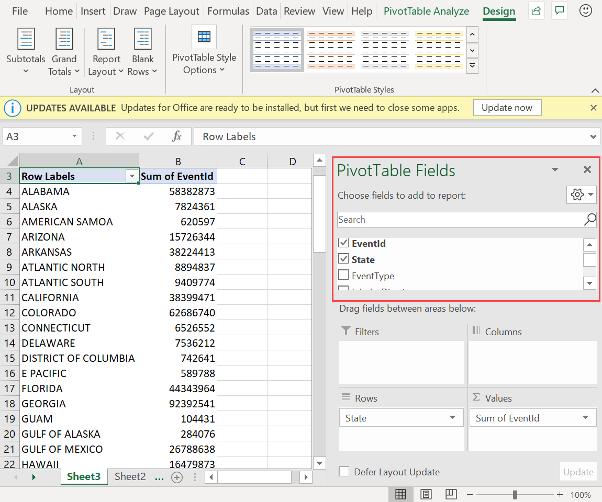
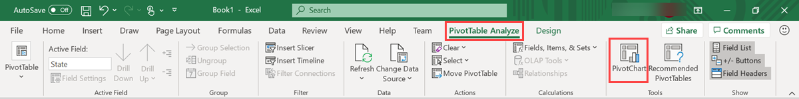
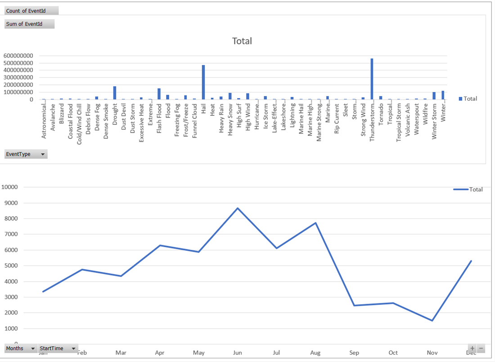

# Visualize data using the Azure Data Explorer connector for Excel

Azure Data Explorer provides two options for connecting to data in Excel: use the native connector or import a query from Azure Data Explorer. This article shows you how to use the native connector in Excel and connect to the Azure Data Explorer cluster to get and visualize data.

The Azure Data Explorer Excel native connector offers the ability to export query results to Excel. You can also add a KQL query as an Excel data source for additional calculations or visualizations.

## Define Kusto query as an Excel data source and load the data to Excel

1. Open **Microsoft Excel**.
1. In the **Data** tab, select **Get Data** > **From Azure** > **From Azure Data Explorer**.

    

1. In the **Azure Data Explorer (Kusto)** window, complete the following fields and select **OK**.

    
    
    |Field   |Description |
    |---------|---------|
    |**Cluster**   |   Name of cluster (mandatory)      |    
    |**Database**     |    Name of database      |    
    |**Table name or Azure Data Explorer query**    |     Name of table or Azure Data Explorer query    | 
    
    **Advanced Options:**

     |Field   |Description |
    |---------|---------|
    |**Limit query result record number**     |     Limit the number of records loaded into excel  |    
    |**Limit query result data size (bytes)**    |    Limit the data size      |   
    |**Disable result-set truncation**    |         |      
    |**Additional Set statements (separated by semicolons)**    |    Add `set` statements to apply to data source     |   

1.	In the **Navigator** pane, navigate to the correct table. In the table preview pane, select **Transform Data** to make changes to your data or select **Load** to load it to Excel.

   > [!TIP]
   > If **Database** and/or **Table name or Azure Data Explorer query** are already specified, the correct table preview pane will open automatically. 

## Analyze and visualize data in Excel

Once the data loads to excel and is available in your Excel sheet, you can analyze, summarize, and visualize the data by creating relationships and visuals. 

1.	In the **Table Design** tab, select **Summarize with PivotTable**. In the **Create PivotTable** window, select the relevant table, and select **OK**.

    

1. In the **PivotTable Fields** pane, select the relevant table columns to create summary tables. In the example below,  **EventId** and **State** are selected.
    
    

1. In the **PivotTable Analyze** tab, select **PivotChart** to create visuals based on the table. 

    

1. In the example below, use **Event Id**, **StartTime**, and **EventType** to view additional information about the weather events.

    

1. Create full dashboards to monitor your data.

## Next steps

[Visualize data using an Azure Data Explorer Kusto query imported into Microsoft Excel](excel-blank-query.md)