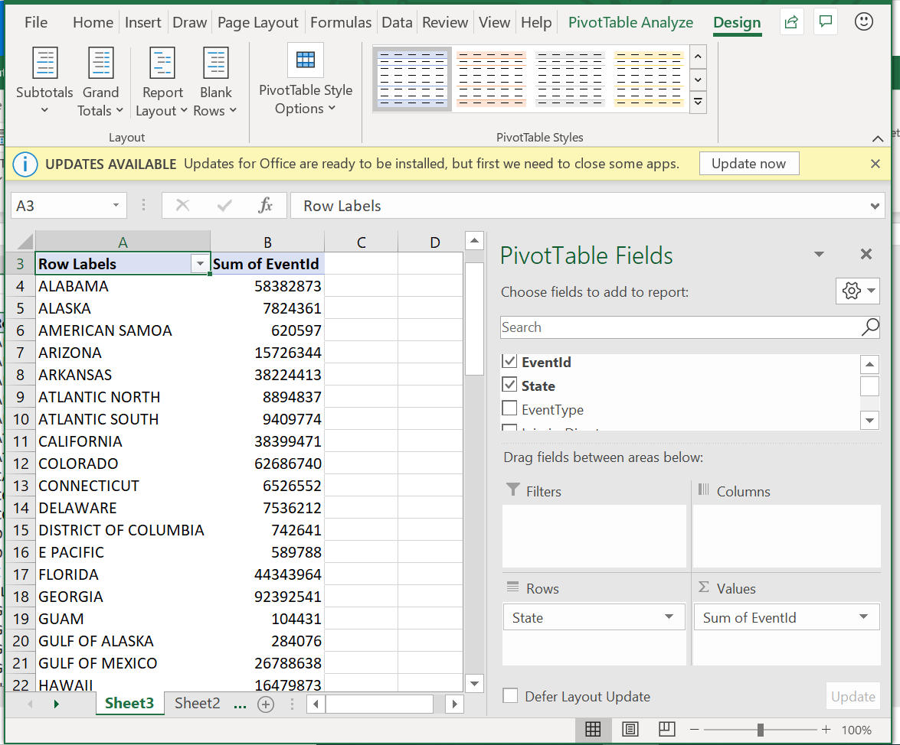
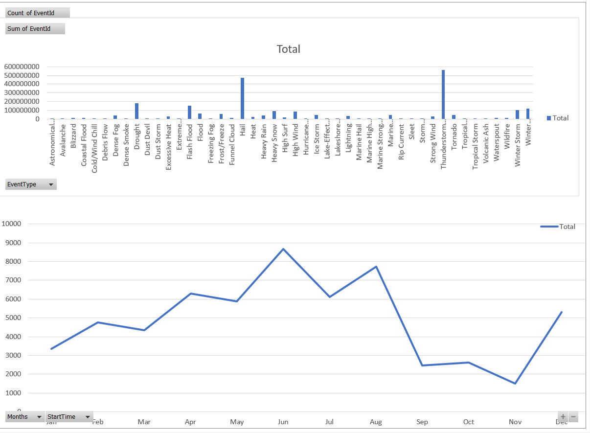

# Visualize data using the Azure Data Explorer connector for Excel

Azure Data Explorer offers the ability to export query results to Excel using the Excel native connector. In addition, you can add a Kusto query language query as an Excel data source for additional calculations or visualizations.

Azure Data Explorer provides two options for connecting to data in Excel:
* Use the native connector, detailed in this article, in Excel to connect to the Azure Data Explorer cluster.
* Import a query from Azure Data Explorer

## Define Kusto query as Excel data source and load data to Excel

1. Open **Microsoft Excel**.
1. In **Data** tab, select **Get Data** > **From Azure** > **From Azure Data Explorer**

    

1. In the **Azure Data Explorer (Kusto)** window complete the following fields and select **OK**.

    
    
    |Field   |Description |
    |---------|---------|
    |**Cluster**   |   Name of cluster (mandatory)      |    
    |**Database**     |    Name of database      |    
    |**Table name or Azure Data Explorer query**    |     Name of table or Azure Data Explorer query    | 
    
    **Advanced Options:**

     |Field   |Description |
    |---------|---------|
    |**Limit query result record number**     |     \\to do    |    
    |**(Limit query result data size (bytes)**    |    \\to do      |   
    |**Disable result-set truncation**    |    \\to do      |      
    |**Additional Set statements (separated by semicolons)**    |    \\to do      |   

1.	In the **Navigator** pane, navigate to correct table. In the table preview pane, select **Transform Data** to make changes to your data (\\to do: kind of changes?) or select **Load** to load it to Excel.

\\to do: add new pic

## Analyze and Visualize Data in Excel

Once the data loads to excel and is available in your Excel sheet you can analyze, summarize,and visualize the data by creating relationships and visuals. 

1.	In **Table Design** tab, select **Summarize with PivotTable**. In **Create PivotTable** window select the relevant table and **OK**.

    

1. In the **PivotTable Fields** pane, select the relevant table columns to create summary tables. In the example below,  **EventId** and **State** are selected.
    
    

\\to do: how create visuals and how create dashboards. 

1. Create visuals based on the table, for example, “Count of Event Id” by “Start time” to view the number of weather events over time.

    

1. Create full dashboards to monitor your data.

