# Microsoft Flow connector (Preview) usage examples

The Azure Data Explorer flow connector allows Azure Data Explorer to use [Microsoft Power Automate's Flow capabilities](https://flow.microsoft.com/) to run Kusto queries and commands automatically as part of a scheduled or triggered task. This document contains several common Microsoft Flow connector usage examples.

For more information, see [Microsoft Flow connector (Preview)](flow.md).

* [Microsoft Flow connector and SQL](#microsoft-flow-connector-and-sql)
* [Push data to Power BI dataset](#push-data-to-power-bi-dataset)
* [Conditional queries](#conditional-queries)
* [Email multiple Azure Data Explorer Flow charts](#email-multiple-azure-data-explorer-flow-charts)

## Microsoft Flow connector and SQL

Use the Microsoft Flow connector to query your data and aggregate it in an SQL database.

> [!Note]
> SQL insert is done separately for each row. Only use the Microsoft Flow connector for small amounts of output data. 

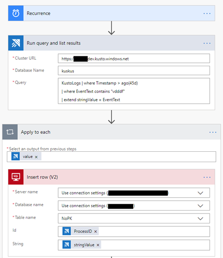

> [!IMPORTANT]
> In the *Cluster Name* field, enter the cluster URL.

## Push data to Power BI dataset

The Microsoft Flow connector can be used together with the Power BI connector to push data from Kusto queries to Power BI streaming datasets.

1. Create a new Run query and list results action.
1. Select **New step**.
1. Select **Add an action** and search for Power BI.
1. Select **Power BI**.
1. Select **Add rows to a dataset**. 

    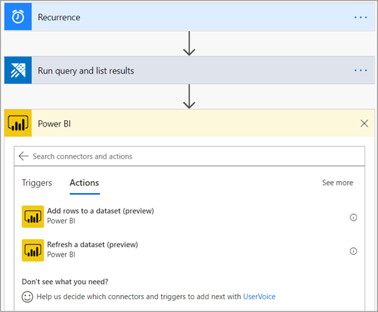
1. Enter the **Workspace**, **Dataset**, and **Table** to which data will be pushed.
1. From the dynamic content dialog, add a Payload containing your dataset schema and the relevant Kusto query results.

    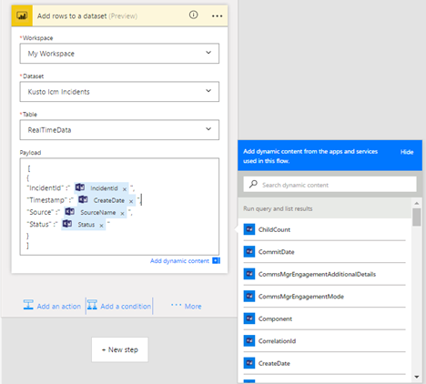

Flow automatically applies the Power BI action for each row of the Kusto query result table. 

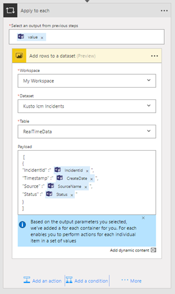

## Conditional queries

The results of Kusto queries can be used as input or conditions for the next flow actions.

In the following example, we query Kusto for incidents that occurred during the last day. For each resolved incident, a slack message is posted and a push notification is created.
For each incident that is still active, Kusto is queried for more information about similar incidents. It sends that information as an email, and opens a related TFS task.

Follow these instructions to create a similar Flow:

1. Create a new Run query and list results action.
1. Select **New step**.
1. Select **Condition control**.
1. From the dynamic content window, select the parameter you want to use as a condition for next actions.
1. Select the type of *Relationship* and *Value* to set a specific condition on the given parameter.

    [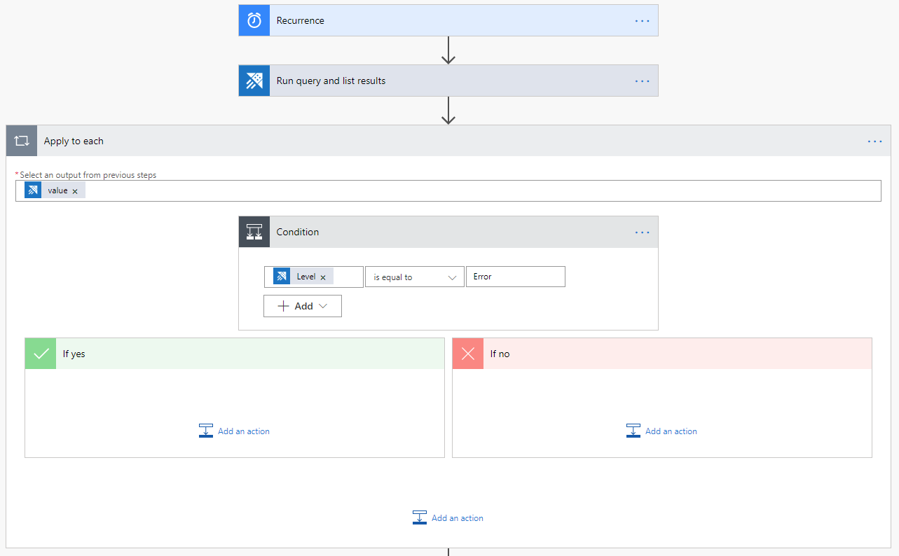](./media/flow-usage/flow-condition.png#lightbox)

    Flow applies this condition on each row of the query result table.
1. Add actions for when the condition is true and false.

    [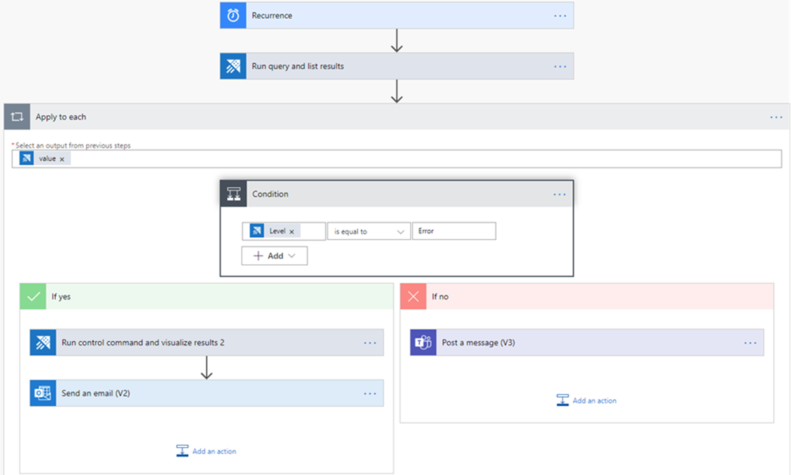](./media/flow-usage/flow-conditionactions.png#lightbox)

You can use the result values from the Kusto query as input for the next actions. Select the result values from the dynamic content window.
In the example below, a Slack - Post Message action and Visual Studio - Create a new work item action containing data from the Kusto query were added.

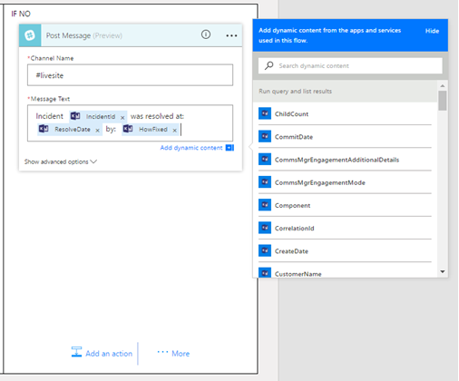

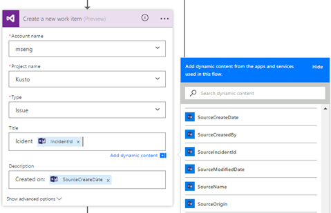

In this example, if an incident is still active, query Kusto again to get information on how incidents from the same source were solved in the past.

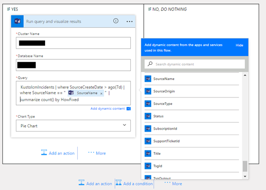

> [!IMPORTANT]
> In the *Cluster Name* field, enter the cluster URL.

Visualize this information as a pie chart and email it to the team.

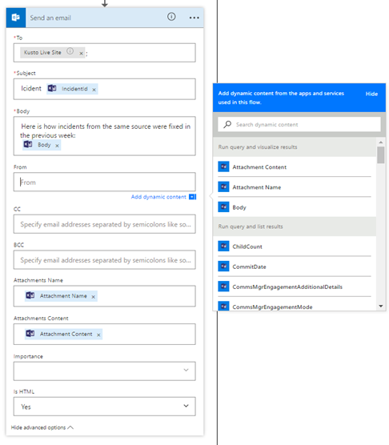

## Email multiple Azure Data Explorer Flow charts

1. Create a new Flow with the recurrence trigger, and define the interval of the Flow and the frequency. 
1. Add a new step, with one or more Kusto - Run query and visualize results actions. 

    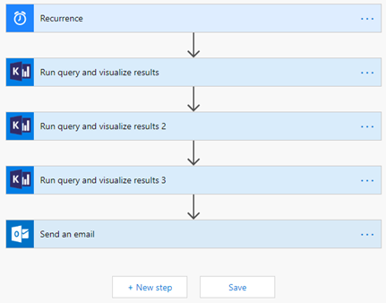
1. For each Kusto - Run query and visualize result, define the following fields:
    * Cluster URL
    * Database Name
    * Query and Chart Type (HTML table, pie chart, time chart, bar chart, or enter a custom value).

    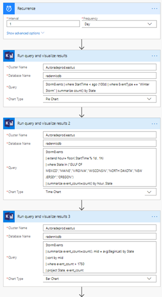

1. Add a Send an email (v2) action: 
    1. In the body section, select the code view icon.
    1. In the **Body** field, insert the required BodyHtml so that the visualized result of the query is included in the body of the email.
    1. To add an attachment to the email, add Attachment Name and Attachment Content.
    
    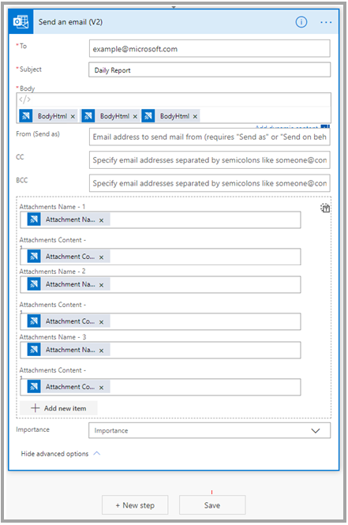

    For full instructions about creating an email action, see [Email Kusto query results](flow.md#email-kusto-query-results). 

Results:

[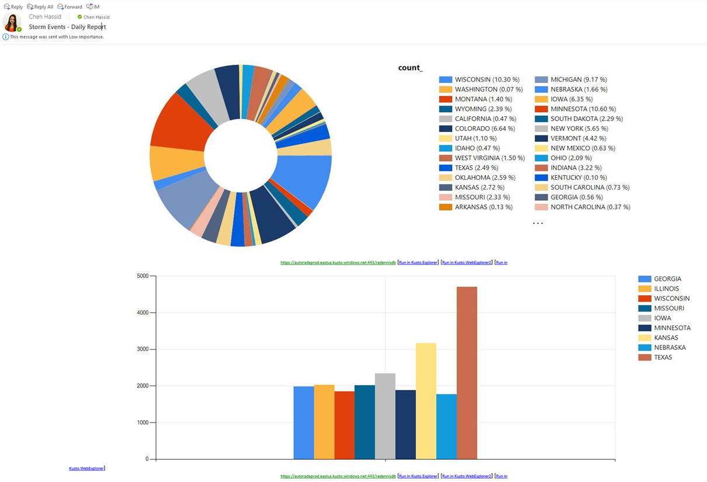](./media/flow-usage/flow-resultsmultipleattachments.png#lightbox)

[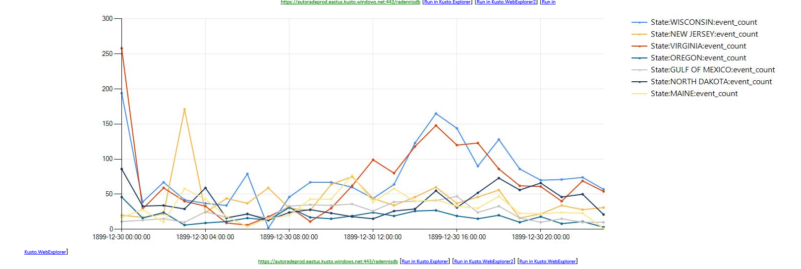](./media/flow-usage/flow-resultsmultipleattachments2.png#lightbox)

## Next steps

Learn about the [Microsoft Azure Explorer Logic App connector](https://docs.microsoft.com/azure/kusto/tools/logicapps) which is another way to run Kusto queries and commands automatically as part of a scheduled or triggered task.
