# Microsoft Flow connector (Preview)

The Azure Data Explorer flow connector allows Azure Data Explorer to use [Microsoft Power Automate's Flow capabilities](https://flow.microsoft.com/) to run Kusto queries and commands automatically as part of a scheduled or triggered task.

Common usage scenarios include:

* Sending daily reports containing tables and charts
* Setting notifications based on query results
* Scheduling control commands on clusters
* Exporting and importing data between Azure Data Explorer and other databases 

For more information, see [Microsoft Flow connector usage examples](flow-usage.md).

##  Log in 

1. Log in to [Microsoft Power Automate](https://flow.microsoft.com/).

1. When connecting for the first time, you'll be prompted to sign in.

1. Select **Sign in** and enter your credentials.

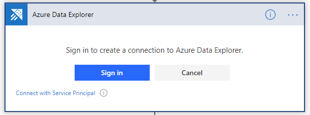

## Authentication

You can authenticate with user credentials or an AAD application.

> [!Note]
> Make sure your application is an [AAD application](https://docs.microsoft.com/azure/kusto/management/access-control/how-to-provision-aad-app) and is authorized to execute queries on your cluster.

1. Select the three dots at the top right of the Microsoft Flow connector:
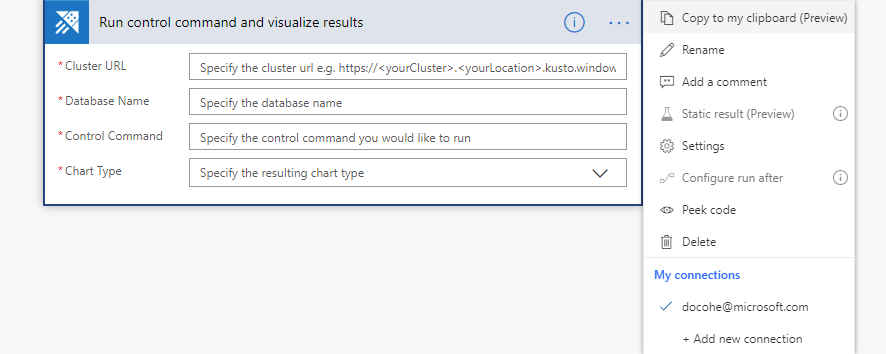

1. Select **Add new connection** and then select **Connect with Service Principal**.

1. Enter the required information:
    * Connection Name: A descriptive and meaningful name for the new connection
    * Client ID: Your application ID
    * Client Secret: Your application key
    * Tenant: The ID of the AAD directory in which you created the application. For example, the Microsoft tenant ID is: 72f988bf-86f1-41af-91ab-2d7cd011db47

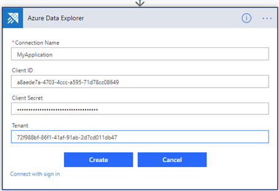

When authentication is complete, you'll see that your flow uses the newly added connection.

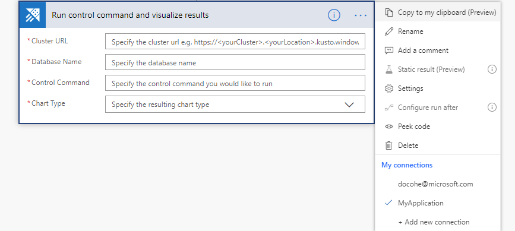

From now on, this flow will run using these application credentials.

## Find the Azure Kusto connector

To use the Microsoft Flow connector, you need to first add a trigger. 
A trigger can be defined based on a recurring time period, or as response to a previous flow action.

1. [Create a new flow](https://flow.microsoft.com/manage/flows/new) or, from the Home page, select the **My Flows** action and then select **+ New**.

    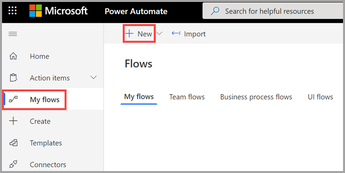

1. Add Scheduled-from blank.

    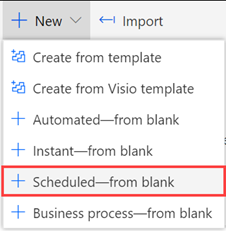

1. Enter the required information on the Build a scheduled flow page.
    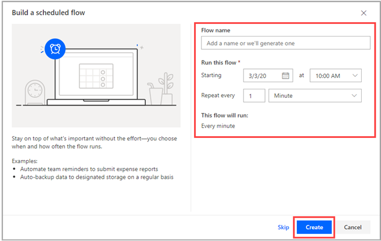
1. Select **Create**.
1. Select **+ New step**.
1. In the search box, enter "Kusto".

    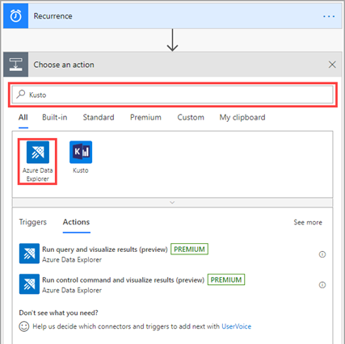

1. Select **Azure Data Explorer**.

## Flow Actions

When you open the Azure Data Explorer connector, there are three possible actions you can add to your flow.

This section describes the capabilities and parameters for each Microsoft Flow action.

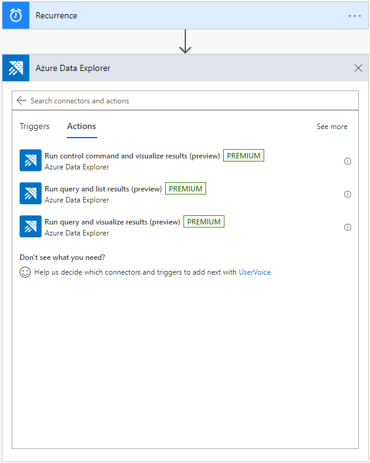

### Run control command and visualize results

Use the Run control command and visualize results action to run a [control command](https://docs.microsoft.com/azure/kusto/management/index).

1. Specify the cluster URL. For example, https://clusterName.eastus.kusto.windows.net
1. Enter the name of the database.
1. Specify the control command:
    * Select dynamic content from the apps and connectors used in the flow
    * Add an expression to access, convert, and compare values
1. To send the results of this action by email as a table or a chart, specify the chart type, which can be:
    * An HTML table
    * A pie chart
    * A time chart
    * A bar chart

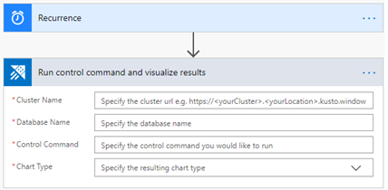

> [!IMPORTANT]
> In the *Cluster Name* field, enter the cluster URL.

### Run query and list results

> [!Note]
> If your query starts with a dot (meaning it's a [control command](https://docs.microsoft.com/azure/kusto/management/index)), use [Run control command and visualize results](#run-control-command-and-visualize-results).

This action sends a query to Kusto cluster. The actions that are added afterwards iterate over each line of the results of the query.

The following example triggers a query every minute and sends an email based on the query results. The query checks the number of lines in the database, and then sends an email only if the number of lines is greater than 0. 

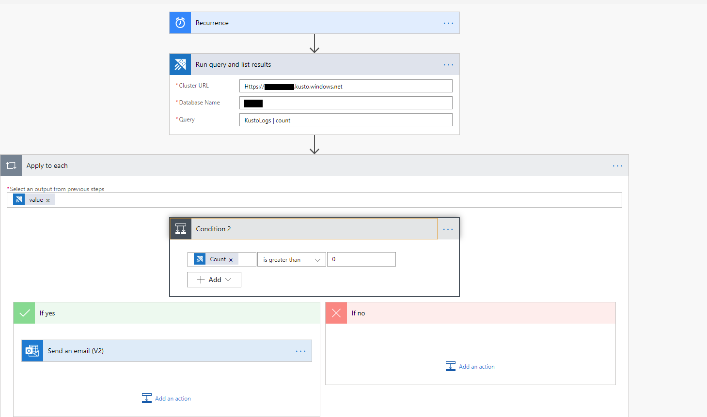

> [!Note]
> If the column has several lines, the connector will run for each line in the column.

### Run query and visualize results
        
> [!Note]
> If your query starts with a dot (meaning it's a [control command](https://docs.microsoft.com/azure/kusto/management/index)), use [Run control command and visualize results](#run-control-command-and-visualize-results).
        
Use the Run query and visualize results action to visualize Kusto query result as a table or chart. For example, use this flow to receive daily ICM reports by email. 
    
In this example, the results of the query are returned as an HTML table.
            
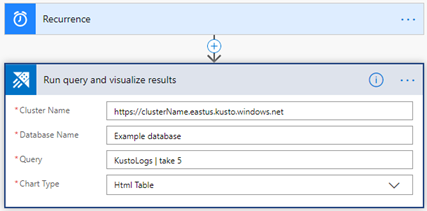

> [!IMPORTANT]
> In the *Cluster Name* field, enter the cluster URL.

## Email Kusto query results

You can include a step in any flow to send reports by email to any email address. 

1. Select **+ New Step** to add a new step to your flow.
1. In the search field, enter Office 365 and select **Office 365 Outlook**.
1. Select **Send an email (V2)**.
1. Enter the email address to where you want the email report sent.
1. Enter the subject of the email.
1. Select **Code view**.
1. Place your cursor in the *Body* field, and select **Add dynamic content**.
1. Select **BodyHtml**.
    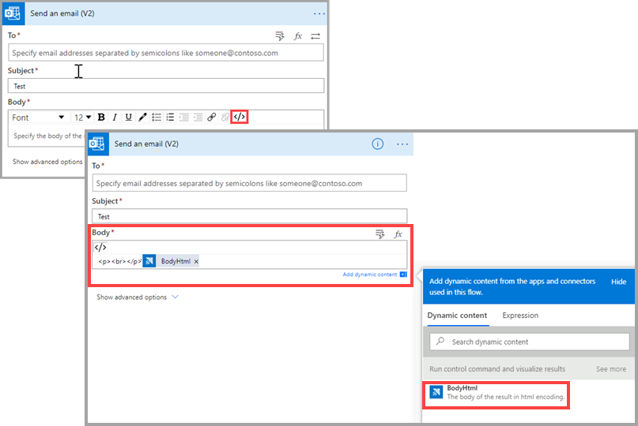
1. Select **Show advanced options**.
1. In the *Attachments Name -1* field, select **Attachment Name**.
1. In the *Attachments Content* field, select **Attachment Content**.
1. If necessary, add more attachments. 
1. If necessary, set the importance level.
1. Select **Save**.

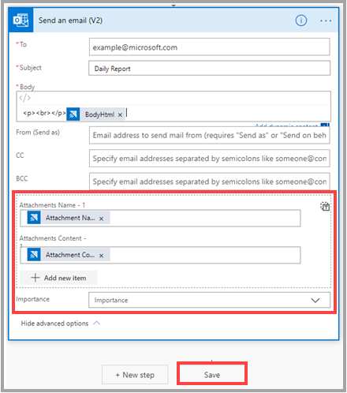

## Check if your flow succeeded

To check if your flow succeeded, see the flow's run history:
1. Go to the [Microsoft Flow home page](https://flow.microsoft.com/).
1. From the main menu, select [My flows](https://flow.microsoft.com/manage/flows).
    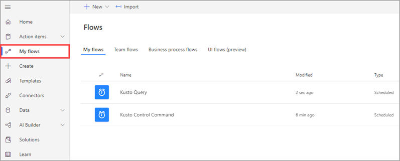
1. On the row of the flow you want to investigate, select the more commands icon, and then **Run history**.

    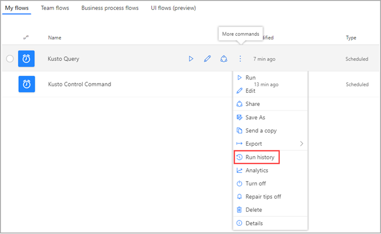

    All flow runs are listed with start time, duration, and status.
    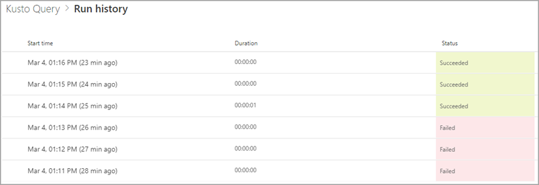

    For full details about the flow, on the [My flows](https://flow.microsoft.com/manage/flows) page, select the flow you want to investigate.

    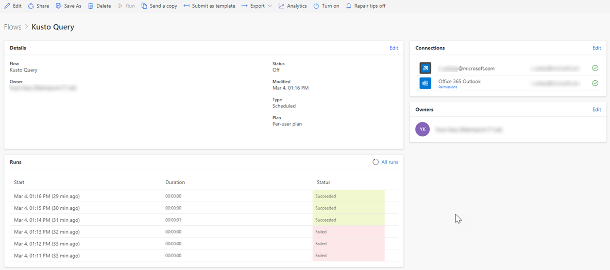 

To see why a run failed, select the run start time. The flow appears and the step of the flow that failed is indicated by a red exclamation point. Expand the failed step to view its details. The right-hand pane contains information about the failure so that you can troubleshoot it.

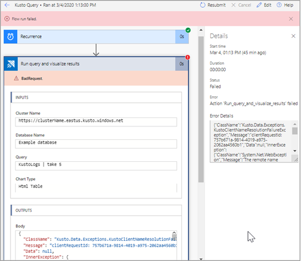

## Timeout exceptions

Your flow can fail and return a "RequestTimeout" exception if it runs for more than seven minutes.

Learn more about [Microsoft Flow limitations](#limitations).
    
The same query may run successfully in Azure Data Explorer where the time isn't limited and can be changed.
            
The "RequestTimeout" exception is shown in the image below:
    
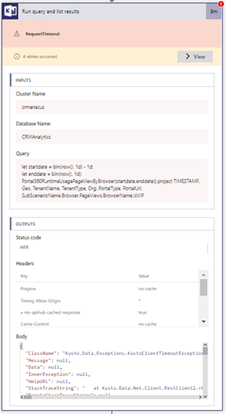
    
To fix a timeout issue, try to make your query more efficient so that it runs faster, or separate it into chunks. Each chunk can run on a different part of the query.

For more information, read about [Query best practices](https://docs.microsoft.com/azure/kusto/query/best-practices).

## Limitations

* Results returned to the client are limited to 500,000 records. The overall memory for those records can't exceed 64 MB and seven-minutes execution time.
* The connector does not support the [fork](https://docs.microsoft.com/azure/kusto/query/forkoperator) and [facet](https://docs.microsoft.com/azure/kusto/query/facetoperator) operators.
* Flow works best on Microsoft Edge and Chrome.

## Next steps

Learn about the [Microsoft Azure Explorer Logic App connector](https://docs.microsoft.com/azure/kusto/tools/logicapps) which is another way to run Kusto queries and commands automatically as part of a scheduled or triggered task.
