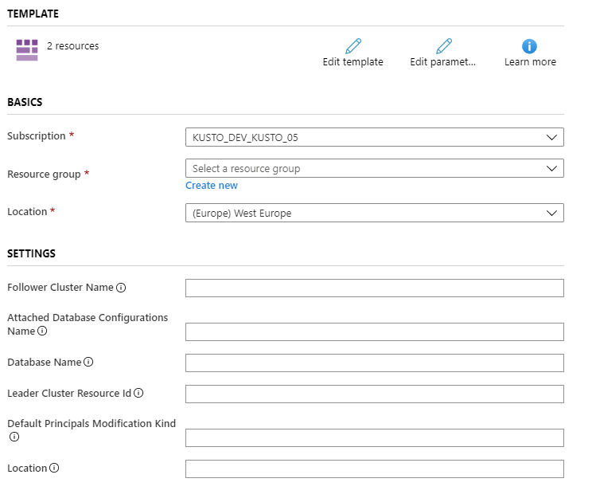
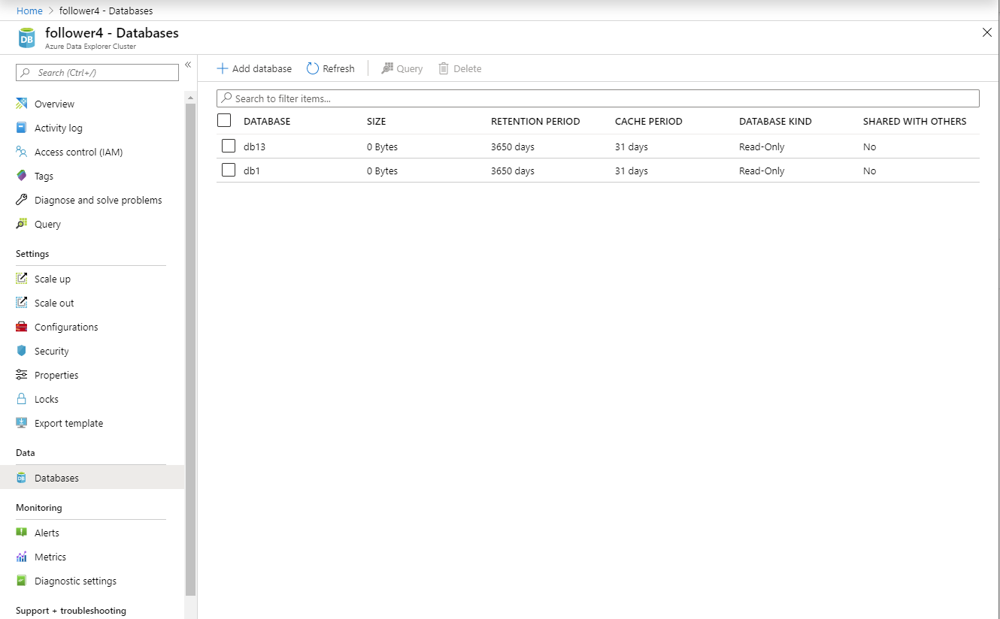
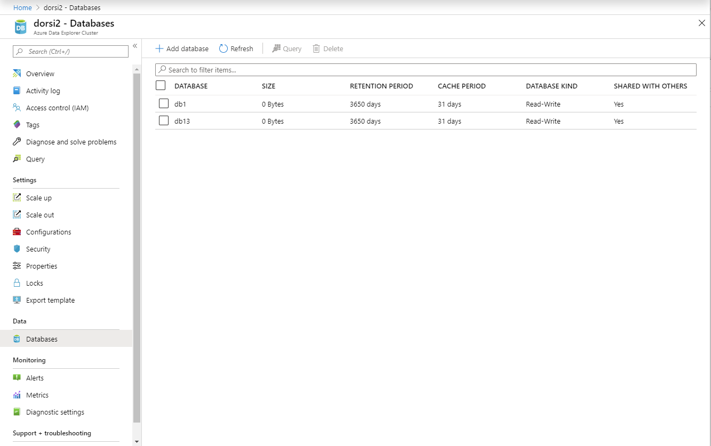

# Use follower database to attach databases in Azure Data Explorer

The **follower database** feature allows you to attach a database located in a different cluster to your cluster. The **follower database** is attached in *read-only* mode, making it possible to run queries on the data in the **leader database**. The follower database periodically synchronizes changes in the leader databases, so there is a data lag of a few seconds to a few minutes in data availability. The length of the time lag depends on the overall size of the leader database metadata.

Attaching a database to a different cluster using the follower capability is used as the infrastructure to share data between organizations and teams. It is useful to segregate compute resources to protect a production environment from non-production use cases. It can also be used to associate the cost of Azure Data Explorer cluster to the party that runs queries on the data.

Azure Data Explorer database(s) hosted in one cluster can be attached as read-only database(s) to a different cluster. By attaching a database to a cluster, you can view the data and execute queries on the attached database. The leader and follower databases use the same storage account to fetch the data. The storage is owned by the leader database. The follower database views the data without needing to ingest it. Since the attached database is a read-only database, the data, tables and policies in the database can't be modified except for [caching policy](#configure-caching-policy), [principals](#manage-principals) and [permissions](#manage-permissions). Attached databases can't be deleted. They must be detached by the leader or follower and only then they can be deleted. 

## Which databases are followed?

* A cluster can follow one database, several databases, or all databases of a leader cluster. 
* A single cluster can follow databases from multiple leader clusters. 
* A cluster can contain both follower databases and leader databases

## Prerequisites

1. If you don't have an Azure subscription, [create a free account](https://azure.microsoft.com/free/) before you begin.
1. [Create cluster and DB](/azure/data-explorer/create-cluster-database-portal) for the leader and follower.
1. [Ingest data](/azure/data-explorer/ingest-sample-data) to leader database using one of various methods discussed in [ingestion overview](/azure/data-explorer/ingest-data-overview).

## Attach a database

There are various methods you can use to attach a database. In this article, we discuss attaching a database using C# or an Azure Resource Manager template. To attach a database, you must have permissions on the leader cluster and the follower cluster. For more information about permissions, see [manage permissions](#manage-permissions).

### Attach a database using C#

**Required NuGets**

* Install [Microsoft.Azure.Management.kusto](https://www.nuget.org/packages/Microsoft.Azure.Management.Kusto/).
* Install [Microsoft.Rest.ClientRuntime.Azure.Authentication for authentication](https://www.nuget.org/packages/Microsoft.Rest.ClientRuntime.Azure.Authentication).


```Csharp
var tenantId = "xxxxxxxx-xxxxx-xxxx-xxxx-xxxxxxxxx";//Directory (tenant) ID
var clientId = "xxxxxxxx-xxxxx-xxxx-xxxx-xxxxxxxxx";//Application ID
var clientSecret = "xxxxxxxxxxxxxx";//Client secret
var subscriptionId = "xxxxxxxx-xxxxx-xxxx-xxxx-xxxxxxxxx";

var serviceCreds = await ApplicationTokenProvider.LoginSilentAsync(tenantId, clientId, clientSecret);
var resourceManagementClient = new ResourceManagementClient(serviceCreds);

var leaderResourceGroupName = "testrg";
var followerResourceGroupName = "followerResouceGroup";
var leaderClusterName = "leader";
var followerClusterName = "follower";
var attachedDatabaseConfigurationName = "adc";
var databaseName = "db" // Can be specific database name or * for all databases
var defaultPrincipalsModificationKind = "Union"; 
var location = "North Central US";

AttachedDatabaseConfiguration attachedDatabaseConfigurationProperties = new AttachedDatabaseConfiguration()
{
	ClusterResourceId = $"/subscriptions/{subscriptionId}/resourceGroups/{followerResourceGroupName}/providers/Microsoft.Kusto/Clusters/{followerClusterName}",
	DatabaseName = databaseName,
	DefaultPrincipalsModificationKind = defaultPrincipalsModificationKind,
	Location = location
};

var attachedDatabaseConfigurations = resourceManagementClient.AttachedDatabaseConfigurations.CreateOrUpdate(followerResourceGroupName, followerClusterName, attachedDatabaseConfigurationName, attachedDatabaseConfigurationProperties);
```

### Attach a database using an Azure Resource Manager template

In this section, you learn how to attach a database by using an [Azure Resource Manager template](../azure-resource-manager/resource-group-overview.md). 

```json
{
	"$schema": "https://schema.management.azure.com/schemas/2015-01-01/deploymentTemplate.json#",
	"contentVersion": "1.0.0.0",
	"parameters": {
		"followerClusterName": {
			"type": "string",
			"defaultValue": "",
			"metadata": {
				"description": "Name of the follower cluster."
			}
		},
		"attachedDatabaseConfigurationsName": {
			"type": "string",
			"defaultValue": "",
			"metadata": {
				"description": "Name of the attached database configurations to create."
			}
		},
		"databaseName": {
			"type": "string",
			"defaultValue": "",
			"metadata": {
				"description": "The name of the database to follow. You can follow all databases by using '*'."
			}
		},
		"leaderClusterResourceId": {
			"type": "string",
			"defaultValue": "",
			"metadata": {
				"description": "Name of the leader cluster to create."
			}
		},
		"defaultPrincipalsModificationKind": {
			"type": "string",
			"defaultValue": "",
			"metadata": {
				"description": "The default principal modification kind."
			}
		},
		"location": {
			"type": "string",
			"defaultValue": "",
			"metadata": {
				"description": "Location for all resources."
			}
		}
	},
	"variables": {},
	"resources": [
		{
			"name": "[parameters('followerClusterName')]",
			"type": "Microsoft.Kusto/clusters",
			"sku": {
				"name": "Standard_D13_v2",
				"tier": "Standard",
				"capacity": 2
			},
			"apiVersion": "2019-09-07",
			"location": "[parameters('location')]"
		},
		{
			"name": "[concat(parameters('followerClusterName'), '/', parameters('attachedDatabaseConfigurationsName'))]",
			"type": "Microsoft.Kusto/clusters/attachedDatabaseConfigurations",
			"apiVersion": "2019-09-07",
			"location": "[parameters('location')]",
			"dependsOn": [
				"[resourceId('Microsoft.Kusto/clusters', parameters('followerClusterName'))]"
			],
			"properties": {
				"databaseName": "[parameters('databaseName')]",
				"clusterResourceId": "[parameters('leaderClusterResourceId')]",
				"defaultPrincipalsModificationKind": "[parameters('defaultPrincipalsModificationKind')]"
			}
		}
	]
}
```

### Deploy the template 

You can deploy the Azure Resource Manager template by [using the Azure portal](https://portal.azure.com) or using powershell.

   


|**Setting**  |**Description**  |
|---------|---------|
|Follower Cluster Name     |  The name of the follower cluster       |
|Attached Database Configurations Name    |    The name of the attached database configurations object. The name must be unique at the cluster level.     |
|Database Name     |      The name of the database to be followed. If you want to follow all the leader's databases use '*'.   |
|Leader Cluster Resource Id    |   The resource ID of the leader cluster.      |
|Default Principals Modification Kind    |   The default principal modification kind. Can be `Union`, `Replace` or `None`. For more information about default principal modification kind, see [principal modification kind control command](/azure/kusto/management/cluster-follower?branch=master#alter-follower-database-principals-modification-kind).      |
|Location   |   The location of all the resources. The leader and the follower must be in the same location.       |
 
### Verify that the database was successfully attached

To verify that the database was successfully attached, find your attached databases in the [Azure portal](https://portal.azure.com). 

1. Navigate to the follower cluster and select **Databases**
1. Search for new Read-Only databases in the database list.

    

Alternatively:

1. Navigate to the leader cluster and select **Databases**
2. Check that the relevant databases are marked as **SHARED WITH OTHERS** > **Yes**

    

## Detach the follower database using C# 

### Detach the attached follower database from the follower cluster

Follower cluster is able to detach any attached database as follows:

```csharp
var tenantId = "xxxxxxxx-xxxxx-xxxx-xxxx-xxxxxxxxx";//Directory (tenant) ID
var clientId = "xxxxxxxx-xxxxx-xxxx-xxxx-xxxxxxxxx";//Application ID
var clientSecret = "xxxxxxxxxxxxxx";//Client secret
var subscriptionId = "xxxxxxxx-xxxxx-xxxx-xxxx-xxxxxxxxx";

var serviceCreds = await ApplicationTokenProvider.LoginSilentAsync(tenantId, clientId, clientSecret);
var resourceManagementClient = new ResourceManagementClient(serviceCreds);

var followerResourceGroupName = "testrg";
//The cluster and database that are created as part of the prerequisites
var followerClusterName = "follower";
var attachedDatabaseConfigurationsName = "adc";

resourceManagementClient.AttachedDatabaseConfigurations.Delete(followerResourceGroupName, followerClusterName, attachedDatabaseConfigurationsName);
```

### Detach the attached follower database from the leader cluster

The leader cluster is able to detach any attached database as follows:

```csharp
var tenantId = "xxxxxxxx-xxxxx-xxxx-xxxx-xxxxxxxxx";//Directory (tenant) ID
var clientId = "xxxxxxxx-xxxxx-xxxx-xxxx-xxxxxxxxx";//Application ID
var clientSecret = "xxxxxxxxxxxxxx";//Client secret
var subscriptionId = "xxxxxxxx-xxxxx-xxxx-xxxx-xxxxxxxxx";

var serviceCreds = await ApplicationTokenProvider.LoginSilentAsync(tenantId, clientId, clientSecret);
var resourceManagementClient = new ResourceManagementClient(serviceCreds);

var leaderResourceGroupName = "testrg";
var followerResourceGroupName = "followerResouceGroup";
var leaderClusterName = "leader";
var followerClusterName = "follower";
//The cluster and database that are created as part of the Prerequisites
var followerDatabaseDefinition = new FollowerDatabaseDefinition()
    {
        AttachedDatabaseConfigurationName = "adc",
        ClusterResourceId = $"/subscriptions/{subscriptionId}/resourceGroups/{followerResourceGroupName}/providers/Microsoft.Kusto/Clusters/{followerClusterName}"
    };

resourceManagementClient.Clusters.DetachFollowerDatabases(leaderResourceGroupName, leaderClusterName, followerDatabaseDefinition);
```

## Manage principals, permissions, and caching policy

### Manage principals

When attaching a database you specify the **default principals modification kind"**. The default is keeping the leader database collection of [authorized principals](/azure/kusto/management/access-control/index.md#authorization)

|**Kind** |**Description**  |
|---------|---------|
|**Union**     |   The attached database principals will always include the original database principals plus additional new principals added to the follower database.      |
|**Replace**   |    No inheritance of principals from the original database. New principals must be created for the attached database. At least one principal needs to be added to block principal inheritance.     |
|**None**   |   The attached database principals include only the principals of the original database with no additional principals.      |

### Manage permissions

Managing read only database permission is the same as for all database types. See [manage permissions in the Azure portal](/azure/data-explorer/manage-database-permissions#manage-permissions-in-the-azure-portal).

### Configure caching policy

The follower database administrator can modify the [caching policy](/azure/kusto/management/cache-policy) of the attached database or any of its tables on the hosting cluster. The default is keeping the leader database collection of database and table-level caching policies. You can, for example, have a 30 day caching policy on the leader database for running monthly reporting and a three day caching policy on the follower database to query only the recent data for troubleshooting.

## Limitations

* The follower and the leader clusters must be in the same region.
* [Streaming ingestion](/azure/data-explorer/ingest-data-streaming) can't be used on a database that is being followed.
* You can't delete a database that is attached to a different cluster before detaching it.
* You can't delete a cluster that has a database attached to a different cluster before detaching it.
* You can't stop a cluster that has attached follower or leader database(s). 

## Next steps

* For information about follower cluster configuration, see [Control commands for managing a follower cluster](/azure/kusto/management/cluster-follower.md).