# Visualize data from Azure Data Explorer in Grafana

Grafana is an analytics platform that enables you to query and visualize data, then create and share dashboards based on your visualizations. Grafana provides an Azure Data Explorer *plugin*, which enables you to connect to and visualize data from Azure Data Explorer. In this article, you learn how to set up Azure Data Explorer as a data source for Grafana, and then visualize data from a sample cluster.

Using the following video, you can learn to use Grafana's Azure Data Explorer plugin, set up Azure Data Explorer as a data source for Grafana, and then visualize data. 

> [!VIDEO https://www.youtube.com/embed/fSR_qCIFZSA]

Alternatively you can [configure the data source](#configure-the-data-source) and [visualize data](#visualize-data) as detailed in the article below.

## Prerequisites

You need the following to complete this how to:

* [Grafana version 5.3.0 or later](https://docs.grafana.org/installation/) for your operating system

* The [Azure Data Explorer plugin](https://grafana.com/plugins/grafana-azure-data-explorer-datasource/installation) for Grafana

* A cluster that includes the StormEvents sample data. For  more information, see [Quickstart: Create an Azure Data Explorer cluster and database](create-cluster-database-portal.md) and [Ingest sample data into Azure Data Explorer](ingest-sample-data.md).

    [!INCLUDE [data-explorer-storm-events](../../includes/data-explorer-storm-events.md)]

## Configure the data source

You perform the following steps to configure Azure Data Explorer as a data source for Grafana. We'll cover these steps in more detail in this section:

1. Create an Azure Active Directory (Azure AD) service principal. The service principal is used by Grafana to access the Azure Data Explorer service.

1. Add the Azure AD service principal to the *viewers* role in the Azure Data Explorer database.

1. Specify Grafana connection properties based on information from the Azure AD service principal, then test the connection.

### Create a service principal

You can create the service principal in the [Azure portal](#azure-portal) or using the [Azure CLI](#azure-cli) command-line experience. Regardless of which method you use, after creation you get values for four connection properties that you'll use in later steps.

#### Azure portal

1. To create the service principal, follow the instructions in the [Azure portal documentation](/azure/active-directory/develop/howto-create-service-principal-portal).

    1. In the [Assign the application to a role](/azure/active-directory/develop/howto-create-service-principal-portal#assign-the-application-to-a-role) section, assign a role type of **Reader** to your Azure Data Explorer cluster.

    1. In the [Get values for signing in](/azure/active-directory/develop/howto-create-service-principal-portal#get-values-for-signing-in) section, copy the three property values covered in the steps: **Directory ID** (tenant ID), **Application ID**, and **Password**.

1. In the Azure portal, select **Subscriptions** then copy the ID for the subscription in which you created the service principal.

    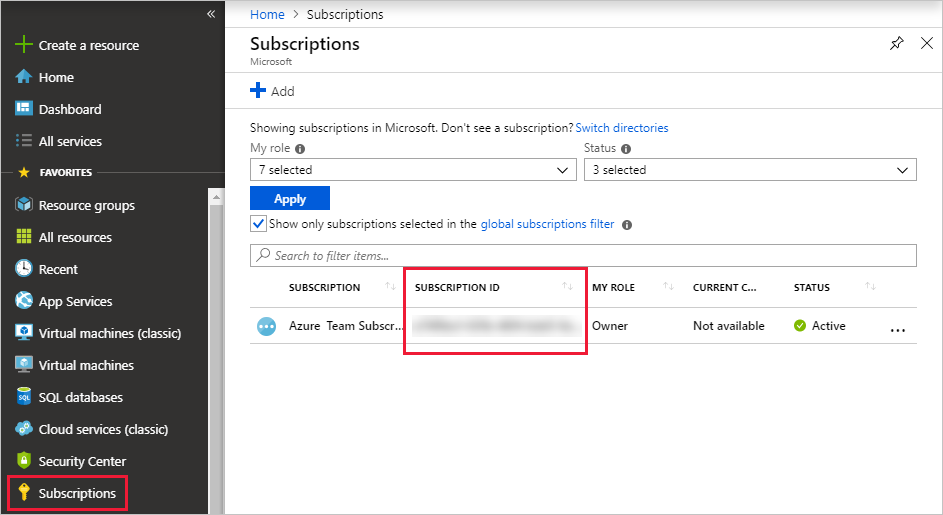

#### Azure CLI

1. Create a service principal. Set an appropriate scope and a role type of `reader`.

    ```azurecli
    az ad sp create-for-rbac --name "https://{UrlToYourGrafana}:{PortNumber}" --role "reader" \
                             --scopes /subscriptions/{SubID}/resourceGroups/{ResourceGroupName}
    ```

    For more information, see [Create an Azure service principal with Azure CLI](/cli/azure/create-an-azure-service-principal-azure-cli).

1. The command returns a result set like the following. Copy the three property values: **appID**, **password**, and **tenant**.

    ```json
    {
      "appId": "XXXXXXXX-XXXX-XXXX-XXXX-XXXXXXXXXXXX",
      "displayName": "{UrlToYourGrafana}:{PortNumber}",
      "name": "https://{UrlToYourGrafana}:{PortNumber}",
      "password": "XXXXXXXX-XXXX-XXXX-XXXX-XXXXXXXXXXXX",
      "tenant": "XXXXXXXX-XXXX-XXXX-XXXX-XXXXXXXXXXXX"
    }
    ```

1. Get a list of your subscriptions.

    ```azurecli
    az account list --output table
    ```

    Copy the appropriate subscription ID.

    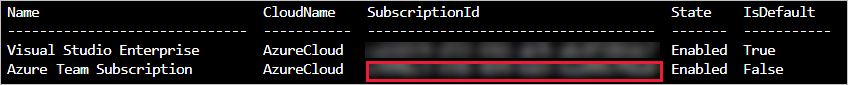

### Add the service principal to the viewers role

Now that you have a service principal, you add it to the *viewers* role in the Azure Data Explorer database. You can perform this task under **Permissions** in the Azure portal, or under **Query** by using a management command.

#### Azure portal - Permissions

1. In the Azure portal, go to your Azure Data Explorer cluster.

1. In the **Overview** section, select the database with the StormEvents sample data.

    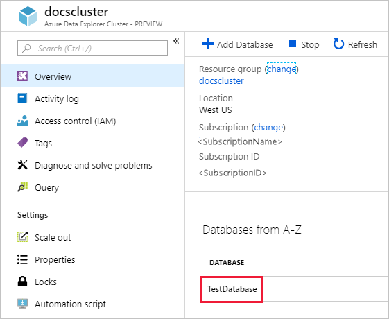

1. Select **Permissions** then **Add**.

    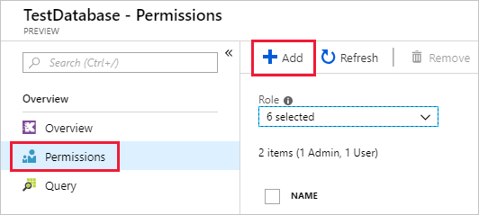

1. Under **Add database permissions**, select the **Viewer** role then **Select principals**.

    

1. Search for the service principal you created (the example shows the principal **mb-grafana**). Select the principal, then **Select**.

    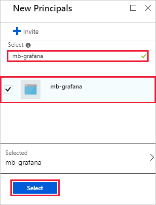

1. Select **Save**.

    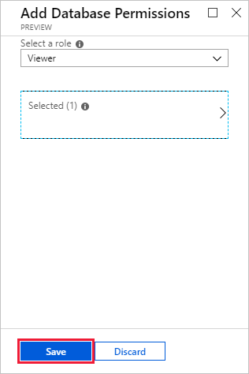

#### Management command - Query

1. In the Azure portal, go to your Azure Data Explorer cluster, and select **Query**.

    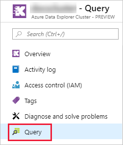

1. Run the following command in the query window. Use the application ID and tenant ID from the Azure portal or CLI.

    ```kusto
    .add database {TestDatabase} viewers ('aadapp={ApplicationID};{TenantID}')
    ```

    The command returns a result set like the following. In this example, the first row is for an existing user in the database, and the second row is for the service principal that was just added.

    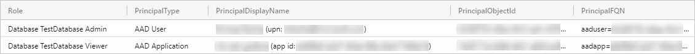

### Specify properties and test the connection

With the service principal assigned to the *viewers* role, you now specify properties in your instance of Grafana, and test the connection to Azure Data Explorer.

1. In Grafana, on the left menu, select the gear icon then **Data Sources**.

    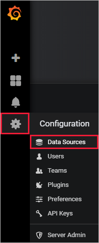

1. Select **Add data source**.

1. On the **Data Sources / New** page, enter a name for the data source, then select the type **Azure Data Explorer Datasource**.

    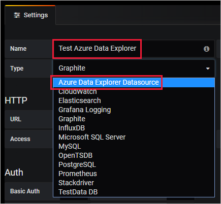

1. Enter the name of your cluster in the form https://{ClusterName}.{Region}.kusto.windows.net. Enter the other values from the Azure portal or CLI. See the table below the following image for a mapping.

    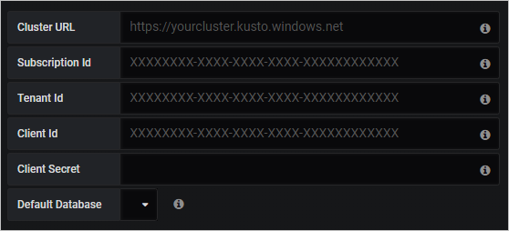

    | Grafana UI | Azure portal | Azure CLI |
    | --- | --- | --- |
    | Subscription Id | SUBSCRIPTION ID | SubscriptionId |
    | Tenant Id | Directory ID | tenant |
    | Client Id | Application ID | appId |
    | Client secret | Password | password |
    | | | |

1. Select **Save & Test**.

    If the test is successful, go to the next section. If you encounter any issues, check the values you specified in Grafana, and review previous steps.

## Visualize data

Now you've finished configuring Azure Data Explorer as a data source for Grafana, it's time to visualize data. We'll show a basic example here, but there's a lot more you can do. We recommend looking at [Write queries for Azure Data Explorer](write-queries.md) for examples of other queries to run against the sample data set.

1. In Grafana, on the left menu, select the plus icon then **Dashboard**.

    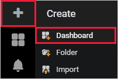

1. Under the **Add** tab, select **Graph**.

    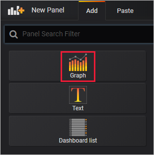

1. On the graph panel, select **Panel Title** then **Edit**.

    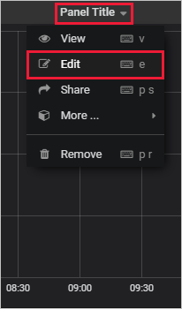

1. At the bottom of the panel, select **Data Source** then select the data source that you configured.

    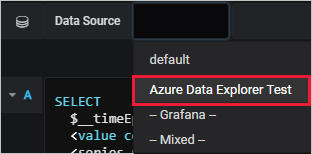

1. In the query pane, copy in the following query then select **Run**. The query buckets the count of events by day for the sample data set.

    ```kusto
    StormEvents
    | summarize event_count=count() by bin(StartTime, 1d)
    ```

    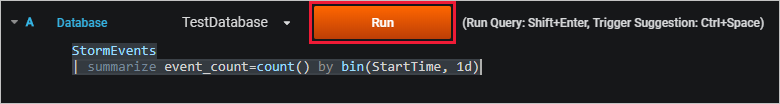

1. The graph doesn't show any results because it's scoped by default to data from the last six hours. On the top menu, select **Last 6 hours**.

    

1. Specify a custom range that covers 2007, the year included in our StormEvents sample data set. Select **Apply**.

    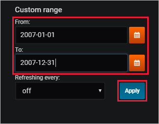

    Now the graph shows the data from 2007, bucketed by day.

    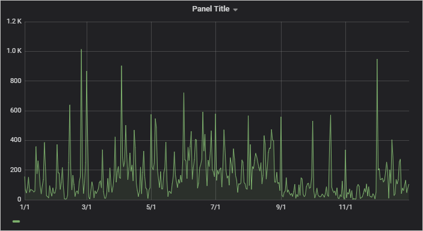

1. On the top menu, select the save icon: 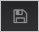.

## Next steps

* [Write queries for Azure Data Explorer](write-queries.md)

* [Tutorial: Visualize data from Azure Data Explorer in Power BI](visualize-power-bi.md)
