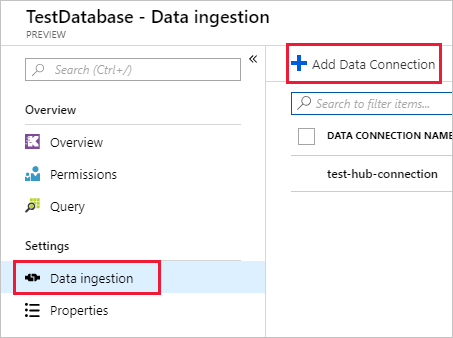

# Quickstart: Ingest Azure Blobs into Azure Data Explorer by subscribing to Event Grid notifications

Azure Data Explorer is a fast and highly scalable data exploration service for log and telemetry data. Azure Data Explorer offers continuous ingestion (data loading) from blobs written to blob containers. This is achieved by setting an [Azure Event Grid](/azure/event-grid/overview) subscription for blob creation events and routing these events to Kusto via an Event Hub. For this quickstart, you should already have a Storage Account with an Event Grid subscription which sends its notifications to Event Hub. With that, you will create an Event Grid Data Connection and see the data flow throught the system.

## Prerequisites

1. If you don't have an Azure subscription, create a [free Azure account](https://azure.microsoft.com/free/).

1. [A cluster and database](create-cluster-database-portal.md)
1. [A storage account](https://docs.microsoft.com/azure/storage/common/storage-quickstart-create-account?tabs=azure-portal)
1. [An Event Hub](https://docs.microsoft.com/azure/event-hubs/event-hubs-create)

## Create an Event Grid Subscription in your Storage Account

* In Azure portal, navigate to your Storage Account
* Click on **Events** tab, then on **Event Subscription**

    

 Provide the following values

    **Setting** | **Suggested value** | **Field description**
    |---|---|---|
    | Name | *test-grid-connection* | The name of the event grid you want to create.|
    | Event schema | *Event Grid Schema* | The schema which should be used for the Event Grid. |
    | Topic Type | *Storage Account* | The type of event grid topic. |
    | Topic Resource | *gridteststorage* | The name of your storage account. |
    | Subscribe to all event types | *Uncheck* | Whether to get notified on all events. |
    | Defined Event Types | *Blob Created* | Which specific events to get notified for. |
    | Endpoint Type | *Event Hubs* | The type of endpoint to send the events to. |
    | Endpoint | *test-hub* | The event hub you created. |
    | | |
* If you want to track files from a specific container, click on the **Additional Features** tab and set the filters for the notifications
        * **Subject Begins With** field is the *literal* prefix of the blob container (as the pattern applied is *startswith*, it can span multiple containers). No wildcards are allowed.
        It *must* be set as follows: *`/blobServices/default/containers/`*[container prefix]
        * **Subject Ends With** field is the *literal* suffix of the blob. No wildcards are allowed.

## Create a target table in Azure Data Explorer

Now you create a table in Azure Data Explorer, to which Event Hubs will send data. You create the table in the cluster and database provisioned in **Prerequisites**.

1. In the Azure portal, under your cluster, select **Query**.

    

1. Copy the following command into the window and select **Run** to create the table (TestTable) which will receive the ingested data.

    ```Kusto
    .create table TestTable (TimeStamp: datetime, Value: string, Source:string)
    ```

    

1. Copy the following command into the window and select **Run** to map the incoming JSON data to the column names and data types of the table (TestTable).

    ```Kusto
    .create table TestTable ingestion json mapping 'TestMapping' '[{"column":"TimeStamp","path":"$.TimeStamp"},{"column":"Value","path":"$.Value"},{"column":"Source","path":"$.Source"}]'
    ```

## Create an Event Grid Data Connection in Azure Data Explorer

Now you connect to the event grid from Azure Data Explorer, so that data flowing into the blob container is streamed to the test table.

1. Select **Notifications** on the toolbar to verify that the event hub deployment was successful.

1. Under the cluster you created, select **Databases** then **TestDatabase**.

    

1. Select **Data ingestion** then **Add data connection**.

    

1. Select **Blob Storage** connection type

1. Fill out the form with the following information, then select **Create**.

    

     Data Source:

    **Setting** | **Suggested value** | **Field description**
    |---|---|---|
    | Data connection name | *test-hub-connection* | The name of the connection you want to create in Azure Data Explorer.|
    | Storage account | *gridteststorage* | The name of the storage account you created on the first step.|
    | Event hub namespace | A unique namespace name | The name you chose earlier that identifies your namespace. |
    | Event hub | *test-hub* | The event hub you created. |
    | Consumer group | *test-group* | The consumer group defined in the event hub you created. |
    | | |

    Target table:

     **Setting** | **Suggested value** | **Field description**
    |---|---|---|
    | Table | *TestTable* | The table you created in **TestDatabase**. |
    | Data format | *JSON* | JSON and CSV formats are supported. |
    | Column mapping | *TestMapping* | The mapping you created in **TestDatabase**, which maps incoming JSON data to the column names and data types of **TestTable**.|
    | | |

## Generate sample data

Now that Azure Data Explorer and the storage account are connected, you can create sample data and upload to the blob storage.

We'll work with a small shell script that issues a few basic Azure CLI commands to interact with Azure Storage resources. The script first creates a new container in your storage account, then uploads an existing file (as a blob) to that container. It then lists all blobs in the container. You can use [Cloud Shell](https://docs.microsoft.com/azure/cloud-shell/overview) to execute the script directly in the portal.

Save the following data into a file and use with the below script.

```Json
{"TimeStamp": "1987-11-16 12:00","Value": "Hello World","Source": "TestSource"}
```

```bash
#!/bin/bash
### A simple Azure Storage example script

    export AZURE_STORAGE_ACCOUNT=<storage_account_name>
    export AZURE_STORAGE_KEY=<storage_account_key>

    export container_name=<container_name>
    export blob_name=<blob_name>
    export file_to_upload=<file_to_upload>
    export destination_file=<destination_file>

    echo "Creating the container..."
    az storage container create --name $container_name

    echo "Uploading the file..."
    az storage blob upload --container-name $container_name --file $file_to_upload --name $blob_name

    echo "Listing the blobs..."
    az storage blob list --container-name $container_name --output table

    echo "Done"
```

## Review the data flow

> [!NOTE]
> ADX has an aggregation (batching) policy for data ingestion designed to optimize the ingestion process.
By default, the policy is configured to 5 minutes.
You’ll be able to alter the policy at later time as needed. In this quickstart you can expect a latency of a few minutes.

1. In the Azure portal, under your event grid, you see the spike in activity while the app is running.

    

1. To check how many messages have made it to the database so far, run the following query in your test database.

    ```Kusto
    TestTable
    | count
    ```

1. To see the content of the messages run the following query in your test database.

    ```Kusto
    TestTable
    ```

    The result set should look like the following.

    

## Clean up resources

If you don't plan to use your event grid again, clean up **test-hub-rg**, to avoid incurring costs.

1. In the Azure portal, select **Resource groups** on the far left, and then select the resource group you created.  

    If the left menu is collapsed, select  to expand it.

   

1. Under **test-resource-group**, select **Delete resource group**.

1. In the new window, type the name of the resource group to delete (*test-hub-rg*), and then select **Delete**.

## Next steps

> [!div class="nextstepaction"]
> [Quickstart: Query data in Azure Data Explorer](web-query-data.md)