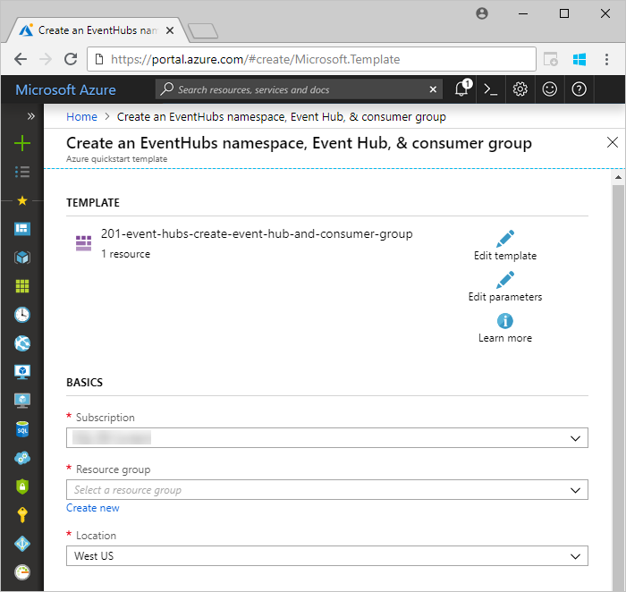
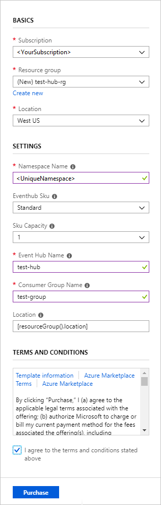
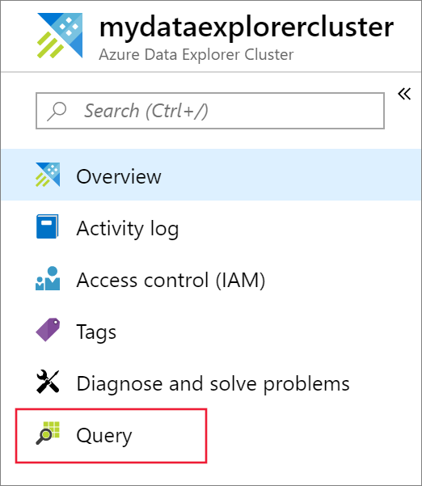
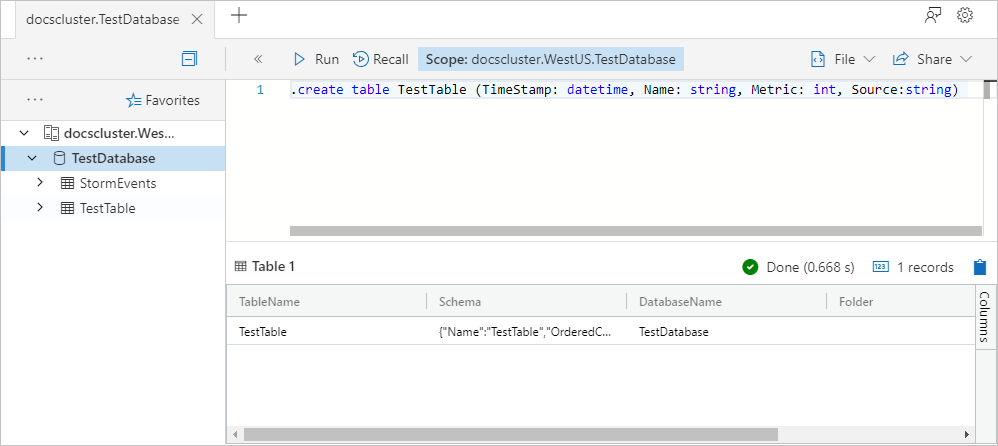
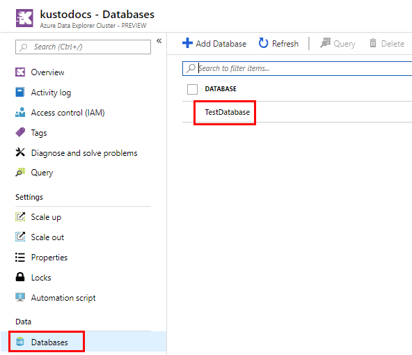
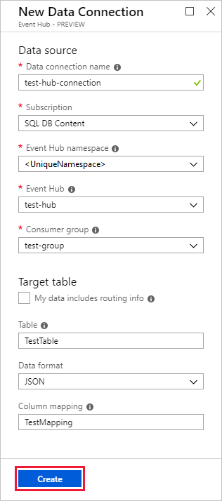
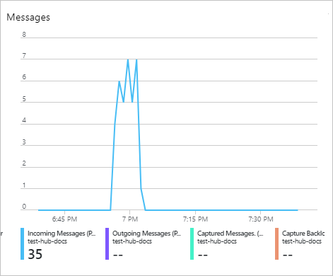

# Ingest data from Event Hub into Azure Data Explorer

Azure Data Explorer is a fast and highly scalable data exploration service for log and telemetry data. Azure Data Explorer offers ingestion (data loading) from Event Hubs, a big data streaming platform and event ingestion service. [Event Hubs](/azure/event-hubs/event-hubs-about) can process millions of events per second in near real-time. In this article, you create an event hub, connect to it from Azure Data Explorer and see data flow through the system.

## Prerequisites

* If you don't have an Azure subscription, create a [free Azure account](https://azure.microsoft.com/free/) before you begin.

* [A test cluster and database](create-cluster-database-portal.md).

* [A sample app](https://github.com/Azure-Samples/event-hubs-dotnet-ingest) that generates data and sends it to an event hub. Download the sample app to your system.

* [Visual Studio 2019](https://visualstudio.microsoft.com/vs/) to run the sample app.

## Sign in to the Azure portal

Sign in to the [Azure portal](https://portal.azure.com/).

## Create an event hub

In this article, you generate sample data and send it to an event hub. The first step is to create an event hub. You do this by using an Azure Resource Manager template in the Azure portal.

1. To create an event hub, use the following button to start the deployment. Right-click and select **Open in new window**, so you can follow the rest of the steps in this article.

    [](https://portal.azure.com/#create/Microsoft.Template/uri/https%3A%2F%2Fraw.githubusercontent.com%2FAzure%2Fazure-quickstart-templates%2Fmaster%2F201-event-hubs-create-event-hub-and-consumer-group%2Fazuredeploy.json)

    The **Deploy to Azure** button takes you to the Azure portal to fill out a deployment form.

    

1. Select the subscription where you want to create the event hub, and create a resource group named *test-hub-rg*.

    

1. Fill out the form with the following information.

    

    Use defaults for any settings not listed in the following table.

    **Setting** | **Suggested value** | **Field description**
    |---|---|---|
    | Subscription | Your subscription | Select the Azure subscription that you want to use for your event hub.|
    | Resource group | *test-hub-rg* | Create a new resource group. |
    | Location | *West US* | Select *West US* for this article. For a production system, select the region that best meets your needs. Create the event hub namespace in the same Location as the Kusto cluster for best performance (most important for event hub namespaces with high throughput).
    | Namespace name | A unique namespace name | Choose a unique name that identifies your namespace. For example, *mytestnamespace*. The domain name *servicebus.windows.net* is appended to the name you provide. The name can contain only letters, numbers, and hyphens. The name must start with a letter, and it must end with a letter or number. The value must be between 6 and 50 characters long.
    | Event hub name | *test-hub* | The event hub sits under the namespace, which provides a unique scoping container. The event hub name must be unique within the namespace. |
    | Consumer group name | *test-group* | Consumer groups enable multiple consuming applications to each have a separate view of the event stream. |
    | | |

1. Select **Purchase**, which acknowledges that you're creating resources in your subscription.

1. Select **Notifications** on the toolbar to monitor the provisioning process. It might take several minutes for the deployment to succeed, but you can move on to the next step now.

    

## Create a target table in Azure Data Explorer

Now you create a table in Azure Data Explorer, to which Event Hubs will send data. You create the table in the cluster and database provisioned in **Prerequisites**.

1. In the Azure portal, navigate to your cluster then select **Query**.

    

1. Copy the following command into the window and select **Run** to create the table (TestTable) which will receive the ingested data.

    ```Kusto
    .create table TestTable (TimeStamp: datetime, Name: string, Metric: int, Source:string)
    ```

    

1. Copy the following command into the window and select **Run** to map the incoming JSON data to the column names and data types of the table (TestTable).

    ```Kusto
    .create table TestTable ingestion json mapping 'TestMapping' '[{"column":"TimeStamp","path":"$.timeStamp","datatype":"datetime"},{"column":"Name","path":"$.name","datatype":"string"},{"column":"Metric","path":"$.metric","datatype":"int"},{"column":"Source","path":"$.source","datatype":"string"}]'
    ```

## Connect to the event hub

Now you connect to the event hub from Azure Data Explorer. When this connection is in place, data that flows into the event hub streams to the test table you created earlier in this article.

1. Select **Notifications** on the toolbar to verify that the event hub deployment was successful.

1. Under the cluster you created, select **Databases** then **TestDatabase**.

    

1. Select **Data ingestion** and **Add data connection**. Then fill out the form with the following information. Select **Create** when you are finished.

    

    Data Source:

    **Setting** | **Suggested value** | **Field description**
    |---|---|---|
    | Data connection name | *test-hub-connection* | The name of the connection you want to create in Azure Data Explorer.|
    | Event hub namespace | A unique namespace name | The name you chose earlier that identifies your namespace. |
    | Event hub | *test-hub* | The event hub you created. |
    | Consumer group | *test-group* | The consumer group defined in the event hub you created. |
    | | |

    Target table:

    There are two options for routing the ingested data: *static* and *dynamic*. 
    For this article, you use static routing, where you specify the table name, data format, and mapping. Therefore, leave **My data includes routing info** unselected.

     **Setting** | **Suggested value** | **Field description**
    |---|---|---|
    | Table | *TestTable* | The table you created in **TestDatabase**. |
    | Data format | *JSON* | Supported formats are Avro, CSV, JSON, MULTILINE JSON, PSV, SOH, SCSV, TSV, and TXT. |
    | Column mapping | *TestMapping* | The mapping you created in **TestDatabase**, which maps incoming JSON data to the column names and data types of **TestTable**. Required for JSON, MULTILINE JSON, or AVRO, and optional for other formats.|
    | | |

    > [!NOTE]
    > Select **My data includes routing info** to use dynamic routing, where your data includes the necessary routing information as seen in the [sample app](https://github.com/Azure-Samples/event-hubs-dotnet-ingest) comments. If both static and dynamic properties are set, the dynamic properties override the static ones. 

## Copy the connection string

When you run the [sample app](https://github.com/Azure-Samples/event-hubs-dotnet-ingest) listed in Prerequisites, you need the connection string for the event hub namespace.

1. Under the event hub namespace you created, select **Shared access policies**, then **RootManageSharedAccessKey**.

    

1. Copy **Connection string - primary key**. You paste it in the next section.

    

## Generate sample data

Use the [sample app](https://github.com/Azure-Samples/event-hubs-dotnet-ingest) you downloaded to generate data.

1. Open the sample app solution in Visual Studio.

1. In the *program.cs* file, update the `connectionString` constant to the connection string you copied from the event hub namespace.

    ```csharp
    const string eventHubName = "test-hub";
    // Copy the connection string ("Connection string-primary key") from your Event Hub namespace.
    const string connectionString = @"<YourConnectionString>";
    ```

1. Build and run the app. The app sends messages to the event hub, and it prints out status every ten seconds.

1. After the app has sent a few messages, move on to the next step: reviewing the flow of data into your event hub and test table.

## Review the data flow

With the app generating data, you can now see the flow of that data from the event hub to the table in your cluster.

1. In the Azure portal, under your event hub, you see the spike in activity while the app is running.

    

1. To check how many messages have made it to the database so far, run the following query in your test database.

    ```Kusto
    TestTable
    | count
    ```

1. To see the content of the messages, run the following query:

    ```Kusto
    TestTable
    ```

    The result set should look like the following:

    

    > [!NOTE]
    > Azure Data Explorer has an aggregation (batching) policy for data ingestion, designed to optimize the ingestion process. The policy is configured to 5 minutes, by default, so you may experience a latency. See [batching policy](/azure/kusto/concepts/batchingpolicy) for aggregation options. See [streaming policy](/azure/kusto/concepts/streamingingestionpolicy) for ingestion with no aggregation.

## Clean up resources

If you don't plan to use your event hub again, clean up **test-hub-rg**, to avoid incurring costs.

1. In the Azure portal, select **Resource groups** on the far left, and then select the resource group you created.  

    If the left menu is collapsed, select  to expand it.

   

1. Under **test-resource-group**, select **Delete resource group**.

1. In the new window, type the name of the resource group to delete (*test-hub-rg*), and then select **Delete**.

## Next steps

* [Query data in Azure Data Explorer](web-query-data.md)
