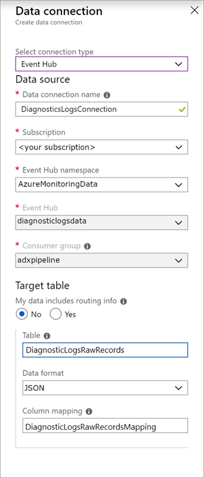

# Tutorial: Ingest data in Azure Data Explorer without one line of code

This tutorial will teach you how to ingest data from diagnostic and activity logs to an Azure Data Explorer cluster without writing code. With this simple ingestion method, you can quickly begin querying Azure Data Explorer for data analysis.

In this tutorial, you'll learn how to:

> [!div class="checklist"]
> * Create tables and ingestion mapping in an Azure Data Explorer database.
> * Format the ingested data by using an update policy.
> * Create an [event hub](/azure/event-hubs/event-hubs-about)  and connect it to Azure Data Explorer.
> * Stream data to an event hub from [Azure Monitor diagnostic logs](/azure/azure-monitor/platform/diagnostic-logs-overview) and [Azure Monitor activity logs](/azure/azure-monitor/platform/activity-logs-overview).
> * Query the ingested data by using Azure Data Explorer.

> [!NOTE]
> Create all resources in the same Azure location or region. This is a requirement for Azure Monitor diagnostic logs.

## Prerequisites

* If you don't have an Azure subscription, create a [free Azure account](https://azure.microsoft.com/free/) before you begin.
* [An Azure Data Explorer cluster and database](create-cluster-database-portal.md). In this tutorial, the database name is *TestDatabase*.

## Azure Monitor data provider: diagnostic and activity logs

View and understand the data provided by the Azure Monitor diagnostic and activity logs below. We'll create an ingestion pipeline based on these data schemas. Note that each event in a log has an array of records. This array of records will be split later in the tutorial.

### Diagnostic logs example

Azure diagnostic logs are metrics emitted by an Azure service that provide data about the operation of that service. Data is aggregated with a time grain of 1 minute. Here's an example of an Azure Data Explorer metric-event schema on query duration:

```json
{
	"records": [
	{
    	"count": 14,
    	"total": 0,
    	"minimum": 0,
    	"maximum": 0,
    	"average": 0,
    	"resourceId": "/SUBSCRIPTIONS/F3101802-8C4F-4E6E-819C-A3B5794D33DD/RESOURCEGROUPS/KEDAMARI/PROVIDERS/MICROSOFT.KUSTO/CLUSTERS/KEREN",
    	"time": "2018-12-20T17:00:00.0000000Z",
    	"metricName": "QueryDuration",
    	"timeGrain": "PT1M"
    },
    {
    	"count": 12,
    	"total": 0,
    	"minimum": 0,
    	"maximum": 0,
    	"average": 0,
    	"resourceId": "/SUBSCRIPTIONS/F3101802-8C4F-4E6E-819C-A3B5794D33DD/RESOURCEGROUPS/KEDAMARI/PROVIDERS/MICROSOFT.KUSTO/CLUSTERS/KEREN",
    	"time": "2018-12-21T17:00:00.0000000Z",
    	"metricName": "QueryDuration",
    	"timeGrain": "PT1M"
    }
    ]
}
```

### Activity logs example

Azure activity logs are subscription-level logs that provide insight into the operations performed on resources in your subscription. Here's an example of an activity-log event for checking access:

```json
{
	"records": [
	{
		"time": "2018-12-26T16:23:06.1090193Z",
		"resourceId": "/SUBSCRIPTIONS/F80EB51C-C534-4F0B-80AB-AEBC290C1C19/RESOURCEGROUPS/CLEANUPSERVICE/PROVIDERS/MICROSOFT.WEB/SITES/CLNB5F73B70-DCA2-47C2-BB24-77B1A2CAAB4D/PROVIDERS/MICROSOFT.AUTHORIZATION",
		"operationName": "MICROSOFT.AUTHORIZATION/CHECKACCESS/ACTION",
		"category": "Action",
		"resultType": "Start",
		"resultSignature": "Started.",
		"durationMs": 0,
		"callerIpAddress": "13.66.225.188",
		"correlationId": "0de9f4bc-4adc-4209-a774-1b4f4ae573ed",
		"identity": {
			"authorization": {
                ...
            },
            "claims": {
                ...
            }
		},
		"level": "Information",
		"location": "global",
		"properties": {
			...
		}
	},
	{
		"time": "2018-12-26T16:23:06.3040244Z",
		"resourceId": "/SUBSCRIPTIONS/F80EB51C-C534-4F0B-80AB-AEBC290C1C19/RESOURCEGROUPS/CLEANUPSERVICE/PROVIDERS/MICROSOFT.WEB/SITES/CLNB5F73B70-DCA2-47C2-BB24-77B1A2CAAB4D/PROVIDERS/MICROSOFT.AUTHORIZATION",
		"operationName": "MICROSOFT.AUTHORIZATION/CHECKACCESS/ACTION",
		"category": "Action",
		"resultType": "Success",
		"resultSignature": "Succeeded.OK",
		"durationMs": 194,
		"callerIpAddress": "13.66.225.188",
		"correlationId": "0de9f4bc-4adc-4209-a774-1b4f4ae573ed",
		"identity": {
			"authorization": {
                ...
            },
            "claims": {
                ...
            }
		},
		"level": "Information",
		"location": "global",
		"properties": {
			"statusCode": "OK",
			"serviceRequestId": "87acdebc-945f-4c0c-b931-03050e085626"
		}
	}]
}
```

## Set up an ingestion pipeline in Azure Data Explorer

Setting up an Azure Data Explorer pipeline involves several steps, such as [table creation and data ingestion](/azure/data-explorer/ingest-sample-data#ingest-data). You can also manipulate, map, and update the data.

### Connect to the Azure Data Explorer Web UI

In your Azure Data Explorer *TestDatabase* database, select **Query** to open the Azure Data Explorer Web UI.


### Create the target tables

The structure of the Azure Monitor logs isn't tabular. You'll manipulate the data and expand each event to one or more records. The raw data will be ingested to an intermediate table named *ActivityLogsRawRecords* for activity logs and *DiagnosticLogsRawRecords* for diagnostic logs. At that time, the data will be manipulated and expanded. Using an update policy, the expanded data will then be ingested into the *ActivityLogsRecords* table for activity logs and *DiagnosticLogsRecords* for diagnostic logs. This means that you'll need to create two separate tables for ingesting activity logs and two separate tables for ingesting diagnostic logs.

Use the Azure Data Explorer Web UI to create the target tables in the Azure Data Explorer database.

#### The diagnostic logs table

1. In the *TestDatabase* database, create a table named *DiagnosticLogsRecords* to store the diagnostic log records. Use the following `.create table` control command:

    ```kusto
    .create table DiagnosticLogsRecords (Timestamp:datetime, ResourceId:string, MetricName:string, Count:int, Total:double, Minimum:double, Maximum:double, Average:double, TimeGrain:string)
    ```

1. Select **Run** to create the table.

    

1. Create the intermediate data table named *DiagnosticLogsRawRecords* in the *TestDatabase* database for data manipulation using the following query. Select **Run** to create the table.

    ```kusto
    .create table DiagnosticLogsRawRecords (Records:dynamic)
    ```

#### The activity logs tables

1. Create a table named *ActivityLogsRecords* in the *TestDatabase* database to receive activity log records. To create the table, run the following Azure Data Explorer query:

    ```kusto
    .create table ActivityLogsRecords (Timestamp:datetime, ResourceId:string, OperationName:string, Category:string, ResultType:string, ResultSignature:string, DurationMs:int, IdentityAuthorization:dynamic, IdentityClaims:dynamic, Location:string, Level:string)
    ```

1. Create the intermediate data table named *ActivityLogsRawRecords* in the *TestDatabase* database for data manipulation:

    ```kusto
    .create table ActivityLogsRawRecords (Records:dynamic)
    ```

<!--
     ```kusto
     .alter-merge table ActivityLogsRawRecords policy retention softdelete = 0d
    <[Retention](/azure/kusto/management/retention-policy) for an intermediate data table is set at zero retention policy.
-->

### Create table mappings

 Because the data format is `json`, data mapping is required. The `json` mapping maps each json path to a table column name.

#### Table mapping for diagnostic logs

To map the diagnostic logs' data to the table, use the following query:

```kusto
.create table DiagnosticLogsRawRecords ingestion json mapping 'DiagnosticLogsRawRecordsMapping' '[{"column":"Records","path":"$.records"}]'
```

#### Table mapping for activity logs

To map the activity logs' data to the table, use the following query:

```kusto
.create table ActivityLogsRawRecords ingestion json mapping 'ActivityLogsRawRecordsMapping' '[{"column":"Records","path":"$.records"}]'
```

### Create the update policy for log data

#### Activity log data update policy

1. Create a [function](/azure/kusto/management/functions) that expands the collection of activity log records so that each value in the collection receives a separate row. Use the [`mv-expand`](/azure/kusto/query/mvexpandoperator) operator:

    ```kusto
    .create function ActivityLogRecordsExpand() {
        ActivityLogsRawRecords
        | mv-expand events = Records
        | project
            Timestamp = todatetime(events["time"]),
            ResourceId = tostring(events["resourceId"]),
            OperationName = tostring(events["operationName"]),
            Category = tostring(events["category"]),
            ResultType = tostring(events["resultType"]),
            ResultSignature = tostring(events["resultSignature"]),
            DurationMs = toint(events["durationMs"]),
            IdentityAuthorization = events.identity.authorization,
            IdentityClaims = events.identity.claims,
            Location = tostring(events["location"]),
            Level = tostring(events["level"])
    }
    ```

2. Add the [update policy](/azure/kusto/concepts/updatepolicy) to the target table. This policy will automatically run the query on any newly ingested data in the *ActivityLogsRawRecords* intermediate data table and ingest its results into the *ActivityLogsRecords* table:

    ```kusto
    .alter table ActivityLogsRecords policy update @'[{"Source": "ActivityLogsRawRecords", "Query": "ActivityLogRecordsExpand()", "IsEnabled": "True"}]'
    ```

#### Diagnostic log data update policy

1. Create a [function](/azure/kusto/management/functions) that expands the collection of diagnostic log records so that each value in the collection receives a separate row. Use the [`mv-expand`](/azure/kusto/query/mvexpandoperator) operator:
     ```kusto
    .create function DiagnosticLogRecordsExpand() {
        DiagnosticLogsRawRecords
        | mv-expand events = Records
        | project
            Timestamp = todatetime(events["time"]),
            ResourceId = tostring(events["resourceId"]),
            MetricName = tostring(events["metricName"]),
            Count = toint(events["count"]),
            Total = todouble(events["total"]),
            Minimum = todouble(events["minimum"]),
            Maximum = todouble(events["maximum"]),
            Average = todouble(events["average"]),
            TimeGrain = tostring(events["timeGrain"])
    }
    ```

2. Add the [update policy](/azure/kusto/concepts/updatepolicy) to the target table. This policy will automatically run the query on any newly ingested data in the *DiagnosticLogsRawRecords* intermediate data table and ingest its results into the *DiagnosticLogsRecords* table:

    ```kusto
    .alter table DiagnosticLogsRecords policy update @'[{"Source": "DiagnosticLogsRawRecords", "Query": "DiagnosticLogRecordsExpand()", "IsEnabled": "True"}]'
    ```

## Create an Azure Event Hubs namespace

Azure diagnostic logs enable exporting metrics to a storage account or to an event hub. In this tutorial, we'll route the metrics via an event hub. You'll create an Event Hubs namespace and an event hub for the diagnostic logs in the following steps. Azure Monitor will create the event hub *insights-operational-logs* for the activity logs.

1. Create an event hub by using an Azure Resource Manager template in the Azure portal. To follow the rest of the steps in this article, right-click the **Deploy to Azure** button, and then select **Open in new window**. The **Deploy to Azure** button takes you to the Azure portal.

    [](https://portal.azure.com/#create/Microsoft.Template/uri/https%3A%2F%2Fraw.githubusercontent.com%2FAzure%2Fazure-quickstart-templates%2Fmaster%2F201-event-hubs-create-event-hub-and-consumer-group%2Fazuredeploy.json)

1. Create an Event Hubs namespace and an event hub for the diagnostic logs.

    

1. Fill out the form with the following information. For any settings not listed in the following table, use the default values.

    **Setting** | **Suggested value** | **Description**
    |---|---|---|
    | **Subscription** | *Your subscription* | Select the Azure subscription that you want to use for your event hub.|
    | **Resource group** | *test-resource-group* | Create a new resource group. |
    | **Location** | Select the region that best meets your needs. | Create the Event Hubs namespace in the same location as other resources.
    | **Namespace name** | *AzureMonitoringData* | Choose a unique name that identifies your namespace.
    | **Event hub name** | *DiagnosticLogsData* | The event hub sits under the namespace, which provides a unique scoping container. |
    | **Consumer group name** | *adxpipeline* | Create a consumer group name. Consumer groups enable multiple consuming applications to each have a separate view of the event stream. |
    | | |

## Connect Azure Monitor logs to your event hub

Now you need to connect your diagnostic logs and your activity logs to the event hub.

### Connect diagnostic logs to your event hub

Select a resource from which to export metrics. Several resource types support exporting diagnostic logs, including Event Hubs namespace, Azure Key Vault, Azure IoT Hub, and Azure Data Explorer clusters. In this tutorial, we'll use an Azure Data Explorer cluster as our resource.

1. Select your Kusto cluster in the Azure portal.
1. Select **Diagnostic settings**, and then select the **Turn on diagnostics** link. 

    

1. The **Diagnostics settings** pane opens. Take the following steps:
   1. Give your diagnostics log data the name *ADXExportedData*.
   1. Under **METRIC**, select the **AllMetrics** check box (optional).
   1. Select the **Stream to an event hub** check box.
   1. Select **Configure**.

      

1. In the **Select event hub** pane, configure how to export data from diagnostic logs to the event hub you created:
    1. In the **Select event hub namespace** list, select *AzureMonitoringData*.
    1. In the **Select event hub name** list, select *diagnosticlogsdata*.
    1. In the **Select event hub policy name** list, select **RootManagerSharedAccessKey**.
    1. Select **OK**.

1. Select **Save**.

### Connect activity logs to your event hub

1. In the left menu of the Azure portal, select **Activity log**.
1. The **Activity log** window opens. Select **Export to Event Hub**.

    

1. The **Export activity log** window opens:
 
    

1. In the **Export activity log** window, take the following steps:
      1. Select your subscription.
      1. In the **Regions** list, choose **Select all**.
      1. Select the **Export to an event hub** check box.
      1. Choose **Select a service bus namespace** to open the **Select event hub** pane.
      1. In the **Select event hub** pane, select your subscription.
      1. In the **Select event hub namespace** list, select *AzureMonitoringData*.
      1. In the **Select event hub policy name** list, select the default event hub policy name.
      1. Select **OK**.
      1. In the upper-left corner of the window, select **Save**.
   An event hub with the name *insights-operational-logs* will be created.

### See data flowing to your event hubs

1. Wait a few minutes until the connection is defined, and the activity-log export to the event hub is finished. Go to your Event Hubs namespace to see the event hubs you created.

    

1. See data flowing to your event hub:

    

## Connect an event hub to Azure Data Explorer

Now you need to create the data connections for your diagnostic logs and activity logs.

### Create the data connection for diagnostic logs

1. In your Azure Data Explorer cluster named *kustodocs*, select **Databases** in the left menu.
1. In the **Databases** window, select your *TestDatabase* database.
1. In the left menu, select **Data ingestion**.
1. In the **Data ingestion** window, click **+ Add Data Connection**.
1. In the **Data connection** window, enter the following information:

    

    Data source:

    **Setting** | **Suggested value** | **Field description**
    |---|---|---|
    | **Data connection name** | *DiagnosticsLogsConnection* | The name of the connection you want to create in Azure Data Explorer.|
    | **Event hub namespace** | *AzureMonitoringData* | The name you chose earlier that identifies your namespace. |
    | **Event hub** | *diagnosticlogsdata* | The event hub you created. |
    | **Consumer group** | *adxpipeline* | The consumer group defined in the event hub you created. |
    | | |

    Target table:

    There are two options for routing: *static* and *dynamic*. For this tutorial, you'll use static routing (the default), where you specify the table name, the data format, and the mapping. Leave **My data includes routing info** unselected.

     **Setting** | **Suggested value** | **Field description**
    |---|---|---|
    | **Table** | *DiagnosticLogsRawRecords* | The table you created in the *TestDatabase* database. |
    | **Data format** | *JSON* | The format used in the table. |
    | **Column mapping** | *DiagnosticLogsRecordsMapping* | The mapping you created in the *TestDatabase* database, which maps incoming JSON data to the column names and data types of the *DiagnosticLogsRawRecords* table.|
    | | |

1. Select **Create**.  

### Create the data connection for activity logs

Repeat the steps in the Create the data connection for diagnostic logs section to create the data connection for your activity logs.

1. Use the following settings in the **Data Connection** window:

    Data source:

    **Setting** | **Suggested value** | **Field description**
    |---|---|---|
    | **Data connection name** | *ActivityLogsConnection* | The name of the connection you want to create in Azure Data Explorer.|
    | **Event hub namespace** | *AzureMonitoringData* | The name you chose earlier that identifies your namespace. |
    | **Event hub** | *insights-operational-logs* | The event hub you created. |
    | **Consumer group** | *$Default* | The default consumer group. If needed, you can create a different consumer group. |
    | | |

    Target table:

    There are two options for routing: *static* and *dynamic*. For this tutorial, you'll use static routing (the default), where you specify the table name, data format, and mapping. Leave **My data includes routing info** unselected.

     **Setting** | **Suggested value** | **Field description**
    |---|---|---|
    | **Table** | *ActivityLogsRawRecords* | The table you created in the *TestDatabase* database. |
    | **Data format** | *JSON* | The format used in the table. |
    | **Column mapping** | *ActivityLogsRawRecordsMapping* | The mapping you created in the *TestDatabase* database, which maps incoming JSON data to the column names and data types of the *ActivityLogsRawRecords* table.|
    | | |

1. Select **Create**.  

## Query the new tables

You now have a pipeline with data flowing. Ingestion via the cluster takes 5 minutes by default, so allow the data to flow for a few minutes before beginning to query.

### An example of querying the diagnostic logs table

The following query analyzes query duration data from diagnostic log records in Azure Data Explorer:

```kusto
DiagnosticLogsRecords
| where Timestamp > ago(15m) and MetricName == 'QueryDuration'
| summarize avg(Average)
```

Query results:

|   |   |
| --- | --- |
|   |  avg_Average |
|   | 00:06.156 |
| | |

### An example of querying the activity logs table

The following query analyzes data from activity log records in Azure Data Explorer:

```kusto
ActivityLogsRecords
| where OperationName == 'MICROSOFT.EVENTHUB/NAMESPACES/AUTHORIZATIONRULES/LISTKEYS/ACTION'
| where ResultType == 'Success'
| summarize avg(DurationMs)
```

Query results:

|   |   |
| --- | --- |
|   |  avg(DurationMs) |
|   | 768.333 |
| | |

## Next steps

Learn to write many more queries on the data you extracted from Azure Data Explorer by using the following article:

> [!div class="nextstepaction"]
> [Write queries for Azure Data Explorer](write-queries.md)
