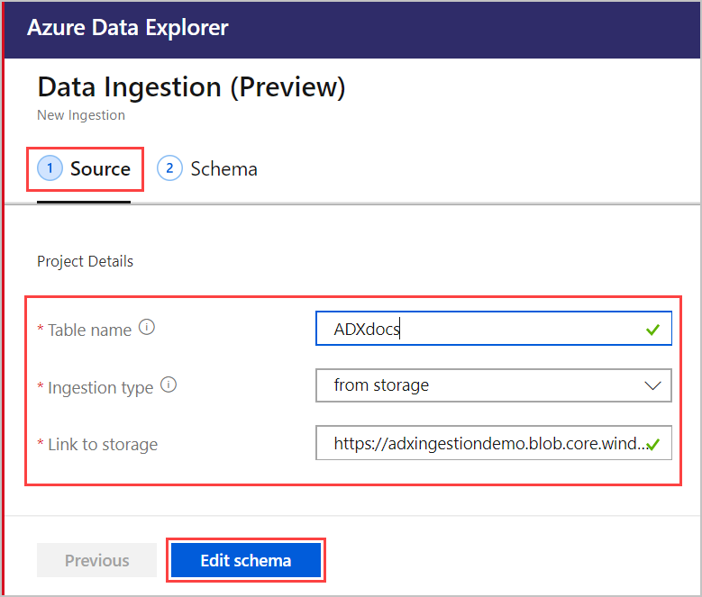
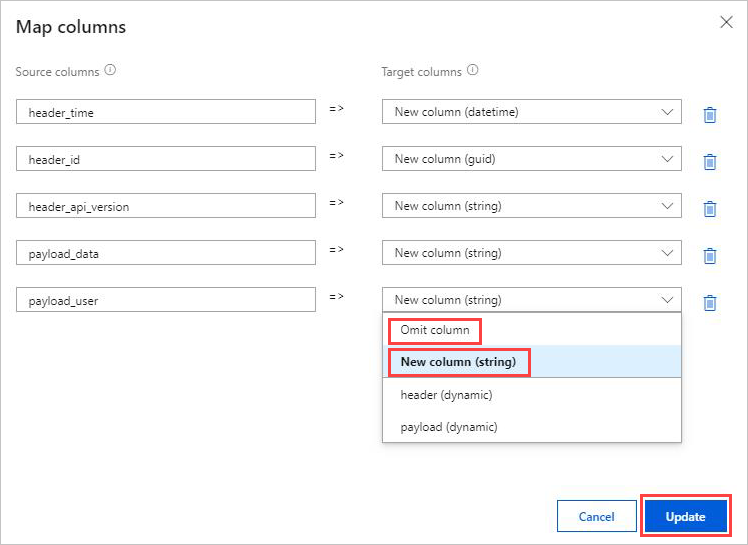
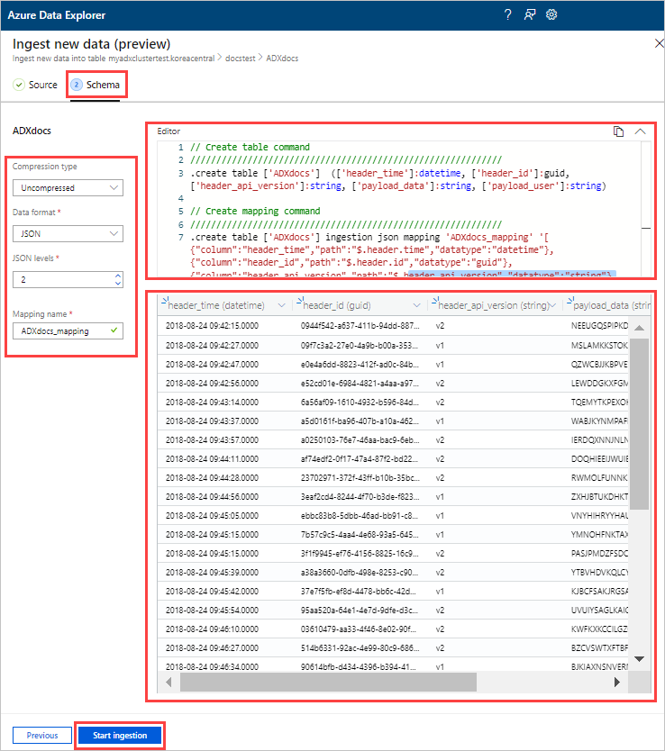
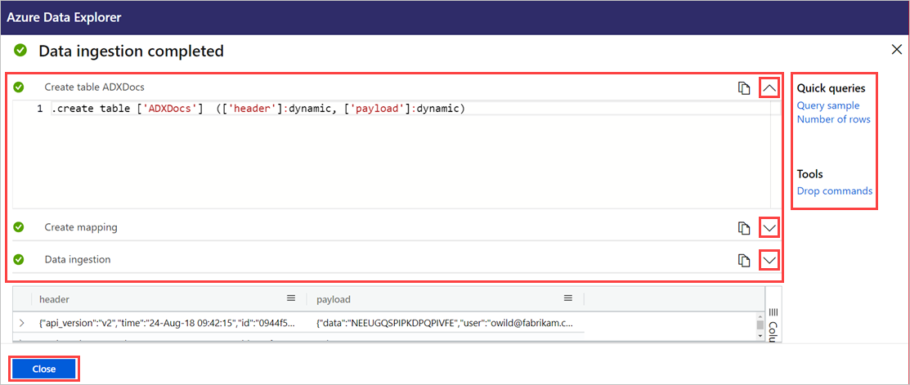

# Use one-click ingestion to ingest data into Azure Data Explorer

This article shows you how to use one-click ingestion for quick ingestion of a new table in JSON or CSV formats. The data can be ingested from storage or a local file into an existing table or a new table. Use the intuitive one-click wizard, and your data ingests within a few minutes. Then, you can edit the table and run queries by using the Azure Data Explorer Web UI.

## Prerequisites

* If you don't have an Azure subscription, create a [free Azure account](https://azure.microsoft.com/free/) before you begin.
* Sign in to [the application](https://dataexplorer.azure.com/).
* Create [an Azure Data Explorer cluster and database](create-cluster-database-portal.md).
* Sign in to the [Web UI](https://dataexplorer.azure.com/) and [add a connection to your cluster](/azure/data-explorer/web-query-data#add-clusters).

## Ingest new data

1. Right-click the *database* or *table* row in left menu of the Web UI and select **Ingest new data (Preview)**.

       
 
1. In the **Ingest new data (Preview)** window, select the **Source** tab and complete the **Project Details**:

    * For **Table**, select an existing table name from the drop-down menu or select **Create new** to make a new table.
    * For **Ingestion type**, select either **from storage** or **from file**.
      * If you selected **from storage**, select **Link to storage** to add the URL. Use [Blob SAS URL](/azure/vs-azure-tools-storage-explorer-blobs#get-the-sas-for-a-blob-container) for private storage accounts. 
      * If you selected **from file**, select **Browse** and drag the file into the box.
    * Select **Edit schema** to view and edit your table column configuration.
 
     

    > [!TIP]
    > If you select **Ingest new data (Preview)** on a *table* row, the selected table name will appear in the **Project Details**.

1. If you selected an existing table, the **Map columns** window opens to map source data columns to target table columns. 
    * Use **Omit column** to remove a target column from the table.
    * Use **New column** to add a new column to the table.

    

1. In the **Schema** tab:

    * Select **Compression type** from the drop-down menu, and then select either **Uncompressed** or **GZip**.
    * Select **Data format** from the drop-down menu, and then select **JSON**, **CSV**, **TSV**, **SCSV**, **SOHSV**, **TSVE**, or **PSV**. 
        * When you select the **JSON** format, you must also select **JSON levels**, from 1 to 10. The levels affect the table column data depiction. 
        * If you select a format other than JSON, you must select the check box **Include column names** to ignore the heading row of the file.
    * **Mapping name** is set automatically but can be edited.
    * If you selected an existing table, you can select **Map columns** to open the **Map columns** window.

    

1. Above the **Editor** pane, select the **v** button to open the editor. In the editor, you can view and copy the automatic queries generated from your inputs. 

1. In the table: 
    * Right-click new column headers to **Change data type**, **Rename column**, **Delete column**, **Sort ascending**, or **Sort descending**. On existing columns, only data sorting is available. 
    * Double-click the new column name to edit.

1. Select **Start ingestion** to create a table and mapping and to begin data ingestion.

     
 
## Query data

1. In the **Data ingestion completed** window, all three steps will be marked with green check marks if data ingestion finishes successfully.
 
    

1. Select the **v** button to open the query. Copy to the Web UI to edit the query.

1. The menu on the right contains **Quick queries** and **Tools** options. 

    * **Quick queries** includes links to the Web UI with example queries.
    * **Tools** includes a link to **Drop commands** on the Web UI, which allow you to troubleshoot issues by running the relevant `.drop` commands.

    > [!TIP]
    > You might lose data when you use `.drop` commands. Use them carefully.

## Next steps

* [Query data in Azure Data Explorer Web UI](web-query-data.md)
* [Write queries for Azure Data Explorer using Kusto Query Language](write-queries.md)
