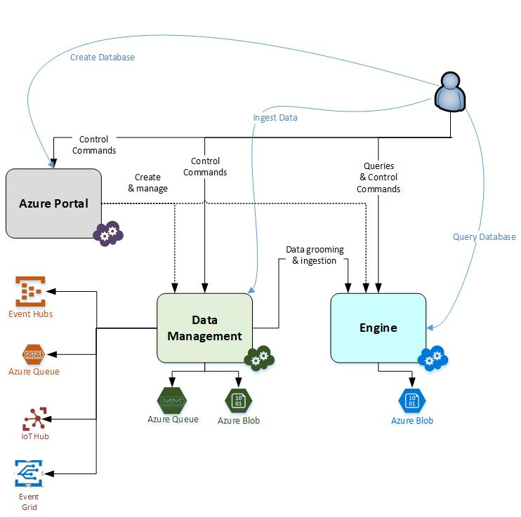

# Azure Data Explorer data ingestion

Data ingestion is the process used to load data records from one or more sources to create or update a table in Azure Data Explorer. Once ingested, the data becomes available for query. The diagram below shows the end-to-end flow for working in Azure Data Explorer, including data ingestion **(2)**.

The Azure Data Explorer data management service, which is responsible for data ingestion, provides the following functionality:

1. **Data pull**: Pull data from external sources (Event Hubs) or read ingestion requests from an Azure Queue.

1. **Batching**: Batch data flowing to the same database and table to optimize ingestion throughput.

1. **Validation**: Preliminary validation and format conversion if required.

1. **Data manipulation**: Matching schema, organizing, indexing, encoding and compressing the data.

1. **Persistence point in the ingestion flow**: Manage ingestion load on the engine and handle retries upon transient failures.

1. **Commit the data ingest**: Makes the data available for query.

> [!NOTE]
> The effective retention policy of ingested data is derived from the database's retention policy. See [retention policy](https://docs.microsoft.com/azure/kusto/concepts/retentionpolicy) for details. Ingesting data requires **Table ingestor** or **Database ingestor** permissions.

## Ingestion methods

Azure Data Explorer supports several ingestion methods, each with its own target scenarios, advantages, and disadvantages. Azure Data Explorer offers connectors to common services, programmatic ingestion using SDKs, and direct access to the engine for exploration purposes.

### Ingestion using connectors

Azure Data Explorer currently supports the Event Hub connector, which can be managed using the management wizard in the Azure portal. For more information, see [Quickstart: Ingest data from Event Hub into Azure Data Explorer](ingest-data-event-hub.md).

### Programmatic ingestion

Azure Data Explorer provides SDKs that can be used for query and data ingestion. Programmatic ingestion is optimized for reducing ingestion costs (COGs), by minimizing storage transactions during and following the ingestion process.

**Available SDKs and open source projects**:

Kusto offers client SDK that can be used to ingest and query data with :

* [Python SDK](https://docs.microsoft.com/azure/kusto/api/python/kusto-python-client-library)

* [.NET SDK](https://docs.microsoft.com/azure/kusto/api/netfx/about-the-sdk)

* [Java SDK](https://docs.microsoft.com/azure/kusto/api/java/kusto-java-client-library)

* [REST API](https://docs.microsoft.com/azure/kusto/api/netfx/kusto-ingest-client-rest)

**Programmatic ingestion techniques**:

* Ingesting data directly into the Azure Data Explorer engine (most appropriate for exploration and prototyping):

  * **Inline ingestion**: control command (.ingest inline) containing in-band data is intended for ad-hoc testing purposes.

  * **Ingest from query**: control command (.set, .set-or-append, .set-or-replace) that points to query results is used for generating reports or small temporary tables.

  * **Ingest from storage**: control command (.ingest into) with data stored externally (e.g., Azure Blob Storage) allows efficient bulk ingestion of data.

* Ingesting data through the Azure Data Explorer data management service (high-throughput and reliable ingestion)

  * [**Batch ingestion**](https://docs.microsoft.com/azure/kusto/api/netfx/kusto-ingest-queued-ingest-sample) (provided by SDK): the client uploads the data to Azure Blob storage (designated by the Azure Data Explorer data management service) and posts a notification to an Azure Queue. This is the recommended technique for high-volume, reliable, and cheap  data ingestion.

**Latency of different methods**:

| Method | Latency |
| --- | --- |
| **Inline ingestion** | Immediate |
| **Ingest from query** | Query time + processing time |
| **Ingest from storage** | Download time + processing time |
| **Queued ingestion** | Batching time + processing time |
| |

Processing time depends on the data size, usually less than a few seconds. Batching time defaults to 5 minutes.

## Choosing the most appropriate ingestion method

Before you start to ingest data, you should ask yourself the following questions.

* Where does my data reside? ​
* What is the data format, and can it be changed? ​
* What are the required fields to be queried? ​
* What is the expected data volume and velocity? ​
* How many event types are expected (reflected as the number of tables)? ​
* How often is the event schema expected to change? ​
* How many nodes will generate the data? ​
* What is the source OS? ​
* What are the latency requirements? ​
* Can one of the existing managed ingestion pipelines be used? ​

For organizations with an existing infrastructure based on a messaging service like Event Hub, using a connector is likely the most appropriate solution. Queued ingestion is appropriate for large data volumes.

## Supported data formats

For all ingestion methods other than ingest from query, the data must be formatted in one of the supported data formats so that Azure Data Explorer can parse it.

* CSV, TSV, PSV, SCSV, SOH​
* JSON (line-separated, multi-line), Avro​
* ZIP and GZIP 

> [!NOTE]
> When data is being ingested, data types are inferred based on the target table columns. If a record is incomplete or a field cannot be parsed as the required data type, the corresponding table columns will be populated with null values.

## Schema Mapping

Schema mapping helps deterministically bind source data fields to destination table columns.

* [CSV Mapping](https://docs.microsoft.com/azure/kusto/management/mappings?branch=master#csv-mapping) (optional) works with all ordinal-based formats and can be passed as the ingest command parameter or [pre-created on the table](https://docs.microsoft.com/azure/kusto/management/tables?branch=master#create-ingestion-mapping) and referenced from the ingest command parameter.
* [JSON Mapping](https://docs.microsoft.com/azure/kusto/management/mappings?branch=master#json-mapping) (mandatory) and [Avro mapping](https://docs.microsoft.com/azure/kusto/management/mappings?branch=master#avro-mapping) (mandatory) can be passed as the ingest command parameter or [pre-created on the table](https://docs.microsoft.com/azure/kusto/management/tables#create-ingestion-mapping) and referenced from the ingest command parameter.

## Next steps

[Quickstart: Ingest data from Event Hub into Azure Data Explorer](ingest-data-event-hub.md)

[Quickstart: Ingest data using the Azure Data Explorer Python library](python-ingest-data.md)

