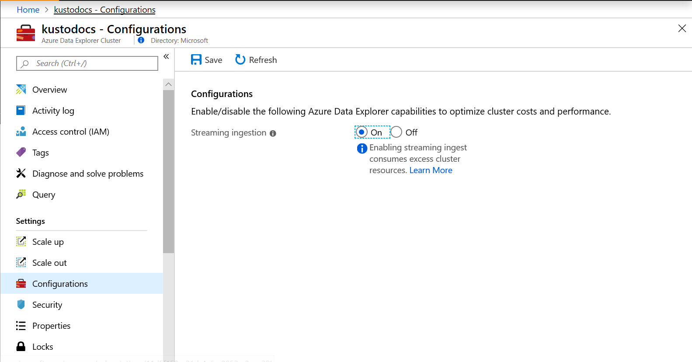
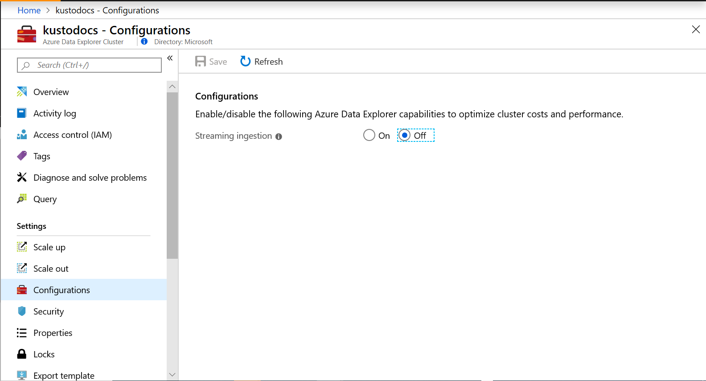

# Streaming ingestion (Preview)

Streaming ingestion is targeted for scenarios that require low latency with an ingestion time of less than 10 seconds for varied volume data. It's used for optimization of operational processing of many tables, in one or more databases where the stream of data into each table is relatively small (few records per second) but overall data ingestion volume is high (thousands of records per second).

Use the classic (bulk) ingestion instead of streaming ingestion when the amount of data grows to more than 1 MB per second per table. Read [Data ingestion overview](/azure/data-explorer/ingest-data-overview) to learn more about the various methods of ingestion.

> [!NOTE]
> Streaming ingestion doesn't support the following features:
> * [Database cursors](/azure/kusto/management/databasecursor).
> * [Data mapping](/azure/kusto/management/mappings). Only [pre-created](/azure/kusto/management/tables#create-ingestion-mapping) data mapping is supported. 

## Prerequisites

* If you don't have an Azure subscription, create a [free Azure account](https://azure.microsoft.com/free/) before you begin.
* Sign in to the [Web UI](https://dataexplorer.azure.com/).
* Create [an Azure Data Explorer cluster and database](create-cluster-database-portal.md)

## Enable streaming ingestion on your cluster

1. In the Azure portal, go to your Azure Data Explorer cluster. In **Settings**, select **Configurations**. 
1. In the **Configurations** pane, select **On** to enable **Streaming ingestion**.
1. Select **Save**.
 
    
 
1. In the [Web UI](https://dataexplorer.azure.com/), define [streaming ingestion policy](/azure/kusto/concepts/streamingingestionpolicy) on table(s) or database(s) that will receive streaming data. 

    > [!NOTE]
    > * If the policy is defined at the database level, all tables in the database are enabled for streaming ingestion.
    > * The applied policy can reference only newly ingested data and not other tables in the database.

## Use streaming ingestion to ingest data to your cluster

There are two supported streaming ingestion types:

* [Event Hub](/azure/data-explorer/ingest-data-event-hub) used as a data source
* Custom ingestion requires you to write an application that uses one of Azure Data Explorer client libraries. See [streaming ingestion sample](https://github.com/Azure/azure-kusto-samples-dotnet/tree/master/client/StreamingIngestionSample) for a sample application.

### Choose the appropriate streaming ingestion type

|   |Event Hub  |Custom Ingestion  |
|---------|---------|---------|
|Data delay between ingestion initiation and the data available for query   |    longer delay     |   shorter delay      |
|Development overhead    |   fast and easy setup, no development overhead    |   high development overhead for application to handle errors and ensure data consistency     |

## Disable streaming ingestion on your cluster

> [!WARNING]
> Disabling streaming ingestion may take a few hours.

1. Drop [streaming ingestion policy](/azure/kusto/concepts/streamingingestionpolicy) from all relevant tables and databases. The streaming ingestion policy removal triggers streaming ingestion data movement from the initial storage to the permanent storage in the column store (extents or shards). The data movement can last between a few seconds to a few hours, depending on the amount of data in the initial storage and the CPU and memory utilization of the cluster.
1. In the Azure portal, go to your Azure Data Explorer cluster. In **Settings**, select **Configurations**. 
1. In the **Configurations** pane, select **Off** to disable **Streaming ingestion**.
1. Select **Save**.

    

## Limitations

* Streaming ingestion performance and capacity scales with increased VM and cluster sizes. Concurrent ingestions are limited to 6 ingestions per core. For example, for 16 core SKUs, such as D14 and L16, the maximal supported load is 96 concurrent ingestions. For 2 core SKUs, such as D11, the maximal supported load is 12 concurrent ingestions.
* The data size limitation per ingestion request is 4 MB.
* Schema updates, such as creation and modification of tables and ingestion mappings, may take up to 5 minutes for the streaming ingestion service.
* Enabling streaming ingestion on a cluster, even when data isn't ingested via streaming, uses part of the local SSD disk of the cluster machines for streaming ingestion data and reduces the storage available for hot cache.

## Next steps

* [Query data in Azure Data Explorer](web-query-data.md)
