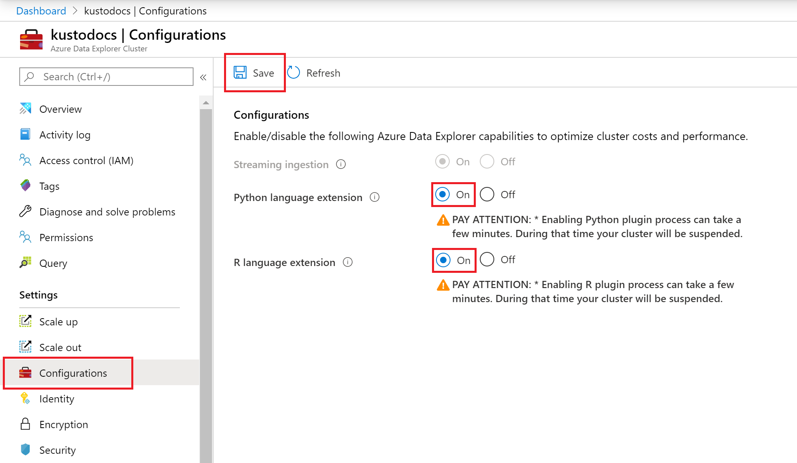
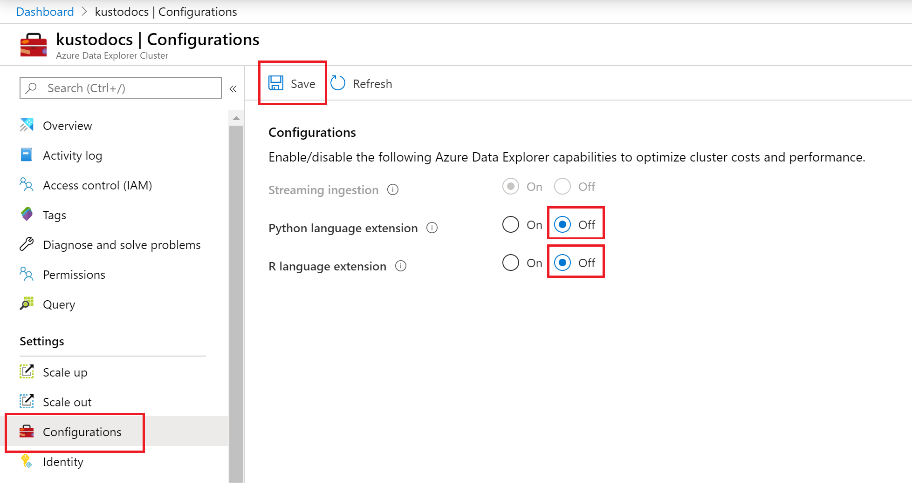

# Language extensions (Preview)

Language extensions (plugins) feature allows the user to run a user-defined-function (UDF) using a relevant script. The script gets tabular data as its input, and is expected to produce tabular output. The plugin's runtime is hosted in a sandbox, an isolated and secure environment, running on the cluster's nodes.

Azure Data Explorer language extensions which currently supported are Python and R.

## Prerequisites

* If you don't have an Azure subscription, create a [free Azure account](https://azure.microsoft.com/free/) before you begin.
* Create [an Azure Data Explorer cluster and database](create-cluster-database-portal.md)

## Enable language extensions on your cluster

> [!WARNING]
> Please review the [limitations](#limitations) prior to enabling language extension.

1. In the Azure portal, go to your Azure Data Explorer cluster. In **Settings**, select **Configurations**. 
1. In the **Configurations** pane, select **On** to enable a language extension.
1. Select **Save**.
 
    
 
## Run language extension integrated queries

Learn how to [run Python integrated KQL queries](/azure/kusto/query/pythonplugin)

Learn how to [run R integrated KQL queries](/azure/kusto/query/rplugin) 

## Disable streaming ingestion on your cluster

> [!WARNING]
> Disabling language extensions could take a few minutes.

1. In the Azure portal, go to your Azure Data Explorer cluster. In **Settings**, select **Configurations**. 
1. In the **Configurations** pane, select **Off** to disable a language extension.
1. Select **Save**.

    

## Limitations

* Language extensions feature doesn't support [Disk encryption](manage-cluster-security). 
* Language extensions runtime sandbox allocate disk space even if no query runs the scope of the relevant language.
* Enabling language extension process can take a fex minutes. During that time your cluster will be suspended.

