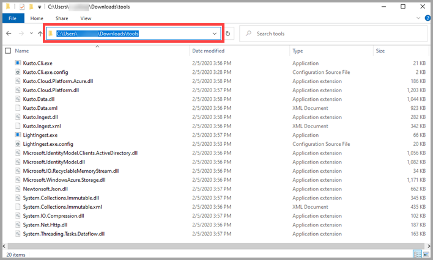

# LightIngest

LightIngest is a command-line utility for ad-hoc data ingestion into Kusto.
The utility can pull source data from a local folder or from an Azure blob storage container.

## Prerequisites

* LightIngest - download it as part of the [Microsoft.Azure.Kusto.Tools NuGet package](https://www.nuget.org/packages/Microsoft.Azure.Kusto.Tools/)
* WinRAR - download it from [www.win-rar.com/download.html](http://www.win-rar.com/download.html)

## Install LightIngest

1. Navigate to the location on your computer where you downloaded LightIngest. 
1. Using WinRAR, extract the *tools* directory to your computer.

## Run LightIngest

1. Navigate to the extracted *tools* directory on your computer.
1. Delete the existing location information from the location bar.
    
      

1. Enter `cmd` and press **Enter**.
1. At the command prompt, enter `LightIngest.exe` followed by the relevant command-line argument.

    > [!Tip]
    > For a list of supported command-line arguments, enter `LightIngest.exe /help`.
    >
    >

1. (Mandatory) Enter `LightIngest` followed by the connection string to the Kusto cluster that will manage the ingestion.
    The connection string should be enclosed in double quotes and follow the [Kusto connection strings specification](https://docs.microsoft.com/azure/kusto/api/connection-strings/kusto).

    For example:
    ```
    LightIngest "Data Source=https://ingest-tzgitlin.westus.kusto.windows.net;AAD Federated Security=True"  -db:TzviaTest -table:Trips -source:"https://tzgitlinegdemo2.blob.core.windows.net/saadxworkshop1;VXPnUFzvBRLBIqEgcA0hRnSXmq69jVyZMChgUn5BeVwhjLnx4ucHZ8RPGTZ0F2hXHnC/vesoFSMF5f4gepeTJw==" -pattern:"*.csv.gz" -format:csv -limit:2 -ignoreFirst:true -cr:10.0 -dontWait:true
    ```

> [!Note]
> * It's recommended to configure `LightIngest` to work with the ingestion endpoint at `https://ingest-{yourClusterNameAndRegion}.kusto.windows.net`. This way the Kusto service can manage the ingestion load, and it provides for recovery in case of transient errors. However, you can also configure `LightIngest` to work directly with the engine endpoint (`https://{yourClusterNameAndRegion}.kusto.windows.net`).
> * Knowing the raw data size is important for optimal ingestion performance. `LightIngest` will estimate the uncompressed size of local files. However, for compressed blobs, `LightIngest` could have difficulties correctly estimating their raw size without first downloading them. When ingesting compressed blobs, it will be helpful for `LightIngest` performance if you set the `rawSizeBytes` property on the blob metadata to uncompressed data size in bytes.

## Command line arguments reference

|Argument name         |Short name   |Type    |Mandatory |Description                                |
|----------------------|-------------|--------|----------|-------------------------------------------|
|                      |             |string  |Mandatory |[Kusto Connection String](https://docs.microsoft.com/azure/kusto/api/connection-strings/kusto) specifying the Kusto endpoint that will handle the ingestion. Should be enclosed in double quotes |
|-database             |-db          |string  |Optional  |Target Kusto database name |
|-table                |             |string  |Mandatory |Target Kusto table name |
|-sourcePath           |-source      |string  |Mandatory |Path to source files or root URI of the blob container. If the data is in blobs, must contain storage account key or SAS. Recommended to enclose in double quotes |
|-prefix               |             |string  |Optional  |When the source data to ingest resides on blob storage, this URL prefix is shared by all blobs, excluding the container name. For example, if the data is in `MyContainer/Dir1/Dir2`, then the prefix should be `Dir1/Dir2`. Enclosing in double quotes is recommended |
|-pattern              |             |string  |Optional  |Pattern by which source files/blobs are picked. Supports wildcards. For example, `"*.csv"`. Recommended to enclose in double quotes |
|-format               |-f           |string  |Optional  |Source data format. Must be one of the [supported formats](https://docs.microsoft.com/azure/kusto/management/data-ingestion/#supported-data-formats) |
|-ingestionMappingPath |-mappingPath |string  |Optional  |Path to ingestion column-mapping file (mandatory for Json and Avro formats). See [data mappings](https://docs.microsoft.com/azure/kusto/management/mappings) |
|-ingestionMappingRef  |-mappingRef  |string  |Optional  |Name of a pre-created ingestion column mapping (mandatory for Json and Avro formats). See [data mappings](https://docs.microsoft.com/azure/kusto/management/mappings) |
|-ignoreFirstRow       |-ignoreFirst |bool    |Optional  |If set, the first record of each file/blob is ignored (for example, if the source data has headers) |
|-tag                  |             |string  |Optional  |[Tags](https://docs.microsoft.com/azure/kusto/management/extents-overview#extent-tagging) to associate with the ingested data. Multiple occurrences are permitted |
|-dontWait             |             |bool    |Optional  |If set to 'true', does not wait for ingestion completion. Useful when ingesting large amounts of files/blobs |

### Additional arguments for advanced scenarios

|Argument name         |Short name   |Type    |Mandatory |Description                                |
|----------------------|-------------|--------|----------|-------------------------------------------|
|-compression          |-cr          |double  |Optional  |Compression ratio hint. Useful when ingesting compressed files/blobs to help Kusto assess the raw data size. Calculated as original size divided by compressed size |
|-limit                |-l           |integer |Optional  |If set, limits the ingestion to first N files |
|-ingestTimeout        |             |integer |Optional  |Timeout in minutes for all ingest operations completion. Defaults to `60`|
|-forceSync            |             |bool    |Optional  |If set, forces synchronous ingestion. Defaults to `false` |
|-dataBatchSize        |             |integer |Optional  |Sets the total size limit (MB, uncompressed) of each ingest operation |
|-filesInBatch         |             |integer |Optional  |Sets the file/blob count limit of each ingest operation |
|-devTracing           |-trace       |string  |Optional  |If set, diagnostic logs are written to a local directory (by default, `RollingLogs` in the current directory, or can be modified by setting the switch value) |

## Usage examples

**Example 1**

* Ingest two blobs under a specified storage account {Account}, files of `CSV` format matching the pattern `.csv.gz`.
* Destination is the database {Database}, the table `Trips`, ignoring the first record
* Data will be ingested at a compression ratio of 10.0
* LightIngest won't wait for the ingestion to be completed

To use the LightIngest command, below:
1. Create a table command.
1. Create a mapping command.
1. Copy the cluster name and paste it into the LightIngest command {Cluster Name and Region}.
1. Enter the database name into the LightIngest command {Database}.
1. Enter the table name into the LightIngest command.

```
LightIngest "Data Source=https://ingest-{Cluster Name and Region}.kusto.windows.net;AAD Federated Security=True"  
    -db:{Database}
    -table:Trips
    -source:"https://{Account}.blob.core.windows.net/saadxworkshop1;VXPnUFzvBRLBIqEgcA0hRnSXmq69jVyZMChgUn5BeVwhjLnx4ucHZ8RPGTZ0F2hXHnC/vesoFSMF5f4gepeTJw==" 
    -pattern:"*.csv.gz" 
    -format:csv 
    -limit:2 
    -ignoreFirst:true 
    -cr:10.0 
    -dontWait:true
```

**Example 2**
* Ingest 10 blobs under specified storage account `ACCOUNT`, in folder `DIR`, under container `CONT`, and matching the pattern `*.csv.gz`
* Destination is database `DB`, table `TABLE`, and the ingestion mapping `MAPPING` is precreated on the destination
* The tool will wait until the ingest operations complete
* Note the different options for specifying the target database and storage account key vs. SAS token

```
LightIngest.exe "https://ingest-{clusterAndRegion}.kusto.windows.net;Fed=True"
  -database:DB
  -table:TABLE
  -source:"https://ACCOUNT.blob.core.windows.net/{ROOT_CONTAINER};{StorageAccountKey}"
  -prefix:"DIR"
  -pattern:*.csv.gz
  -format:csv
  -mappingRef:MAPPING
  -limit:10

LightIngest.exe "https://ingest-{clusterAndRegion}.kusto.windows.net;Fed=True;Initial Catalog=DB"
  -table:TABLE
  -source:"https://ACCOUNT.blob.core.windows.net/{ROOT_CONTAINER}?{SAS token}"
  -prefix:"DIR"
  -pattern:*.csv.gz
  -format:csv
  -mappingRef:MAPPING
  -limit:10
```

**Example 3**
* Ingest all blobs under specified storage account `ACCOUNT`, in folder `DIR1/DIR2`, under container `CONT`, and matching the pattern `*.csv.gz`
* Destination is database `DB`, table `TABLE`, and the ingestion mapping `MAPPING` is precreated on the destination
* Source blobs contain header line, so the tool is instructed to drop the first record of each blob
* The tool will post the data for ingestion and won't wait for the ingest operations to complete

```
LightIngest.exe "https://ingest-{clusterAndRegion}.kusto.windows.net;Fed=True"
  -database:DB
  -table:TABLE
  -source:"https://ACCOUNT.blob.core.windows.net/{ROOT_CONTAINER}?{SAS token}"
  -prefix:"DIR1/DIR2"
  -pattern:*.csv.gz
  -format:csv
  -mappingRef:MAPPING
  -ignoreFirstRow:true
```

**Example 4**
* Ingest all files under path `PATH`, matching the pattern `*.json`
* Destination is database `DB`, table `TABLE`, and the ingestion mapping is defined in local file `MAPPING_FILE_PATH`
* The tool will post the data for ingestion and won't wait for the ingest operations to complete

```
LightIngest.exe "https://ingest-{clusterAndRegion}.kusto.windows.net;Fed=True"
  -database:DB
  -table:TABLE
  -source:"PATH"
  -pattern:*.json
  -format:json
  -mappingPath:"MAPPING_FILE_PATH"
```

**Example 5**
* Ingest all files under path `PATH`, matching the pattern `*.json`
* Destination is database `DB`, table `TABLE`, and the ingestion mapping is defined in local file `MAPPING_FILE_PATH`
* The tool will post the data for ingestion and won't wait for the ingest operations to complete
* Diagnostics trace files will be written locally under folder `LOGS_PATH`

```
LightIngest.exe "https://ingest-{clusterAndRegion}.kusto.windows.net;Fed=True"
  -database:DB
  -table:TABLE
  -source:"PATH"
  -pattern:*.json
  -format:json
  -mappingPath:"MAPPING_FILE_PATH"
  -trace:"LOGS_PATH"
```
