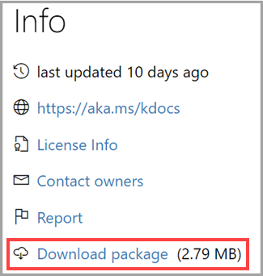
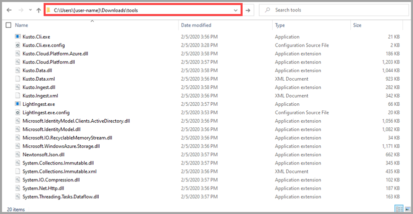
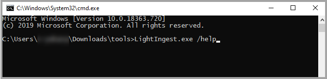

# Install and use LightIngest

LightIngest is a command-line utility for ad-hoc data ingestion into Azure Data Explorer.
The utility can pull source data from a local folder or from an Azure blob storage container.

## Prerequisites

* LightIngest - download it as part of the [Microsoft.Azure.Kusto.Tools NuGet package](https://www.nuget.org/packages/Microsoft.Azure.Kusto.Tools/)

    

* WinRAR - download it from [www.win-rar.com/download.html](http://www.win-rar.com/download.html)

## Install LightIngest

1. Navigate to the location on your computer where you downloaded LightIngest. 
1. Using WinRAR, extract the *tools* directory to your computer.

## Run LightIngest

1. Navigate to the extracted *tools* directory on your computer.
1. Delete the existing location information from the location bar.
    
      

1. Enter `cmd` and press **Enter**.
1. At the command prompt, enter `LightIngest.exe` followed by the relevant command-line argument.

    > [!Tip]
    > For a list of supported command-line arguments, enter `LightIngest.exe /help`.
    >
    >

1. Enter `ingest-` followed by the connection string to the Azure Data Explorer cluster that will manage the ingestion.
    Enclose the connection string in double quotes and follow the [Kusto connection strings specification](https://docs.microsoft.com/azure/kusto/api/connection-strings/kusto).

    For example:
    ```
    ingest-{Cluster name and region}.kusto.windows.net;AAD Federated Security=True -db:{Database} -table:Trips -source:"https://{Account}.blob.core.windows.net/{ROOT_CONTAINER};{StorageAccountKey}" -pattern:"*.csv.gz" -format:csv -limit:2 -ignoreFirst:true -cr:10.0 -dontWait:true
    ```

* The recommended method is for LightIngest to work with the ingestion endpoint at `https://ingest-{yourClusterNameAndRegion}.kusto.windows.net`. This way, the Azure Data Explorer service can manage the ingestion load, and you can easily recover from transient errors. However, you can also configure LightIngest to work directly with the engine endpoint (`https://{yourClusterNameAndRegion}.kusto.windows.net`).

> [!Note]
> If you ingest directly with the engine endpoint, you don't need to include `ingest-`, but there won't be a DM feature to protect the engine and improve the ingestion success rate.

* For optimal ingestion performance, it's important for LightIngest to know the raw data size and so LightIngest will estimate the uncompressed size of local files. However, LightIngest might not be able to correctly estimate the raw size of compressed blobs without first downloading them. Therefore, when ingesting compressed blobs, set the `rawSizeBytes` property on the blob metadata to uncompressed data size in bytes.

## General command-line arguments

|Argument name         |Short name   |Type    |Mandatory |Description                                |
|----------------------|-------------|--------|----------|-------------------------------------------|
|                      |             |string  |Mandatory |[Azure Data Explorer Connection String](https://docs.microsoft.com/azure/kusto/api/connection-strings/kusto) specifying the Kusto endpoint that will handle the ingestion. Should be enclosed in double quotes |
|-database             |-db          |string  |Optional  |Target Azure Data Explorer database name |
|-table                |             |string  |Mandatory |Target Azure Data Explorer table name |
|-sourcePath           |-source      |string  |Mandatory |Path to source files or root URI of the blob container. If the data is in blobs, must contain storage account key or SAS. Recommended to enclose in double quotes |
|-prefix               |             |string  |Optional  |When the source data to ingest resides on blob storage, this URL prefix is shared by all blobs, excluding the container name. <br>For example, if the data is in `MyContainer/Dir1/Dir2`, then the prefix should be `Dir1/Dir2`. Enclosing in double quotes is recommended |
|-pattern              |             |string  |Optional  |Pattern by which source files/blobs are picked. Supports wildcards. For example, `"*.csv"`. Recommended to enclose in double quotes |
|-zipPattern           |             |string  |Optional  |Regular expression to use when selecting which files in a ZIP archive to ingest.<br>All other files in the archive will be ignored.For example, `"*.csv"`. It's recommended to surround it in double quotes |
|-format               |-f           |string  |Optional  |Source data format. Must be one of the [supported formats](https://docs.microsoft.com/azure/data-explorer/ingestion-supported-formats) |
|-ingestionMappingPath |-mappingPath |string  |Optional  |Path to ingestion column-mapping file (mandatory for Json and Avro formats). See [data mappings](https://docs.microsoft.com/azure/kusto/management/mappings) |
|-ingestionMappingRef  |-mappingRef  |string  |Optional  |Name of a pre-created ingestion column mapping (mandatory for Json and Avro formats). See [data mappings](https://docs.microsoft.com/azure/kusto/management/mappings) |
|-creationTimePattern  |             |string  |Optional  |When set, is used to extract the CreationTime property from the file or blob path. See [Using CreationTimePattern argument](#using-creationtimepattern-argument) |
|-ignoreFirstRow       |-ignoreFirst |bool    |Optional  |If set, the first record of each file/blob is ignored (for example, if the source data has headers) |
|-tag                  |             |string  |Optional  |[Tags](https://docs.microsoft.com/azure/kusto/management/extents-overview#extent-tagging) to associate with the ingested data. Multiple occurrences are permitted |
|-dontWait             |             |bool    |Optional  |If set to 'true', doesn't wait for ingestion completion. Useful when ingesting large amounts of files/blobs |

### Using CreationTimePattern argument

The `-creationTimePattern` argument extracts the CreationTime property from the file or blob path. The pattern doesn't need to reflect the entire item path, just the section enclosing the timestamp you want to use.

The argument values must include:
* Constant test immediately preceding the timestamp, enclosed in single quotes
* The timestamp format, in standard [.NET DateTime notation](https://docs.microsoft.com/dotnet/standard/base-types/custom-date-and-time-format-strings)
* Constant text immediately following the timestamp. For example, if blob names end with `historicalvalues19840101.parquet` (the timestamp is four digits for the year, two digits for the month, and two digits for the day of month), the corresponding value for the `-creationTimePattern` argument is:

```
ingest-{Cluster name and region}.kusto.windows.net;AAD Federated Security=True -db:{Database} -table:Trips -source:"https://{Account}.blob.core.windows.net/{ROOT_CONTAINER};{StorageAccountKey}" -creationTimePattern:"'historicalvalues'yyyyMMdd'.parquet'"
 -pattern:"*.csv.gz" -format:csv -limit:2 -ignoreFirst:true -cr:10.0 -dontWait:true
```

### Command-line arguments for advanced scenarios

|Argument name         |Short name   |Type    |Mandatory |Description                                |
|----------------------|-------------|--------|----------|-------------------------------------------|
|-compression          |-cr          |double  |Optional  |Compression ratio hint. Useful when ingesting compressed files/blobs to help Azure Data Explorer assess the raw data size. Calculated as original size divided by compressed size |
|-limit                |-l           |integer |Optional  |If set, limits the ingestion to first N files |
|-listOnly             |-list        |bool    |Optional  |If set, only displays the items that would have been selected for ingestion| 
|-ingestTimeout        |             |integer |Optional  |Timeout in minutes for all ingest operations completion. Defaults to `60`|
|-forceSync            |             |bool    |Optional  |If set, forces synchronous ingestion. Defaults to `false` |
|-dataBatchSize        |             |integer |Optional  |Sets the total size limit (MB, uncompressed) of each ingest operation |
|-filesInBatch         |             |integer |Optional  |Sets the file/blob count limit of each ingest operation |
|-devTracing           |-trace       |string  |Optional  |If set, diagnostic logs are written to a local directory (by default, `RollingLogs` in the current directory, or can be modified by setting the switch value) |

## Blob metadata properties
When used with Azure blobs, LightIngest will use certain blob metadata properties to augment the ingestion process.

|Metadata property                            | Usage                                                                           |
|---------------------------------------------|---------------------------------------------------------------------------------|
|`rawSizeBytes`, `kustoUncompressedSizeBytes` | If set, will be interpreted as the uncompressed data size                       |
|`kustoCreationTime`, `kustoCreationTimeUtc`  | Interpreted as UTC timestamp. If set, will be used to override the creation time in Kusto. Useful for backfilling scenarios |

## Usage examples

<!-- Waiting for Tzvia or Vladik to rewrite the instructions for this example before publishing it

### Ingesting a specific number of blobs in JSON format

* Ingest two blobs under a specified storage account {Account}, in `JSON` format matching the pattern `.json`
* Destination is the database {Database}, the table `SampleData`
* Indicate that your data is compressed with the approximate ratio of 10.0
* LightIngest won't wait for the ingestion to be completed

To use the LightIngest command below:
1. Create a table command and enter the table name into the LightIngest command, replacing `SampleData`.
1. Create a mapping command and enter the IngestionMappingRef command, replacing `SampleData_mapping`.
1. Copy your cluster name and enter it into the LightIngest command, replacing `{ClusterandRegion}`.
1. Enter the database name into the LightIngest command, replacing `{Database name}`.
1. Replace `{Account}` with your account name and replace `{ROOT_CONTAINER}?{SAS token}` with the appropriate information.

    ```
    LightIngest.exe "https://ingest-{ClusterAndRegion}.kusto.windows.net;Fed=True"  
        -db:{Database name} 
        -table:SampleData 
        -source:"https://{Account}.blob.core.windows.net/{ROOT_CONTAINER}?{SAS token}" 
        -IngestionMappingRef:SampleData_mapping 
        -pattern:"*.json" 
        -format:JSON 
        -limit:2 
        -cr:10.0 
        -dontWait:true
    ```
     
1. In Azure Data Explorer, open query count.

    
-->

### Ingesting blobs using a storage account key or a SAS token

* Ingest 10 blobs under specified storage account `ACCOUNT`, in folder `DIR`, under container `CONT`, and matching the pattern `*.csv.gz`
* Destination is database `DB`, table `TABLE`, and the ingestion mapping `MAPPING` is precreated on the destination
* The tool will wait until the ingest operations complete
* Note the different options for specifying the target database and storage account key vs. SAS token

```
LightIngest.exe "https://ingest-{ClusterAndRegion}.kusto.windows.net;Fed=True"
  -database:DB
  -table:TABLE
  -source:"https://ACCOUNT.blob.core.windows.net/{ROOT_CONTAINER};{StorageAccountKey}"
  -prefix:"DIR"
  -pattern:*.csv.gz
  -format:csv
  -mappingRef:MAPPING
  -limit:10

LightIngest.exe "https://ingest-{ClusterAndRegion}.kusto.windows.net;Fed=True;Initial Catalog=DB"
  -table:TABLE
  -source:"https://ACCOUNT.blob.core.windows.net/{ROOT_CONTAINER}?{SAS token}"
  -prefix:"DIR"
  -pattern:*.csv.gz
  -format:csv
  -mappingRef:MAPPING
  -limit:10
```

### Ingesting all blobs in a container, not including header rows

* Ingest all blobs under specified storage account `ACCOUNT`, in folder `DIR1/DIR2`, under container `CONT`, and matching the pattern `*.csv.gz`
* Destination is database `DB`, table `TABLE`, and the ingestion mapping `MAPPING` is precreated on the destination
* Source blobs contain header line, so the tool is instructed to drop the first record of each blob
* The tool will post the data for ingestion and won't wait for the ingest operations to complete

```
LightIngest.exe "https://ingest-{ClusterAndRegion}.kusto.windows.net;Fed=True"
  -database:DB
  -table:TABLE
  -source:"https://ACCOUNT.blob.core.windows.net/{ROOT_CONTAINER}?{SAS token}"
  -prefix:"DIR1/DIR2"
  -pattern:*.csv.gz
  -format:csv
  -mappingRef:MAPPING
  -ignoreFirstRow:true
```

### Ingesting all JSON files from a path

* Ingest all files under path `PATH`, matching the pattern `*.json`
* Destination is database `DB`, table `TABLE`, and the ingestion mapping is defined in local file `MAPPING_FILE_PATH`
* The tool will post the data for ingestion and won't wait for the ingest operations to complete

```
LightIngest.exe "https://ingest-{ClusterAndRegion}.kusto.windows.net;Fed=True"
  -database:DB
  -table:TABLE
  -source:"PATH"
  -pattern:*.json
  -format:json
  -mappingPath:"MAPPING_FILE_PATH"
```

### Ingesting files and writing diagnostic trace files

* Ingest all files under path `PATH`, matching the pattern `*.json`
* Destination is database `DB`, table `TABLE`, and the ingestion mapping is defined in local file `MAPPING_FILE_PATH`
* The tool will post the data for ingestion and won't wait for the ingest operations to complete
* Diagnostics trace files will be written locally under folder `LOGS_PATH`

```
LightIngest.exe "https://ingest-{ClusterAndRegion}.kusto.windows.net;Fed=True"
  -database:DB
  -table:TABLE
  -source:"PATH"
  -pattern:*.json
  -format:json
  -mappingPath:"MAPPING_FILE_PATH"
  -trace:"LOGS_PATH"
```
## Changelog
|Version        |Changes                                                                             |
|---------------|------------------------------------------------------------------------------------|
|4.0.9.0        |<ul><li>Added `-zipPattern` argument</li><li>Added `-listOnly` argument</li><li>Arguments summary is displayed before run is commenced</li><li>CreationTime is read from blob metadata properties or from blob or file name, according to the `-creationTimePattern` argument</li></ul>|
