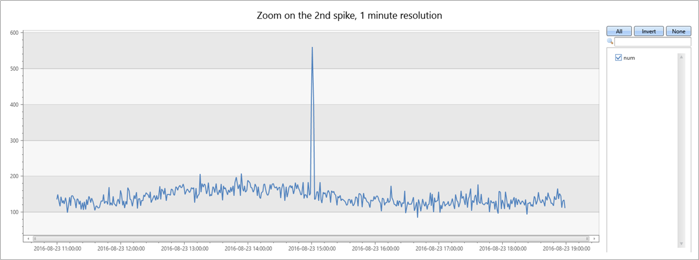
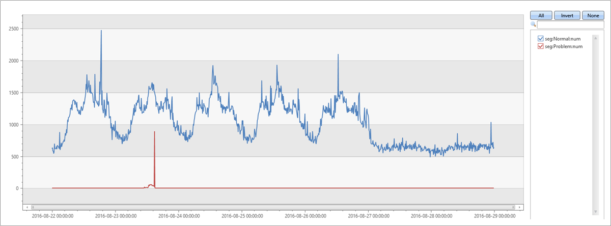

# Machine learning clustering in Azure Data Explorer

Azure Data Explorer is a Big Data analytics platform that is commonly used to collect telemetry data from cloud services or IoT devices. A common use case for ADX (as well as for other Big Data systems) is to monitor service health, QoS or malfunctioning devices for anomalous behavior. This can be done in ADX using Time Series Anomaly Detection, as described here (add link to the doc). Once an anomalous pattern is detected, it needs to be investigated in order to first verify it’s a true anomaly, then further  diagnose it for the root cause (a process called RCA, Root Cause Analysis) and mitigate/resolve it. This diagnosis process is quite complex & lengthy and usually done by domain experts. It involves fetching and joining additional data from different sources for the same time frame, look for changes in the distribution of values on multiple dimensions, charting additional variables and other techniques based on domain knowledge and intuition. Fortunately, this process can be partially automated by Machine Learning algorithms & techniques. As this diagnosis scenarios are very common among ADX usage patterns, we developed few ML plugins that facilitate the diagnosis phase and significantly shorten the duration of the RCA. Currently there are three plugins: [autocluster](/azure/kusto/query/autoclusterplugin), [basket](/azure/kusto/query/basketplugin) and [diffpatterns](/azure/kusto/query/diffpatternsplugin).  All plugins implement clustering algorithms, where autocluster & basket clusterize a single record set vs. diffpatterns that clusterize differences among two record sets, as described below.

## Clustering a single record set

In many common scenarios we have a data set selected by some criteria (e.g. time window manifests some anomalous behavior, high temperature device readings, long duration commands, top spending users etc.) and we would like a simple and fast way to find common patterns (a.k.a. segments) in this data set. To clarify, a pattern in this context means a subset of the record set whose records share the same values over multiple dimensions (i.e. categorical columns). In the following example the chart represents a time series of service exceptions: //  Build a time series of exception over the week in 10m bins

```kusto
let min_t = toscalar(demo_clustering1 | summarize min(PreciseTimeStamp));  
let max_t = toscalar(demo_clustering1 | summarize max(PreciseTimeStamp));  
demo_clustering1
| make-series num=count() on PreciseTimeStamp from min_t to max_t step 10m
| render timechart with(title="Service exceptions over a week, 10 minutes resolution")
```


The exceptions count correlates with the overall service traffic - we can clearly see the daily pattern, where there is rises in exception counts during mid-days and drops over nights for the business days (Monday to Friday), followed by flat low counts over the weekend. However, there are few exception spikes (that could have been detected by ADX time series anomaly detection), and for this example we shall further diagnose the 2nd spike that occurs on Tuesday afternoon.
The first step is to redraw the chart around the spike in higher resolution to verify whether it’s a spike and if so,view its borders: //  Focus on the 2nd spike, redraw 8 hours in 1m bins

```kusto
let min_t=datetime(2016-08-23 11:00);
demo_clustering1
| make-series num=count() on PreciseTimeStamp from min_t to min_t+8h step 1m
| render timechart with(title="Zoom on the 2nd spike, 1 minute resolution")
```



We can see it’s indeed a narrow 2 minutes spike from 15:00 to 15:02.
The next logical step would be to count and view the exceptions in these 2 minutes window:
Counting how many exceptions

```kusto
let min_peak_t=datetime(2016-08-23 15:00);
let max_peak_t=datetime(2016-08-23 15:02);
demo_clustering1
| where PreciseTimeStamp between(min_peak_t..max_peak_t)
| count
```

|Count |
|---------|
|972    |

Sampling 20 exceptions:

```kusto
let min_peak_t=datetime(2016-08-23 15:00);
let max_peak_t=datetime(2016-08-23 15:02);
demo_clustering1
| where PreciseTimeStamp between(min_peak_t..max_peak_t)
| take 20
```

| PreciseTimeStamp            | Region | ScaleUnit | DeploymentId                     | Tracepoint | ServiceHost                          |
|-----------------------------|--------|-----------|----------------------------------|------------|--------------------------------------|
| 2016-08-23 15:00:08.7302460 | scus   | su5       | 9dbd1b161d5b4779a73cf19a7836ebd6 | 100005     | 00000000-0000-0000-0000-000000000000 |
| 2016-08-23 15:00:09.9496584 | scus   | su5       | 9dbd1b161d5b4779a73cf19a7836ebd6 | 10007006   | 8d257da1-7a1c-44f5-9acd-f9e02ff507fd |
| 2016-08-23 15:00:10.5911748 | scus   | su5       | 9dbd1b161d5b4779a73cf19a7836ebd6 | 100005     | 00000000-0000-0000-0000-000000000000 |
| 2016-08-23 15:00:12.2957912 | scus   | su5       | 9dbd1b161d5b4779a73cf19a7836ebd6 | 10007007   | f855fcef-ebfe-405d-aaf8-9c5e2e43d862 |
| 2016-08-23 15:00:18.5955357 | scus   | su5       | 9dbd1b161d5b4779a73cf19a7836ebd6 | 10007006   | 9d390e07-417d-42eb-bebd-793965189a28 |
| 2016-08-23 15:00:20.7444854 | scus   | su5       | 9dbd1b161d5b4779a73cf19a7836ebd6 | 10007006   | 6e54c1c8-42d3-4e4e-8b79-9bb076ca71f1 |
| 2016-08-23 15:00:23.8694999 | eus2   | su2       | 89e2f62a73bb4efd8f545aeae40d7e51 | 36109      | 19422243-19b9-4d85-9ca6-bc961861d287 |
| 2016-08-23 15:00:26.4271786 | ncus   | su1       | e24ef436e02b4823ac5d5b1465a9401e | 36109      | 3271bae4-1c5b-4f73-98ef-cc117e9be914 |
| 2016-08-23 15:00:27.8958124 | scus   | su3       | 90d3d2fc7ecc430c9621ece335651a01 | 904498     | 8cf38575-fca9-48ca-bd7c-21196f6d6765 |
| 2016-08-23 15:00:32.9884969 | scus   | su3       | 90d3d2fc7ecc430c9621ece335651a01 | 10007007   | d5c7c825-9d46-4ab7-a0c1-8e2ac1d83ddb |
| 2016-08-23 15:00:34.5061623 | scus   | su5       | 9dbd1b161d5b4779a73cf19a7836ebd6 | 1002110    | 55a71811-5ec4-497a-a058-140fb0d611ad |
| 2016-08-23 15:00:37.4490273 | scus   | su3       | 90d3d2fc7ecc430c9621ece335651a01 | 10007006   | f2ee8254-173c-477d-a1de-4902150ea50d |
| 2016-08-23 15:00:41.2431223 | scus   | su3       | 90d3d2fc7ecc430c9621ece335651a01 | 103200     | 8cf38575-fca9-48ca-bd7c-21196f6d6765 |
| 2016-08-23 15:00:47.2983975 | ncus   | su1       | e24ef436e02b4823ac5d5b1465a9401e | 423690590  | 00000000-0000-0000-0000-000000000000 |
| 2016-08-23 15:00:50.5932834 | scus   | su5       | 9dbd1b161d5b4779a73cf19a7836ebd6 | 10007006   | 2a41b552-aa19-4987-8cdd-410a3af016ac |
| 2016-08-23 15:00:50.8259021 | scus   | su5       | 9dbd1b161d5b4779a73cf19a7836ebd6 | 1002110    | 0d56b8e3-470d-4213-91da-97405f8d005e |
| 2016-08-23 15:00:53.2490731 | scus   | su5       | 9dbd1b161d5b4779a73cf19a7836ebd6 | 36109      | 55a71811-5ec4-497a-a058-140fb0d611ad |
| 2016-08-23 15:00:57.0000946 | eus2   | su2       | 89e2f62a73bb4efd8f545aeae40d7e51 | 64038      | cb55739e-4afe-46a3-970f-1b49d8ee7564 |
| 2016-08-23 15:00:58.2222707 | scus   | su5       | 9dbd1b161d5b4779a73cf19a7836ebd6 | 10007007   | 8215dcf6-2de0-42bd-9c90-181c70486c9c |
| 2016-08-23 15:00:59.9382620 | scus   | su3       | 90d3d2fc7ecc430c9621ece335651a01 | 10007006   | 451e3c4c-0808-4566-a64d-84d85cf30978 |

### Use `autocluster()` for single record set clustering

We can see that even though we have less than thousand exceptions, it’s hard to find common segments, as there are multiple values in each column. Now it’s the time to call our [`autocluster()`](/azure/kusto/query/autoclusterplugin) plugin that will instantly extract small list of common segments: //  autocluster() to find interesting clusters during the 2 minutes of the spike

```kusto
let min_peak_t=datetime(2016-08-23 15:00);
let max_peak_t=datetime(2016-08-23 15:02);
demo_clustering1
| where PreciseTimeStamp between(min_peak_t..max_peak_t)
| evaluate autocluster()
```

| SegmentId | Count | Percent | Region | ScaleUnit | DeploymentId | ServiceHost |
|-----------|-------|------------------|--------|-----------|----------------------------------|--------------------------------------|
| 0 | 639 | 65.7407407407407 | eau | su7 | b5d1d4df547d4a04ac15885617edba57 | e7f60c5d-4944-42b3-922a-92e98a8e7dec |
| 1 | 94 | 9.67078189300411 | scus | su5 | 9dbd1b161d5b4779a73cf19a7836ebd6 |  |
| 2 | 82 | 8.43621399176955 | ncus | su1 | e24ef436e02b4823ac5d5b1465a9401e |  |
| 3 | 68 | 6.99588477366255 | scus | su3 | 90d3d2fc7ecc430c9621ece335651a01 |  |
| 4 | 55 | 5.65843621399177 | weu | su4 | be1d6d7ac9574cbc9a22cb8ee20f16fc |  |

We can see that the most dominant segment contains 65.74% of the total exception records and share 4 dimensions. The next segment is much less common and contains only 9.67% of the records sharing 3 dimensions, and the other segments are even less common. Autocluster uses a proprietary algorithm for mining on multiple dimensions and extracting “interesting” segments; “interesting” in this context means that each segment has significant coverage of both the records set and the features set, and also they are diverged (i.e. each one is different from the others). There is good chance that one or more segments would be relevant for the RCA process, 

### Use `basket()` for single record set clustering

and as our ultimate goal is to save the user time for diagnosis, autocluster extract only a small list of segments so the user won’t have to spend long time just reviewing and assessing all segments.
Alternatively we can call [`basket()`](/azure/kusto/query/basketplugin) plugin: //  alternatively using basket()

```kusto
let min_peak_t=datetime(2016-08-23 15:00);
let max_peak_t=datetime(2016-08-23 15:02);
demo_clustering1
| where PreciseTimeStamp between(min_peak_t..max_peak_t)
| evaluate basket()
```

| SegmentId | Count | Percent | Region | ScaleUnit | DeploymentId | Tracepoint | ServiceHost |
|-----------|-------|------------------|--------|-----------|----------------------------------|------------|--------------------------------------|
| 0 | 639 | 65.7407407407407 | eau | su7 | b5d1d4df547d4a04ac15885617edba57 |  | e7f60c5d-4944-42b3-922a-92e98a8e7dec |
| 1 | 642 | 66.0493827160494 | eau | su7 | b5d1d4df547d4a04ac15885617edba57 |  |  |
| 2 | 324 | 33.3333333333333 | eau | su7 | b5d1d4df547d4a04ac15885617edba57 | 0 | e7f60c5d-4944-42b3-922a-92e98a8e7dec |
| 3 | 315 | 32.4074074074074 | eau | su7 | b5d1d4df547d4a04ac15885617edba57 | 16108 | e7f60c5d-4944-42b3-922a-92e98a8e7dec |
| 4 | 328 | 33.7448559670782 |  |  |  | 0 |  |
| 5 | 94 | 9.67078189300411 | scus | su5 | 9dbd1b161d5b4779a73cf19a7836ebd6 |  |  |
| 6 | 82 | 8.43621399176955 | ncus | su1 | e24ef436e02b4823ac5d5b1465a9401e |  |  |
| 7 | 68 | 6.99588477366255 | scus | su3 | 90d3d2fc7ecc430c9621ece335651a01 |  |  |
| 8 | 167 | 17.1810699588477 | scus |  |  |  |  |
| 9 | 55 | 5.65843621399177 | weu | su4 | be1d6d7ac9574cbc9a22cb8ee20f16fc |  |  |
| 10 | 92 | 9.46502057613169 |  |  |  | 10007007 |  |
| 11 | 90 | 9.25925925925926 |  |  |  | 10007006 |  |
| 12 | 57 | 5.8641975308642 |  |  |  |  | 00000000-0000-0000-0000-000000000000 |

Basket implements the known Apriori algorithm for item set mining and extracts all segments whose coverage of the records set is above a threshold (default 5%). Note that more segments were extracted with very similar ones (e.g. segments 0,1 or 2,3).
Both plugins are quite powerful and very easy to use, but their significant limitation is due to the fact that they clusterize a single record set in an unsupervised manner (i.e. no labels). Consequently, we cannot know whether the extracted patterns characterize the selected records set (e.g. the anomalous records) or the global set of all records. 

## Clustering the difference between two records sets using `diffpatterns()`

To overcome this limitation we developed [`diffpatterns()`](/azure/kusto/query/diffpatternsplugin) plugin, that takes 2 records sets and extracts the top segments that are different among them. Typically, one set contains the anomalous records set that we investigate (the same one analyzed above by autocluster/basket), and the other contains the reference one (named “baseline”). Continue with the previous example, we define the baseline window as 8 minutes before 15:00 (when the spike started) and we also need to extend by a binary column (AB) specifying whether a specific record belong to the baseline or the anomalous set. Actually, this plugin implements a supervised learning algorithm, where the 2 class labels where generated by the anomalous vs the baseline flag (AB):
//  diffpatterns() to find interesting clusters during the 2 minutes of the spike which are significantly different than clusters on the 8 minutes baseline before.
//  Note that we leave out a 2 minutes gap between the baseline and the spike to avoid the transition zone

```kusto
let min_peak_t=datetime(2016-08-23 15:00);
let max_peak_t=datetime(2016-08-23 15:02);
let min_baseline_t=datetime(2016-08-23 14:50);
let max_baseline_t=datetime(2016-08-23 14:58);
let splitime=(max_baseline_t+min_peak_t)/2.0;
demo_clustering1
| where (PreciseTimeStamp between(min_baseline_t..max_baseline_t)) or
        (PreciseTimeStamp between(min_peak_t..max_peak_t))
| extend AB=iff(PreciseTimeStamp > splitime, 'Anomaly', 'Baseline')
| evaluate diffpatterns(AB, 'Anomaly', 'Baseline')
```

| SegmentId | CountA | CountB | PercentA | PercentB | PercentDiffAB | Region | ScaleUnit | DeploymentId | Tracepoint |
|-----------|--------|--------|----------|----------|---------------|--------|-----------|----------------------------------|------------|
| 0 | 639 | 21 | 65.74 | 1.7 | 64.04 | eau | su7 | b5d1d4df547d4a04ac15885617edba57 |  |
| 1 | 167 | 544 | 17.18 | 44.16 | 26.97 | scus |  |  |  |
| 2 | 92 | 356 | 9.47 | 28.9 | 19.43 |  |  |  | 10007007 |
| 3 | 90 | 336 | 9.26 | 27.27 | 18.01 |  |  |  | 10007006 |
| 4 | 82 | 318 | 8.44 | 25.81 | 17.38 | ncus | su1 | e24ef436e02b4823ac5d5b1465a9401e |  |
| 5 | 55 | 252 | 5.66 | 20.45 | 14.8 | weu | su4 | be1d6d7ac9574cbc9a22cb8ee20f16fc |  |
| 6 | 57 | 204 | 5.86 | 16.56 | 10.69 |  |  |  |  |

We can see that the most dominant segment is the same one that was extracted by autocluster, and it’s coverage on the 2 minutes anomalous window is the same 65.74%, but in addition we can see that it’s coverage on the 8 minutes baseline window is only 1.7%, so the difference is 64.04%. Looks like it’s related to the anomalous spike. Let’s verify it by splitting the original chart to the records belonging to this segment vs the others:
// Validating diff pattern segment: redraw timechart but splitting it to the problematic segment and all other
//

```kusto
let min_t = toscalar(demo_clustering1 | summarize min(PreciseTimeStamp));  
let max_t = toscalar(demo_clustering1 | summarize max(PreciseTimeStamp));  
demo_clustering1
| extend seg = iff(Region == "eau" and ScaleUnit == "su7" and DeploymentId == "b5d1d4df547d4a04ac15885617edba57"
and ServiceHost == "e7f60c5d-4944-42b3-922a-92e98a8e7dec", "Problem", "Normal")
| make-series num=count() on PreciseTimeStamp from min_t to max_t step 10m by seg
| render timechart
```



And indeed, we clearly see that the spike on Tuesday afternoon was due to exceptions from this specific segment that was automatically found by diffpatterns plugin.

## Summary

In this document we presented ADX ML plugins that are helpful for diagnosis records set(s) for RCA or any other scenario. We presented autocluster & basket implementing unsupervised learning algorithm, followed by diffpatterns implementing supervised learning one. While the unsupervised plugins are handy and very easy to use, diffpatterns is more complex yet more powerful to extract differentiation segments which are more precise for RCA. All these plugins can be used either interactively in ad-hoc scenarios, as well as in automatic near real time monitoring service that can use time series based anomaly detection followed by diagnosis of detected anomalies using the above plugins. These powerful plugins are unique to ADX and as usual are highly optimized to meet ADX performance standards.
