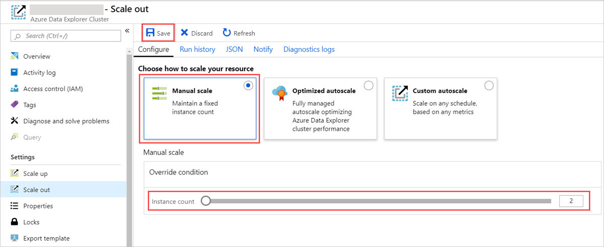
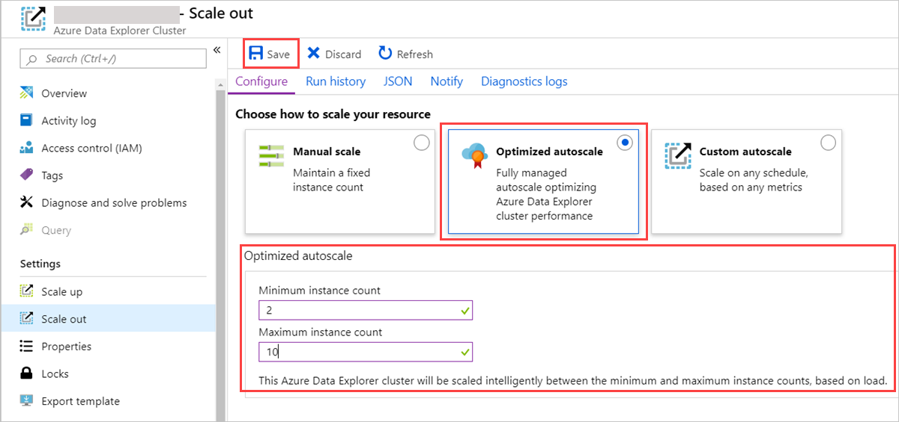

# Manage cluster horizontal scaling (scale out) in Azure Data Explorer to accommodate changing demand

Sizing a cluster appropriately is critical to the performance of Azure Data Explorer. A static cluster size can lead to under-utilization or over-utilization, neither of which is ideal.

Since demand on a cluster can’t be predicted with absolute accuracy, a better approach is to *scale* a cluster, adding and removing capacity and CPU resources with changing demand. 

There are two workflows for scaling an Azure Data Explorer cluster: 

* Horizontal scaling, also called scaling in and out.
* [Vertical scaling](manage-cluster-vertical-scaling.md), also called scaling up and down.

This article explains the horizontal scaling workflow.

## Configure horizontal scaling

Horizontal scaling allows you to scale the instance count automatically based on predefined rules and schedules. Specify your autoscale settings for your cluster in the Azure portal, as described in this article.

1. In the Azure portal, go to your Azure Data Explorer cluster resource. Under **Settings**, select **Scale out**. 

2. In the **Scale out** window, select your desired autoscale method: **Manual scale**, **Optimized autoscale** or **Custom autoscale**.

### Manual scale

Manual scale is the default setting during cluster creation. The cluster has a static cluster capacity that doesn't change automatically. You select the static capacity using the **instance capacity** bar. The cluster's scaling will remain at that setting until you make an additional change.

   

### Optimized autoscale

Optimized autoscale is the recommended autoscale method. This autoscale method optimizes the cluster performance and costs. If the cluster approaches a state of under-utilization, it will be scaled-in. This will lower costs but keep performance level. If the cluster approaches a state of over-utilization, it will be scaled-out to keep performance at its best. To configure **Optimized autoscale**:

1. Select **Optimized autoscale**. 

1. Select a **minimum instance count** and a **maximum instance count**. The cluster autoscaling will be done between those two numbers, based on load.

1. Select **Save**.

   

Optimized autoscale will start working. Its actions are now visible in the Activity log of the cluster. 

### Custom autoscale

Custom autoscale allows you to scale your cluster dynamically based on metrics that you specify. The following graphic shows the flow and steps to configure Custom autoscale. More details follow the graphic.

1. In the **Autoscale setting name** box, provide a name, such as *Scale-out: cache utilization*. 

   

2. For **Scale mode**, select **Scale based on a metric**. This mode provides dynamic scaling. You can also select **Scale to a specific instance count**.

3. Select **+ Add a rule**.

4. In the **Scale rule** section on the right, provide values for each setting.

    **Criteria**

    | Setting | Description and value |
    | --- | --- |
    | **Time aggregation** | Select an aggregation criteria, such as **Average**. |
    | **Metric name** | Select the metric you want the scale operation to be based on, such as **Cache Utilization**. |
    | **Time grain statistic** | Choose between **Average**, **Minimum**, **Maximum**, and **Sum**. |
    | **Operator** | Choose the appropriate option, such as **Greater than or equal to**. |
    | **Threshold** | Choose an appropriate value. For example, for cache utilization, 80 percent is a good starting point. |
    | **Duration (in minutes)** | Choose an appropriate amount of time for the system to look back when calculating metrics. Start with the default of 10 minutes. |
    |  |  |

    **Action**

    | Setting | Description and value |
    | --- | --- |
    | **Operation** | Choose the appropriate option to scale in or scale out. |
    | **Instance count** | Choose the number of nodes or instances you want to add or remove when a metric condition is met. |
    | **Cool down (minutes)** | Choose an appropriate time interval to wait between scale operations. Start with the default of five minutes. |
    |  |  |

5. Select **Add**.

6. In the **Instance limits** section on the left, provide values for each setting.

    | Setting | Description and value |
    | --- | --- |
    | **Minimum** | The number of instances that your cluster won't scale below, regardless of utilization. |
    | **Maximum** | The number of instances that your cluster won't scale above, regardless of utilization. |
    | **Default** | The default number of instances. This setting is used if there are problems with reading the resource metrics. |
    |  |  |

7. Select **Save**.

You've now configured horizontal scaling for your Azure Data Explorer cluster. Add another rule for vertical scaling. If you need assistance with cluster-scaling issues, [open a support request](https://portal.azure.com/#blade/Microsoft_Azure_Support/HelpAndSupportBlade/overview) in the Azure portal.

## Next steps

* [Monitor Azure Data Explorer performance, health, and usage with metrics](using-metrics.md)

* [Manage cluster vertical scaling](manage-cluster-vertical-scaling.md) for appropriate sizing of a cluster.
