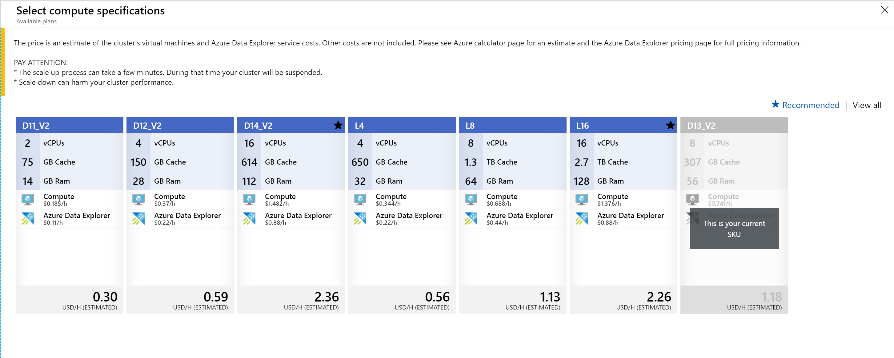

# Manage cluster scale up to accommodate changing demand

Sizing a cluster appropriately is critical to the performance of Azure Data Explorer. But demand on a cluster can’t be predicted with 100% accuracy. A static cluster size can lead to under-utilization or over-utilization, neither of which is ideal. A better approach is to *scale* a cluster, adding and removing capacity and CPU with changing demand. This article shows you how to manage cluster scale up.

1. Navigate to your cluster, and under **Settings** select **Scale up**.

You would then be given the list of SKUs that are available. You can choose from the list of enabled cards. For instance in the below figure there is only one SKU that can be chosen from D14_vs.

D13_v2 is disabled because this is the current SKU of the cluster. L8 and L16 are disabled because they not available on the region where the cluster is.

To change a SKU just click the SKU, you would like to use and click the **Select** button.

[!NOTE] The scale up process can take a few minutes, and during that time your cluster will be suspended. Note that scaling down can harm your cluster performance.

If you need assistance with cluster scaling issues, open a support request in the [Azure portal](https://portal.azure.com/#blade/Microsoft_Azure_Support/HelpAndSupportBlade/overview).