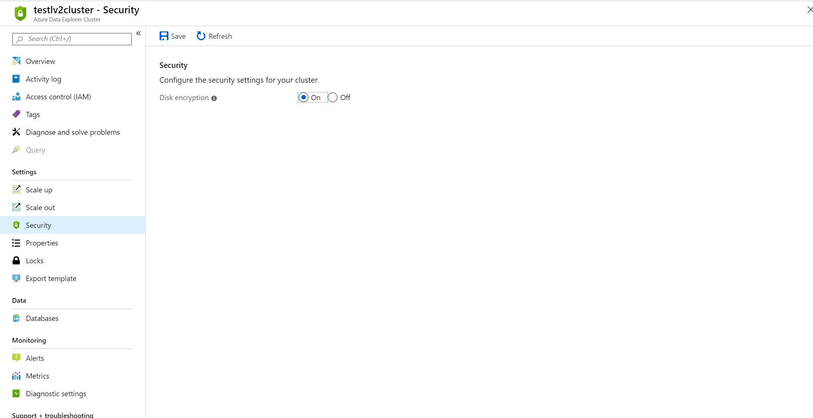

# Secure your cluster in Azure Data Explorer - Azure portal

[Azure Disk Encryption](/azure/security/azure-security-disk-encryption-overview) helps protect and safeguard your data to meet your organizational security and compliance commitments. It provides volume encryption for the OS and data disks of your cluster virtual machines. It also integrates with [Azure Key Vault](/azure/key-vault/), which allows us to control and manage the disk encryption keys and secrets, and ensure all data on the VM disks is encrypted. 
  
## Enable encryption at rest in the Azure portal
  
Your cluster security settings allow you to enable disk encryption on your cluster. Enabling [encryption at rest](/azure/security/fundamentals/encryption-atrest) on your cluster provides data protection for stored data (at rest). 

1. In the Azure portal, go to your Azure Data Explorer cluster resource. Under the **Settings** heading, select **Security**. 

    

1. In the **Security** window, select **On** for the **Disk encryption** security setting. 

1. Select **Save**.
 
> [!NOTE]
> Select **Off** to disable the encryption after it has been enabled.

## Next steps

[Check cluster health](/azure/data-explorer/check-cluster-health)
