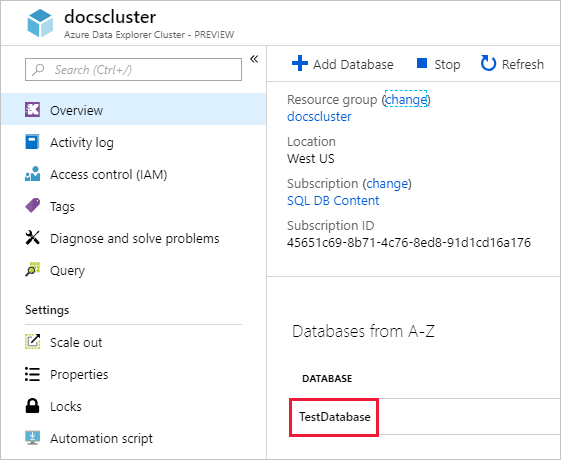
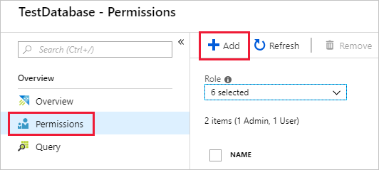
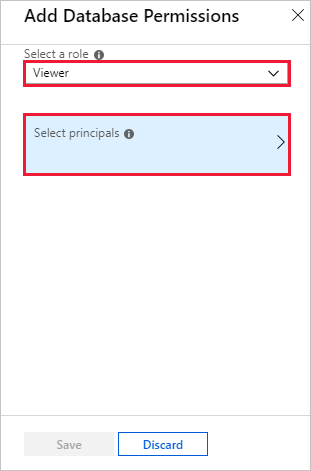
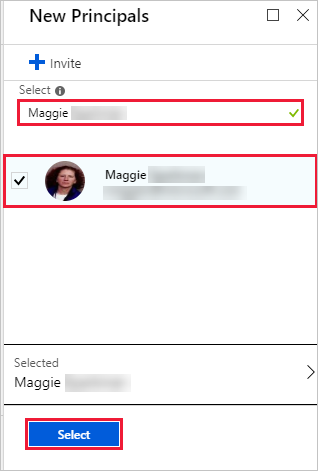
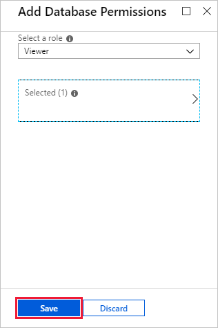

# Manage Azure Data Explorer database permissions

Azure Data Explorer enables you to control access to databases and tables, using a *role-based access control* model. Under this model, *principals* (users, groups, and apps) are mapped to *roles*. Principals can access resources according to the roles they're assigned.

This article describes the available roles and how to assign principals to those roles.

## Roles and permissions

Azure Data Explorer has the following roles:

|Role                       |Permissions                                                                        |
|---------------------------|-----------------------------------------------------------------------------------|
|Database admin             |Can do anything in the scope of a particular database.|
|Database user              |Can read all data and metadata in the database. Additionally, they can create tables (becoming the table admin for that table) and functions in the database.|
|Database viewer            |Can read all data and metadata in the database.|
|Database ingestor          |Can ingest data to all existing tables in the database, but not query the data.|
|Database monitor           |Can execute '.show ...' commands in the context of the database and its child entities.|
|Table admin                |Can do anything in the scope of a particular table. |
|Table ingestor             |Can ingest data in the scope of a particular table, but not query the data.|

## Manage permissions in the Azure portal

1. Sign in to the [Azure portal](https://portal.azure.com/).

1. Navigate to your Azure Data Explorer cluster.

1. In the **Overview** section, select the database where you want to manage permissions.

    

1. Select **Permissions** then **Add**.

    

1. Under **Add database permissions**, select the role that you want to assign the principal to, then **Select principals**.

    

1. Look up the principal, select it, then **Select**.

    

1. Select **Save**.

    

## Manage permissions with management commands

1. Sign-in to [https://dataexplorer.azure.com](https://dataexplorer.azure.com), and add your cluster if it's not already available.

1. In the left pane, select the appropriate database.

1. Use the `.add` command to assign principals to roles: `.add database databasename rolename ('aaduser | aadgroup=user@domain.com')`. To add a user to the Database user role, run the following command, substituting your database name and user.

    ```Kusto
    .add database <TestDatabase> users ('aaduser=<user@contoso.com>')
    ```

    The output of the command shows the list of existing users and the roles they're assigned to in the database.

## Next steps

[Write queries](write-queries.md)
