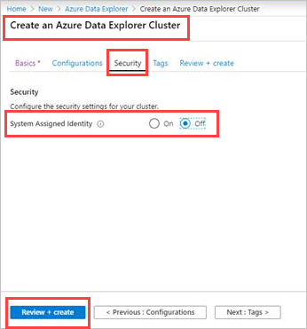
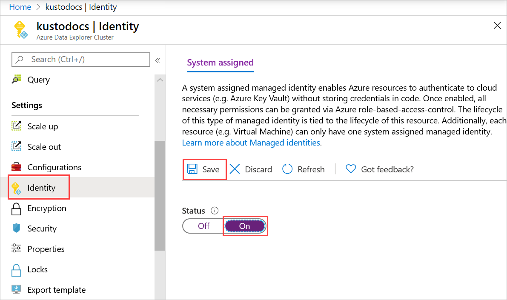
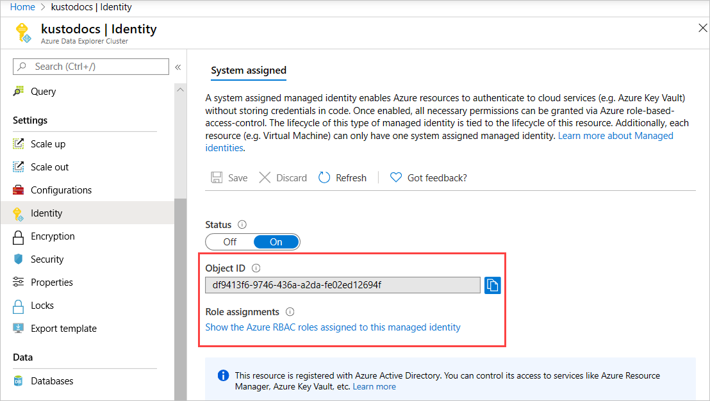
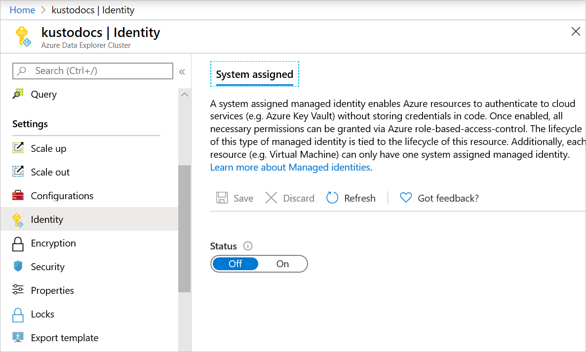

# Configure managed identities for your Azure Data Explorer cluster

A [managed identity from Azure Active Directory](/azure/active-directory/managed-identities-azure-resources/overview) allows your cluster to easily access other AAD-protected resources such as Azure Key Vault. The identity is managed by the Azure platform and doesn't require you to provision or rotate any secrets. This article shows you how to create a managed identity for Azure Data Explorer clusters. Managed identity configuration is currently supported only to [enable customer-managed keys for your cluster](/azure/data-explorer/security#customer-managed-keys-with-azure-key-vault).

> [!Note]
> Managed identities for Azure Data Explorer won't behave as expected if your Azure Data Explorer cluster is migrated across subscriptions or tenants. The app will need to obtain a new identity, which can be done by [disabling](#disable-a-system-assigned-identity) and [re-enabling](#add-a-system-assigned-identity) the feature. Access policies of downstream resources will also need to be updated to use the new identity.

## Add a system-assigned identity
                                                                                                    
Assign a system-assigned identity that is tied to your cluster, and is deleted if your cluster is deleted. A cluster can only have one system-assigned identity. Creating a cluster with a system-assigned identity requires an additional property to be set on the cluster. The system-assigned identity is added using C#, ARM templates, or the Azure portal as detailed below.

# [Azure portal](#tab/portal)

### Add a system-assigned identity using the Azure portal

1. Sign in to the [Azure portal](https://portal.azure.com/).

#### New Azure Data Explorer cluster

1. [Create an Azure Data Explorer cluster](/azure/data-explorer/create-cluster-database-portal#create-a-cluster) 
1. In the **Security** tab > **System assigned identity**, select **On**. To remove the system assigned identity, select **Off**.
2. Select **Next:Tags>** or **Review + create** to create the cluster.

    

#### Existing Azure Data Explorer cluster

1. Open an existing Azure Data Explorer cluster.
1. Select **Settings** > **Identity** in left pane of portal.
1. In the **Identity** pane > **System assigned** tab:
   1. Move the **Status** slider to **On**.
   1. Select **Save**
   1. In the pop-up window, select **Yes**

    

1. After a few minutes, the screen shows: 
  * **Object ID** - used for customer managed keys 
  * **Role assignments** - click link to assign relevant roles

    

# [C#](#tab/c-sharp)

### Add a system-assigned identity using C#

#### Prerequisites

To set up a managed identity using the Azure Data Explorer C# client:

* Install the [Azure Data Explorer (Kusto) NuGet package](https://www.nuget.org/packages/Microsoft.Azure.Management.Kusto/).
* Install the [Microsoft.IdentityModel.Clients.ActiveDirectory NuGet package](https://www.nuget.org/packages/Microsoft.IdentityModel.Clients.ActiveDirectory/) for authentication.
* [Create an Azure AD application](/azure/active-directory/develop/howto-create-service-principal-portal) and service principal that can access resources. You add role assignment at the subscription scope and get the required `Directory (tenant) ID`, `Application ID`, and `Client Secret`.

#### Create or update your cluster

1. Create or update your cluster using the `Identity` property:

    ```csharp
    var tenantId = "xxxxxxxx-xxxxx-xxxx-xxxx-xxxxxxxxx";//Directory (tenant) ID
    var clientId = "xxxxxxxx-xxxxx-xxxx-xxxx-xxxxxxxxx";//Application ID
    var clientSecret = "xxxxxxxxxxxxxx";//Client Secret
    var subscriptionId = "xxxxxxxx-xxxxx-xxxx-xxxx-xxxxxxxxx";
    var authenticationContext = new AuthenticationContext($"https://login.windows.net/{tenantId}");
    var credential = new ClientCredential(clientId, clientSecret);
    var result = await authenticationContext.AcquireTokenAsync(resource: "https://management.core.windows.net/", clientCredential: credential);
    
    var credentials = new TokenCredentials(result.AccessToken, result.AccessTokenType);
    
    var kustoManagementClient = new KustoManagementClient(credentials)
    {
        SubscriptionId = subscriptionId
    };
                                                                                                    
    var resourceGroupName = "testrg";
    var clusterName = "mykustocluster";
    var location = "Central US";
    var skuName = "Standard_D13_v2";
    var tier = "Standard";
    var capacity = 5;
    var sku = new AzureSku(skuName, tier, capacity);
    var identity = new Identity(IdentityType.SystemAssigned);
    var cluster = new Cluster(location, sku, identity: identity);
    await kustoManagementClient.Clusters.CreateOrUpdateAsync(resourceGroupName, clusterName, cluster);
    ```
    
2. Run the following command to check if your cluster was successfully created or updated with an identity:

    ```csharp
    kustoManagementClient.Clusters.Get(resourceGroupName, clusterName);
    ```

    If the result contains `ProvisioningState` with the `Succeeded` value, then the cluster was created or updated, and should have the following properties:

    ```csharp
    var principalId = cluster.Identity.PrincipalId;
    var tenantId = cluster.Identity.TenantId;
    ```

`PrincipalId` and `TenantId` are replaced with GUIDs. The `TenantId` property identifies the AAD tenant to which the identity belongs. The `PrincipalId` is a unique identifier for the cluster's new identity. Within AAD, the service principal has the same name that you gave to your App Service or Azure Functions instance.

# [ARM template](#tab/arm)

### Add a system-assigned identity using an Azure Resource Manager template

An Azure Resource Manager template can be used to automate deployment of your Azure resources. To learn more about deploying to Azure Data Explorer, see [Create an Azure Data Explorer cluster and database by using an Azure Resource Manager template](create-cluster-database-resource-manager.md).

Adding the system-assigned type tells Azure to create and manage the identity for your cluster. Any resource of type `Microsoft.Kusto/clusters` can be created with an identity by including the following property in the resource definition: 

```json
"identity": {
    "type": "SystemAssigned"
}    
```

For example:

```json
{
    "apiVersion": "2019-09-07",
    "type": "Microsoft.Kusto/clusters",
    "name": "[variables('clusterName')]",
    "location": "[resourceGroup().location]",
    "identity": {
        "type": "SystemAssigned"
    },
    "properties": {
        "trustedExternalTenants": [],
        "virtualNetworkConfiguration": null,
        "optimizedAutoscale": null,
        "enableDiskEncryption": false,
        "enableStreamingIngest": false,
    }
}
```

When the cluster is created, it has the following additional properties:

```json
"identity": {
    "type": "SystemAssigned",
    "tenantId": "<TENANTID>",
    "principalId": "<PRINCIPALID>"
}
```

`<TENANTID>` and `<PRINCIPALID>` are replaced with GUIDs. The `TenantId` property identifies the AAD tenant to which the identity belongs. The `PrincipalId` is a unique identifier for the cluster's new identity. Within AAD, the service principal has the same name that you gave to your App Service or Azure Functions instance.

---

## Disable a system-assigned identity

Removing a system-assigned identity will also delete it from AAD. System-assigned identities are also automatically removed from AAD when the cluster resource is deleted. A system-assigned identity can be removed by disabling the feature.  The system-assigned identity is removed using C#, ARM templates, or the Azure portal as detailed below.

# [Azure portal](#tab/portal)

### Disable a system-assigned identity using the Azure portal

1. Sign in to the [Azure portal](https://portal.azure.com/).
1. Select **Settings** > **Identity** in left pane of portal.
1. In the **Identity** pane > **System assigned** tab:
    1. Move the **Status** slider to **Off**.
    1. Select **Save**
    1. In the pop-up window, select **Yes** to disable the system-assigned identity. The **Identity** pane reverts to same condition as before the addition of the system-assigned identity.

    

# [C#](#tab/c-sharp)

### Remove a system-assigned identity using C#

Run the following to remove the system-assigned identity:

```csharp
var identity = new Identity(IdentityType.None);
var cluster = new Cluster(location, sku, identity: identity);
await kustoManagementClient.Clusters.CreateOrUpdateAsync(resourceGroupName, clusterName, cluster);
```

# [ARM template](#tab/arm)

### Remove a system-assigned identity using an Azure Resource Manager template

Run the following to remove the system-assigned identity:

```json
"identity": {
    "type": "None"
}
```

---

## Next steps

* [Secure Azure Data Explorer clusters in Azure](security.md)
* [Secure your cluster in Azure Data Explorer - Azure portal](manage-cluster-security.md) by enabling encryption at rest.
 * [Configure customer-managed-keys using C#](customer-managed-keys-csharp.md)
 * [Configure customer-managed-keys using the Azure Resource Manager template](customer-managed-keys-resource-manager.md)
