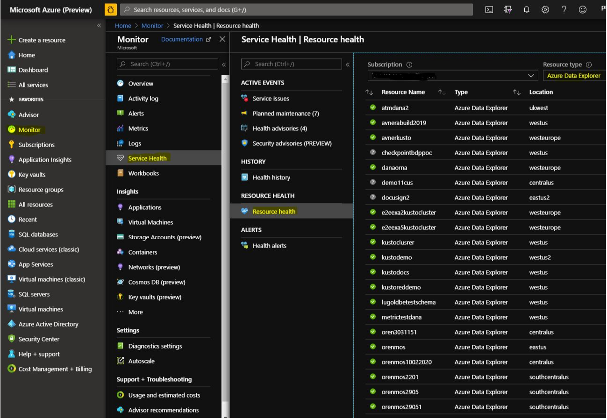
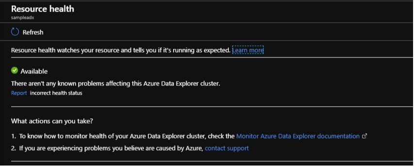
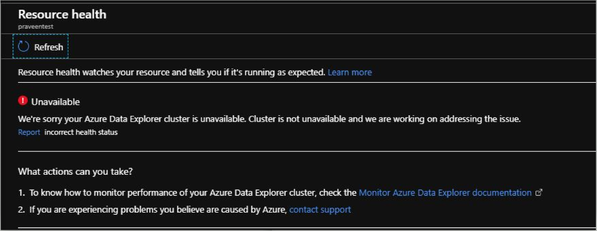
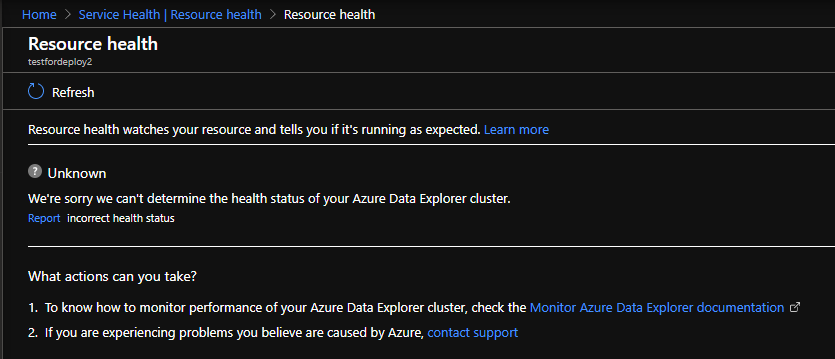
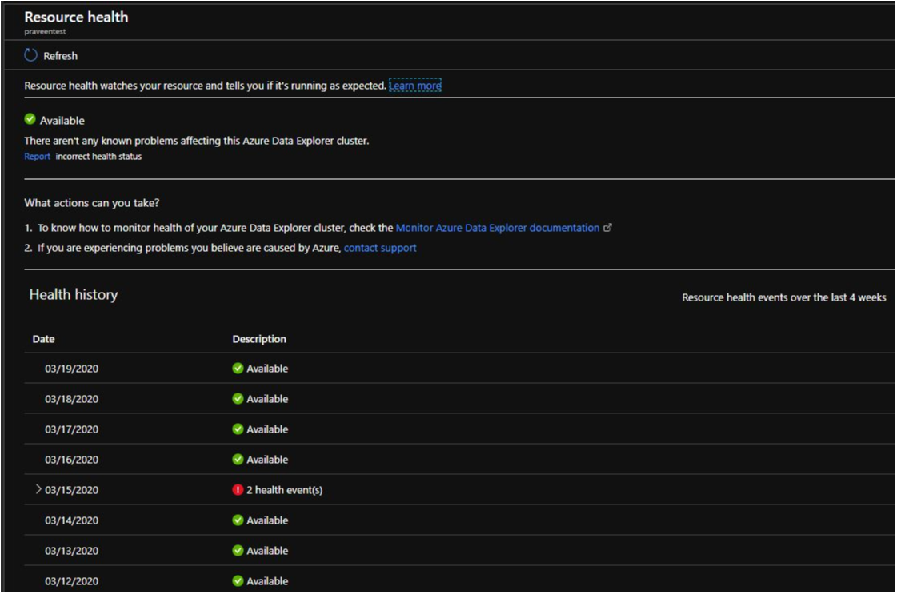

# Monitor Azure Data Explorer resource health status using Resource Health

[Resource Health](/azure/service-health/resource-health-overview) for Azure Data Explorer helps you with health of Azure Data Explorer resource and provides actionable recommendations to troubleshoot problems. Resource Health report the current and past health of your resources. 

Resource Health determines the health of your Azure Data Explorer resource by examining variuos health status checks such as for now (the health status will be extended with more metrics)
* Azure Data Explorer resource availability
* Query failures

The Resource Health is updated every 1-2 minutes.

## Health States

### Available

A status of **Available** means that there are no issues with your Azure Data Explorer and is running healthy.

### Unavailable

A status of **Unavailable** means that there is ongoing problem with your Azure Data Explorer and it is not available for queries and ingestion. For example node(s) in the Azure Data Explorer resource rebooted unexpectdly. If your Azure Data Explorer remains in this state for an extended period of time, please contact support.

### Unknown

The health status of **Unknown** indicates that Resource Health hasn't received information about this Azure Data Explorer for more than 10 minutes. Although this status isn't a definitive indication of the state of the Azure Data Explorer, it is an important data point in the troubleshooting process. If your Azure Data Explorer is running as expected, the status will change to Available after a few minutes. If you're experiencing problems with your Azure Data Explorer, the Unknown health status might suggest that an event in the platform is affecting the resource. The status of Azure Data Explorer may also report as unknown if it is in stopped state.

## Historical information

You can access up to 4 weeks health history in the Health history section of Resource Health. The section will also contains an unhealthy reason (when available) for the issues reported by Resource Health. 

## Next steps

* [Configuring Resource Health alerts](https://docs.microsoft.com/azure/service-health/resource-health-alert-arm-template-guide)
* [Tutorial: Ingest and query monitoring data in Azure Data Explorer](ingest-data-no-code.md)