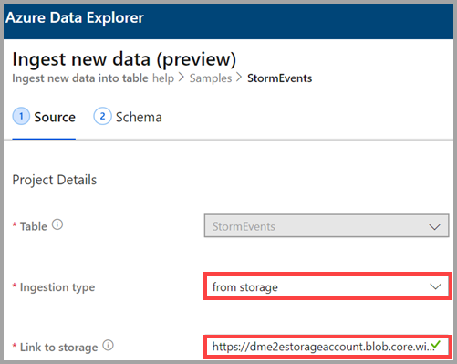
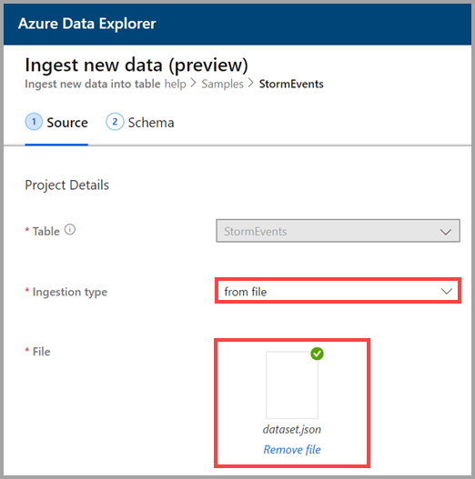
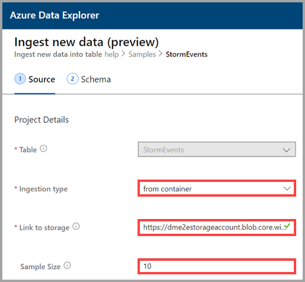
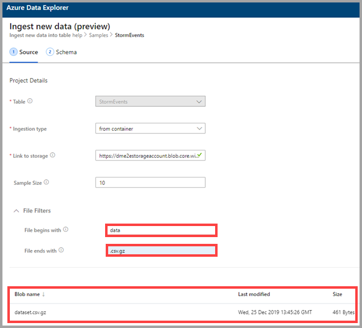

# Use one-click ingestion to ingest data to an existing table in Azure Data Explorer

One-click ingestion enables you to quickly ingest a new table in JSON, CSV, and other formats. Using the Azure Data Explorer Web UI, you can ingest data from storage, from a local file, or from a container. This document describes using the intuitive one-click wizard to ingest your data into an existing table. You can then edit the table and run queries with the Azure Data Explorer Web UI.

One-click ingestion is particularly useful when ingesting data for the first time, or when your data's schema is unfamiliar to you. 

For an overview of one-click ingestion and a list of prerequisites, see [One-click ingestion](ingest-data-one-click.md).
For information about ingesting data into a new table in Azure Data Explorer, see [One-click ingestion to a new table](one-click-ingestion-new-table.md)

## Ingest new data

1. In the left menu of the Web UI, right-click a *database* or *table* and select **Ingest new data (Preview)**.

       
 
1. In the **Ingest new data (Preview)** window, the **Source** tab is automatically selected. Complete the **Project Details**:

    1. If the **Table** field isn't automatically filled, select an existing table name from the drop-down menu.
        > [!TIP]
        > If you select **Ingest new data (Preview)** on a *table* row, the selected table name will appear in the **Project Details**.
    
    1. For **Ingestion type**, select one of the following options:
       * **from storage** - in the **Link to storage** field, add the URL of the storage account. Use [Blob SAS URL](/azure/vs-azure-tools-storage-explorer-blobs#get-the-sas-for-a-blob-container) for private storage accounts. 
       

      * **from file** - select **Browse** to locate the file, or drag the file into the field.
      
      * **from container** - in the **Link to storage** field, add the URL of the container, and enter the sample size
      
      A sample of the data appears. If you want to, you can filter it to show only files that begin end with specific characters. When you adjust the filters, the preview automatically updates.
      For example, you can filter for all files that begin with the word *data* and end with a *.csv.gz* extension.
      
1. Select **Edit schema** to view and edit your table column configuration.

## Edit the schema

1. The **Map columns** dialog opens and you can map source data columns to target table columns. 
    * In the **Source columns** fields, enter column names to map with the **Target columns**.
    * To delete a mapping, select the trash can icon.
    
1. Select **Update**.
1. In the **Schema** tab:
    1. Select **Compression type**, and then select either **Uncompressed** or **GZip**.
    1. Select **Data format**:
        * JSON
        * CSV
        * TSV
        * SCSV
        * SOHSV
        * TSVE
        * PSV

        * If you select  **JSON**, you must also select **JSON levels**, from 1 to 10. The levels affect the table column data depiction.
        
        * If you select a format other than JSON, you can select the check box **Include column names** to ignore the heading row of the file.
        
    * The **Mapping name** is set automatically, but you can edit it.
    * You can select **Map columns** to open the **Map columns** window.

## Copy and paste queries

1. Above the **Editor** pane, select the **v** button to open the editor. In the editor, you can view and copy the automatic queries generated from your inputs. 
1. In the table: 
    * Select new column headers to **Change data type**, **Rename column**, **New column**, **Delete column**, **Sort ascending**, or **Sort descending**. On existing columns, only data sorting is available. 
    * Double-click the new column name to edit.

 

## Start ingestion

Select **Start ingestion** to create a table and mapping and to begin data ingestion.

## Query data

1. In the **Data ingestion completed** window, all three steps will be marked with green check marks if data ingestion finishes successfully.
 
    

1. Select the **v** button to open the query. Copy to the Web UI to edit the query.

1. In the right-hand menu, select **Quick queries** and **Tools**: 

    * **Quick queries** includes links to the Web UI with example queries.
    * **Tools** includes a link to **Drop commands** on the Web UI, which enable you to troubleshoot issues by running the relevant `.drop` commands.

    > [!TIP]
    > You might lose data when you use `.drop` commands. Use them carefully.

## Next steps

* [Query data in Azure Data Explorer Web UI](/azure/data-explorer/web-query-data)
* [Write queries for Azure Data Explorer using Kusto Query Language](/azure/data-explorer/write-queries)
