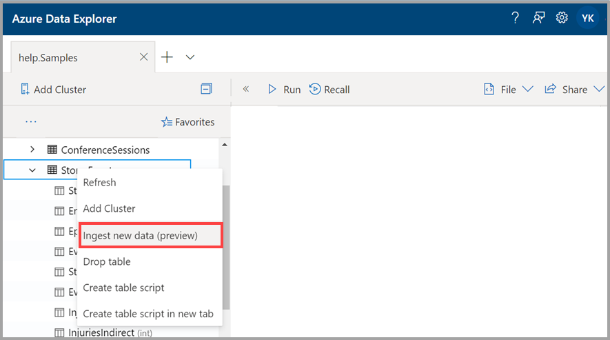
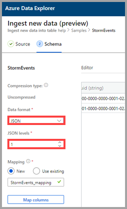
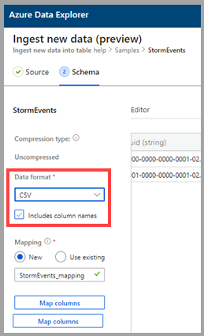
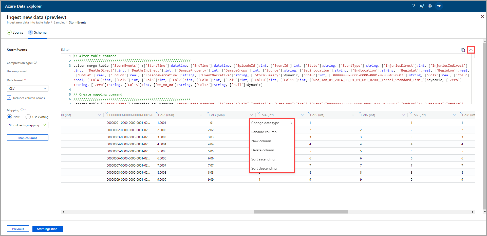

# Use one-click ingestion to ingest data to an existing table in Azure Data Explorer

One-click ingestion enables you to quickly ingest data in JSON, CSV, and other formats into a table. Using the Azure Data Explorer Web UI, you can ingest data from storage, from a local file, or from a container. 

This document describes using the intuitive one-click wizard to ingest JSON data from a file into an existing table. You can then edit the table and run queries with the Azure Data Explorer Web UI.

One-click ingestion is particularly useful when ingesting data for the first time, or when your data's schema is unfamiliar to you. 

For an overview of one-click ingestion and a list of prerequisites, see [One-click ingestion](ingest-data-one-click.md).
For information about ingesting data into a new table in Azure Data Explorer, see [One-click ingestion to a new table](one-click-ingestion-new-table.md)

## Ingest new data

1. In the left menu of the Web UI, right-click a *database* or *table* and select **Ingest new data (Preview)**.

       
 
1. In the **Ingest new data (Preview)** window, the **Source** tab is automatically selected.

1. If the **Table** field isn't automatically filled, select an existing table name from the drop-down menu.
    > [!TIP]
    > If you select **Ingest new data (Preview)** on a *table* row, the selected table name will appear in the **Project Details**.

[!INCLUDE [data-explorer-one-click-ingestion-types](../../includes/data-explorer-one-click-ingestion-types.md)]
    
Select **Edit schema** to view and edit your table column configuration.

## Edit the schema

1. The **Map columns** dialog opens and you can map source data columns to target table columns. 
    * In the **Source columns** fields, enter column names to map with the **Target columns**.
    * To delete a mapping, select the trash can icon.

    

1. Select **Update**.
1. In the **Schema** tab:
    1. Select **Compression type**, and then select either **Uncompressed** or **GZip**.

        [!INCLUDE [data-explorer-one-click-ingestion-edit-schema](../../includes/data-explorer-one-click-ingestion-edit-schema.md)]
        
    1. If you select  **JSON**, you must also select **JSON levels**, from 1 to 10. The levels affect the table column data depiction.

    

    * If you select a format other than JSON, you can select the check box **Include column names** to ignore the heading row of the file.
        
    

    > [!Note]
    > Tabular formats can ingest column data into only one column in an Azure Data Explorer table. 

    * New mappings are set automatically, but you can change it to use an existing one. 
    * You can select **Map columns** to open the **Map columns** window.

## Copy and paste queries

1. Above the **Editor** pane, select the **v** button to open the editor. In the editor, you can view and copy the automatic commands generated from your inputs. 
1. In the table: 
    * Select new column headers to add a **New column**, **Delete column**, **Sort ascending**, or **Sort descending**. On existing columns, only data sorting is available.

    > [!Note]
    > * You can't update the name and datatype for existing tables.
    > * Drop commands will only revert the changes that were made by his ingestion flow (new extents and columns). Nothing else will be dropped.

 

## Start ingestion

Select **Start ingestion** to create a table and mapping and to begin data ingestion.

## Data ingestion completed

In the **Data ingestion completed** window, all three steps will be marked with green check marks if data ingestion finishes successfully.
 

[!INCLUDE [data-explorer-one-click-ingestion-query-data](../../includes/data-explorer-one-click-ingestion-query-data.md)]

## Next steps

* [Query data in Azure Data Explorer Web UI](/azure/data-explorer/web-query-data)
* [Write queries for Azure Data Explorer using Kusto Query Language](/azure/data-explorer/write-queries)
