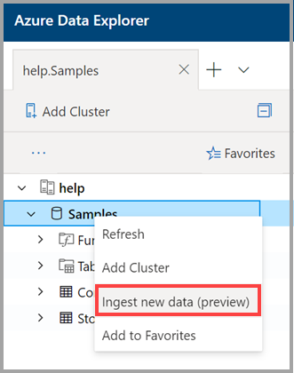
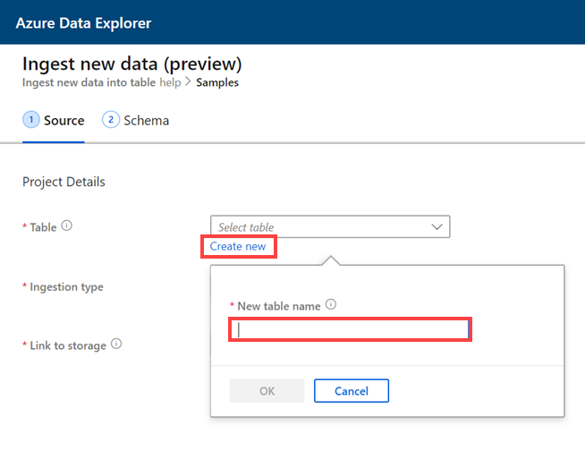
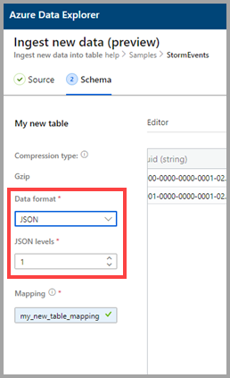
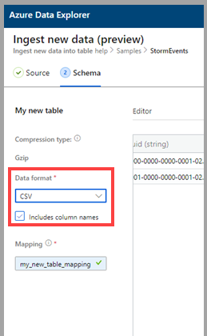
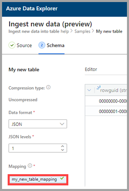
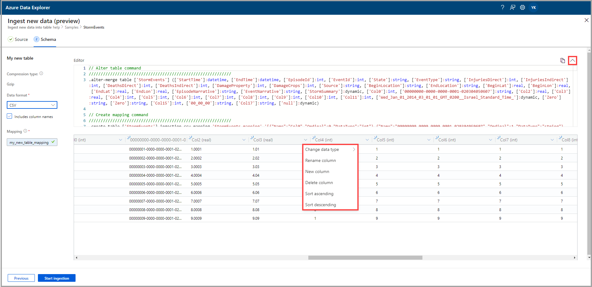
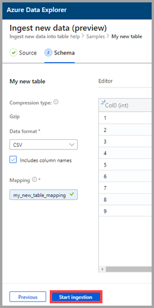

# Use one-click ingestion to ingest data to a new table in Azure Data Explorer

One-click ingestion enables you to quickly ingest data in JSON, CSV, and other formats into a table. Using the Azure Data Explorer Web UI, you can ingest data from storage, from a local file, or from a container. 

This document describes using the intuitive one-click wizard to ingest CSV data from a container into a new table. You can then edit the table and run queries with the Azure Data Explorer Web UI. You can also set continuous ingestion to automatically ingest data into the table when the source data updates.

One-click ingestion is particularly useful when ingesting data for the first time, or when your data's schema is unfamiliar to you. 

For an overview of one-click ingestion and a list of prerequisites, see [One-click ingestion](ingest-data-one-click.md).
For information about ingesting data into an existing table in Azure Data Explorer, see [One-click ingestion to an existing table](one-click-ingestion-existing-table.md)

## Ingest new data

1. In the left menu of the Web UI, right-click a *database* and select **Ingest new data (Preview)**.

       
 
1. In the **Ingest new data (Preview)** window, the **Source** tab is automatically selected. 

1. Select **Create new table** and enter a name for the new table. You can use alphanumeric, hyphens and underscores. Special characters aren't supported.

 

[!INCLUDE [data-explorer-one-click-ingestion-types](../../includes/data-explorer-one-click-ingestion-types.md)]

Select **Edit schema** to view and edit your table column configuration. The system will select one of the blobs at random and the schema will be generated based on that blob. By looking at the name of the source, the service automatically identifies if it is compressed or not.

## Edit the schema

1. In the **Schema** tab:

    1. Select **Data format**:

        [!INCLUDE [data-explorer-one-click-ingestion-edit-schema](../../includes/data-explorer-one-click-ingestion-edit-schema.md)]

    1. If you select  **JSON**, you must also select **JSON levels**, from 1 to 10. The levels affect the table column data depiction. 

    

    * If you select a format other than JSON, you can select the check box **Include column names** to ignore the heading row of the file.

        
        
1. In the **Mapping name** field, enter a mapping name. You can use alphanumeric characters and underscores. Spaces, special characters, and hyphens aren't supported.
    
    

## Copy and paste queries

1. Above the **Editor** pane, select the **v** button to open the editor. In the editor, you can view and copy the automatic queries generated from your inputs. 
1. In the table: 
    * Double-click the new column name to edit.
    * Select new column headers and do any of the following:
    
|Action         |Description                                  |
|-----------------|-------------------------------------------|
|Change data type |Change the data type from the one automatically selected by the service to one of the other [supported data types](#edit-the-schema)|
|Rename column    |Change the column name |
|New column       |Add a new column|
|Delete column    |Delete the selected column|
|Sort ascending   |Sort the table by the selected column in ascending order (existing columns only)|
|Sort descending  |Sort the table by the selected column in descending order (existing columns only) |

> [!Note]
> For tabular formats, each column can be ingested into one column in Azure Data Explorer.
> You can create new columns from different JSON levels.

 

## Start ingestion

Select **Start ingestion** to create a table and mapping and to begin data ingestion.

## Data ingestion completed

In the **Data ingestion completed** window, all three steps will be marked with green check marks if data ingestion finishes successfully.
 

[!INCLUDE [data-explorer-one-click-ingestion-query-data](../../includes/data-explorer-one-click-ingestion-query-data.md)]

**Continuous ingestion**

Continuous ingestion enables you to create an event grid that listens to the source container. Any new blob that meets the criteria of the the pre-defined parameters (prefix, suffix, and so on) will be automatically ingested into the destination table.

> [!Note]
> Continuous ingestion is only relevant when ingesting from a container.

1. Select **Continuous ingestion** to open the Azure portal. The data connection page opens with the event grid data connector opened and with source and target parameters already entered (source container, tables, and mappings).

1. Select **Create** to create a data connection which will listen for any changes in that container container. 

## Next steps

* [Query data in Azure Data Explorer Web UI](/azure/data-explorer/web-query-data)
* [Write queries for Azure Data Explorer using Kusto Query Language](/azure/data-explorer/write-queries)
