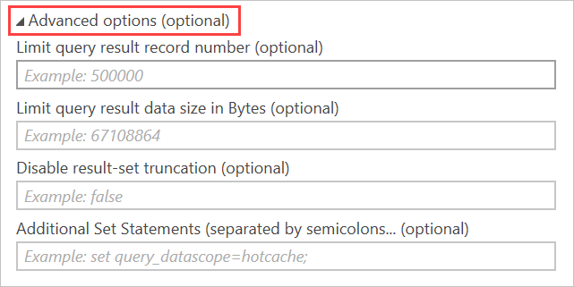
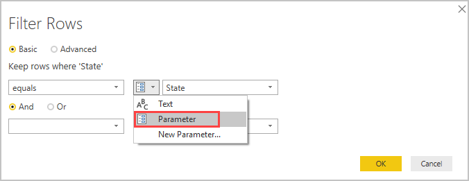

# Best practices for working with Power BI

Azure Data Explorer is a fast and highly scalable data exploration service for log and telemetry data. [Power BI](https://docs.microsoft.com/power-bi/) is a business analytics solution that lets you visualize your data and share the results across your organization. Azure Data Explorer provides three options for connecting to data in Power BI: use the [built-in connector](power-bi-connector.md), [import a query from Azure Data Explorer into Power BI](power-bi-imported-query.md), or use a [SQL query](power-bi-sql-query.md). 

When working with terabytes of fresh raw data, follow these guidelines to keep Power BI dashboards and reports snappy and updated:

* **Travel light** - Bring only the data that you need for your reports to Power BI. For deep interactive analysis, use the [Azure Data Explorer Web UI](web-query-data.md) which is optimized for ad-hoc exploration with the Kusto Query Language.

* **Composite model** - Use composite model (\\expl) to combine aggregated data for top level dashboards with filtered operational raw data. You can clearly define when to use raw data and when to use an aggregated view.

* **Import** mode versus **DirectQuery** mode - Use **Import** mode for interaction of smaller data sets. Use **DirectQuery** mode for large, frequently updated data sets. 
For example, create dimension tables using **Import** mode since they are small and don't change often. Set the refresh interval according to the expected rate of data updates.
On the other hand, create fact tables using **DirectQuery** mode since these tables are big and contain raw data. Use these tables to present filtered data using Power BI drillthrough (\\expl?).

* **Parallelism** – Azure Data explorer is a linearly scalable data platform, therefore, you can improve the performance of dashboard rendering by increasing the parallelism of the end-to-end flow as follows:

   * Increase the number of concurrent queries in Power BI desktop properties pane as documented [here]().

    img

   * Use weak consistency to improve parallelism (\\expl?). Note that this may have an impact on the freshness of the data.

* **Effective slicers** – you can use **sync slicers** (\\link) to prevent reports from loading data before you are ready. After you structure the data set, place all visuals, and mark all the slicers, you can select the sync slicer to load only the data needed.

* **Use filters** - Use as many filters as possible to focus the Azure Data Explorer search on the relevant data shards.

* **Efficient visuals** – Select the most performant visuals for your data.

## Tips for using Power BI to visualize Azure Data Explorer data

### Complex queries in Power BI

Complex queries more easily expressed in Kusto than in Power Query, should be implemented as [Kusto functions](/azure/kusto/query/functions), and invoked in Power BI. This method is required when using **DirectQuery** with `let` statements in your Kusto query. Since Power BI joins two queries, and `let` statements can't be used with the `join` operator, this may result in syntax errors. Therefore, save each portion of the join as a Kusto function and allow Power BI to join these two functions together.

### How to simulate `Timestamp < ago(1d)`

Power BI doesn't contain a *relative* date-time operator such as `ago()`.
To simulate `ago()`, use a combination of `DateTime.FixedLocalNow()` and `#duration` Power BI functions.

```kusto
let
    Source = Kusto.Contents("help", "Samples", "StormEvents", []),
    #"Filtered Rows" = Table.SelectRows(Source, each [StartTime] > (DateTime.FixedLocalNow()-#duration(5,0,0,0)))
in
    #"Filtered Rows"
```
The query is equivalent to the following Kusto query:

```kusto
    StormEvents | where StartTime > (now()-5d)
    StormEvents | where StartTime > ago(5d)
```

### Reaching Kusto query limits 

Kusto queries return, by default, up to 500,000 rows or 64MB, as described in [query limits](/azure/kusto/concepts/querylimits). You can override these defaults by using **Advanced options** in the  **Azure Data Explorer (Kusto)** connection window:



These options issue [set statements](/azure/kusto/query/setstatement) with your query to change the default query limits:

  * **Limit query result record number** generates a `set truncationmaxrecords`
  * **Limit query result data size in Bytes** generates a `set truncationmaxsize`
  * **Disable result-set truncation** generates a `set notruncation`

### Using query parameters

You can use [query parameters](/azure/kusto/query/queryparametersstatement) to modify your query dynamically. 

### Using a query parameter in the connection details

1. Open the relevant query with the **Advanced Editor** (\\where?) 
1. Find the following section of the query:

    ```kusto
    Source = Kusto.Contents("<Cluster>", "<Database>", "<Query>", [])
    ```
   
   For example:

    ```kusto
    Source = Kusto.Contents("Help", "Samples", "StormEvents | where State == 'ALABAMA' | take 100", [])
    ```

1. Replace the relevant part of the query with your parameter. Splitting the query into multiple parts, and concatenate them back using the & sign, along with the parameter.

   For example, in the query above, we'll take the `State == 'ALABAMA'` part, and split it to: `State == '` and `'` and we'll place the `State` parameter between them:
   
    ```kusto
    "StormEvents | where State == '" & State & "' | take 100"
    ```

1. If your query contains quotation marks, encode them correctly. For example, the following query: 

   ```kusto
   "StormEvents | where State == "ALABAMA" | take 100" 
   ```

   will appear in the **Advanced Editor** as follows with two quotation marks:

   ```kusto
    "StormEvents | where State == ""ALABAMA"" | take 100"
   ```

   It should be replaced with the following query with three quotation marks:

   ```kusto
   "StormEvents | where State == """ & State & """ | take 100"
   ```

### Use a query parameter in the query steps

You can use a query parameter in any query step that supports it. For example, filter the results based on the value of a parameter.



### Change the timeout of a Power BI query

When generating a Power BI query in \\Kusto Explorer\\, the timeout used in the query is taken from \\tools->options->connections->query server timeout\\. You can edit the generated query manually and change both client and server timeouts as follows:

```kusto
let KustoQuery = 
    let Source = Json.Document(Web.Contents("...",#"x-ms-app"="PowerQuery",#"properties"="{""Options"":{""servertimeout"":""00:04:00""}}"], Timeout=#duration(0,0,4,0)])),
    ...
in KustoQuery
```

### Do not use Power BI data refresh scheduler to issue control commands to Kusto

Power BI includes a data refresh scheduler, capable of periodically issuing
queries against a data source. This mechanism
shouldn't be used to schedule control commands to Kusto, since Power BI assumes
all queries are read-only (and therefore idempotent) and does not guarantee
exactly-once queries.

### Power BI can only send short \\(&lt;2000) queries to Kusto

If running a query in Power BI results in the following error:
 _"DataSource.Error: Web.Contents failed to get contents from..."_
the query is probably longer than 2000 characters. Power BI uses \\Power Query\\ to query Kusto by issuing a HTTP GET request which encodes the query as part of the URI being retrieved. This means
that Kusto queries issued by Power BI are limited to the maximum length of
a request URI (2000 characters, minus some small offset). The workaround is
to define a [stored function](/azure/kusto/query/schema-entities/stored-functions) in Kusto,
and have Power BI use that function in the query.
\\(Why isn't HTTP POST used instead? Power Query currently
only supports anonymous HTTP POST requests.)


