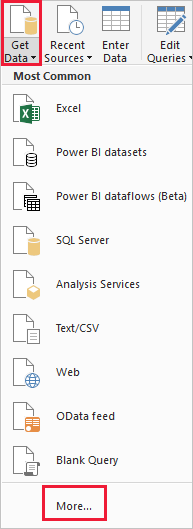
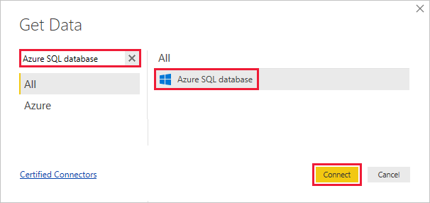
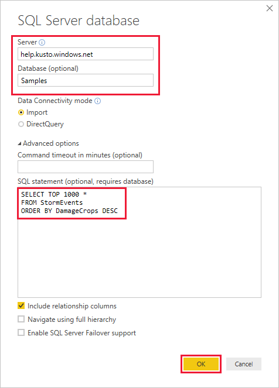
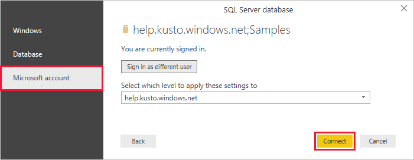
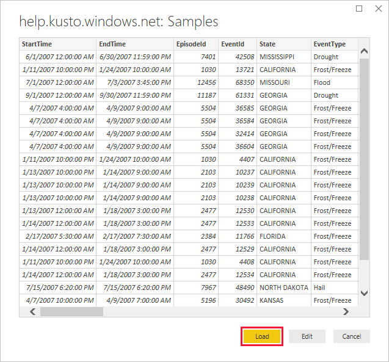

# Visualize data from Azure Data Explorer using a SQL query in Power BI

Azure Data Explorer is a fast and highly scalable data exploration service for log and telemetry data. Power BI is a business analytics solution that lets you visualize your data and share the results across your organization.

Azure Data Explorer provides three options for connecting to data in Power BI: use the built-in connector, import a query from Azure Data Explorer, or use a SQL query. This article shows you how to use a SQL query to get data and visualize it in a Power BI report.

If you don't have an Azure subscription, create a [free Azure account](https://azure.microsoft.com/free/) before you begin.

## Prerequisites

You need the following to complete this article:

* An organizational email account that is a member of Azure Active directory, so you can connect to the [Azure Data Explorer help cluster](https://dataexplorer.azure.com/clusters/help/databases/samples).

* [Power BI Desktop](https://powerbi.microsoft.com/get-started/) (select **DOWNLOAD FREE**)

## Get data from Azure Data Explorer

First, you connect to the Azure Data Explorer help cluster, then you bring in a subset of the data from the *StormEvents* table. [!INCLUDE [data-explorer-storm-events](../../includes/data-explorer-storm-events.md)]

You typically use the native query language with Azure Data Explorer, but it also supports SQL queries, which you'll use here. Azure Data Explorer translates the SQL query into a native query for you.

1. In Power BI Desktop, on the **Home** tab, select **Get Data** then **More**.

    

1. Search for *Azure SQL Database*, select **Azure SQL Database** then **Connect**.

    

1. On the **SQL Server database** screen, fill out the form with the following information.

    

    **Setting** | **Value** | **Field description**
    |---|---|---|
    | Server | *help.kusto.windows.net* | The URL for the help cluster (without *https://*). For other clusters, the URL is in the form *\<ClusterName\>.\<Region\>.kusto.windows.net*. |
    | Database | *Samples* | The sample database that is hosted on the cluster you're connecting to. |
    | Data connectivity mode | *Import* | Determines whether Power BI imports the data or connects directly to the data source. You can use either option with this connector. |
    | Command timeout | Leave blank | How long the query runs before it throws a timeout error. |
    | SQL statement | Copy the query below this table | The SQL statement that Azure Data Explorer translates into a native query. |
    | Other options | Leave as default values | Options don't apply to Azure Data Explorer clusters. |
    | | | |

    ```SQL
    SELECT TOP 1000 *
    FROM StormEvents
    ORDER BY DamageCrops DESC
    ```

1. If you don't already have a connection to the help cluster, sign in. Sign in with a Microsoft account, then select **Connect**.

    

1. On the **help.kusto.windows.net: Samples** screen, select **Load**.

    

    The table opens in the main Power BI window, in report view, where you can create reports based on the sample data.

## Visualize data in a report

[!INCLUDE [data-explorer-power-bi-visualize-basic](../../includes/data-explorer-power-bi-visualize-basic.md)]

## Clean up resources

If you no longer need the report you created for this article, delete the Power BI Desktop (.pbix) file.

## Next steps

[Visualize data using the Azure Data Explorer connector for Power BI](power-bi-connector.md)