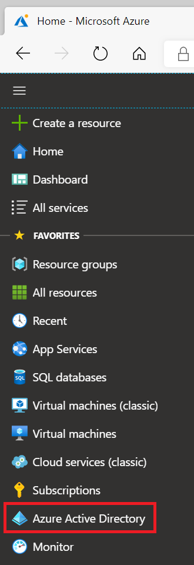
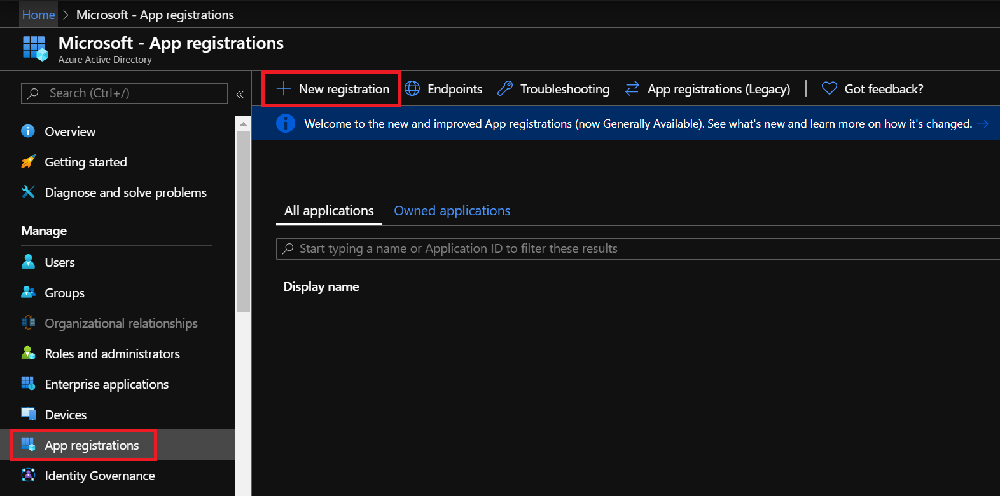
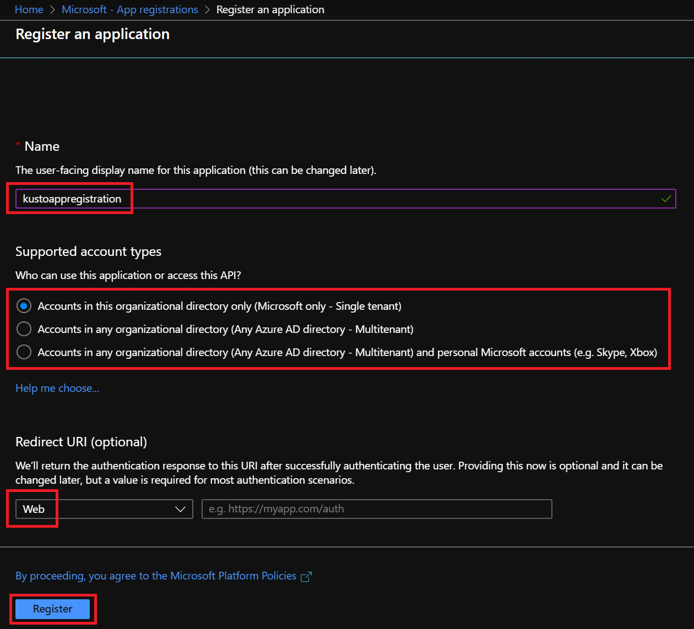
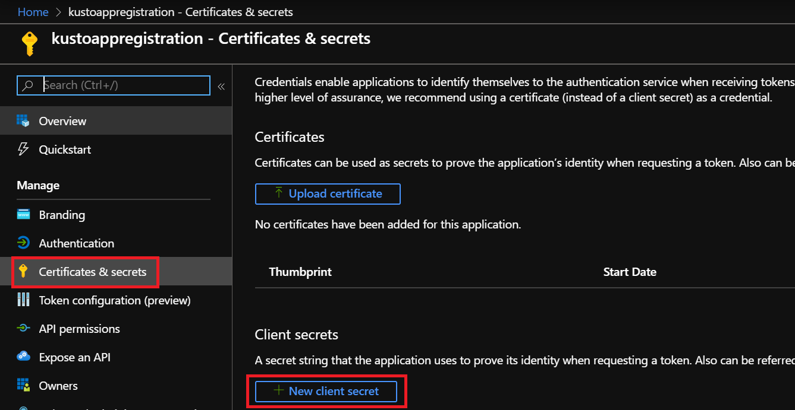
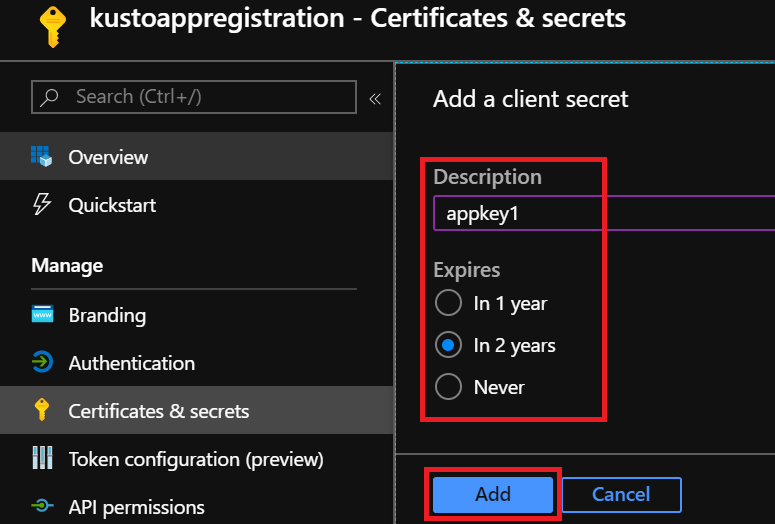
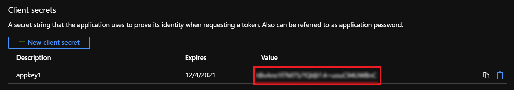
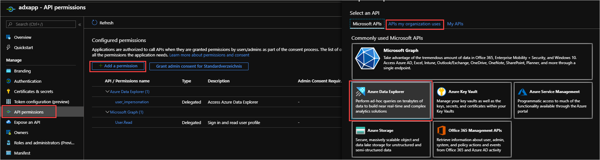
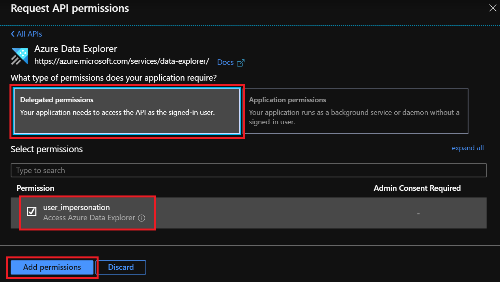

# Create an Azure Active Directory application registration in Azure Data Explorer

Azure Active Directory (Azure AD) application authentication is used for applications, such as an unattended service or a scheduled flow, that need to access Azure Data Explorer without a user present. If you're connecting to an Azure Data Explorer database using an application, such as a web app, you should authenticate using service principal authentication. This article details how to create and register an Azure AD service principal and then authorize it to access an Azure Data Explorer database.

## Create Azure AD application registration

Azure AD application authentication requires creating and registering an application with Azure AD. 
A service principal is automatically created when the application registration is created in an Azure AD tenant. 

1. Log in to [Azure portal](https://portal.azure.com) and open the `Azure Active Directory` blade

    

1. Select the **App registrations** blade and select **New registration**

    

1. Fill in the following information: 

    * **Name** 
    * **Supported account types**
    * **Redirect URI** > **Web**
        > [!IMPORTANT] 
        > The application type should be **Web**. The URI is optional and is left blank in this case.
    * Select **Register**

    

1. Select the **Overview** blade and copy the **Application ID**.

    > [!NOTE]
    > You'll need the application ID to authorize the service principal to access the database.

    

1. In the **Certificates & secrets** blade, select **New client secret**

    

    > [!TIP]
    > This article describes using a client secret for the application's credentials.  You can also use an X509 certificate to authenticate your application. Select **Upload certificate** and follow the instructions to upload the public portion of the certificate.

1. Enter a description, expiration, and select **Add**

    

1. Copy the key value.

    > [!NOTE]
    > When you leave this page, the key value won't be accessible.  You'll need the key to configure client credentials to the database.

    

Your application is created. If you only need access to an authorized Azure Data Explorer resource, such as in the programmatic example below, skip the next section. For delegated permissions support, see [configure delegated permissions for the application registration](#configure-delegated-permissions-for-the-application-registration).

## Configure delegated permissions for the application registration

If your application needs to access Azure Data Explorer using the credentials of the calling user, configure delegated permissions for your application registration. For example, if you're building a web API to access Azure Data Explorer and you want to authenticate using the credentials of the user who is *calling* your API.  

1. In the **API permissions** blade, select **Add a permission**.
1. Select **APIs my organization uses**. Search for and select **Azure Data Explorer**.

    

1. In **Delegated permissions**, select the **user_impersonation** box and **Add permissions**

         

## Grant the service principal access to an Azure Data Explorer database

Now that your service principal application registration is created, you need to grant the corresponding service principal access to your Azure Data Explorer database. 

1. In the [Web UI](https://dataexplorer.azure.com/), connect to your database and open a query tab.

1. Execute the following command:

    ```kusto
    .add database <DatabaseName> viewers ('<ApplicationId>') '<Notes>'
    ```

    For example:
    
    ```kusto
    .add database Logs viewers ('aadapp=f778b387-ba15-437f-a69e-ed9c9225278b') 'Azure Data Explorer App Registration'
    ```

    The last parameter is a string that shows up as notes when you query the roles associated with a database.
    
    > [!NOTE]
    > After creating the application registration, there may be a several minute delay until Azure Data Explorer can reference it. If, when executing the command, you receive an error that the application is not found, wait and try again.

For more information, see [security roles management](/azure/kusto/management/security-roles) and [ingestion permissions](/azure/kusto/api/netfx/kusto-ingest-client-permissions.md).  

## Using application credentials to access a database

Use the application credentials to programmatically access your database by using the [Azure Data Explorer client library](/azure/kusto/api/netfx/about-kusto-data.md).

```C#
. . .
string applicationClientId = "<myClientID>";
string applicationKey = "<myApplicationKey>";
. . .
var kcsb = new KustoConnectionStringBuilder($"https://{clusterName}.kusto.windows.net/{databaseName}")
    .WithAadApplicationKeyAuthentication(
        applicationClientId,
        applicationKey,
        authority);
var client = KustoClientFactory.CreateCslQueryProvider(kcsb);
var queryResult = client.ExecuteQuery($"{query}");
```

   > [!NOTE]
   > Specify the application id and key of the application registration (service principal) created earlier.

For more information, see [authenticate with Azure AD for Azure Data Explorer access](/azure/kusto/management/access-control/how-to-authenticate-with-aad) and [use Azure Key Vault with .NET Core web app](/azure/key-vault/tutorial-net-create-vault-azure-web-app#create-a-net-core-web-app).

## Troubleshooting

### Invalid resource error

If your application is used to authenticate users or applications for Azure Data Explorer access, you must set up delegated permissions for Azure Data Explorer service application. Declare your application can authenticate users or applications for Azure Data Explorer access. Not doing so will result in an error similar to the following, when an authentication attempt is made:

`AADSTS650057: Invalid resource. The client has requested access to a resource which is not listed in the requested permissions in the client's application registration...`

You'll need to follow the instructions on [setting up delegated permissions for Azure Data Explorer service application](#configure-delegated-permissions-for-the-application-registration).

### Enable user consent error

Your Azure AD tenant administrator may enact a policy that prevents tenant users from giving consent to applications. This situation will result in an error similar to the following, when a user tries to log in to your application:

`AADSTS65001: The user or administrator has not consented to use the application with ID '<App ID>' named 'App Name'`

You'll need to contact your Azure AD administrator to grant consent for all users in the tenant, or enable user consent for your specific application.

## Next steps

* See [Kusto connection strings](/azure/kusto/api/connection-strings/kusto.md) for list of supported connection strings.
