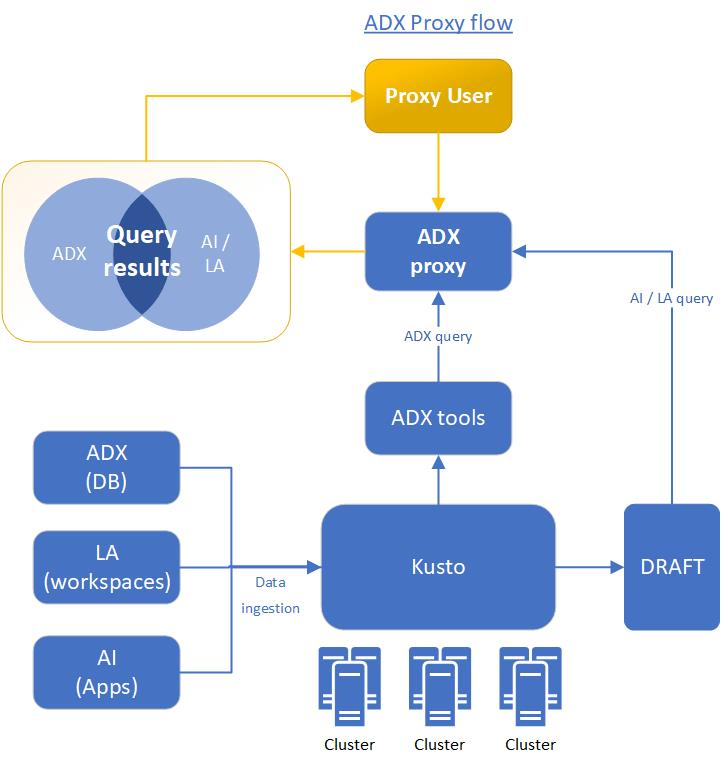
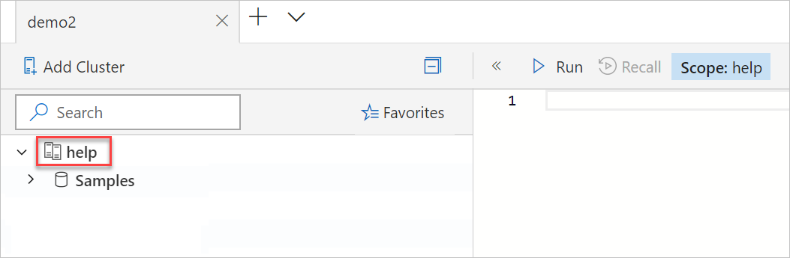
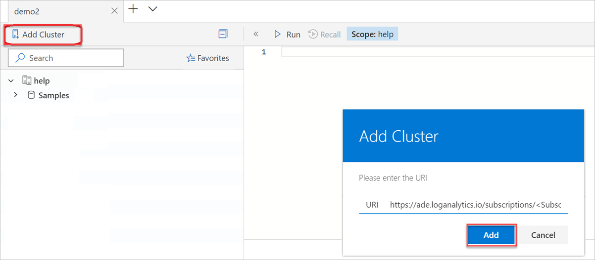
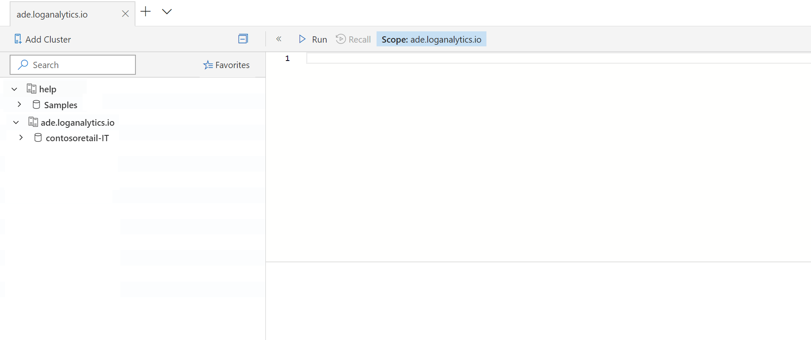
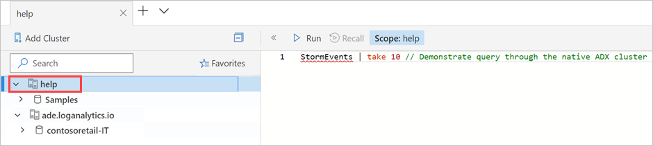
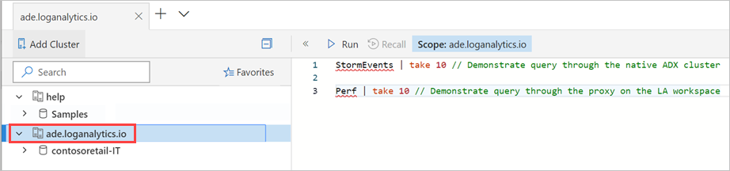
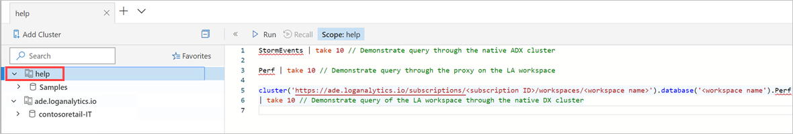
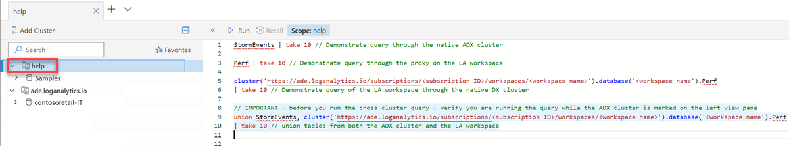

# Query data in Azure Monitor using Azure Data Explorer (Preview)

The Azure Data Explorer proxy cluster (ADX Proxy) is an entity that enables you to perform cross product queries between Azure Data Explorer, [Application Insights (AI)](/azure/azure-monitor/app/app-insights-overview), and [Log Analytics (LA)](/azure/azure-monitor/platform/data-platform-logs) in the [Azure Monitor](/azure/azure-monitor/) service. You can map Azure Monitor Log Analytics workspaces or Application Insights apps as a proxy cluster. You can then query the proxy cluster using Azure Data Explorer tools and refer to it in a cross cluster query. The article shows how to connect to a proxy cluster, add a proxy cluster to Azure Data Explorer Web UI, and run queries against your AI apps or LA workspaces from Azure Data Explorer.

The Azure Data Explorer proxy flow: 



## Prerequisites

> [!NOTE]
> The ADX Proxy is in preview mode. To enable this feature, contact the [ADXProxy](mailto:adxproxy@microsoft.com) team.

## Connect to the proxy

1. Verify your Azure Data Explorer native cluster (such as *help* cluster) appears on the left menu before you connect to your Log Analytics or Application Insights cluster.

    

1. In the Azure Data Explorer UI (https://dataexplorer.azure.com/clusters), select **Add Cluster**.

1. In the **Add Cluster** window:

    * Add the URL to the LA or AI cluster. For example: `https://ade.loganalytics.io/subscriptions/<subscription-id>/resourcegroups/<resource-group-name>/providers/microsoft.operationalinsights/workspaces/<workspace-name>`

    * Select **Add**.

    

    If you add a connection to more than one proxy cluster, give each a different name. Otherwise they'll all have the same name in the left pane.

1. After the connection is established, your LA or AI cluster will appear in the left pane with your native ADX cluster. 

    

## Run queries

You can use Kusto Explorer, ADX web Explorer, Jupyter Kqlmagic, or REST API to query the proxy clusters. 

> [!TIP]
> * Database name should have the same name as the resource specified in the proxy cluster. Names are case sensitive.
> * In cross cluster queries, make sure that the [naming of apps and workspaces](#application-insights-app-and-log-analytics-workspace-names) is correct.

### Query against the native Azure Data Explorer cluster 

Run queries on your Azure Data Explorer cluster (such as *StormEvents* table in *help* cluster). When running the query, verify that your native Azure Data Explorer cluster is selected in the left pane.

```kusto
StormEvents | take 10 // Demonstrate query through the native ADX cluster
```



### Query against your LA or AI cluster

When you run queries on your LA or AL cluster, verify that your LA or AI cluster is selected in the left pane. 

```kusto
Perf | take 10 // Demonstrate query through the proxy on the LA workspace
```



### Query your LA or AI cluster from the ADX proxy  

When you run queries on your LA or AI cluster from the proxy, verify your ADX native cluster is selected in the left pane. The following example demonstrates a query of the LA workspace using the native ADX cluster

```kusto
cluster('https://ade.loganalytics.io/subscriptions/<subscription-id>/resourcegroups/<resource-group-name>/providers/microsoft.operationalinsights/workspaces/<workspace-name>').database('<workspace-name').Perf
| take 10 
```



### Cross query of LA or AI cluster and the ADX cluster from the ADX proxy 

When you run cross cluster queries from the proxy, verify your ADX native cluster is selected in the left pane. The following examples demonstrate combining ADX cluster tables (using `union`) with LA workspace.

```kusto
union StormEvents, cluster('https://ade.loganalytics.io/subscriptions/<subscription-id>/resourcegroups/<resource-group-name>/providers/microsoft.operationalinsights/workspaces/<workspace-name>').database('<workspace-name>').Perf
| take 10 
```

```kusto
let CL1 = 'https://ade.loganalytics.io/subscriptions/<subscription-id>/resourcegroups/<resource-group-name>/providers/microsoft.operationalinsights/workspaces/<workspace-name>';
union <ADX table>, cluster(CL1).database(<workspace-name>).<table name>
```



Using the [`join` operator](/azure/kusto/query/joinoperator), instead of union, may require a hint to run it on an Azure Data Explorer native cluster (and not on the proxy). 

## Additional syntax examples

The following syntax options are available when calling the Application Insights (AI) or Log Analytics (LA) clusters:

|Syntax Description  |Application Insights  |Log Analytics  |
|----------------|---------|---------|
| Database within a cluster that contains only the defined resource in this subscription (**recommended for cross cluster queries**) |   cluster(`https://ade.applicationinsights.io/subscriptions/<subscription-id>/resourcegroups/<resource-group-name>/providers/microsoft.insights/components/<ai-app-name>').database('<ai-app-name>`) | cluster(`https://ade.loganalytics.io/subscriptions/<subscription-id>/resourcegroups/<resource-group-name>/providers/microsoft.operationalinsights/workspaces/<workspace-name>').database('<workspace-name>`)     |
| Cluster that contains all apps/workspaces in this subscription    |     cluster(`https://ade.applicationinsights.io/subscriptions/<subscription-id>`)    |    cluster(`https://ade.loganalytics.io/subscriptions/<subscription-id>`)     |
|Cluster that contains all apps/workspaces in the subscription and are members of this resource group    |   cluster(`https://ade.applicationinsights.io/subscriptions/<subscription-id>/resourcegroups/<resource-group-name>`)      |    cluster(`https://ade.loganalytics.io/subscriptions/<subscription-id>/resourcegroups/<resource-group-name>`)      |
|Cluster that contains only the defined resource in this subscription      |    cluster(`https://ade.applicationinsights.io/subscriptions/<subscription-id>/resourcegroups/<resource-group-name>/providers/microsoft.insights/components/<ai-app-name>`)    |  cluster(`https://ade.loganalytics.io/subscriptions/<subscription-id>/resourcegroups/<resource-group-name>/providers/microsoft.operationalinsights/workspaces/<workspace-name>`)     |

### Application Insights app and Log Analytics workspace names

* If names contain special characters, they're replaced by URL encoding in the proxy cluster name. 
* If names include characters that don't meet [KQL identifier name rules](/azure/kusto/query/schema-entities/entity-names), the are replaced by the dash **-** character.

## Next steps

[Write queries](write-queries.md)