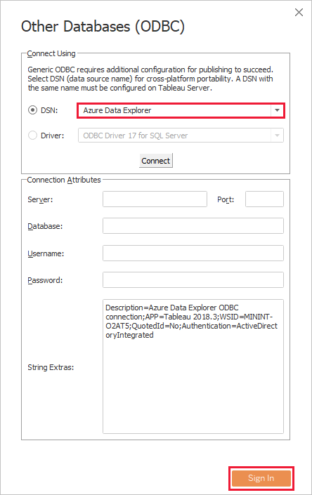
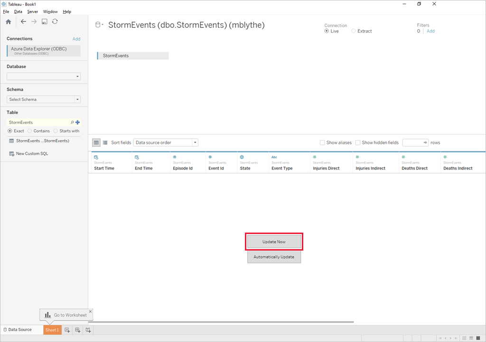

# Visualize data from Azure Data Explorer in Redash

 [Redash](https://www.redash.io/) Connects and queries your data sources, builds dashboards to visualize data and share them with peers. 

## Prerequisites

You need the following to complete this article:

1. Sign in to Redash service
1. Create a new query
1. Create a new data source - select Azure Data Explorer (Kusto) connector. 
    You need to introduce the following properties:
    * Data source name
    * Cluster
    * Azure AD app client id
    * Azure AD client secret
    * Azure AD tenant id
    * Database

    [!INCLUDE [data-explorer-storm-events](../../includes/data-explorer-storm-events.md)]

## Create queries in Redash 

Once you've finished creating a data source, you can start creating queries using KQL (Kusto Query Language).

1. In Redash app, on the top left drop down select **Create --> Query**. 
1. Select data source on the top left drop down of data sources. On the left pane you will see all the tables in the selected database.
1. Type your query in the top editing pane and **Execute** it. you can view the query results in the bottom central pane. Once you get the query right you can add a parameter to it using {{}} curly brackets like in the example below.
1. Define the parameter attributes. In this case The parameter "Type" is "Query based dropdownlist" and the parameter "Query" is one of the other queries that returns a list of values.
1. Create a visualization to go with the query by selecting the **New Visualization** button.
1. In the visualization screen, select the visualization type and the relevant fields like X axis column and Y axis column.
1. **Save** the visualization to add it to an existing dashboard.
1. To add a chart to the dashboard you can either create a new dashboard from the "Create" drop down or open a dashboard from the top left "Dashboards" drop down.
1. After opening the dashboard go into edit mode and click **Add widget** on the bottom right of the screen. The widget requires selecting a query and visualization to place on the dashboard. Once the widget was added you can move and resize it.
1. In the dashboard edit mode select **Use Dashboard Level Filters** to use the **Type** parameter previously defined.

1. For **DSN**, select the data source you created for ODBC, then select **Sign In**.

    

1. For **Database**, select the database on your sample cluster, such as *TestDatabase*. For **Schema**, select *dbo*, and for **Table**, select the *StormEvents* sample table.

    

1. Tableau now shows the schema for the sample data. Select **Update Now** to bring the data into Tableau.

    

    When the data is imported, Tableau shows rows of data similar to the following image.

    

1. Now you can create visualizations in Tableau based on the data you brought in from Azure Data Explorer. For more information, see [Tableau Learning](https://www.tableau.com/learn).

## Next steps

* [Write queries for Azure Data Explorer](write-queries.md)