# Visualize data from Azure Data Explorer in Redash

[Redash](https://www.redash.io/) connects and queries your data sources, builds dashboards to visualize data and share them with peers. In this article, you learn how to set up Azure Data Explorer as a data source for Redash, and then visualize data.

## Prerequisites

1. [Create cluster and database](create-cluster-database-portal.md).
1. Create a new data source as explained in [ingest sample data into Azure Data Explorer](ingest-sample-data.md). For more ingestion options see [ingestion overview)](ingest-data-overview.md).
1. Create a new query using [Web UI](web-query-data.md). 

    [!INCLUDE [data-explorer-configure-data-source](../../includes/data-explorer-configure-data-source.md)]

## Create Azure Data Explorer Connector in Redash 

1. Sign in to [Redash](https://www.redash.io/). Select **Get Started** to create an account.
1. Under **Let's get started**, Select **Connect a Data Source**.

    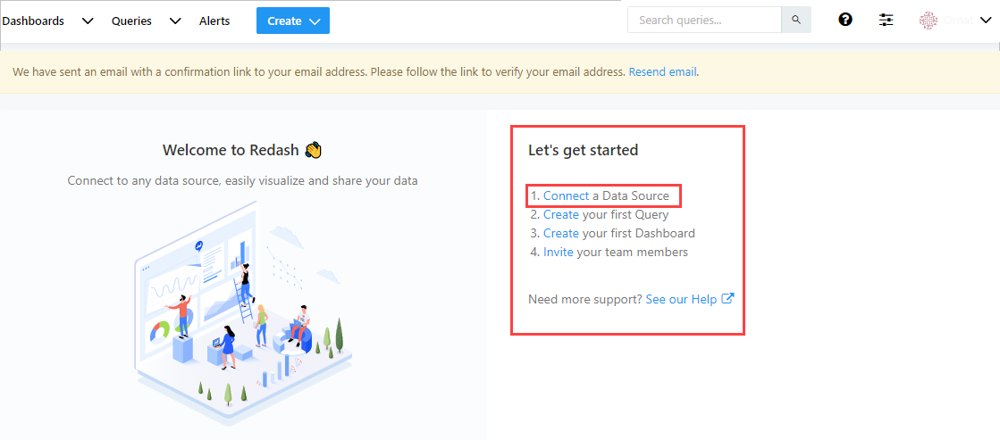

1. In **Create a New Data Source** window, select **Azure Data Explorer (Kusto)** 

    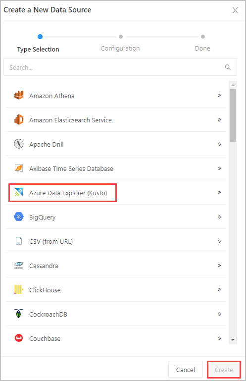

1. In **Azure Data Explorer (Kusto)** window, complete the following form and select **Create**:

    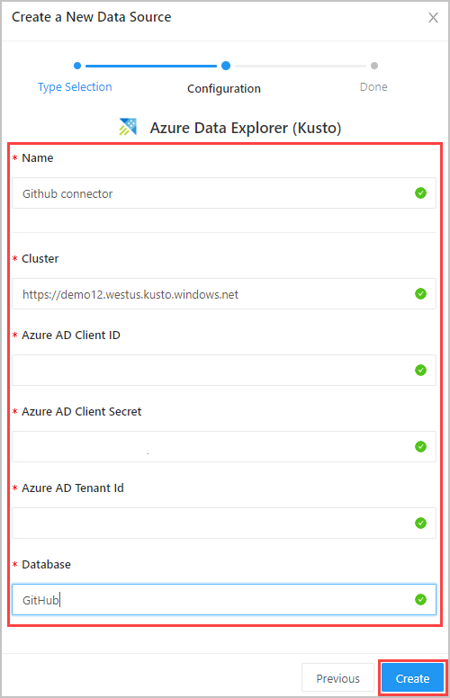

1. In **Settings** window, select **Save** and **Test Connection** to test your **Azure Data Explorer (Kusto)** data source connection.

## Create queries in Redash

1. In Redash, on top left select **Create** > **Query**. Click on **New Query** and rename the query.

    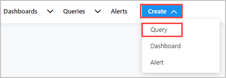

1. In the left pane, you can see the data source connection name (**Github connector** in our flow) in the drop-down menu, and the tables in the selected database.
1. Type your query in the top editing pane and select **Save** and **Execute**. Select **Publish** to publish query for future use.

    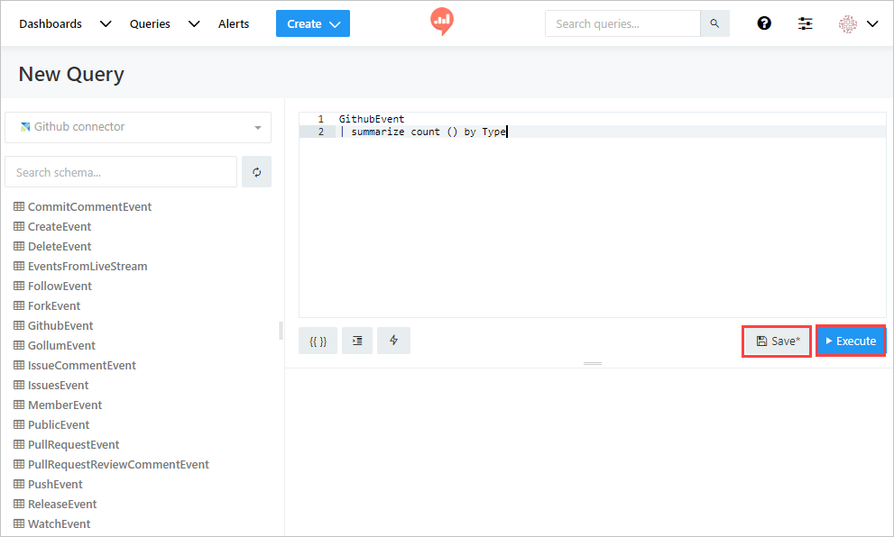

1. View the query results in the bottom central pane. Create a visualization to go with the query by selecting the **New Visualization** button.

    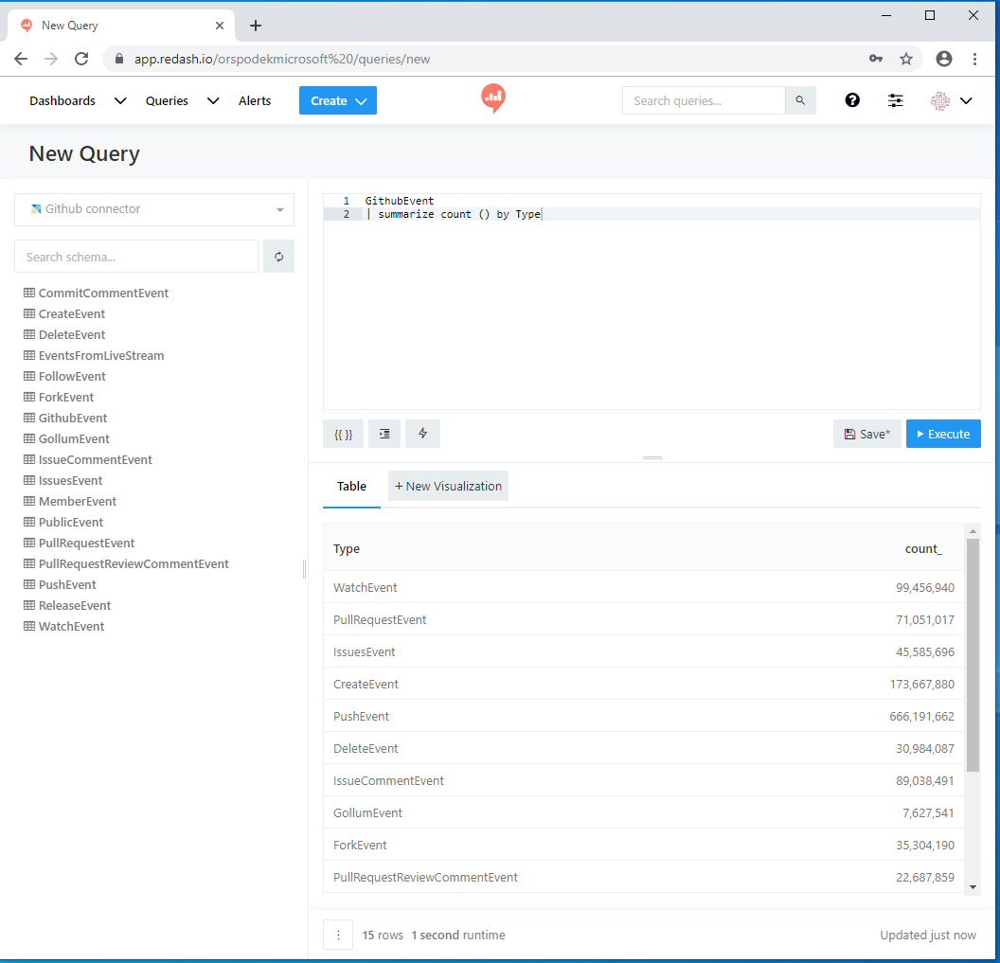

1. In the visualization screen, select the **Visualization Type** and the relevant fields such as **X Column** and **Y Column**. **Save** the visualization.

    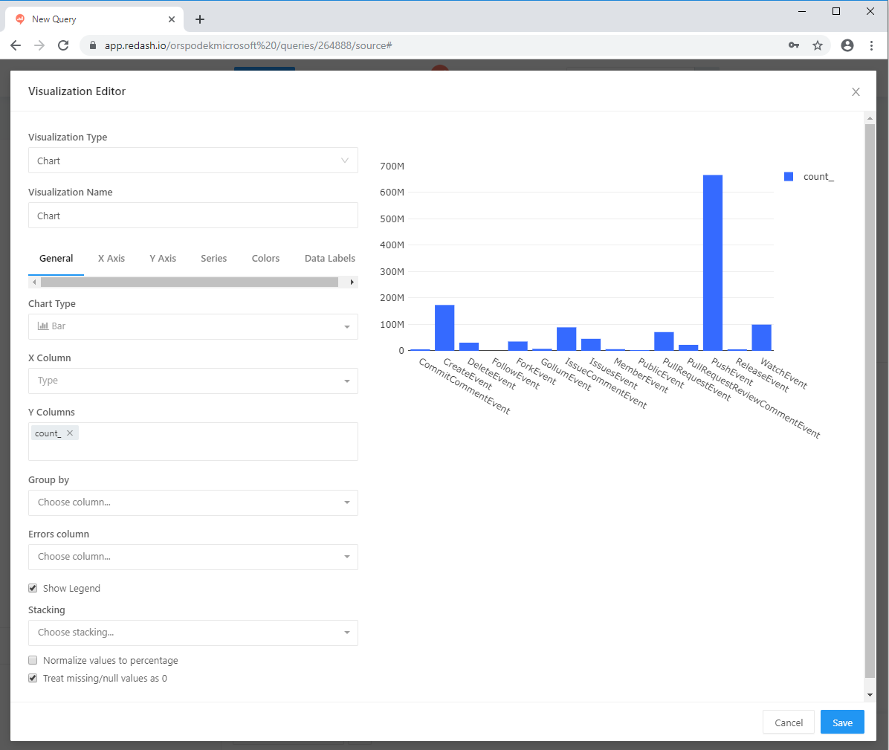

### Create a query using a parameter

1. **Create** > **Query** to create a new query. Add a parameter to it using {{}} curly brackets.

    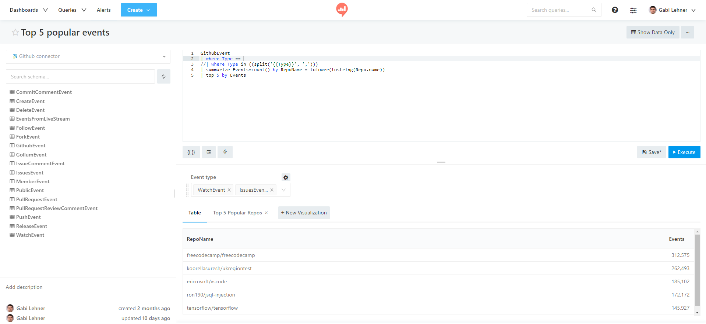

1. In the **Add Parameter** window, name your parameter using **Keyword**. Select **Type**: **Query Based Dropdown List**  from dropdown menu

    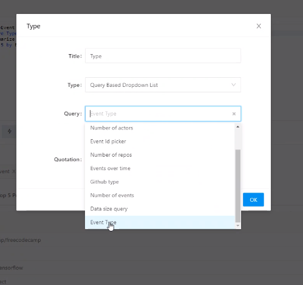

    > [!NOTE]
    > The query uses multiple values, therefore you must include the following syntax `| where Type in ((split('{{Type}}', ',')))`. See [in operator](https://docs.microsoft.com/en-us/azure/kusto/query/inoperator) for more details. This results in [multiple query parameter options in redash app](https://redash.io/help/user-guide/querying/query-parameters#Serialized-Multi-Select Query Parametersredash.io)

    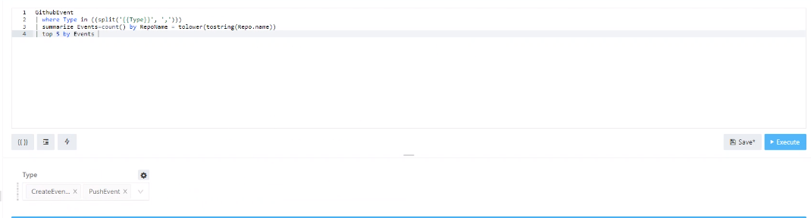    

1. Select *settings icon* to modify the parameter attributes and open <parameter name> window. Select **Save**

    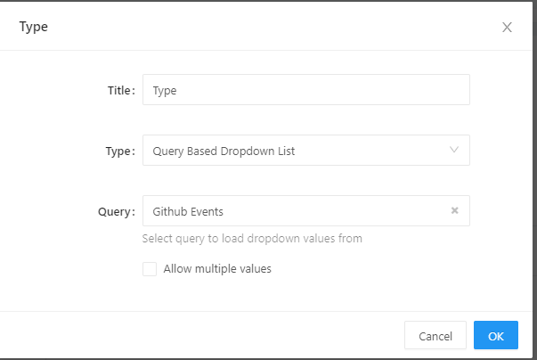

## Create a dashboard in Redash

1. To create your dashboard, **Create** > **Dashboard**. Alternatively, select existing dashboard, **Dashboards** > select a dashboard from the list.

    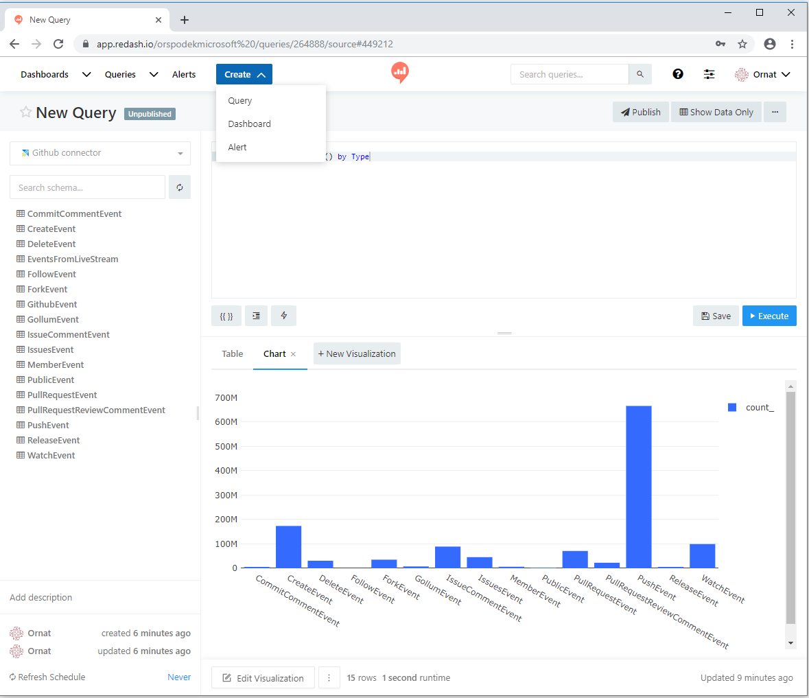

1. In **New Dashboard** window, name your dashboard and select **Save**.
1. In **<Dashboard name>** window, select **Add Widget** to create a new widget. In **Add widget** window, select query name and **Choose Visualization**. Select **Add to Dashboard**

   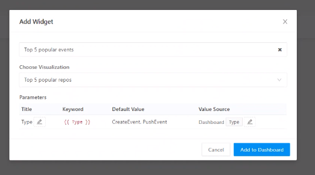

1. Select **Done Editing** to complete dashboard creation.

1.  In the dashboard edit mode, select **Use Dashboard Level Filters** to use the **Type** parameter previously defined.

    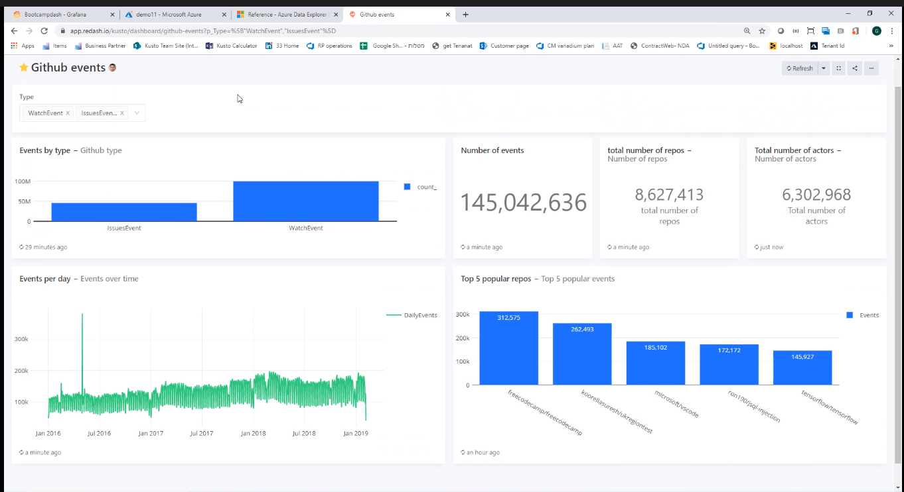

## Next steps

* [Write queries for Azure Data Explorer](write-queries.md)

