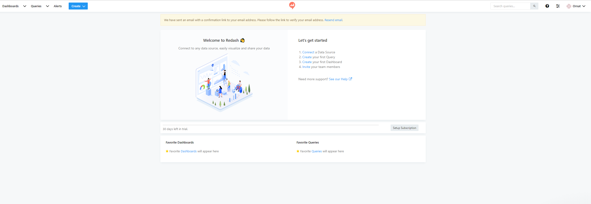
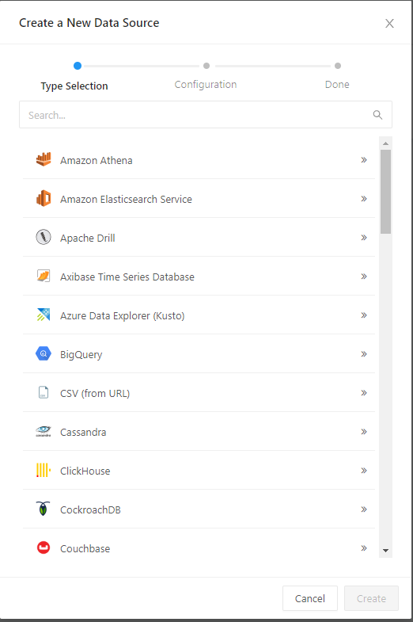
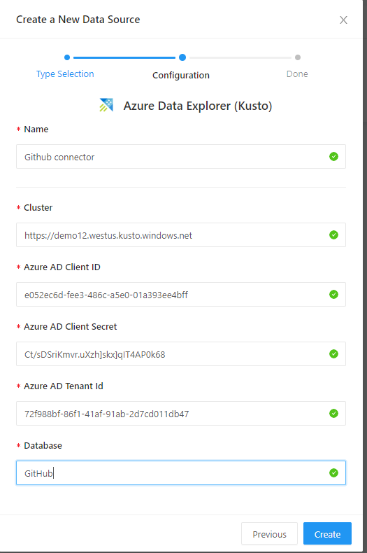
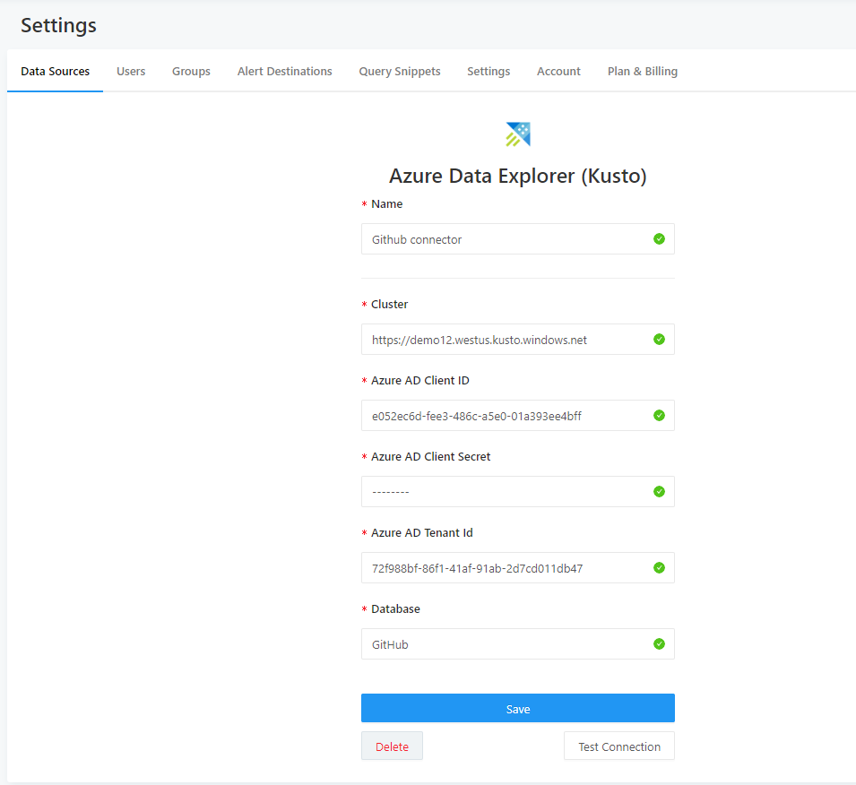
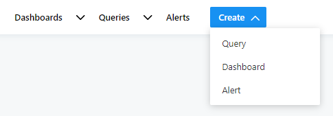
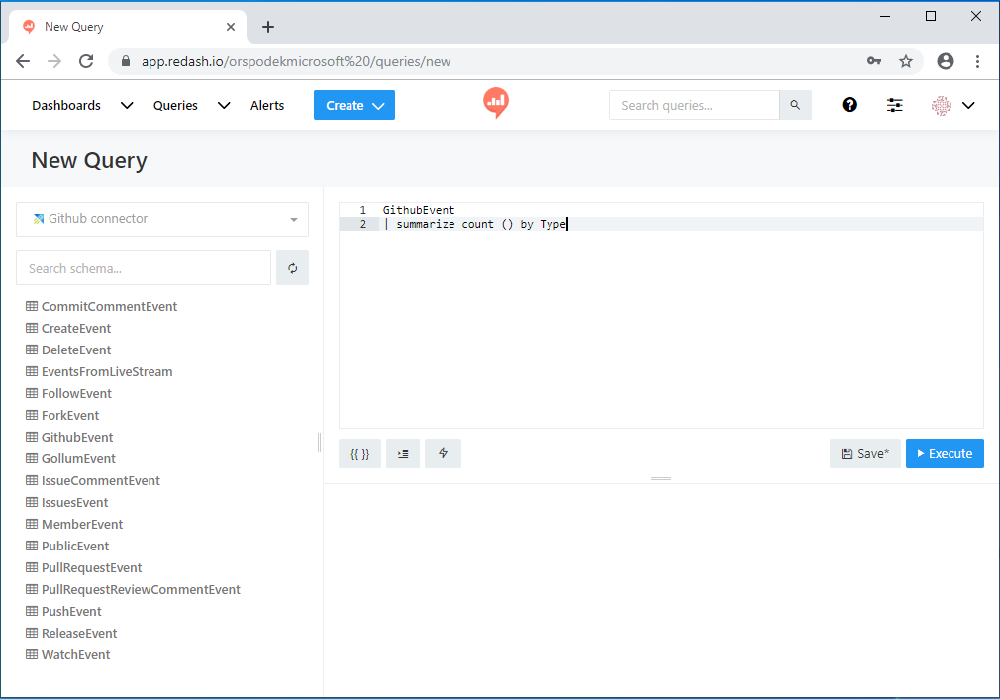

# Visualize data from Azure Data Explorer in Redash

 [Redash](https://www.redash.io/) connects and queries your data sources, builds dashboards to visualize data and share them with peers. 

## Prerequisites

You need the following to complete this article:

\\1. Sign in to Redash service
1. Create a new query
1. Create a new data source - select Azure Data Explorer (Kusto) connector. 
    You need to introduce the following properties:
    * Data source name
    * Cluster
    * Azure AD app client id
    * Azure AD client secret
    * Azure AD tenant id
    * Database

    [!INCLUDE [data-explorer-storm-events](../../includes/data-explorer-storm-events.md)]

    [!INCLUDE [data-explorer-configure-data-source](../../includes/data-explorer-configure-data-source.md)]

## Create queries in Redash 

1. Sign in to [Redash](https://www.redash.io/). Select **Get Started** to create an account.
1. Under **Let's get started**, Select **Connect a Data Source**.

    

1. In **Create a New Data Source** window, select **Azure Data Explorer (Kusto)** 

    

1. In **Azure Data Explorer (Kusto)** window, complete the following form and select **Create**:

    

    | Setting |Description  |
    |---------|---------|
    |Name    |         |
    |Cluster    |         |
    |Azure AD Client ID    |         |
    |Row3     |         |
    |Row3     |         |
    |Row3     |         |

1. In **Settings** window, select **Save** and **Test Connection** to test your **Azure Data Explorer (Kusto)** data source connection.

    

1. In Redash, on top left select **Create** > **Query**. Click on **New Query** and rename the query.

    

1. The data source connection **Github connector** is seen in drop-down. In the left pane, view the tables in the selected database.
1. Type your query in the top editing pane and select **Save** and **Execute**. Select **Publish** to publish query for future use.

    

1. View the query results in the bottom central pane. Create a visualization to go with the query by selecting the **New Visualization** button.

    

1. In the visualization screen, select the **Visualization Type** and the relevant fields such as **X Column** and **Y Column**. **Save** the visualization.

    

1. **Create** > **Query** to create a new query. Add a parameter to it using {{}} curly brackets.

\\need image

1. Select (wheel icon pic) to define the parameter attributes and open parameter name (**Type**) window. For **Type** select **Query Based Dropdown List** and for **Query** select another query (without parameter) that returns a list of values.

    

1. To create your dashboard, **Create** > **Dashboard**. Alternatively, select existing dashboard, **Dashboards** >  \\selection

    

1. In **New Dashboard** window, name your dashboard and select **Save**.
1. In **<Dashboard name>** window, select **Add Widget** to create a new widget. In **Add widget** window, select query name and **Choose Visualization**. Select **Add to Dashboard**

    

1. Select **Done Editing** to complete dashboard creation.

    

1. In the dashboard edit mode, select **Use Dashboard Level Filters** to use the **Type** parameter previously defined.
1. 
1. Once you get the query right you can add a parameter to it using {{}} curly brackets like in the example below.
1. Define the parameter attributes. In this case The parameter "Type" is "Query based dropdownlist" and the parameter "Query" is one of the other queries that returns a list of values.

1. For **DSN**, select the data source you created for ODBC, then select **Sign In**.

    

1. For **Database**, select the database on your sample cluster, such as *TestDatabase*. For **Schema**, select *dbo*, and for **Table**, select the *StormEvents* sample table.

    

1. Tableau now shows the schema for the sample data. Select **Update Now** to bring the data into Tableau.

    

    When the data is imported, Tableau shows rows of data similar to the following image.

    

1. Now you can create visualizations in Tableau based on the data you brought in from Azure Data Explorer. For more information, see [Tableau Learning](https://www.tableau.com/learn).

## Next steps

* [Write queries for Azure Data Explorer](write-queries.md)

To add a chart to the dashboard you can either create a new dashboard from the "Create" drop down or open a dashboard from the top left "Dashboards" drop down.
1. After opening the dashboard go into edit mode and click **Add widget** on the bottom right of the screen. The widget requires selecting a query and visualization to place on the dashboard. Once the widget was added you can move and resize it.